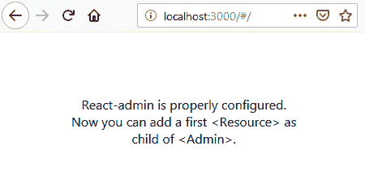
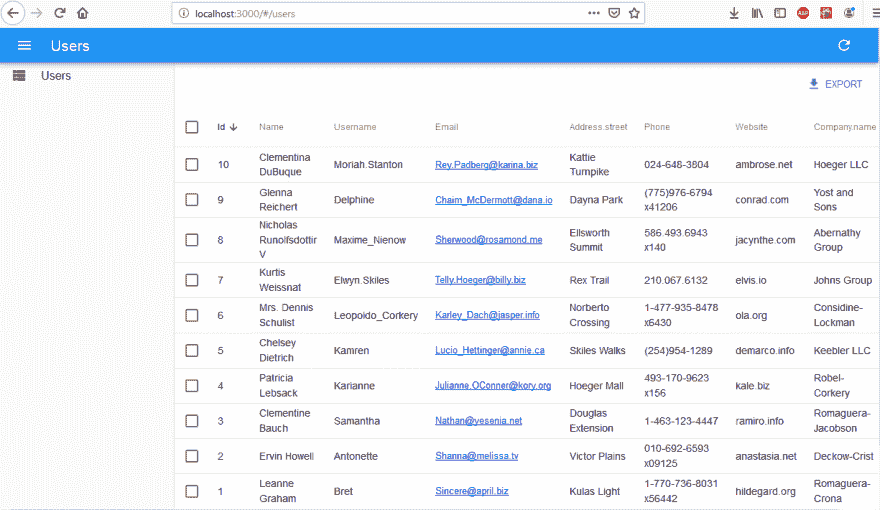
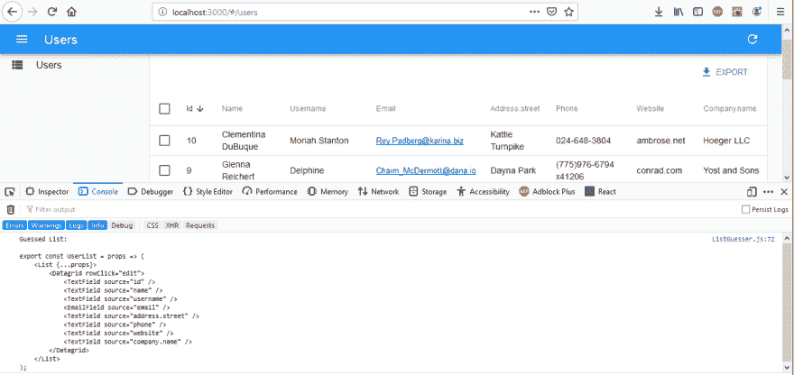
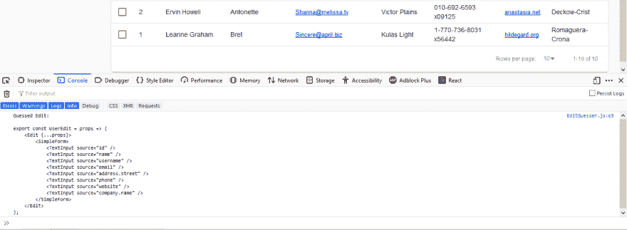
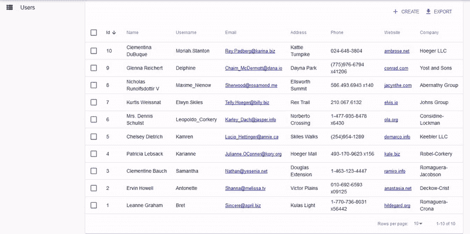
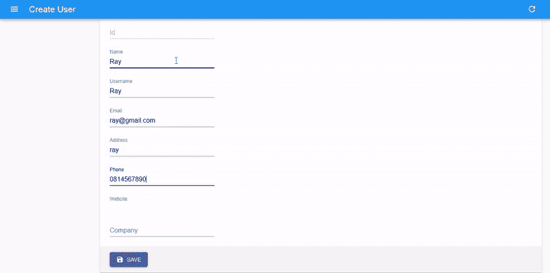
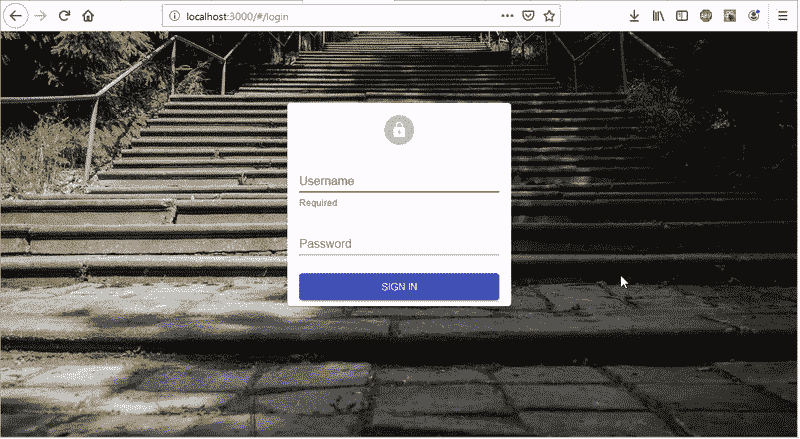

# 如何用 React 建立一个管理面板

> 原文：<https://dev.to/bnevilleoneill/how-to-build-an-admin-panel-with-react-4gf1>

**作者:[拉斐尔](https://blog.logrocket.com/author/raphaelugwu/)乌戈乌** ✏️

## 简介

许多 web 应用程序已经从仅仅显示内容的静态网站发展到用户访问内容并与之交互的动态网页。这些内容通常由发送和接收数据的 API 提供支持。

通常，需要一个管理页面来排序和处理这些数据。通常的做法是构建一个接口，通过向 API 发送请求来连接每个端点。这曾经是一个乏味的过程，直到`react-admin`被引入。

`react-admin`是一个框架，通过使用您的 API(Rest、GraphQL 或 custom)来构建管理界面。你也不必担心样式格式，因为它是以[材质 UI](https://material-ui.com/) 为主题的，这是一个用于设计应用程序界面的 React 库。在这篇博文中，我们将学习`react-admin`如何为应用搭建管理界面。

[](https://logrocket.com/signup/)

## 入门

让我们首先创建一个新的 React 项目，并将`react-admin`安装在它的目录中，如下所示:

```
npx create-react-app react-admin-app
cd react-admin-app
# install react-admin
npm install react-admin 
```

<svg width="20px" height="20px" viewBox="0 0 24 24" class="highlight-action crayons-icon highlight-action--fullscreen-on"><title>Enter fullscreen mode</title></svg> <svg width="20px" height="20px" viewBox="0 0 24 24" class="highlight-action crayons-icon highlight-action--fullscreen-off"><title>Exit fullscreen mode</title></svg>

您的应用程序应该在端口 3000 上运行一个空的 React 应用程序。

## 用猜测器修改和过滤数据

对于一个管理页面来说，CRUD 功能是必不可少的。我们将使用一个 API 来展示`react-admin`如何做到这一点。 [JSONPlaceholder](http://jsonplaceholder.typicode.com/) 是一个虚拟的 REST API，它是为了说明的目的而存在的，这里是我们将要得到的数据的一个例子:

```
{
    "id": 1,
    "name": "Leanne Graham",
    "username": "Bret",
    "email": "Sincere@april.biz",
    "address": {
      "street": "Kulas Light",
      "suite": "Apt. 556",
      "city": "Gwenborough",
      "zipcode": "92998-3874",
      "geo": {
        "lat": "-37.3159",
        "lng": "81.1496"
      }
    },
    "phone": "1-770-736-8031 x56442",
    "website": "hildegard.org",
    "company": {
      "name": "Romaguera-Crona",
      "catchPhrase": "Multi-layered client-server neural-net",
      "bs": "harness real-time e-markets"
    }
  } 
```

<svg width="20px" height="20px" viewBox="0 0 24 24" class="highlight-action crayons-icon highlight-action--fullscreen-on"><title>Enter fullscreen mode</title></svg> <svg width="20px" height="20px" viewBox="0 0 24 24" class="highlight-action crayons-icon highlight-action--fullscreen-off"><title>Exit fullscreen mode</title></svg>

我们首先需要在我们的`react-admin`应用:
中安装 JSONPlaceholder

```
npm install ra-data-json-server prop-types 
```

<svg width="20px" height="20px" viewBox="0 0 24 24" class="highlight-action crayons-icon highlight-action--fullscreen-on"><title>Enter fullscreen mode</title></svg> <svg width="20px" height="20px" viewBox="0 0 24 24" class="highlight-action crayons-icon highlight-action--fullscreen-off"><title>Exit fullscreen mode</title></svg>

让我们试着从 API 获取数据。为此，`react-admin`使用它的根组件`<Admin>`来提供 API 和应用程序之间的数据交换。将`src/App.js`中的默认语法替换为:

```
import React, { Component } from "react";
import { Admin } from "react-admin";
import jsonServerProvider from "ra-data-json-server";

const dataProvider =
  jsonServerProvider("https://jsonplaceholder.typicode.com");

class App extends Component {
  render() {
    return (
      <Admin dataProvider={dataProvider} />
    );
  }
}
export default App; 
```

<svg width="20px" height="20px" viewBox="0 0 24 24" class="highlight-action crayons-icon highlight-action--fullscreen-on"><title>Enter fullscreen mode</title></svg> <svg width="20px" height="20px" viewBox="0 0 24 24" class="highlight-action crayons-icon highlight-action--fullscreen-off"><title>Exit fullscreen mode</title></svg>

此时运行`npm start`应该会在浏览器上呈现一个带有确认消息的应用程序:

[](https://res.cloudinary.com/practicaldev/image/fetch/s--K0WwsoND--/c_limit%2Cf_auto%2Cfl_progressive%2Cq_auto%2Cw_880/https://i0.wp.com/blog.logrocket.com/wp-content/uploads/2019/08/reactadmininterface.png%3Fresize%3D450%252C233%26ssl%3D1)

虽然仍在开发中，`react-admin`通过“guessers”创建管理界面。Guessers 从 API 接收数据，确定数据的种类，然后决定数据应该以何种格式显示。让我们尝试通过应用 guessers 来显示用户列表:

```
import React, { Component } from "react";
import { Admin, Resource, ListGuesser } from "react-admin";
import jsonServerProvider from "ra-data-json-server";

const dataProvider =
  jsonServerProvider("https://jsonplaceholder.typicode.com");

class App extends Component {
  render() {
    return (
      <Admin dataProvider={dataProvider}>
        <Resource name="users" list={ListGuesser} />
      </Admin>
    );
  }
}
export default App; 
```

<svg width="20px" height="20px" viewBox="0 0 24 24" class="highlight-action crayons-icon highlight-action--fullscreen-on"><title>Enter fullscreen mode</title></svg> <svg width="20px" height="20px" viewBox="0 0 24 24" class="highlight-action crayons-icon highlight-action--fullscreen-off"><title>Exit fullscreen mode</title></svg>

在上面的代码块中，`<resource>`元素负责将`name`属性映射到 API 中的一个端点。这里`<resource>`将`users`值附加到我们的 API，并从 API 获取用户数据。`list`属性使用`<ListGuesser>`组件将这些数据显示为用户列表。

[](https://res.cloudinary.com/practicaldev/image/fetch/s--E-FkV1Rh--/c_limit%2Cf_auto%2Cfl_progressive%2Cq_auto%2Cw_880/https://i0.wp.com/blog.logrocket.com/wp-content/uploads/2019/08/datadisplay.png%3Fresize%3D1225%252C710%26ssl%3D1)

`<ListGuesser>`不能用于生产，因此必须用定制组件替换。guessers 的一个很棒的特性是在浏览器的控制台上显示从 API 中检索到的数据的源代码。让我们来看看`<ListGuesser>`显示了什么:

[](https://res.cloudinary.com/practicaldev/image/fetch/s--FN5kPdU3--/c_limit%2Cf_auto%2Cfl_progressive%2Cq_auto%2Cw_880/https://i0.wp.com/blog.logrocket.com/wp-content/uploads/2019/08/console-display-.png%3Fresize%3D1298%252C614%26ssl%3D1)

这向我们展示了应该如何创建用户列表。让我们在应用程序中复制这些数据。在项目的`src`文件夹中，创建一个文件，并将其命名为`users.js` :

```
/src/users.js
import React from 'react';
import { List, Datagrid, TextField, EmailField, UrlField } from 'react-admin';
export const UserList = props => (
    <List {...props}>
        <Datagrid rowClick="edit">
            <TextField source="id" />
            <TextField source="name" />
            <TextField source="username" />
            <EmailField source="email" />
            <TextField source="address.street" label="Address" />
            <TextField source="phone" />
            <UrlField source="website" />
            <TextField source="company.name" label="Company" />
        </Datagrid>
    </List>
); 
```

<svg width="20px" height="20px" viewBox="0 0 24 24" class="highlight-action crayons-icon highlight-action--fullscreen-on"><title>Enter fullscreen mode</title></svg> <svg width="20px" height="20px" viewBox="0 0 24 24" class="highlight-action crayons-icon highlight-action--fullscreen-off"><title>Exit fullscreen mode</title></svg>

在上面的代码块中，做了一些修改。首先，我们使用`<UrlField>`元素使我们网站栏上的链接可点击。然后，我们向地址和公司列添加一个`label`属性，以使它们的标题更美观。让我们导航到`App.js`，用`UserList` :
替换`ListGuesser`

```
/src/App.js

import React, { Component } from "react";
import { Admin, Resource } from "react-admin";
import { UserList } from './users';
import jsonServerProvider from "ra-data-json-server";

const dataProvider =
  jsonServerProvider("https://jsonplaceholder.typicode.com");

class App extends Component {
  render() {
    return (
      <Admin dataProvider={dataProvider}>
        <Resource name="users" list={UserList} />
      </Admin>
    );
  }
}
export default App; 
```

<svg width="20px" height="20px" viewBox="0 0 24 24" class="highlight-action crayons-icon highlight-action--fullscreen-on"><title>Enter fullscreen mode</title></svg> <svg width="20px" height="20px" viewBox="0 0 24 24" class="highlight-action crayons-icon highlight-action--fullscreen-off"><title>Exit fullscreen mode</title></svg>

管理页面应该能够编辑和创建数据。也是通过使用猜测者来实现的。`EditGuesser`用于编辑管理页面的数据。在`App.js`，从`react-admin` :
导入`EditGuesser`

```
src/App.js

import React from 'react';
import { Admin, Resource, EditGuesser } from "react-admin";
import { UserList } from './users';

class App extends Component {
  render() {
    return (
      <Admin dataProvider={dataProvider}>
        <Resource
          name="users"
          list={UserList}
          edit={EditGuesser}
        />
      </Admin>
    );
  }
} 
```

<svg width="20px" height="20px" viewBox="0 0 24 24" class="highlight-action crayons-icon highlight-action--fullscreen-on"><title>Enter fullscreen mode</title></svg> <svg width="20px" height="20px" viewBox="0 0 24 24" class="highlight-action crayons-icon highlight-action--fullscreen-off"><title>Exit fullscreen mode</title></svg>

现在，我们可以在管理界面上编辑用户详细信息:

[](https://res.cloudinary.com/practicaldev/image/fetch/s--C_yTMJEF--/c_limit%2Cf_auto%2Cfl_progressive%2Cq_66%2Cw_880/https://thepracticaldev.s3.amazonaws.com/i/pvb6ez7iyhklxmkfpz0p.gif)

需要注意的一点是，我们使用的 API JSONPlaceholder 没有编辑和创建功能。这里发生的是一个被称为乐观渲染的概念—`react-admin`使用它来显示所做的更改，同时在后台发送更新查询。如果查询失败，数据将变回原来的形式。

与列出用户类似，查看我们的控制台将会让我们知道应该输入什么作为标记。下面是我们使用`EditGuesser`后的结果:

[](https://res.cloudinary.com/practicaldev/image/fetch/s--HcgX9fmO--/c_limit%2Cf_auto%2Cfl_progressive%2Cq_auto%2Cw_880/https://i1.wp.com/blog.logrocket.com/wp-content/uploads/2019/08/consoledata.png%3Fresize%3D1363%252C500%26ssl%3D1)

让我们在应用程序中复制控制台的标记。将下面的代码示例追加到`users.js` :

```
//src/users.js
import React from 'react';
import { Edit, UrlField, DisabledInput, SimpleForm, TextInput } from 'react-admin';

export const UserEdit = props => (
    <Edit {...props}>
      <SimpleForm>
        <DisabledInput source="id" />
        <TextInput source="name" />
        <TextInput source="username" />
        <TextInput source="email" />
        <TextInput source="address.street" label="Address" />
        <TextInput source="phone" />
        <UrlField source="website" />
        <TextInput source="company.name" label="Company" />
      </SimpleForm>
    </Edit>
  ); 
```

<svg width="20px" height="20px" viewBox="0 0 24 24" class="highlight-action crayons-icon highlight-action--fullscreen-on"><title>Enter fullscreen mode</title></svg> <svg width="20px" height="20px" viewBox="0 0 24 24" class="highlight-action crayons-icon highlight-action--fullscreen-off"><title>Exit fullscreen mode</title></svg>

`DisabledInput`元素防止敏感属性被编辑。在`App.js`中，将`EditGuesser`替换为`UserEdit` :

```
//src/App.js
import React, { Component } from "react";
import { Admin, Resource } from "react-admin";
import  { UserList, UserEdit }  from './users';
import jsonServerProvider from "ra-data-json-server";
const dataProvider =
  jsonServerProvider("https://jsonplaceholder.typicode.com");
class App extends Component {
  render() {
    return (
      <Admin dataProvider={dataProvider}>
        <Resource name="users" list={UserList} edit={UserEdit} />
      </Admin>
    );
  }
}
export default App; 
```

<svg width="20px" height="20px" viewBox="0 0 24 24" class="highlight-action crayons-icon highlight-action--fullscreen-on"><title>Enter fullscreen mode</title></svg> <svg width="20px" height="20px" viewBox="0 0 24 24" class="highlight-action crayons-icon highlight-action--fullscreen-off"><title>Exit fullscreen mode</title></svg>

创建新用户的过程几乎与编辑几个元素的保存相同。在`users.js`中，复制下面的代码示例:

```
//src/users.js
import React from 'react';
import { Create, UrlField, DisabledInput, SimpleForm, TextInput } from 'react-admin';

export const UserCreate = props => (
    <Create {...props}>
      <SimpleForm>
        <TextInput source="name" />
        <TextInput source="username" />
        <TextInput source="email" />
        <TextInput source="address.street" label="Address" />
        <TextInput source="phone" />
        <UrlField source="website" />
        <TextInput source="company.name" label="Company" />
      </SimpleForm>
    </Create>
  ); 
```

<svg width="20px" height="20px" viewBox="0 0 24 24" class="highlight-action crayons-icon highlight-action--fullscreen-on"><title>Enter fullscreen mode</title></svg> <svg width="20px" height="20px" viewBox="0 0 24 24" class="highlight-action crayons-icon highlight-action--fullscreen-off"><title>Exit fullscreen mode</title></svg>

并在`App.js`中添加`UserCreate`组件:

```
//src/App.js
import React, { Component } from "react";
import { Admin, Resource } from "react-admin";
import  { UserList, UserEdit, UserCreate }  from './users';
import jsonServerProvider from "ra-data-json-server";
const dataProvider =
  jsonServerProvider("https://jsonplaceholder.typicode.com");
class App extends Component {
  render() {
    return (
      <Admin dataProvider={dataProvider}>
        <Resource name="users" list={UserList} edit={UserEdit} create={UserCreate} />
      </Admin>
    );
  }
}
export default App; 
```

<svg width="20px" height="20px" viewBox="0 0 24 24" class="highlight-action crayons-icon highlight-action--fullscreen-on"><title>Enter fullscreen mode</title></svg> <svg width="20px" height="20px" viewBox="0 0 24 24" class="highlight-action crayons-icon highlight-action--fullscreen-off"><title>Exit fullscreen mode</title></svg>

在我们的界面上，让我们尝试创建一个新用户:

[](https://res.cloudinary.com/practicaldev/image/fetch/s--pOb1B18o--/c_limit%2Cf_auto%2Cfl_progressive%2Cq_66%2Cw_880/https://thepracticaldev.s3.amazonaws.com/i/xorifmxx7pz3d989fzl2.gif)
[T6】](https://res.cloudinary.com/practicaldev/image/fetch/s--VLW5qFna--/c_limit%2Cf_auto%2Cfl_progressive%2Cq_66%2Cw_880/https://thepracticaldev.s3.amazonaws.com/i/obiivlya6c5scoaxhiyf.gif)

与我们试图编辑用户的详细信息时发生的情况类似，乐观呈现也会发生。这解释了为什么在上面的代码片段的最后几秒钟，我们新创建的用户会在消息`NOT FOUND`出现之前显示一段时间。

## 认证

每个管理页面都需要一个认证过程。它可以是基本的，也可以稍微复杂一点(JWT，OAuth)。虽然默认情况下，`react-admin`应用程序不需要认证就能运行，但是将认证集成到管理页面中仍然是最佳实践。

`react-admin`允许您灵活地实施身份验证。JSONPlaceholder 没有认证模型，所以我们将创建一个伪认证过程，它将接受任何值作为`username`和`password`，并将这些值存储在`localStorage`中。在你的`src`文件夹中，创建一个名为`authProvider` :
的文件

```
// src/authProvider.js
import { AUTH_LOGIN, AUTH_LOGOUT, AUTH_ERROR, AUTH_CHECK } from 'react-admin';

   export default (type, params) => {
    // when a user tries to log in 
    if (type === AUTH_LOGIN) {
     const { username } = params;
     localStorage.setItem('username', username)
     return Promise.resolve();
    }
    // when a user tries to logout
    if (type === AUTH_LOGOUT) {
     localStorage.removeItem('username', username)
     return Promise.resolve();
    }
    // when the API throws an error
    if (type === AUTH_ERROR) {
     const { status } = params;
     if (status === 401 || status === 403) {
      localStorage.removeItem('username');
      return Promise.reject()
     }
     return Promise.resolve()
    }
    // when a user navigates to a new location
    if (type === AUTH_CHECK) {
     return localStorage.getItem('username') ?
      Promise.resolve() :
      Promise.reject();
    }
    return Promise.reject('Unknown Method');
   }; 
```

<svg width="20px" height="20px" viewBox="0 0 24 24" class="highlight-action crayons-icon highlight-action--fullscreen-on"><title>Enter fullscreen mode</title></svg> <svg width="20px" height="20px" viewBox="0 0 24 24" class="highlight-action crayons-icon highlight-action--fullscreen-off"><title>Exit fullscreen mode</title></svg>

然后转到`App.js`并传递`<Admin>`组件中的`authProvider`属性:

```
//src/App.js
import React, { Component } from "react";
import { Admin, Resource } from "react-admin";
import authProvider from "./authProvider";
import  { UserList, UserEdit, UserCreate }  from './users';
import jsonServerProvider from "ra-data-json-server";
const dataProvider =
  jsonServerProvider("https://jsonplaceholder.typicode.com");
class App extends Component {
  render() {
    return (
      <Admin dataProvider={dataProvider} authProvider={authProvider}>
        <Resource name="users" list={UserList} edit={UserEdit} create={UserCreate} />
      </Admin>
    );
  }
}
export default App; 
```

<svg width="20px" height="20px" viewBox="0 0 24 24" class="highlight-action crayons-icon highlight-action--fullscreen-on"><title>Enter fullscreen mode</title></svg> <svg width="20px" height="20px" viewBox="0 0 24 24" class="highlight-action crayons-icon highlight-action--fullscreen-off"><title>Exit fullscreen mode</title></svg>

现在，当我们重新启动应用程序时，我们首先会看到一个登录页面:

[](https://res.cloudinary.com/practicaldev/image/fetch/s--jlFnSSBC--/c_limit%2Cf_auto%2Cfl_progressive%2Cq_66%2Cw_880/https://thepracticaldev.s3.amazonaws.com/i/z4maairaip6mww6vdex7.gif)

## 总结

创建管理应用程序不再像以前那样复杂。有了`react-admin`，我们可以很容易地搭建管理界面。认证过程同样重要，在这里也不排除。如果你需要看一下源代码，你可以在 CodeSandBox 的这里找到它。

* * *

**编者按:**看到这个帖子有问题？你可以在这里找到正确的版本。

## Plug: [LogRocket](https://logrocket.com/signup/) ，一款适用于网络应用的 DVR

[](https://res.cloudinary.com/practicaldev/image/fetch/s--6FG5kvEL--/c_limit%2Cf_auto%2Cfl_progressive%2Cq_auto%2Cw_880/https://i2.wp.com/blog.logrocket.com/wp-content/uploads/2017/03/1d0cd-1s_rmyo6nbrasp-xtvbaxfg.png%3Fresize%3D1200%252C677%26ssl%3D1)

[log rocket](https://logrocket.com/signup/)是一个前端日志工具，让你重放问题，就像它们发生在你自己的浏览器中一样。LogRocket 不需要猜测错误发生的原因，也不需要向用户询问截图和日志转储，而是让您重放会话以快速了解哪里出错了。它可以与任何应用程序完美配合，不管是什么框架，并且有插件可以记录来自 Redux、Vuex 和@ngrx/store 的额外上下文。

除了记录 Redux 动作和状态，LogRocket 还记录控制台日志、JavaScript 错误、stacktraces、带有头+体的网络请求/响应、浏览器元数据、自定义日志。它还使用 DOM 来记录页面上的 HTML 和 CSS，甚至为最复杂的单页面应用程序重新创建像素级完美视频。

[免费试用](https://logrocket.com/signup/)。

* * *

帖子[如何用 React](https://blog.logrocket.com/admin-panel-with-react/) 构建管理面板最先出现在[博客](https://blog.logrocket.com)上。