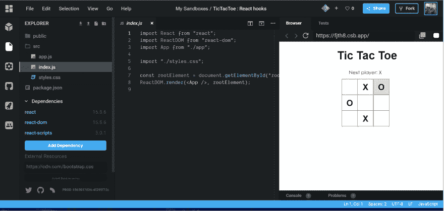

# React-hooks - useState，useEffect，useRef，useMemo

> 原文：<https://dev.to/vinodchauhan7/react-hooks-usestate-useeffect-useref-usememo-2dj>

想象一下:你的应用程序中有一个优秀的函数组件，但有一天你需要在其中添加一个生命周期方法。经过一段时间的思考，你可以将函数组件转换成一个类&这就对了。

您将转换类 Temp 扩展 React。组件，然后在 render body 中复制您的返回函数。然而，新的 React-Hooks 有更好的方法来做这件事。您也可以在功能组件和生命周期方法中使用状态。

### 注意:这篇文章需要 React 的基础知识。

**钩子**，让你插入状态&生命周期反应特性到功能组件中。

## 使用状态:

这个钩子将允许你在功能组件中添加状态。在类组件中，我们可以有“this”。有了“this”的帮助，我们可以在构造函数中初始化状态，并可以做我们的工作。但是在函数组件中，我们没有“this ”,所以我们不能赋值或读取“this”。

```
import React, { useState } from 'react';

// Declare a new state variable, which we'll call "count"
   const [count, setCount] = useState(0); 
```

在上面的例子中，我们使用了 react 包中的“useState”。在这个例子中，我们有一个变量“count ”,它的值作为一个参数设置在 useState(0)中。所以“0”将是它的初始值，它可以是任何你需要的数据类型。

//可以修改为我们在 useState 中提到的 setCount 方法。

```
<button onClick={() => setCount(count + 1)}> 
    {count} // Can be read in this way
  </button> 
```

###### 完整示例:

```
 import React, { useState } from 'react';
   function Example() {
     const [count, setCount] = useState(0);
     return (<division> <h3>You clicked {count} times</h3>
      <button onClick={() => setCount(count + 1)}>
       Click me
        </button>
     <division/>
   );
  } 
```

当我们用 useState 声明一个状态变量时，它返回一对——一个包含两项的数组。第一项是当前值，第二项是让我们更新它的函数。

## 自定义挂钩:

React 钩子最好的一点是它们是常规的 JS 函数调用，所以我们可以将它们的所有逻辑重构为一个小函数。

// 🐨创建一个名为 useCounter 的自定义钩子，它接受 step 和
// initialCount 并返回计数和增量函数 function

```
useCounter({stepCount = 1, initialCount = 0}) {
 const [count, setCount] = React.useState(initialCount)
 const increment = () => setCount(count + stepCount)
 return [count, increment]
}
function Counter({step = 1, initialCount = 0}) {
 const [count, increment] = useCounter(step, initialCount)
 return <buton onClick={increment}>{count}</buton> } 
```

## 使用效果:

可以用' useEffect '直接在函数组件内部处理 3 个生命周期事件，即:componentDidMount，componentDidUpdate，componentWillUnmount。

有时我们希望每次渲染时都运行我们的代码。我们传递给`React.useEffect`的回调会在组件的每次渲染(包括重新渲染)的*之后被调用。* 

```
React.useEffect( () => {
   Console.log("useEffect runs");
}); 
```

但是有时候我们*只有*想用一个效果回调函数来运行我们变量值的变化。在这种情况下，对我们来说幸运的是，`React.useEffect`允许您传递第二个参数，称为“依赖关系数组”,当(且仅当)这些依赖关系发生变化时，它会发出信号来反应您的效果回调函数应该被调用。所以我们可以用这个来避免做不必要的工作！

```
//Custom useState hook 
function useLocalStorageCounter({step = 1, initialCount = 0, key = 'count'}) {
const [count, setCount] = React.useState(() =>
  Number(window.localStorage.getItem('count') || initialCount),
)
React.useEffect(() => {
window.localStorage.setItem('count', count)
}, [count]);

const increment = () => setCount(c => c + step)
return [count, increment]
} 
```

如果我在 useEffect 中提供了空的依赖项，那么这意味着我只想在初始加载时加载回调函数。或者，如果我从回调函数中返回一些东西，那么它将像 componentWillUnmount lifeCycle 方法一样工作。

## useRef:

useRef 返回一个可变的 Ref 对象。当前属性被初始化为传递的参数(initialValue)。返回的对象将在组件的整个生存期内保持不变。

```
function formMethod() {
  const username= useRef(null);
  const onUsernameClick = () => {
    // `current` points to the mounted text input element
    username.current.focus();
  };
  return (
      <input> ref={username} type="text"</>
      <buton onClick={onUsernameClick}>Focus the input</buton>  
  );
} 
```

请记住，useRef 不会在内容发生变化时通知您。变异了。当前属性不会导致重新呈现。

## 使用备忘录:

```
const memoizedValue = useMemo(() => modifyValue(a), [a]); 
```

useMemo 只会在其中一个依赖关系发生变化时重新计算 memoized 值。这种优化有助于避免每次渲染时进行昂贵的计算。
记住传递给 useMemo 的函数在渲染时运行。不要做任何渲染时通常不会做的事情。如果没有提供数组，每次渲染都会计算一个新值。

为了让你的手脏在代码中，我在 CodeSandbox 的 react hooks 中做了一个例子。
[https://codesandbox.io/s/tictactoe-react-hooks-fjth8](https://codesandbox.io/s/tictactoe-react-hooks-fjth8)

[](https://res.cloudinary.com/practicaldev/image/fetch/s--ESgcuDnT--/c_limit%2Cf_auto%2Cfl_progressive%2Cq_auto%2Cw_880/https://thepracticaldev.s3.amazonaws.com/i/v7iro4ikv2e8dc35apv6.png)

[https://github.com/vinodchauhan7/react-hooks-ticTacToe](https://github.com/vinodchauhan7/react-hooks-ticTacToe)

如果你喜欢这个，请提供你的建设性意见和分享。