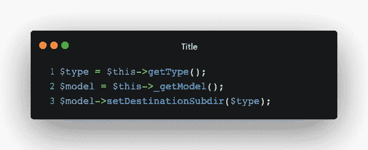
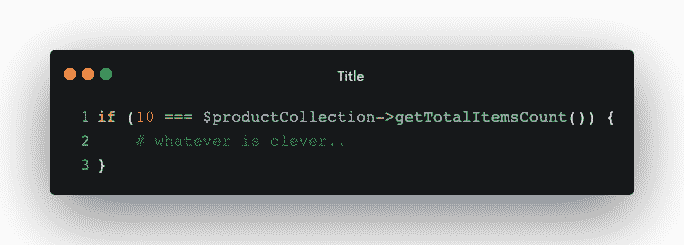
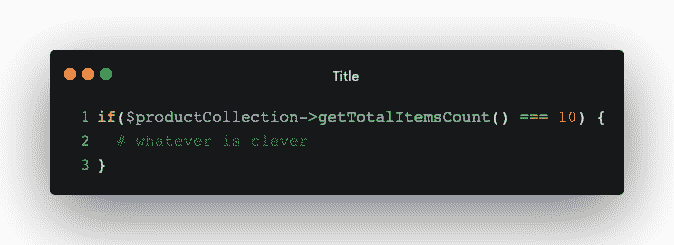
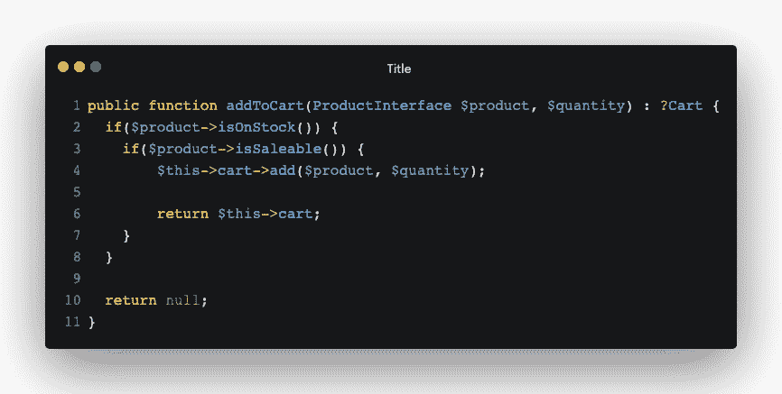
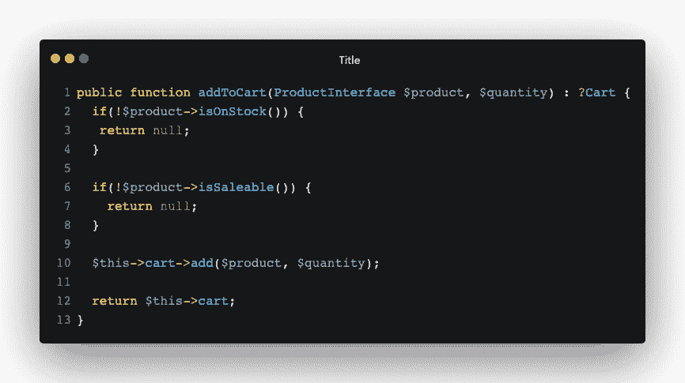
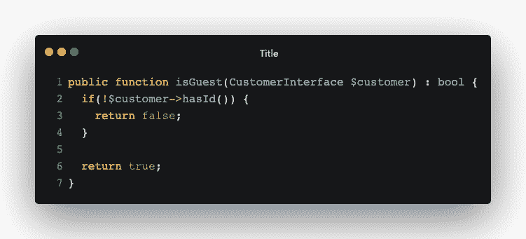

# 提高代码可读性的 5 个技巧

> 原文：<https://dev.to/davidlambauer/5-tips-for-better-code-readability-1f13>

最近，我被雇佣来重构一个庞大的代码库，这个库已经混乱了很多年。该项目是一个 Magento 2 项目，有 30 多个定制模块。这些模块基本上做了所有你在 Magento 中不应该做的事情。我没有找到任何测试或文档。没有静态代码分析，什么都没有。事实上，没有任何测试是混乱的代码库的原因。

在我研究代码的时候，我一次又一次地发现了同样丑陋的模式。这篇文章是 5 种最糟糕模式的一个小总结。

## #1 -连锁函数调用

链接...请看以下内容:

链式函数调用很难调试、阅读和理解。在调试的时候，你必须评估每个函数调用或者单步执行它们，而不是直接跳过它们...

更好的方法是:

## # 2——尤达风格

这可能是一些人的偏好，但对我来说，尤达风格是有史以来最难读的风格之一。也许我的大脑不够快，无法评估病情，也许尤达风格是纯粹的邪恶。

原因如下:

帮我个忙，别再做了。

这感觉自然多了:

## # 3——错过提前退场

失败得快，失败得响。这是编写公共函数时常见的说法。我经常看到函数在失败之前做了很多事情，因为给定的参数有一个不期望的值。失败得快，失败得响。首先验证传入的参数，如果它们不符合函数的要求，则失败，否则继续；

颠倒条件，增加提前退出。

## #4 -不必要的 else 语句

如果 if 块保证在进入时退出控制流，则没有必要添加 else 语句。退出可以是返回，抛出，继续，中断。

我会说，else 语句在大多数情况下是不必要的。下面的代码不是更好读吗？

## #5 -命名...

旧但很金。人们仍然关心他们如何给事物命名。我知道命名很难。然而，这里有一些适用于许多用例的经验法则:

*   带目的的后缀类名。

    *   CreateCustomerAccountService
    *   ImportProductManager
    *   ProductToArrayMapper
    *   ProtectHttpConnectionsGuard
    *   日期时间助手
*   尝试找到有意义的变量名，并将以下名称添加到变量名黑名单中:

    *   $ data--> $ product data
    *   $params --> $requestParams
    *   $型号-> $产品
    *   $ message-> user flashmessage
    *   $id --> $cartId
    *   $ item--> $ cartItem
    *   $ connection--> $ redis disconnection
*   显式函数名。我们都知道，我们的职能只做一件事。考虑到这一点，可以有彼此相似但具有不同接口的功能。让我们想象一个 CustomerMapper 类，映射客户数据。方法可以这样命名:

*   mapToArray(客户$客户)

*   mapToJson(客户$客户)

*   mapToArrayById(int $customerId)

*   mapToJsonByEmail(string $email)

*   当然，如今我们都使用返回类型，但是声明返回布尔值的函数名仍然是个好主意(感谢提示 [Pujan Srivastava](https://dev.to/pujansrt)

    *   hasStock() : bool
    *   isGuest() : bool
    *   canBeAddedToCart() : bool

*免责声明:片段是无意义的例子。*

有额外的提示吗？期待听到它