# 终极指南:20 分钟内完成蓝牙 Swift 和硬件

> 原文：<https://dev.to/jaredwolff/ultimate-how-to-bluetooth-swift-with-hardware-in-20-minutes-2bmn>

[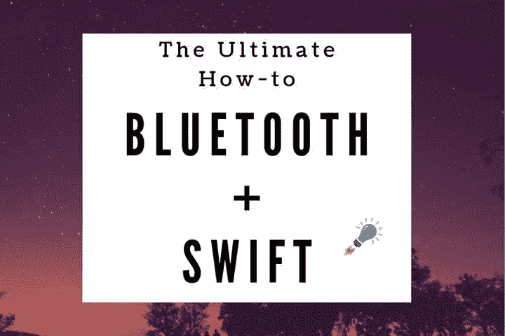](https://res.cloudinary.com/practicaldev/image/fetch/s--08XsmZ9a--/c_limit%2Cf_auto%2Cfl_progressive%2Cq_auto%2Cw_880/https://www.jaredwolff.com/the-ultimate-how-to-bluetooth-swift-with-hardware-in-20-minutimg/Copy_of_Copy_of_Particle_Cloud_to_Blynk-60e2538b-ba8b-4d8d-9b88-c80f8cd2fb2e.jpg)

在之前的教程中，你学习了如何将蓝牙添加到粒子氙应用程序中。这样，您就可以从 nRF Connect 或浅蓝色 Explorer 等测试应用程序控制板载 RGB LED。

在这篇文章中，我们将更进一步。我们将开发一个 Swift 应用程序来控制粒子网格 RGB led。如果一切顺利，你应该在 20 分钟左右有一个工作的应用程序！

让我们开始吧。

### 现在没时间看完整篇？

[在此下载 PDF 版本。](https://www.jaredwolff.com/files/the-ultimate-how-to-bluetooth-swift-with-hardware-in-20-minutes/)

## 开始设置

*   安装 Xcode。你可以从这里的 App store 下载。
*   你还需要一个苹果登录。我用我的 iCloud 邮箱。如果您还没有帐户，可以在 Xcode 中创建新帐户。
*   将 [RGB 示例代码](https://www.jaredwolff.com/how-to-use-particles-powerful-bluetooth-api/#final-code)安装在粒子网板上。

## 创建项目

一旦一切都安装好了，让我们开始有趣的事情吧！

打开 Xcode，进入**文件→新建项目。**

[](https://res.cloudinary.com/practicaldev/image/fetch/s--I9odfCCk--/c_limit%2Cf_auto%2Cfl_progressive%2Cq_auto%2Cw_880/https://www.jaredwolff.com/the-ultimate-how-to-bluetooth-swift-with-hardware-in-20-minutimg/Screen_Shot_2019-08-11_at_3-7ef4de80-050c-4fc3-9cf2-8581e16ffe18.10.57_PM.png)

选择**单视图应用。**

[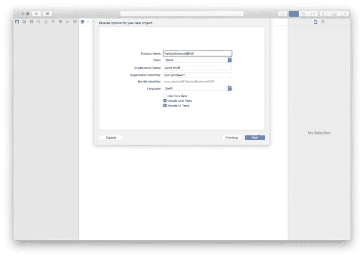](https://res.cloudinary.com/practicaldev/image/fetch/s--kEVW8V40--/c_limit%2Cf_auto%2Cfl_progressive%2Cq_auto%2Cw_880/https://www.jaredwolff.com/the-ultimate-how-to-bluetooth-swift-with-hardware-in-20-minutimg/Screen_Shot_2019-08-11_at_3-ef953954-312b-4320-be30-5da186d0902e.11.14_PM.png)

然后根据你的喜好更新**项目名称**。我还将我的组织标识符更改为`com.jaredwolff`。你觉得合适就修改吧！

选择保存它的位置。

接下来找到您的**信息列表**

[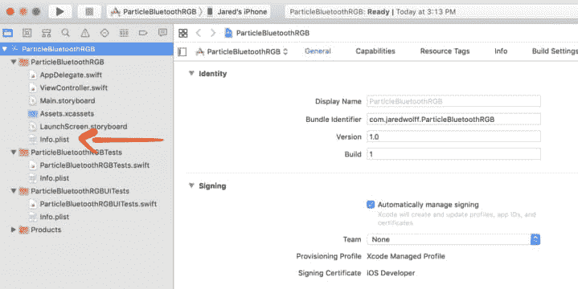](https://res.cloudinary.com/practicaldev/image/fetch/s--V2r_aXh5--/c_limit%2Cf_auto%2Cfl_progressive%2Cq_auto%2Cw_880/https://www.jaredwolff.com/the-ultimate-how-to-bluetooth-swift-with-hardware-in-20-minutimg/Screen_Shot_2019-08-11_at_3-27439ca7-68c5-4890-902d-6c2ee7f31829.13.26_PM.png)

通过添加`Privacy - Bluetooth Peripheral Usage Description`更新`info.plist`

我最后用的描述是`App uses Bluetooth to connect to the Particle Xenon RGB Example`

这允许你在应用程序中使用蓝牙，如果你想发布它的话。

现在，让我们让所有的功能最小化！

## 最小功能

[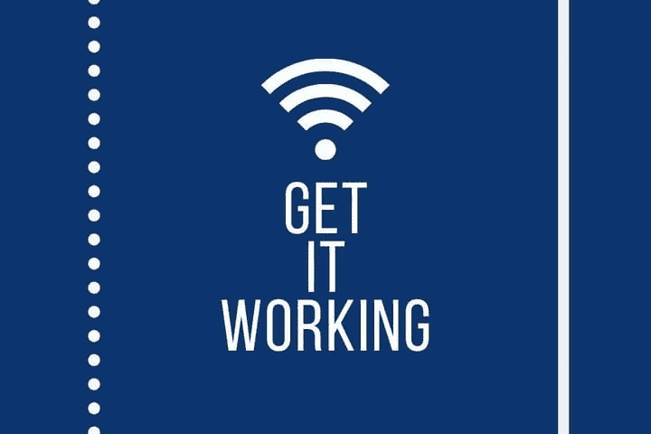](https://res.cloudinary.com/practicaldev/image/fetch/s--5D7O8Que--/c_limit%2Cf_auto%2Cfl_progressive%2Cq_auto%2Cw_880/https://www.jaredwolff.com/the-ultimate-how-to-bluetooth-swift-with-hardware-in-20-minutimg/Copy_of_Flow-5e62bf38-b399-4bca-9b5b-c63f9716af33.jpg)

接下来，我们将获得一个最小功能的应用程序来连接并执行服务发现。大部分的动作将发生在`ViewController.swift`。

让我们先导入`CoreBluetooth`

```
 import CoreBluetooth 
```

这使我们能够控制 iOS 中的蓝牙低能耗功能。然后让我们将`CBPeripheralDelegate`和`CBCentralManagerDelegate`都添加到`ViewController`类中。

```
 class ViewController: UIViewController, CBPeripheralDelegate, CBCentralManagerDelegate { 
```

现在让我们创建本地私有变量来存储实际的中央管理器和外围设备。我们会尽快安排他们。

```
 // Properties
    private var centralManager: CBCentralManager!
    private var peripheral: CBPeripheral! 
```

在你的`viewDidLoad`函数中，让我们初始化`centralManager`T2

```
 centralManager = CBCentralManager(delegate: self, queue: nil) 
```

设置`delegate: self`很重要。否则，中央状态在启动时不会改变。

在我们进一步讨论之前，让我们创建一个单独的文件，并将其命名为`ParticlePeripheral.swift`。它可以放在任何地方，但我把它放在一个单独的“组”中，称为**模型**，以备后用。

在里面，我们将创建一些包含粒子板 UUIDs 的公共变量。他们应该看起来很眼熟！

```
 import UIKit
    import CoreBluetooth

    class ParticlePeripheral: NSObject {

        /// MARK: - Particle LED services and charcteristics Identifiers

        public static let particleLEDServiceUUID     = CBUUID.init(string: "b4250400-fb4b-4746-b2b0-93f0e61122c6")
        public static let redLEDCharacteristicUUID   = CBUUID.init(string: "b4250401-fb4b-4746-b2b0-93f0e61122c6")
        public static let greenLEDCharacteristicUUID = CBUUID.init(string: "b4250402-fb4b-4746-b2b0-93f0e61122c6")
        public static let blueLEDCharacteristicUUID  = CBUUID.init(string: "b4250403-fb4b-4746-b2b0-93f0e61122c6")

    } 
```

回到`ViewController.swift`让我们一起来拼凑蓝牙比特。

### 蓝牙位

[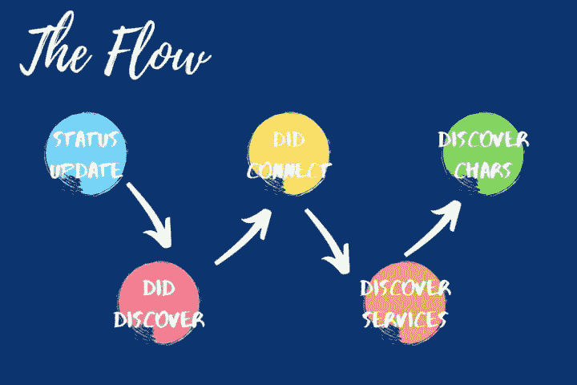](https://res.cloudinary.com/practicaldev/image/fetch/s--waECjPmg--/c_limit%2Cf_auto%2Cfl_progressive%2Cq_auto%2Cw_880/https://www.jaredwolff.com/the-ultimate-how-to-bluetooth-swift-with-hardware-in-20-minutimg/Flow-3cb1d250-f9d5-4757-a244-be29bed9dcf6.jpg)

与蓝牙有关的一切都是基于事件的。我们将定义几个处理这些事件的函数。以下是一些重要的例子:

`centralManagerDidUpdateState`蓝牙外设打开或关闭时更新。当一个应用程序第一次启动时，它会触发，这样你就知道蓝牙的状态了。我们也从这里开始扫描。

收到扫描结果时会发生`centralManager` `didDiscover`事件。我们将用它来建立一个连接。

一旦设备连接，就会触发`centralManager` `didConnect`事件。我们将在这里开始设备发现。**注意:**设备发现是我们确定哪些服务和特性可用的方式。这是确认我们连接的设备类型的好方法。

一旦所有服务被发现，首先是`peripheral` `didDiscoverServices`事件。请注意，我们已经从`centralManager`切换到`peripheral`，现在我们已经连接上了。我们将从这里开始特色发现。我们将使用 UUID 的 RGB 服务作为目标。

`peripheral` `didDiscoverCharacteristicsFor`事件将使用所提供的服务 UUID 提供所有特征。这是执行完整设备发现的最后一步。这很麻烦，但在连接阶段只需做一次！

### 定义所有蓝牙功能。

现在我们知道了哪些函数事件被触发了。我们将按照它们在连接周期中发生的逻辑顺序来定义它们。

首先，我们将定义`centralManagerDidUpdateState`用我们的粒子 RGB LED 服务开始扫描设备。如果蓝牙没有启用，它不会做任何事情。

```
 // If we're powered on, start scanning
        func centralManagerDidUpdateState(_ central: CBCentralManager) {
            print("Central state update")
            if central.state != .poweredOn {
                print("Central is not powered on")
            } else {
                print("Central scanning for", ParticlePeripheral.particleLEDServiceUUID);
                centralManager.scanForPeripherals(withServices: [ParticlePeripheral.particleLEDServiceUUID],
                                                  options: [CBCentralManagerScanOptionAllowDuplicatesKey : true])
            }
        } 
```

定义`centralManager` `didDiscover`是我们下一步的工作。如果这个事件发生了，我们知道我们找到了一个装置。

```
 // Handles the result of the scan
        func centralManager(_ central: CBCentralManager, didDiscover peripheral: CBPeripheral, advertisementData: [String : Any], rssi RSSI: NSNumber) {

            // We've found it so stop scan
            self.centralManager.stopScan()

            // Copy the peripheral instance
            self.peripheral = peripheral
            self.peripheral.delegate = self

            // Connect!
            self.centralManager.connect(self.peripheral, options: nil)

        } 
```

所以，我们用`self.centralManager.stopScan()`停止扫描。我们设置了`peripheral`,因此它在应用程序中保持不变。然后我们使用`self.centralManager.connect`连接到那个设备

连接后，我们需要仔细检查我们是否使用了正确的设备。

```
 // The handler if we do connect succesfully
        func centralManager(_ central: CBCentralManager, didConnect peripheral: CBPeripheral) {
            if peripheral == self.peripheral {
                print("Connected to your Particle Board")
                peripheral.discoverServices([ParticlePeripheral.particleLEDServiceUUID])
            }
        } 
```

通过比较这两个外围设备，我们将知道它是我们之前找到的设备。我们将使用`peripheral.discoverService`开始服务发现。我们可以用`ParticlePeripheral.particleLEDServiceUUID`作为参数。这样我们就不会收到任何我们不关心的服务。

一旦我们完成发现服务，我们将得到一个`didDiscoverServices`事件。我们遍历所有“可用”的服务。(虽然只会有一个！)

```
 // Handles discovery event
        func peripheral(_ peripheral: CBPeripheral, didDiscoverServices error: Error?) {
            if let services = peripheral.services {
                for service in services {
                    if service.uuid == ParticlePeripheral.particleLEDServiceUUID {
                        print("LED service found")
                        //Now kick off discovery of characteristics
                        peripheral.discoverCharacteristics([ParticlePeripheral.redLEDCharacteristicUUID,
                                                                 ParticlePeripheral.greenLEDCharacteristicUUID,
                                                                 ParticlePeripheral.blueLEDCharacteristicUUID], for: service)
                        return
                    }
                }
            }
        } 
```

到目前为止，这是我们第三次检查以确保我们有正确的服务。当有许多特性和服务时，这将变得更加方便。

我们用一个 UUIDs 数组调用`peripheral.discoverCharacteristics`,以获得我们正在寻找的特征。它们都是我们在`ParticlePeripheral.swift`中定义的 UUIDs。

最后，我们处理`didDiscoverCharacteriscsFor`事件。我们遍历所有可用的特征。当我们迭代时，我们与我们正在寻找的进行比较。

```
 // Handling discovery of characteristics
        func peripheral(_ peripheral: CBPeripheral, didDiscoverCharacteristicsFor service: CBService, error: Error?) {
            if let characteristics = service.characteristics {
                for characteristic in characteristics {
                    if characteristic.uuid == ParticlePeripheral.redLEDCharacteristicUUID {
                        print("Red LED characteristic found")
                    } else if characteristic.uuid == ParticlePeripheral.greenLEDCharacteristicUUID {
                        print("Green LED characteristic found")
                    } else if characteristic.uuid == ParticlePeripheral.blueLEDCharacteristicUUID {
                        print("Blue LED characteristic found");
                    }
                }
            }
        } 
```

此时，我们准备好对我们的粒子网格设备进行完整的设备发现。在下一节中，我们将测试我们必须做的事情，以确保一切正常。

## 测试我们最小的例子

[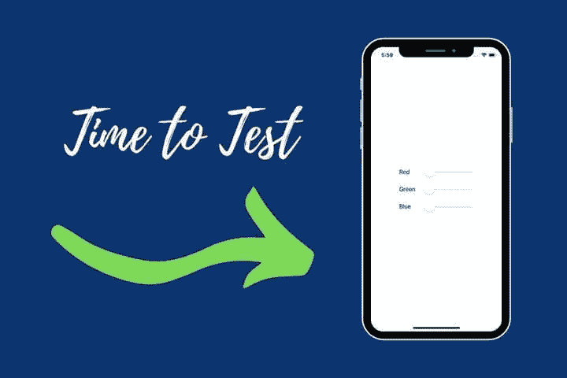](https://res.cloudinary.com/practicaldev/image/fetch/s--JwuKCpQi--/c_limit%2Cf_auto%2Cfl_progressive%2Cq_auto%2Cw_880/https://www.jaredwolff.com/the-ultimate-how-to-bluetooth-swift-with-hardware-in-20-minutimg/Flow-6-744bf855-fd7c-403b-b07f-dfc0c191b6af.jpg)

在我们开始之前，如果你遇到了麻烦，我已经在[脚注](https://www.jaredwolff.com/the-ultimate-how-to-bluetooth-swift-with-hardware-in-20-minutes/#troubleshooting)中列出了一些故障排除步骤。

为了测试，你必须有一部带蓝牙低能耗功能的 iPhone。大多数现代 iPhones 都有。我相信最后一部没有这个功能的 iPhone 不是 iPhone 4 就是 3Gs。(所以你很可能是好的)

首先，把它插到你的电脑上。

通过播放和停止按钮转到顶部。选择您的目标设备。在我的例子中，我选择了我的手机( **Jared 的 iPhone** )。也可以用 iPad。

[](https://res.cloudinary.com/practicaldev/image/fetch/s--d4PZsgiD--/c_limit%2Cf_auto%2Cfl_progressive%2Cq_auto%2Cw_880/https://www.jaredwolff.com/the-ultimate-how-to-bluetooth-swift-with-hardware-in-20-minutimg/Screen_Shot_2019-08-09_at_4-d04de709-6000-4161-bd12-7347a70d6e1e.37.27_PM.png)

然后你可以点击 **Command + R** 或者点击 **Play 按钮**将应用程序加载到你的手机上。

确保您的日志选项卡已打开。通过单击右上角的底部窗格按钮来启用它。

[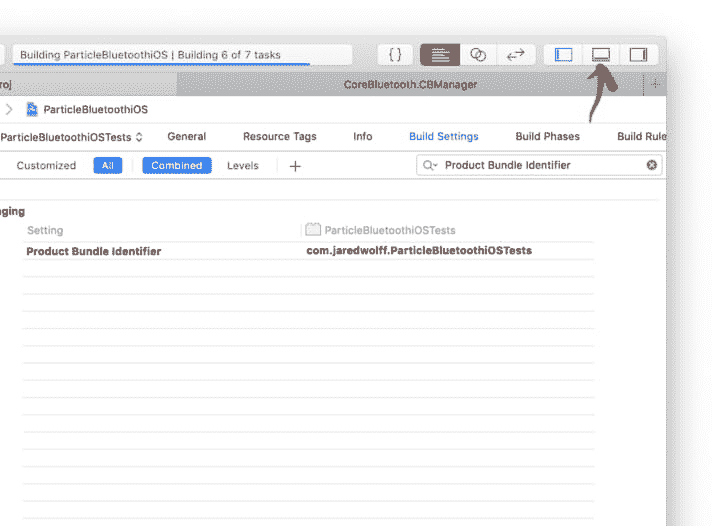](https://res.cloudinary.com/practicaldev/image/fetch/s--PDC9h7wu--/c_limit%2Cf_auto%2Cfl_progressive%2Cq_auto%2Cw_880/https://www.jaredwolff.com/the-ultimate-how-to-bluetooth-swift-with-hardware-in-20-minutimg/Screen_Shot_2019-08-09_at_4-8b83ea0a-274f-4a41-a5ff-e80717b41977.38.57_PM.png)

确保您有一个网格设备设置并运行示例代码。可以去[这个帖子](https://www.jaredwolff.com/how-to-use-particles-powerful-bluetooth-api/#final-code)领取。请记住，您的粒子网板需要运行设备操作系统 1.3.0 或更高版本，蓝牙才能工作！

一旦固件和应用程序都被加载，让我们检查日志输出。

它应该是这样的:

```
View loaded
Central state update
Central scanning for B4250400-FB4B-4746-B2B0-93F0E61122C6
Connected to your Particle Board
LED service found
Red LED characteristic found
Green LED characteristic found
Blue LED characteristic found 
```

这意味着你的电话已经接通，找到了 LED 服务！被发现的特征在这里也很重要。没有这些，我们就无法向网格设备发送数据。

下一步是创建一些滑块，这样我们可以动态更新 RGB 值。

## 向左滑动。向右滑动。

接下来我们将为我们的`Main.storyboard`添加一些元素。打开`Main.storyboard`，点击**视图控制器下面的**视图**。**

[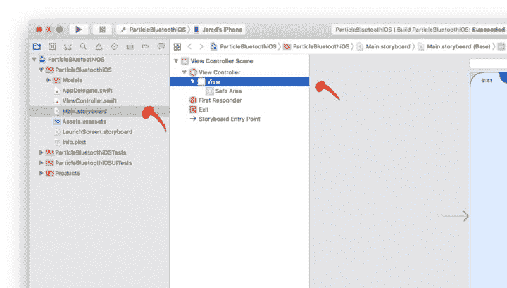](https://res.cloudinary.com/practicaldev/image/fetch/s--lfAP19yE--/c_limit%2Cf_auto%2Cfl_progressive%2Cq_auto%2Cw_880/https://www.jaredwolff.com/the-ultimate-how-to-bluetooth-swift-with-hardware-in-20-minutimg/Screen_Shot_2019-08-11_at_1-7919e3c2-cb72-4297-b9e0-06139a064fec.57.37_PM.png)

然后点击**库的**按钮。(它看起来像用于 home 键的旧艺术苹果)

[](https://res.cloudinary.com/practicaldev/image/fetch/s--eqpIHqJz--/c_limit%2Cf_auto%2Cfl_progressive%2Cq_auto%2Cw_880/https://www.jaredwolff.com/the-ultimate-how-to-bluetooth-swift-with-hardware-in-20-minutimg/Screen_Shot_2019-08-11_at_1-895d247a-6706-4c39-be04-0bda41195ca6.58.02_PM.png)

您将会看到一个弹出窗口，其中包含您可以插入到应用程序中的所有选项。

[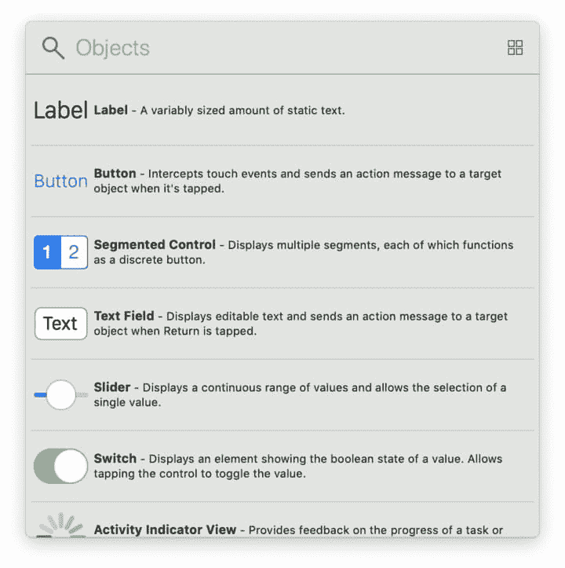](https://res.cloudinary.com/practicaldev/image/fetch/s--jsWv3T3U--/c_limit%2Cf_auto%2Cfl_progressive%2Cq_auto%2Cw_880/https://www.jaredwolff.com/the-ultimate-how-to-bluetooth-swift-with-hardware-in-20-minutimg/Screen_Shot_2019-08-11_at_1-8b531053-621e-4c14-8086-2ac0ef6e52de.58.31_PM.png)

拖动三个**标签**并将三个**滑块**复制到您的视图中。

[](https://res.cloudinary.com/practicaldev/image/fetch/s--mAWC0bsk--/c_limit%2Cf_auto%2Cfl_progressive%2Cq_auto%2Cw_880/https://www.jaredwolff.com/the-ultimate-how-to-bluetooth-swift-with-hardware-in-20-minutimg/Screen_Shot_2019-08-11_at_1-9c8c6167-2279-4cb7-a37b-c24b8cdd275d.59.39_PM.png)

您可以双击标签，并在操作过程中对其进行重命名。

[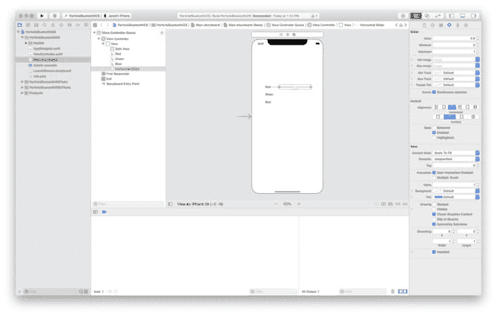](https://res.cloudinary.com/practicaldev/image/fetch/s--ao6ti728--/c_limit%2Cf_auto%2Cfl_progressive%2Cq_auto%2Cw_880/https://www.jaredwolff.com/the-ultimate-how-to-bluetooth-swift-with-hardware-in-20-minutimg/Screen_Shot_2019-08-11_at_1-72573a66-1201-4d08-902d-ea905c91b2bb.59.57_PM.png)

如果你点击并按住，一些方便的对齐工具会弹出。他们甚至会跳到中间！

[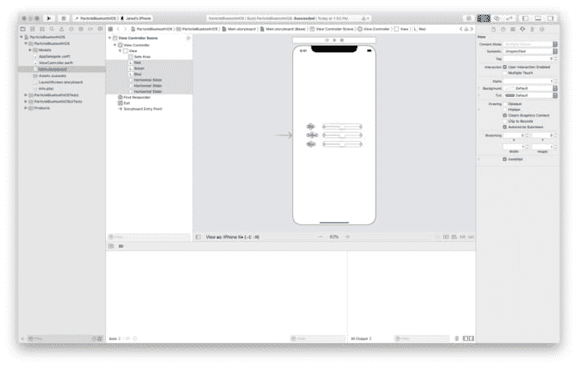](https://res.cloudinary.com/practicaldev/image/fetch/s--ODrLg4xI--/c_limit%2Cf_auto%2Cfl_progressive%2Cq_auto%2Cw_880/https://www.jaredwolff.com/the-ultimate-how-to-bluetooth-swift-with-hardware-in-20-minutimg/Screen_Shot_2019-08-11_at_2-4c7b1627-c55e-4eba-b29a-32915ba41867.00.17_PM.png)

您也可以选择它们并一起移动。我们将垂直和水平排列它们。

为了让它们保持在中间，让我们删除自动调整属性。点击右上角的**标尺图标**。然后点击每个**红色条**。这将确保您的标签和滑块停留在屏幕上！

[](https://res.cloudinary.com/practicaldev/image/fetch/s--Kt2HNX3X--/c_limit%2Cf_auto%2Cfl_progressive%2Cq_auto%2Cw_880/https://www.jaredwolff.com/the-ultimate-how-to-bluetooth-swift-with-hardware-in-20-minutimg/Screen_Shot_2019-08-11_at_2-f207fae8-7292-4e38-9985-c97444ab4e55.09.39_PM.png)

接下来让我们点击**显示助理编辑**按钮。(看起来像维恩图)

[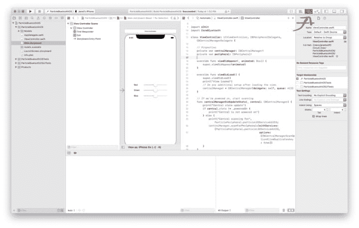](https://res.cloudinary.com/practicaldev/image/fetch/s--qsMcj6X1--/c_limit%2Cf_auto%2Cfl_progressive%2Cq_auto%2Cw_880/https://www.jaredwolff.com/the-ultimate-how-to-bluetooth-swift-with-hardware-in-20-minutimg/Screen_Shot_2019-08-11_at_2-c52c52b8-70b3-426b-9cbe-9df1042f5fb1.00.59_PM.png)

**注意:**确保 **ViewController.swift** 在你的助理编辑器中是打开的。

[](https://res.cloudinary.com/practicaldev/image/fetch/s--XbUmXLUN--/c_limit%2Cf_auto%2Cfl_progressive%2Cq_auto%2Cw_880/https://www.jaredwolff.com/the-ultimate-how-to-bluetooth-swift-with-hardware-in-20-minutimg/Screen_Shot_2019-08-11_at_2-655a4468-4da8-4841-a2dc-1cf8706592e7.17.35_PM.png)

然后在`/properties`部分下面，**按住 Control 键点击并拖动** **红色滑块**到你的代码中。

[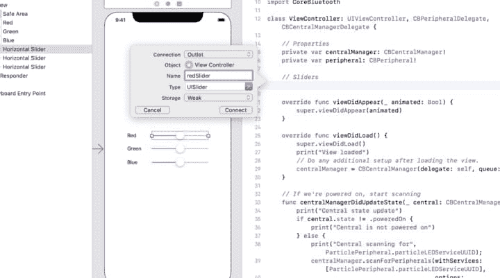](https://res.cloudinary.com/practicaldev/image/fetch/s--t76KiguC--/c_limit%2Cf_auto%2Cfl_progressive%2Cq_auto%2Cw_880/https://www.jaredwolff.com/the-ultimate-how-to-bluetooth-swift-with-hardware-in-20-minutimg/Screen_Shot_2019-08-11_at_2-39480e58-fd92-4ec7-a2db-9e8524019755.01.43_PM.png)

重复所有其他的。一定要给它们取不同的名字。完成后，您的代码应该如下所示:

```
 // Properties
        private var centralManager: CBCentralManager!
        private var peripheral: CBPeripheral!

        // Sliders
        @IBOutlet weak var redSlider: UISlider!
        @IBOutlet weak var greenSlider: UISlider!
        @IBOutlet weak var blueSlider: UISlider! 
```

这允许我们访问滑块的值。

接下来，让我们将**值更改**事件附加到每个滑块。**右击文件夹视图中**红色滑块上的**。**

[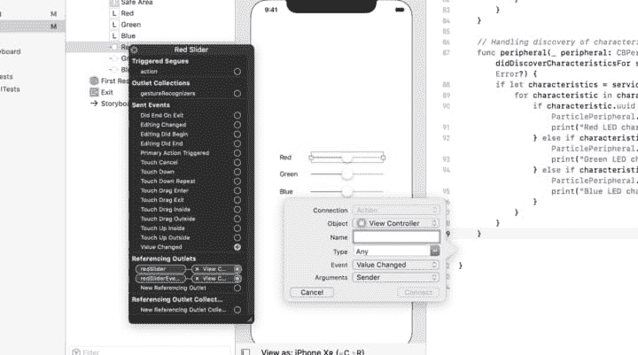](https://res.cloudinary.com/practicaldev/image/fetch/s--uZoW0ql2--/c_limit%2Cf_auto%2Cfl_progressive%2Cq_auto%2Cw_880/https://www.jaredwolff.com/the-ultimate-how-to-bluetooth-swift-with-hardware-in-20-minutimg/Screen_Shot_2019-08-11_at_2-b2ffe0a6-709e-433d-9d4c-0f8028bd096c.03.44_PM.png)

它应该给你一些事件的选项。单击并拖动**值改变**事件到您的代码中。一定要给它起个有意义的名字。我用**红色滑块改变了**红色滑块。

再重复两次。在这一步结束时，您的代码应该是这样的:

```
 @IBAction func RedSliderChanged(_ sender: Any) {
        }

        @IBAction func GreenSliderChanged(_ sender: Any) {
        }

        @IBAction func BlueSliderChanged(_ sender: Any) {
        } 
```

我还选择了每一个滑块，使**未被选中，使**被启用。这样你就不能移动它们了。稍后我们将在代码中启用它们。

[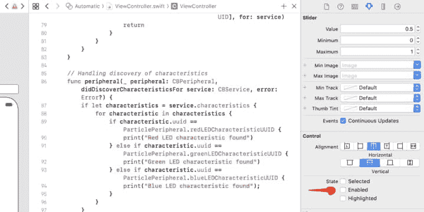](https://res.cloudinary.com/practicaldev/image/fetch/s--ECRQJbWH--/c_limit%2Cf_auto%2Cfl_progressive%2Cq_auto%2Cw_880/https://www.jaredwolff.com/the-ultimate-how-to-bluetooth-swift-with-hardware-in-20-minutimg/Screen_Shot_2019-08-11_at_2-e7e0aca9-224c-4bfb-b482-1d9e58b37947.21.21_PM.png)

同样，这也是将**最大值改为 255** 的好时机。还将默认的**值从 0.5 设置为 0。**

[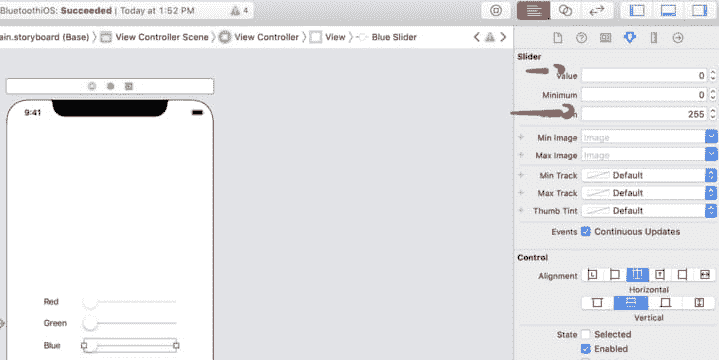](https://res.cloudinary.com/practicaldev/image/fetch/s--2YIUfX8p--/c_limit%2Cf_auto%2Cfl_progressive%2Cq_auto%2Cw_880/https://www.jaredwolff.com/the-ultimate-how-to-bluetooth-swift-with-hardware-in-20-minutimg/Screen_Shot_2019-08-11_at_2-9bf5618b-f6ac-4aea-9888-7f93a8c75414.55.38_PM.png)

回到文件的顶部。让我们为每个特征创建一些局部变量。我们将使用这些，这样我们就可以将滑块变量写入粒子网格板。

```
 // Characteristics
        private var redChar: CBCharacteristic?
        private var greenChar: CBCharacteristic?
        private var blueChar: CBCharacteristic? 
```

现在，让我们把所有的东西绑在一起！

在`didDiscoverCharacteristicsFor`回调函数中。让我们指定这些特征。例如

```
 if characteristic.uuid == ParticlePeripheral.redLEDCharacteristicUUID {
        print("Red LED characteristic found")
        redChar = characteristic 
```

当我们找到每个特征时，我们也可以在同一点启用每个滑块。

```
 // Unmask red slider
            redSlider.isEnabled = true 
```

最后你的`didDiscoverCharacteristicsFor`应该是这样的:

```
 // Handling discovery of characteristics
        func peripheral(_ peripheral: CBPeripheral, didDiscoverCharacteristicsFor service: CBService, error: Error?) {
            if let characteristics = service.characteristics {
                for characteristic in characteristics {
                    if characteristic.uuid == ParticlePeripheral.redLEDCharacteristicUUID {
                        print("Red LED characteristic found")

                        redChar = characteristic
                        redSlider.isEnabled = true
                    } else if characteristic.uuid == ParticlePeripheral.greenLEDCharacteristicUUID {
                        print("Green LED characteristic found")

                        greenChar = characteristic
                        greenSlider.isEnabled = true
                    } else if characteristic.uuid == ParticlePeripheral.blueLEDCharacteristicUUID {
                        print("Blue LED characteristic found");

                        blueChar = characteristic
                        blueSlider.isEnabled = true
                    }
                }
            }
        } 
```

现在，让我们更新`RedSliderChanged` `GreenSliderChanged`和`BlueSliderChanged`函数。这里我们想要做的是更新与`Changed`函数相关的特性。我创建了一个名为`writeLEDValueToChar`的独立函数。我们会传入特征和数据。

```
 private func writeLEDValueToChar( withCharacteristic characteristic: CBCharacteristic, withValue value: Data) {

            // Check if it has the write property
            if characteristic.properties.contains(.writeWithoutResponse) && peripheral != nil {

                peripheral.writeValue(value, for: characteristic, type: .withoutResponse)

            }

        } 
```

现在给每个`Changed`函数添加一个对`writeLEDValueToChar`的调用。你将不得不把这个值转换成一个`Uint8`。(粒子网格设备需要一个无符号的 8 位数字。)

```
 @IBAction func RedSliderChanged(_ sender: Any) {
            print("red:",redSlider.value);
            let slider:UInt8 = UInt8(redSlider.value)
            writeLEDValueToChar( withCharacteristic: redChar!, withValue: Data([slider]))

        } 
```

对`GreenSliderChanged`和`BlueSliderChanged`重复此步骤。确保将`red`改为`green`和`blue`！

最后，为了保持整洁，我还添加了一个处理蓝牙断开的功能。

```
 func centralManager(_ central: CBCentralManager, didDisconnectPeripheral peripheral: CBPeripheral, error: Error?) { 
```

在内部，我们应该将滑块的状态重置为 0 并禁用它们。

```
 if peripheral == self.peripheral {
                print("Disconnected")

                redSlider.isEnabled = false
                greenSlider.isEnabled = false
                blueSlider.isEnabled = false

                redSlider.value = 0
                greenSlider.value = 0
                blueSlider.value = 0 
```

将`self.peripheral`重置为零是个好主意，这样我们就不会试图写入一个幽灵设备。

```
 self.peripheral = nil 
```

最后，因为我们已经断开，再次开始扫描！

```
 // Start scanning again
                print("Central scanning for", ParticlePeripheral.particleLEDServiceUUID);
                centralManager.scanForPeripherals(withServices: [ParticlePeripheral.particleLEDServiceUUID],
                                                  options: [CBCentralManagerScanOptionAllowDuplicatesKey : true])
            } 
```

好吧！我们准备好测试了。让我们进入下一步(也是最后一步)。

## 测试滑块。

[](https://res.cloudinary.com/practicaldev/image/fetch/s--KAA-x5GA--/c_limit%2Cf_auto%2Cfl_progressive%2Cq_auto%2Cw_880/https://www.jaredwolff.com/the-ultimate-how-to-bluetooth-swift-with-hardware-in-20-minutimg/Flow-5-3af7db2e-8bf7-4561-98c2-a1b7ab0c685b.jpg)

艰难的工作完成了。现在该上场了！

测试一切的最简单的方法是**点击左上角的播放按钮**或者**命令+ R** 键盘快捷键。Xcode 会将应用程序加载到您的手机上。您应该会看到一个白色的屏幕，接着是一个带有滑块的屏幕！

滑块应该保持灰色，直到连接到您的粒子网板。如果连接已经建立，您可以检查日志输出。

```
View loaded
Central state update
Central scanning for B4250400-FB4B-4746-B2B0-93F0E61122C6
Connected to your Particle Board
LED service found
Red LED characteristic found
Green LED characteristic found
Blue LED characteristic found 
```

(看着眼熟？我们连在一起了！)

如果你完全按照一切，你应该能够移动滑块。更好的是，粒子网板上的 RGB LED 应该会变色。

[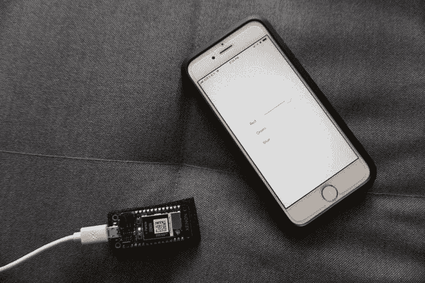](https://res.cloudinary.com/practicaldev/image/fetch/s--cUiIT0bL--/c_limit%2Cf_auto%2Cfl_progressive%2Cq_auto%2Cw_880/https://www.jaredwolff.com/the-ultimate-how-to-bluetooth-swift-with-hardware-in-20-minutimg/DSC01556-1fda5018-f1f5-4855-8705-f7d344ce3d78.jpeg)

## 结论

在本文中，您已经学习了如何通过蓝牙连接您的粒子网板和 iOS 设备。我们已经学会了如何联系到每一个可用的特征。此外，最重要的是，创建一个干净的界面来完成这一切。

可想而知，你可以在 iOS 上用蓝牙下兔子洞。在我即将发布的指南中还有更多的内容:**粒子网格终极指南。**我的列表中的订户可以访问预发布内容，并在发布时获得折扣！[点击这里注册。](https://www.jaredwolff.com/the-ultimate-guide-to-particle-mesh/)

## 代码

完整的源代码可以在 [Github 上找到。如果你觉得有用，点击星号键。⭐️](https://github.com/jaredwolff/swift-bluetooth-particle-rgb)