# 怎么跑。Azure DevOps 管道 Windows/Ubuntu 代理上的 NET Core Selenium UI 测试？🚀

> 原文：<https://dev.to/swimburger/how-to-run-net-core-selenium-ui-tests-on-azure-devops-pipelines-windows-ubuntu-agents-3l18>

前一篇博文讨论了如何使用。网芯。这篇文章讨论了如何在两个 Windows & Ubuntu 代理上的 Azure DevOps 管道中进行这些 UI 测试。使用这个 [GitHub 库](https://github.com/Swimburger/AzureDevOps_Selenium_DotNet)，它包含了这篇文章中需要的 UI 测试项目。该代码已稍作修改，以利用. runsettings 文件。

在这篇文章中，你将学到:

*   如何在持续集成(CI)构建中产生 UI 测试工件
*   如何使用 UI 测试工件将 UI 测试作为连续交付(CD)管道的一部分来运行

但是在动手之前，我们先来谈谈 Azure 管道的两种不同使用方式。

## 经典 Azure 管道 vs YAML Azure 管道

在引入 YAML 管道之前，您必须使用用户界面来组装构建管道和发布管道。这些管道使用 JSON 存储在后台，您可以导出和导入。这现在被称为“经典”Azure 管道。

古典和 YAML 各有利弊。

**经典**:

*   更容易被新人接受
*   你可以快速迭代
*   版本控制发生在幕后
*   不需要提交/推送至源代码控制
*   无需学习新的配置语言
*   更加成熟/功能更加丰富

**YAML** :

*   将 yaml 文件存储为源代码控制的一部分
*   开源项目可以使用 yaml 文件共享它们的构建/发布过程
*   使用“统一管道”,您可以在一个 yaml 文件中描述构建和发布过程
*   YAML 的视觉界面构建带来了经典的用户友好的用户界面，并将其与 YAML 相结合。Releases UI 还没有很好的 YAML 支持。

经典是最富特色的，YAML 正在慢慢赶上。在考虑 YAML 之前，重要的是评估 YAML 管道是否支持所有要求的功能。本帖将指导您创建 YAML 构建管道，但将使用 Classic 发布管道，因为目前 YAML 对发布的支持还不够强。

幸运的是，YAML 管道路线图上有一些缺失的功能，你可以在 [MS Dev 博客“Azure DevOps 年第三季度路线图更新”](https://devblogs.microsoft.com/devops/azure-devops-roadmap-update-for-2019-q3/)上阅读。

解决了这个问题，是时候构建您的构建管道了。

## 为. NET 核心 Selenium 测试项目创建一个持续集成管道

当使用 YAML 管道时，Azure DevOps 将读取您的 YAML 配置文件并按照规定执行步骤。要设置这一点，您首先需要创建 yaml 文件，然后告诉 Azure DevOps 在您的存储库中的何处可以找到它。

在您的解决方案的根目录中，添加以下“azure-pipelines.yml”文件。

```
# any commit to the master branch will trigger the CI build
trigger:
- master

# use a Windows agent with VS to build the .NET Core MSTest project
# you can replace this with Ubuntu too without changing the tasks
pool:
  name: Hosted Windows 2019 with VS2019

steps:
# install the required .NET Core SDK version
# only necessary if the agent doesn't already have the required SDK
- task: DotNetCoreInstaller@0
  displayName: 'Use  .NET  Core  sdk  2.2.301'
  inputs:
    version: 2.2.301

# restore Nuget packages/dependencies
- task: DotNetCoreCLI@2
  displayName: Restore
  inputs:
    command: restore
    projects: '**/Demo.SeleniumTests.csproj'

# publish the UI test project to the SeleliumTest subfolder in the Artifact Staging Directory
# optionally, you can add more steps to publish your own website alongside your SeleniumTests in another task
- task: DotNetCoreCLI@2
  displayName: Publish
  inputs:
    command: publish
    publishWebProjects: false
    projects: '**/Demo.SeleniumTests.csproj'
    arguments: '--configuration  Release  -o  $(build.artifactstagingdirectory)/SeleniumTests'
    zipAfterPublish: false
    modifyOutputPath: false

# publish all artifacts in the Artifact Stagign Directory
# this will place the UI Test artifacts in Azure DevOps for future use in the deployment pipeline
- task: PublishBuildArtifacts@1
  displayName: 'Publish  Artifact'
  inputs:
    PathtoPublish: '$(build.artifactstagingdirectory)'
  condition: succeededOrFailed() 
```

<svg width="20px" height="20px" viewBox="0 0 24 24" class="highlight-action crayons-icon highlight-action--fullscreen-on"><title>Enter fullscreen mode</title></svg> <svg width="20px" height="20px" viewBox="0 0 24 24" class="highlight-action crayons-icon highlight-action--fullscreen-off"><title>Exit fullscreen mode</title></svg>

请参考解释 yaml 文件不同部分的注释。总之，当您将提交推送到主分支时，Azure DevOps 将:

1.  安装。NET Core SDK
2.  恢复 MS 测试项目的 NuGet 包
3.  发布 MS 测试项目
4.  将 dotnet 发布结果作为工件发布回 Azure DevOps

要使用 Ubuntu，请将“Hosted Windows 2019 with VS2019”替换为“Hosted Ubuntu 1604”。yaml 文件中的所有步骤都应该在 Windows 和 Ubuntu 上运行。也可能是 MacOS，但我没有证实这一点。

***重要提示*:您可以使用在一个平台上生成的 DLL，并在另一个平台上运行它们。例如，当使用 linux 发行版构建 MS 测试项目时，您可以在 Windows、MacOS 和任何支持的 Linux 发行版上执行 DLL。**

现在您已经将“azure-pipelines.yml”文件添加到 GIT 存储库中，导航到 DevOps 项目中的 Azure DevOps Build 部分。

[](https://res.cloudinary.com/practicaldev/image/fetch/s--s6_rm67y--/c_limit%2Cf_auto%2Cfl_progressive%2Cq_auto%2Cw_880/https://www.swimburger.net/media/1160/azure-devops-navigate-to-build-pipelines.png)

点击“新管道”按钮。

[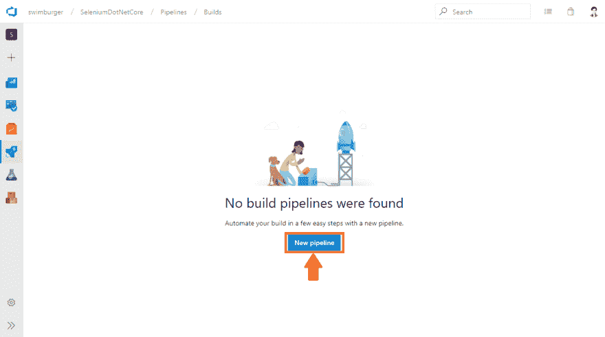](https://res.cloudinary.com/practicaldev/image/fetch/s--8XhboVeR--/c_limit%2Cf_auto%2Cfl_progressive%2Cq_auto%2Cw_880/https://www.swimburger.net/media/1159/azure-devops-new-pipeline.png)

GitHub 将在本演练中使用，但是在这一步中选择存储源代码控制库的位置。

[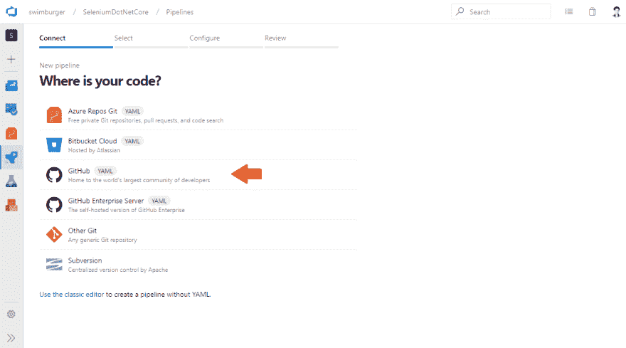](https://res.cloudinary.com/practicaldev/image/fetch/s--0x-boteF--/c_limit%2Cf_auto%2Cfl_progressive%2Cq_auto%2Cw_880/https://www.swimburger.net/media/1161/azure-devops-new-pipeline-connect-to-code.png)

从列表中选择所需的存储库。

[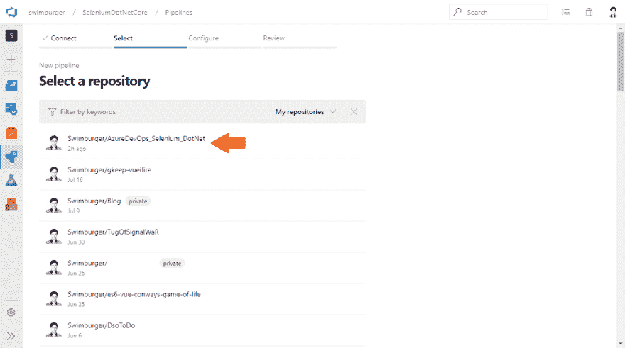](https://res.cloudinary.com/practicaldev/image/fetch/s--wkrF_9Ih--/c_limit%2Cf_auto%2Cfl_progressive%2Cq_auto%2Cw_880/https://www.swimburger.net/media/1157/azure-devops-new-pipeline-select-github-repo.png)

您已经有一个“azure-pipelines.yml”文件，因此 Azure DevOps 将使用该文件作为“配置”步骤，并跳到“检查”步骤。如果你没有 yaml 文件，Azure DevOps 会为你提供一些启动模板，并自动将新的 yaml 文件提交到你的 GIT repo 中。

单击“运行”完成构建管道的创建。

[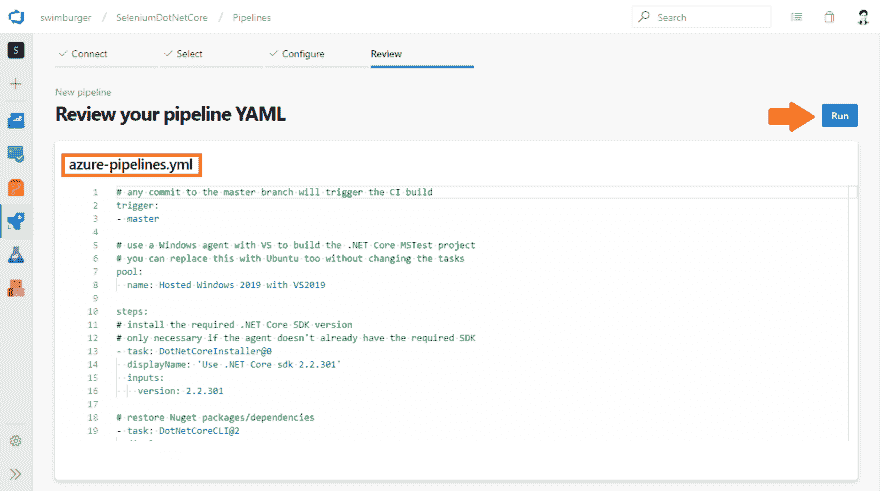](https://res.cloudinary.com/practicaldev/image/fetch/s--IHx-QFbT--/c_limit%2Cf_auto%2Cfl_progressive%2Cq_auto%2Cw_880/https://www.swimburger.net/media/1156/azure-devops-new-pipeline-review.png)

创建构建管道后，管道将首次运行，并有望成功。🤞

如果成功，将出现“工件”按钮。点击“工件”按钮，然后点击“放下”按钮。

[](https://res.cloudinary.com/practicaldev/image/fetch/s--xHMwAuVg--/c_limit%2Cf_auto%2Cfl_progressive%2Cq_auto%2Cw_880/https://www.swimburger.net/media/1155/azure-devops-continous-integration-build.png)

在工件模式中，您可以探索和下载已发布的构建工件:

[](https://res.cloudinary.com/practicaldev/image/fetch/s--8ldCgguX--/c_limit%2Cf_auto%2Cfl_progressive%2Cq_auto%2Cw_880/https://www.swimburger.net/media/1154/azure-devops-continous-integration-build-artifact.png)

现在您已经有了一个构建工件，您可以继续创建一个持续的交付管道来获取工件。

## 为. NET 核心 Selenium 测试项目创建一个连续的交付管道

到目前为止，您只使用了 YAML 管道，但是 YAML 对发布管道的支持没有这么强。因此，下面的指南将使用经典管道来创建发布管道。

### 创建发布管道

[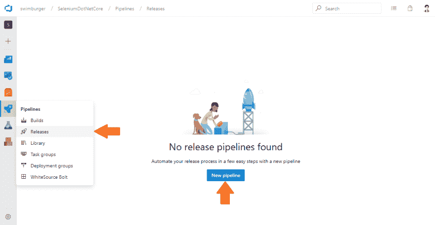](https://res.cloudinary.com/practicaldev/image/fetch/s--kYNU7teN--/c_limit%2Cf_auto%2Cfl_progressive%2Cq_auto%2Cw_880/https://www.swimburger.net/media/1165/azure-devops-releases-1-new-pipeline.png)

导航到“发布”选项卡，然后单击“新管道”按钮。

[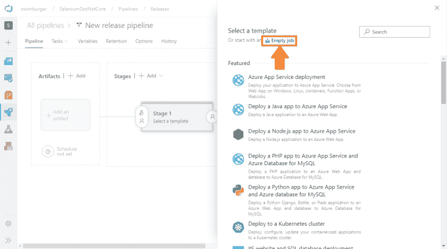](https://res.cloudinary.com/practicaldev/image/fetch/s--uQmRhztL--/c_limit%2Cf_auto%2Cfl_progressive%2Cq_auto%2Cw_880/https://www.swimburger.net/media/1166/azure-devops-releases-2-select-empty-job-template.png)

新的发布管道将提示您选择一个启动模板。这些模板非常适合快速入门。

或者，您可以使用“空作业”从头开始。单击“空工单”链接。

[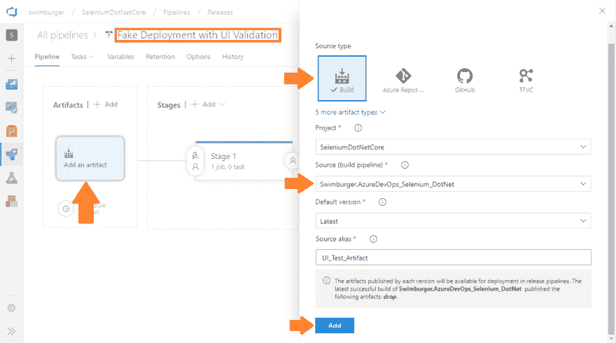](https://res.cloudinary.com/practicaldev/image/fetch/s--JKgTf-s6--/c_limit%2Cf_auto%2Cfl_progressive%2Cq_auto%2Cw_880/https://www.swimburger.net/media/1167/azure-devops-releases-3-select-artifact.png)

将管道重命名为“带 UI 验证的假部署”。

点击“添加一个工件”区域，匹配上面截图中显示的配置。

以下是这些字段含义的概述:

*   **源类型**:这将让你选择获取工件时使用的源类型。
*   **项目**:这是您添加 CI 构建的项目。
*   **Source** :该下拉列表将列出所有可能的 CI 构建管道。选择生成 UI 测试项目工件的 CI 构建管道。
*   **默认版本**:指定工件版本应该如何确定。
*   **源别名**:将其重命名为 UI_Test_Artifact。您可以使用这个别名来引用管道中的工件。

配置匹配后，单击“添加”按钮。

### 创建 QA 虚拟部署阶段

[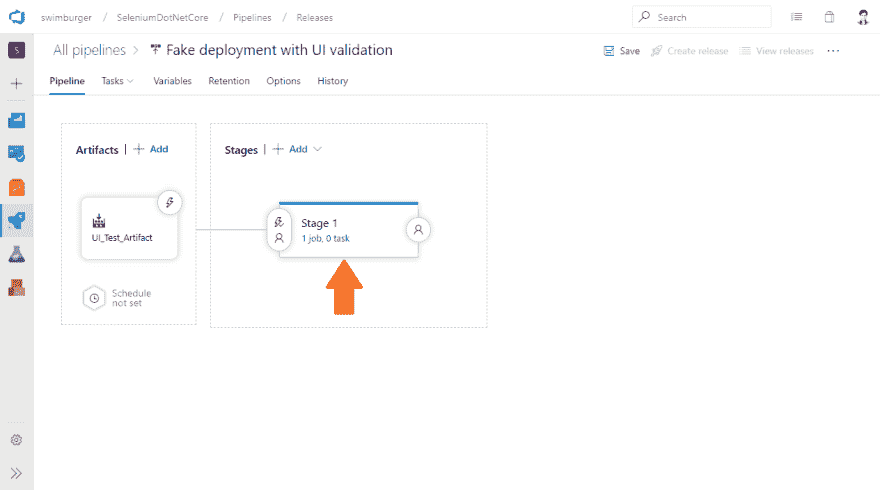](https://res.cloudinary.com/practicaldev/image/fetch/s--NMLycA5D--/c_limit%2Cf_auto%2Cfl_progressive%2Cq_auto%2Cw_880/https://www.swimburger.net/media/1168/azure-devops-releases-4-select-stage-1-job.png)

单击“阶段 1”阶段中的“1 作业，0 任务”链接，开始配置阶段中的作业/任务。

[](https://res.cloudinary.com/practicaldev/image/fetch/s--B1fkHhAQ--/c_limit%2Cf_auto%2Cfl_progressive%2Cq_auto%2Cw_880/https://www.swimburger.net/media/1169/azure-devops-releases-5-rename-job-1-to-qa-dummy-deploy.png)

将“阶段名称”重命名为“QA 虚拟部署”。这个阶段实际上不会部署任何东西，但让我们假设它会部署。

[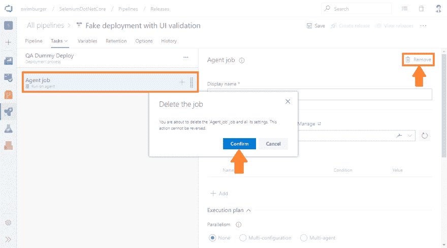](https://res.cloudinary.com/practicaldev/image/fetch/s--a-M25Brk--/c_limit%2Cf_auto%2Cfl_progressive%2Cq_auto%2Cw_880/https://www.swimburger.net/media/1170/azure-devops-releases-6-qa-dummy-deploy-remove-agent-job.png)

选择“代理作业”并单击“删除”链接。

[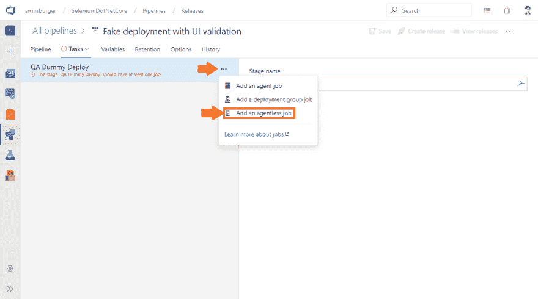](https://res.cloudinary.com/practicaldev/image/fetch/s--augaiu8y--/c_limit%2Cf_auto%2Cfl_progressive%2Cq_auto%2Cw_880/https://www.swimburger.net/media/1171/azure-devops-releases-7-qa-dummy-deploy-add-agentless-job.png)

有 3 种类型的作业可以添加到阶段:

1.  **代理作业**:在代理上运行的作业
2.  **部署组作业**:在加入部署组的多个虚拟机上运行的作业
3.  **无代理作业**:不需要代理运行的作业

因为这是一个虚拟部署阶段，所以添加一个空的无代理作业。这将是运行时最快的。

点击“QA 虚拟部署”上的三个点，并点击上下文菜单中的“添加无代理作业”。

[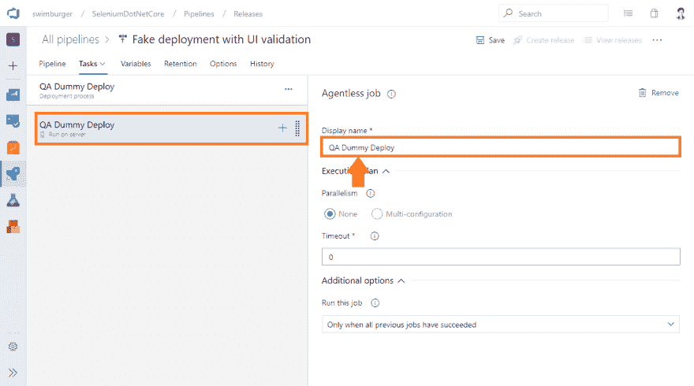](https://res.cloudinary.com/practicaldev/image/fetch/s--sWA6qRXK--/c_limit%2Cf_auto%2Cfl_progressive%2Cq_auto%2Cw_880/https://www.swimburger.net/media/1172/azure-devops-releases-8-qa-dummy-deploy-rename-agentless-job.png)

将新作业也重命名为“QA 虚拟部署”。

### 在 Windows 舞台上创建 UI 测试

[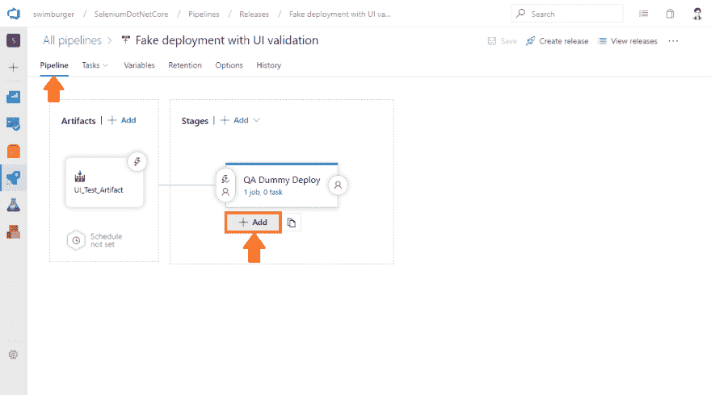](https://res.cloudinary.com/practicaldev/image/fetch/s--7hVwdXRU--/c_limit%2Cf_auto%2Cfl_progressive%2Cq_auto%2Cw_880/https://www.swimburger.net/media/1173/azure-devops-releases-9-qa-dummy-deploy-add-qa-validation-stage-windows.png)

点击“Pipeline”选项卡，导航回“Pipeline”视图。

点击“QA 虚拟部署”阶段下方的“添加”按钮。这将添加一个新阶段，该阶段将在“QA 虚拟部署”阶段之后运行。

[](https://res.cloudinary.com/practicaldev/image/fetch/s--F9YDs4d---/c_limit%2Cf_auto%2Cfl_progressive%2Cq_auto%2Cw_880/https://www.swimburger.net/media/1174/azure-devops-releases-10-create-verify-qa-stage.png)

将阶段名称重命名为“使用 Windows 代理验证 QA ”,然后单击“1 个作业，0 个任务”导航到阶段的“任务”视图。

[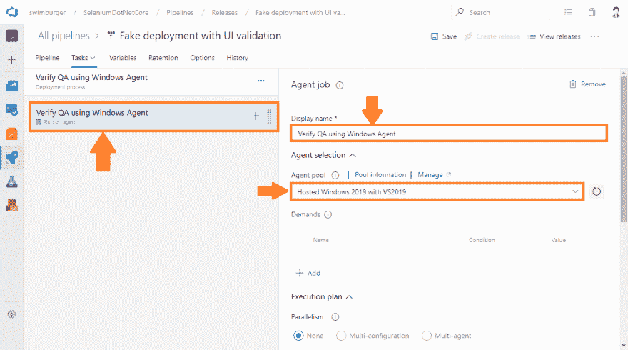](https://res.cloudinary.com/practicaldev/image/fetch/s--811dKWTb--/c_limit%2Cf_auto%2Cfl_progressive%2Cq_auto%2Cw_880/https://www.swimburger.net/media/1175/azure-devops-releases-11-verify-qa-setup-windows-agent-job.png)

将现有作业重命名为“使用 Windows 代理验证 QA”。

将“代理池”下拉列表更改为使用“带 VS2019 的托管 Windows 2019”。

代理池决定任务将在哪个代理上运行。开箱即用，Azure DevOps 服务将为您提供多个预配置的代理池。

您可以通过将您的机器配置为 Azure DevOps 代理来添加您自己的代理池。

[](https://res.cloudinary.com/practicaldev/image/fetch/s--8hWORx2---/c_limit%2Cf_auto%2Cfl_progressive%2Cq_auto%2Cw_880/https://www.swimburger.net/media/1176/azure-devops-releases-12-verify-qa-add-powershell-task.png)

单击“使用 Windows 代理验证 QA”作业上的“+”图标。

搜索“PowerShell”，点击“PowerShell”任务上的“添加”按钮，添加 PowerShell 任务。

这个 PowerShell 任务将从 Google 下载 ChromeDriver，并将它们放在 UI 测试 DLL 旁边。

[](https://res.cloudinary.com/practicaldev/image/fetch/s--kEWRqjbX--/c_limit%2Cf_auto%2Cfl_progressive%2Cq_auto%2Cw_880/https://www.swimburger.net/media/1177/azure-devops-releases-13-qa-verification-windows-download-chromedriver-using-powershell.png)

将 PowerShell 任务配置为与上面的屏幕截图相匹配:

*   **显示名称**:*下载 ChromeDriver 75*
*   **类型**:勾选*内嵌*单选按钮。您可以使用引用 PowerShell 脚本文件的“文件路径”来运行 PowerShell，或者使用“内联”选项将 PowerShell 简单地复制到内联“脚本”字段中。
*   **脚本**:这是将由代理执行的 PowerShell 代码。代码将下载 ChromeDriver，并将其放在 UI 测试 DLL 的旁边。*从下面复制代码*:

```
Invoke-WebRequest  -Uri  "https://chromedriver.storage.googleapis.com/75.0.3770.90/chromedriver_win32.zip"  -OutFile  $(System.DefaultWorkingDirectory)/chromedriver_win32.zip;  Expand-Archive  $(System.DefaultWorkingDirectory)/chromedriver_win32.zip  -DestinationPath  $(System.DefaultWorkingDirectory)/chromedriver_win32;  Copy-Item  "$(System.DefaultWorkingDirectory)/chromedriver_win32/chromedriver.exe" -Destination "$(System.DefaultWorkingDirectory)/UI_Test_Artifact/drop/SeleniumTests/" 
```

<svg width="20px" height="20px" viewBox="0 0 24 24" class="highlight-action crayons-icon highlight-action--fullscreen-on"><title>Enter fullscreen mode</title></svg> <svg width="20px" height="20px" viewBox="0 0 24 24" class="highlight-action crayons-icon highlight-action--fullscreen-off"><title>Exit fullscreen mode</title></svg>

[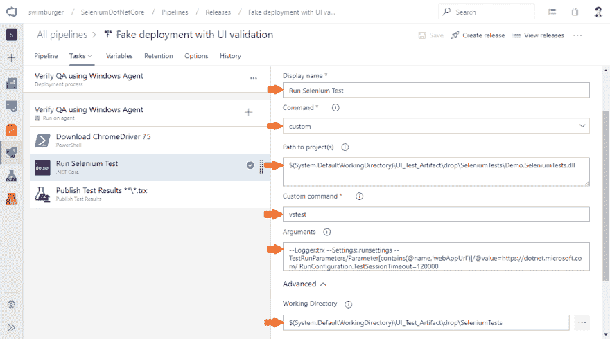](https://res.cloudinary.com/practicaldev/image/fetch/s--VTAhcENN--/c_limit%2Cf_auto%2Cfl_progressive%2Cq_auto%2Cw_880/https://www.swimburger.net/media/1178/azure-devops-releases-14-qa-verification-windows-run-selenium-test.png)

当您想要从源代码运行 UI 测试项目时，您可以使用“dotnet test”命令来查找您的*。csproj 文件。在您的情况下，您只有 DLL 文件，并且“dotnet test”命令将不起作用。

对于这个用例，你必须使用[的‘点网 vs test’命令](https://docs.microsoft.com/en-us/dotnet/core/tools/dotnet-vstest)。语法略有不同，但本质上与 test 命令的工作方式相同。要运行 UI 测试，您需要运行带有一些额外参数的“dotnet vstest”来生成测试结果。

通过单击“+”图标添加另一个任务。搜索一下”。NET Core”任务，并单击“添加”按钮。

配置。NET 核心任务来匹配上面的截图:

*   **显示名称**:运行硒测试
*   **命令**:自定义
*   **项目路径** : $(系统。DefaultWorkingDirectory)\ UI _ Test _ Artifact \ drop \ SeleniumTests \ Demo。SeleniumTests.dll
*   **自定义命令** : vstest
*   **参数** : -记录器:trx -设置:。run settings-TestRunParameters/Parameter[contains([@ name](https://dev.to/name)，' web app URL ')]/@ value =[https://dotnet.microsoft.com/](https://dotnet.microsoft.com/)run configuration。TestSessionTimeout=120000
*   **工作目录** : $(系统。DefaultWorkingDirectory)\ UI _ Test _ Artifact \ drop \ SeleniumTests

这些参数将被传递给“dotnet vstest”命令。这些论点是这样的:

*   **Logger** :指定记录测试执行结果的格式。 **trx** 是 Visual Studio 测试结果文件格式。

    使用该参数将创建一个“测试结果”文件夹，并在文件夹内创建一个 trx 文件。

*   **设置**:使用这个参数你可以指定一个. runsettings 文件。你可以找到[了。运行 GitHub 资源库中的设置文件，以获得本指南](https://github.com/Swimburger/AzureDevOps_Selenium_DotNet/blob/master/Demo.SeleniumTests/.runsettings)。

*   **-**:“-”后面的所有内容都是额外的参数，用于覆盖。运行设置文件。

    这允许你很容易地为每个阶段(开发/QA/登台/生产/等)改变 webAppUrl。

    【运行配置】。“TestSessionTimeout”会将单个测试的超时时间指定为 2 分钟(120 秒)。

[](https://res.cloudinary.com/practicaldev/image/fetch/s--73dX434x--/c_limit%2Cf_auto%2Cfl_progressive%2Cq_auto%2Cw_880/https://www.swimburger.net/media/1179/azure-devops-releases-15-qa-verification-windows-publish-test-results.png)

最后一步是发布存储在 trx 文件中的测试结果。

添加另一个任务，这次寻找“发布测试结果”。

配置任务以匹配上面的截图:

*   **显示名称**:发布测试结果***。处理
*   **测试结果格式** : VSTest
*   **测试结果文件** : ***。处理
*   **搜索文件夹** : $(系统。DefaultWorkingDirectory)\ UI _ Test _ Artifact \ drop \ SeleniumTests \ Test results

如上配置任务时，该任务需要 VSTest 格式的结果文件，并将使用* * * *搜索 trx 文件。TestResults 文件夹中的 trx Regex 模式。

测试结果的任何子文件夹也将使用* * * *进行扫描。trx 模式。结果文件将用于填充 Azure DevOps 中的测试结果接口。

现在您有了一个可以工作的 UI 测试阶段。您可以通过创建一个新版本来尝试这种方法。🎊

### 在 Ubuntu 舞台上创建 UI 测试

要在 Ubuntu 而不是 Windows 上运行 UI 测试，您可以在 Ubuntu 上运行相同的任务，只是平台略有不同。

[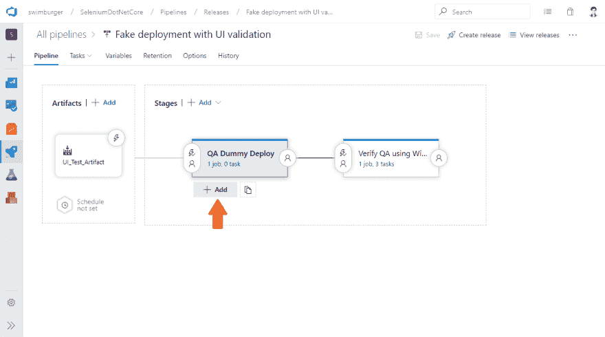](https://res.cloudinary.com/practicaldev/image/fetch/s--PDFyt7dt--/c_limit%2Cf_auto%2Cfl_progressive%2Cq_auto%2Cw_880/https://www.swimburger.net/media/1180/azure-devops-releases-16-create-verify-qa-stage-using-ubuntu-agent.png)

单击“QA 虚拟部署”阶段下方的“添加”按钮。

这将创建另一个阶段，该阶段将在“QA 虚拟部署”之后运行，但与 Windows 阶段并行。

[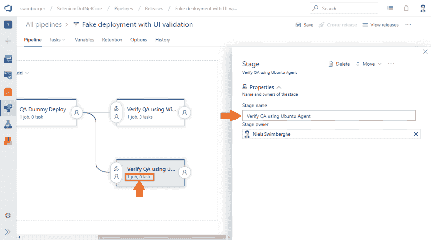](https://res.cloudinary.com/practicaldev/image/fetch/s--OXi8Tbtk--/c_limit%2Cf_auto%2Cfl_progressive%2Cq_auto%2Cw_880/https://www.swimburger.net/media/1181/azure-devops-releases-17-create-verify-qa-stage-using-ubuntu-agent-rename.png)

将新阶段重命名为“使用 Ubuntu 代理验证 QA”，然后单击“1 作业，0 任务”。

[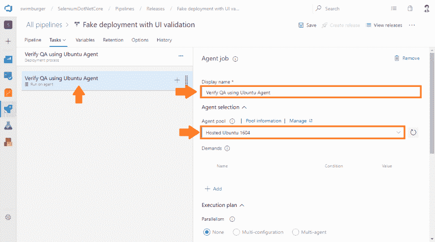](https://res.cloudinary.com/practicaldev/image/fetch/s--LnHfihIX--/c_limit%2Cf_auto%2Cfl_progressive%2Cq_auto%2Cw_880/https://www.swimburger.net/media/1182/azure-devops-releases-18-verify-qa-stage-using-ubuntu-setup-agent.png)

将默认作业重命名为“使用 Ubuntu 代理验证 QA ”,并选择“托管 Ubuntu 1604”代理池

[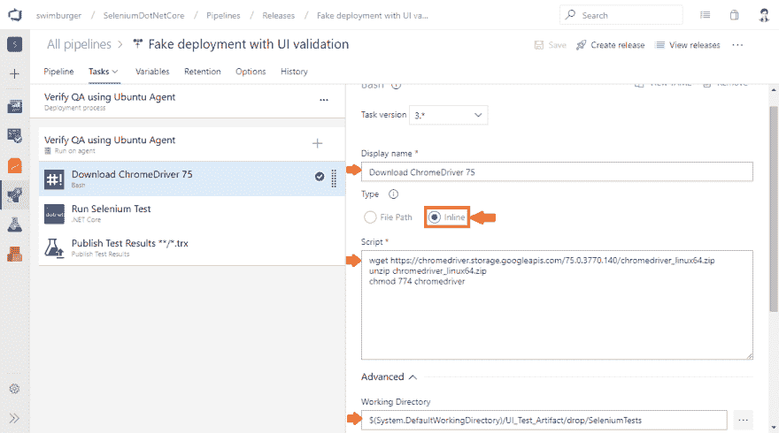](https://res.cloudinary.com/practicaldev/image/fetch/s--aWStR-6D--/c_limit%2Cf_auto%2Cfl_progressive%2Cq_auto%2Cw_880/https://www.swimburger.net/media/1183/azure-devops-releases-19-qa-verification-ubuntu-download-chromedriver.png)

添加一个“Bash”任务，并将该任务配置为与上面的屏幕截图相匹配:

*   **显示名称**:下载 ChromeDriver 75
*   **类型**:内嵌
*   **脚本**:从下面复制脚本。
*   **工作目录** : $(系统。DefaultWorkingDirectory)/UI _ Test _ Artifact/drop/SeleniumTests

下载 ChromeDriver 75 bash 脚本:

```
wget https://chromedriver.storage.googleapis.com/75.0.3770.140/chromedriver_linux64.zip
unzip chromedriver_linux64.zip
chmod +x chromedriver 
```

<svg width="20px" height="20px" viewBox="0 0 24 24" class="highlight-action crayons-icon highlight-action--fullscreen-on"><title>Enter fullscreen mode</title></svg> <svg width="20px" height="20px" viewBox="0 0 24 24" class="highlight-action crayons-icon highlight-action--fullscreen-off"><title>Exit fullscreen mode</title></svg>

bash 脚本的逻辑与 PowerShell 脚本相同，只是在 Linux 上，您需要更改 chromedriver 的权限才能使用它。

**或者，你也可以在 Ubuntu 上使用 PowerShell！NANI？！**😲

Ubuntu 代理预装了 PowerShell 核心。 **PowerShell Core 是基于的跨平台版 PowerShell。网芯。**

如果 PowerShell 是你的最爱，下面是脚本:

```
Invoke-WebRequest  -Uri  "https://chromedriver.storage.googleapis.com/75.0.3770.140/chromedriver_linux64.zip"  -OutFile  $(System.DefaultWorkingDirectory)/chromedriver_linux64.zip;  Expand-Archive  $(System.DefaultWorkingDirectory)/chromedriver_linux64.zip  -DestinationPath  $(System.DefaultWorkingDirectory)/chromedriver_linux64;  Copy-Item  "$(System.DefaultWorkingDirectory)/chromedriver_linux64/chromedriver" -Destination "$(System.DefaultWorkingDirectory)/UI_Test_Artifact/drop/SeleniumTests/"

chmod +x $(System.DefaultWorkingDirectory)/UI_Test_Artifact/drop/SeleniumTests/chromedriver 
```

<svg width="20px" height="20px" viewBox="0 0 24 24" class="highlight-action crayons-icon highlight-action--fullscreen-on"><title>Enter fullscreen mode</title></svg> <svg width="20px" height="20px" viewBox="0 0 24 24" class="highlight-action crayons-icon highlight-action--fullscreen-off"><title>Exit fullscreen mode</title></svg>

你可能会注意到 PowerShell 脚本与 Windows 脚本非常相似，非常酷！

[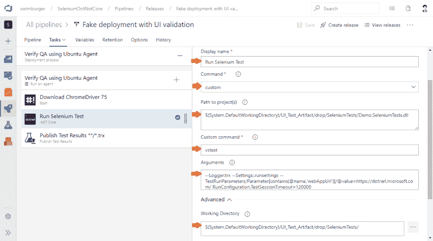](https://res.cloudinary.com/practicaldev/image/fetch/s--Ar0-QMCg--/c_limit%2Cf_auto%2Cfl_progressive%2Cq_auto%2Cw_880/https://www.swimburger.net/media/1184/azure-devops-releases-20-qa-verification-ubuntu-run-selenium-test.png)

添加一个新的”。NET Core”任务，并将配置与上面的屏幕截图进行匹配:

*   **显示名称**:运行硒测试
*   **命令**:自定义
*   **项目路径** : $(系统。DefaultWorkingDirectory)/UI _ Test _ Artifact/drop/SeleniumTests/Demo。SeleniumTests.dll
*   **自定义命令** : vstest
*   **参数** : -记录器:trx -设置:。run settings-TestRunParameters/Parameter[contains([@ name](https://dev.to/name)，' web app URL ')]/@ value =[https://dotnet.microsoft.com/](https://dotnet.microsoft.com/)run configuration。TestSessionTimeout=120000
*   **工作目录** : $(系统。DefaultWorkingDirectory)/UI _ Test _ Artifact/drop/SeleniumTests/

此配置与 Windows stage 的配置完全相同。有关更多信息，请参考 Windows stage。

[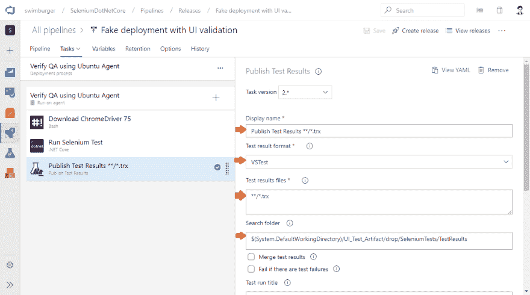](https://res.cloudinary.com/practicaldev/image/fetch/s--tvwfxL5e--/c_limit%2Cf_auto%2Cfl_progressive%2Cq_auto%2Cw_880/https://www.swimburger.net/media/1185/azure-devops-releases-21-qa-verification-ubuntu-publish-test-results.png)

添加“发布测试结果”,并将配置与上面的屏幕截图匹配:

*   **显示名称**:发布测试结果**/*。处理
*   **测试结果格式** : VSTest
*   **测试结果文件** : **/*。处理
*   **搜索文件夹** : $(系统。DefaultWorkingDirectory)/UI _ Test _ Artifact/drop/SeleniumTests/Test results

此配置与 Windows stage 的配置完全相同。有关更多信息，请参考 Windows stage。

### 测试发布管道

既然已经创建了发布管道，您可以通过创建一个发布来测试它。

[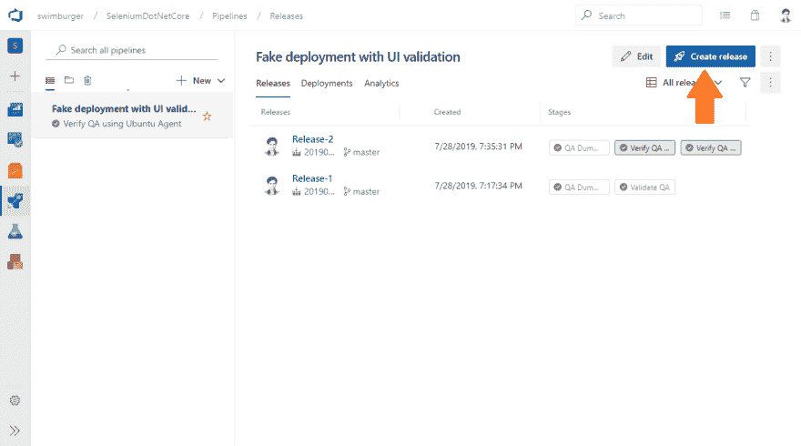](https://res.cloudinary.com/practicaldev/image/fetch/s--sd925Xcx--/c_limit%2Cf_auto%2Cfl_progressive%2Cq_auto%2Cw_880/https://www.swimburger.net/media/1186/azure-devops-releases-22-create-release.png)

导航回发布概览屏幕，并单击“创建发布”按钮。

[](https://res.cloudinary.com/practicaldev/image/fetch/s--pNj9Ap6V--/c_limit%2Cf_auto%2Cfl_progressive%2Cq_auto%2Cw_880/https://www.swimburger.net/media/1187/azure-devops-releases-23-create-release-details.png)

在弹出“创建新版本”详细信息屏幕后，单击“创建”按钮。

[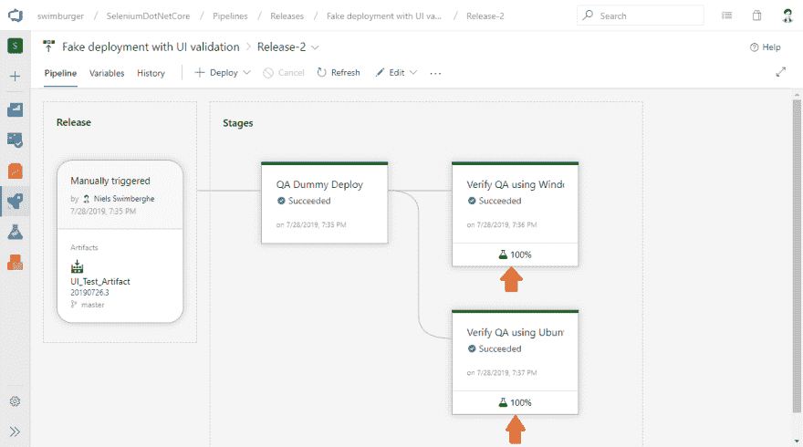](https://res.cloudinary.com/practicaldev/image/fetch/s--wmPQEKML--/c_limit%2Cf_auto%2Cfl_progressive%2Cq_auto%2Cw_880/https://www.swimburger.net/media/1188/azure-devops-releases-24-release-results.png)

当发布运行时，您可以检查进度并实时查看变化。

[](https://res.cloudinary.com/practicaldev/image/fetch/s--t0OBSWTp--/c_limit%2Cf_auto%2Cfl_progressive%2Cq_auto%2Cw_880/https://www.swimburger.net/media/1189/azure-devops-releases-25-release-test-results.png)

单击检查特定阶段时，您可以找到包括测试结果在内的更多详细信息。

## 总结

在本指南中，您学习了如何

*   使用 YAML Azure DevOps 管道创建持续集成管道
*   使用 dotnet CLI 可以
    *   建设
    *   使用源代码进行测试(点网测试)
    *   使用已发布的 DLL 进行测试(dotnet vstest)
*   使用经典 Azure DevOps 管道创建连续部署管道
*   快跑。Windows 和 Ubuntu 上的. NET UI 测试

如果所有的 UI 测试都成功，您可以扩展这个示例以部署到生产环境中，然后使用相同的 UI 测试逻辑验证生产环境。通常，自动化的 UI 测试是不够的，所以添加一个预部署批准门是个好主意。在进行额外的探索性测试后，QA 工程师可以批准批准关卡。

享受自动化！😎