# Kubernetes:第 2 部分——使用 AWS 云提供商和 AWS 负载均衡器在 AWS 上设置一个集群

> 原文：<https://dev.to/setevoy/kubernetes-part-2-a-cluster-set-up-on-aws-with-aws-cloud-provider-and-aws-loadbalancer-4mlh>

[](https://res.cloudinary.com/practicaldev/image/fetch/s--1omKf2Bs--/c_limit%2Cf_auto%2Cfl_progressive%2Cq_auto%2Cw_880/https://rtfm.co.ua/wp-content/uploads/2017/06/kuber-1.png) 在第一部分——[Kubernetes:第一部分——架构和主要组件概述](https://rtfm.co.ua/en/kubernetes-part-1-architecture-and-main-components-overview/#Deployment)——我们快速浏览了一下 Kubernetes。

第三部分- [Kubernetes:第三部分-AWS EKS 概述和手动 EKS 集群设置](https://rtfm.co.ua/en/kubernetes-part-3-aws-eks-overview-and-manual-eks-cluster-set-up/)

我想尝试的下一件事是使用 [`kubeadm`](https://kubernetes.io/docs/setup/production-environment/tools/kubeadm/create-cluster-kubeadm/) 手动创建一个集群，在那里运行一个简单的 web 服务，并通过 AWS 负载平衡器访问它。

在这个过程中，我面临的主要问题是缺乏成熟的文档和最新的例子，因此几乎所有的事情都必须通过试凑法来完成。

终于看到一条信息说:

> 警告:aws 内置云提供程序现已弃用。AWS 提供程序已弃用，将在未来版本中删除

下面的例子使用了 Kubernetes 版本:v1.15.2 .和ес2 以及 OS Ubuntu 18.04

### 准备 AWS

#### VPC

用 *10.0.0.0/16* CIDR 制造一个 VPC:

[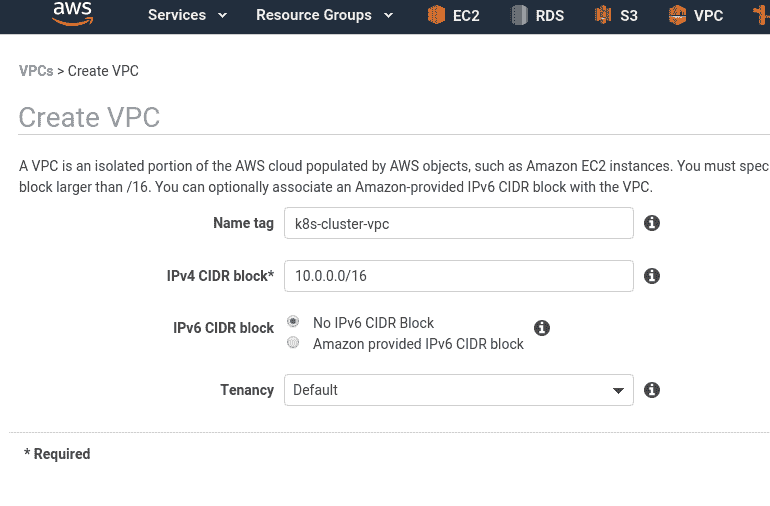](https://rtfm.co.ua/wp-content/uploads/2019/08/Screenshot_20190809_155148.png)

添加一个名为*kubernetes.io/cluster/kubernetes*的标签，其值为*所拥有的*——K8s 将使用该标签进行与 Kubernetes 堆栈相关的 AWS 资源自动发现，它还会在创建新资源的过程中添加这样一个标签:

[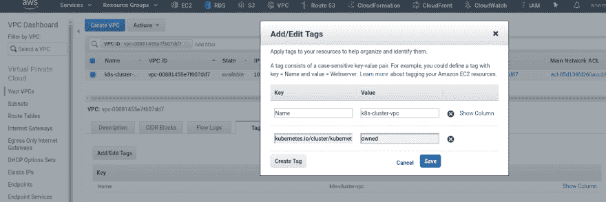](https://rtfm.co.ua/wp-content/uploads/2019/08/Screenshot_20190809_155223.png)

启用 *DNS 主机名*:

[](https://rtfm.co.ua/wp-content/uploads/2019/08/Screenshot_20190809_155306.png)

[](https://rtfm.co.ua/wp-content/uploads/2019/08/Screenshot_20190809_155322.png)

#### 子网

在此 VPC 中创建新子网:

[](https://rtfm.co.ua/wp-content/uploads/2019/08/Screenshot_20190809_155431.png)

为将放置在此子网中的 EC2 实例启用公共 IP:

[](https://rtfm.co.ua/wp-content/uploads/2019/08/Screenshot_20190809_155456.png)

[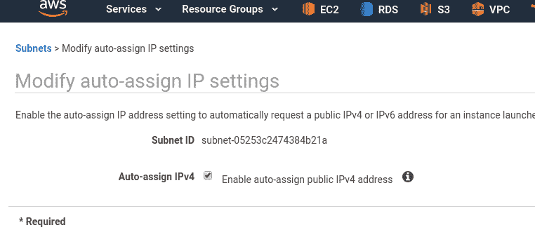](https://rtfm.co.ua/wp-content/uploads/2019/08/Screenshot_20190809_155520.png)

添加标签:

[](https://rtfm.co.ua/wp-content/uploads/2019/08/Screenshot_20190809_155553.png)

#### 互联网网关

创建一个 IGW，将流量从子网路由到互联网:

[](https://rtfm.co.ua/wp-content/uploads/2019/08/Screenshot_20190809_155626.png)

对于 IGW，也添加标签，以防万一:

[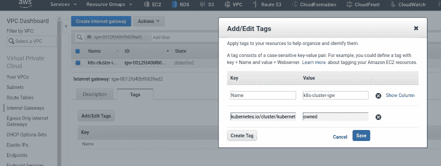](https://rtfm.co.ua/wp-content/uploads/2019/08/Screenshot_20190809_155734.png)

将此 IGW 附加到您的 VPC:

[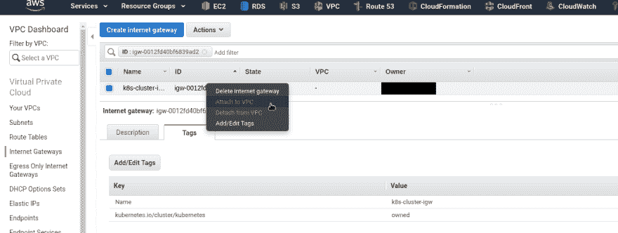](https://rtfm.co.ua/wp-content/uploads/2019/08/Screenshot_20190809_155756-1.png)

[](https://rtfm.co.ua/wp-content/uploads/2019/08/Screenshot_20190809_155811.png)

#### 路由表

创建路由表:

[](https://rtfm.co.ua/wp-content/uploads/2019/08/Screenshot_20190809_155842.png)

在此添加标签:

[](https://rtfm.co.ua/wp-content/uploads/2019/08/Screenshot_20190809_155913.png)

点击*路由*选项卡，通过我们上面创建的 IGW 向 *0.0.0.0/0* 网络添加一条新路由:

[](https://rtfm.co.ua/wp-content/uploads/2019/08/Screenshot_20190809_155947.png)

将此表附加到子网-*编辑子网关联*:

[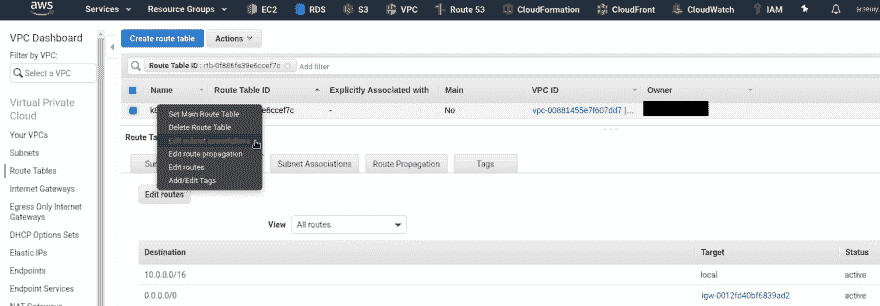](https://rtfm.co.ua/wp-content/uploads/2019/08/Screenshot_20190809_160029-1.png)

选择您之前创建的子网:

[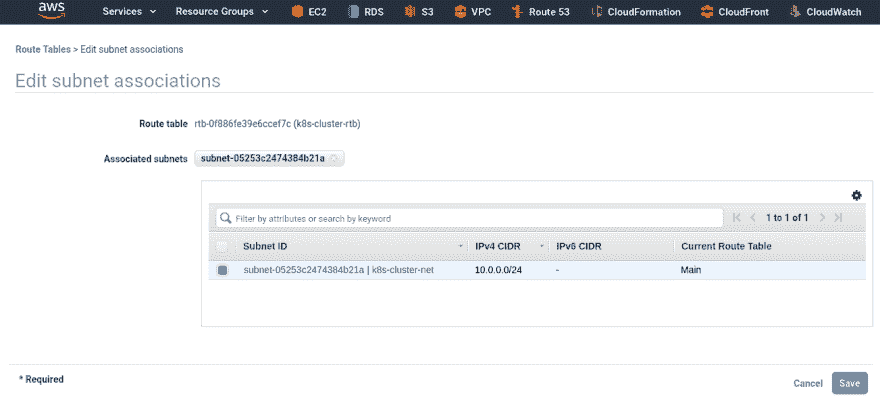](https://rtfm.co.ua/wp-content/uploads/2019/08/Screenshot_20190809_160104.png)

#### IAM 角色

为了让 Kubernetes 与 AWS 一起工作，需要创建两个 IAM EC2 角色——主角色和从角色。

您也可以使用 ACCESS/SECRET 来代替。

##### IAM 主角色

进入 *IAM >策略*，点击*创建策略*，进入 JSON 添加新的策略描述(参见 [cloud-provider-aws](https://github.com/kubernetes/cloud-provider-aws) ):

```
{
    "Version": "2012-10-17",
    "Statement": [
        {
            "Effect": "Allow",
            "Action": [
                "autoscaling:DescribeAutoScalingGroups",
                "autoscaling:DescribeLaunchConfigurations",
                "autoscaling:DescribeTags",
                "ec2:DescribeInstances",
                "ec2:DescribeRegions",
                "ec2:DescribeRouteTables",
                "ec2:DescribeSecurityGroups",
                "ec2:DescribeSubnets",
                "ec2:DescribeVolumes",
                "ec2:CreateSecurityGroup",
                "ec2:CreateTags",
                "ec2:CreateVolume",
                "ec2:ModifyInstanceAttribute",
                "ec2:ModifyVolume",
                "ec2:AttachVolume",
                "ec2:AuthorizeSecurityGroupIngress",
                "ec2:CreateRoute",
                "ec2:DeleteRoute",
                "ec2:DeleteSecurityGroup",
                "ec2:DeleteVolume",
                "ec2:DetachVolume",
                "ec2:RevokeSecurityGroupIngress",
                "ec2:DescribeVpcs",
                "elasticloadbalancing:AddTags",
                "elasticloadbalancing:AttachLoadBalancerToSubnets",
                "elasticloadbalancing:ApplySecurityGroupsToLoadBalancer",
                "elasticloadbalancing:CreateLoadBalancer",
                "elasticloadbalancing:CreateLoadBalancerPolicy",
                "elasticloadbalancing:CreateLoadBalancerListeners",
                "elasticloadbalancing:ConfigureHealthCheck",
                "elasticloadbalancing:DeleteLoadBalancer",
                "elasticloadbalancing:DeleteLoadBalancerListeners",
                "elasticloadbalancing:DescribeLoadBalancers",
                "elasticloadbalancing:DescribeLoadBalancerAttributes",
                "elasticloadbalancing:DetachLoadBalancerFromSubnets",
                "elasticloadbalancing:DeregisterInstancesFromLoadBalancer",
                "elasticloadbalancing:ModifyLoadBalancerAttributes",
                "elasticloadbalancing:RegisterInstancesWithLoadBalancer",
                "elasticloadbalancing:SetLoadBalancerPoliciesForBackendServer",
                "elasticloadbalancing:AddTags",
                "elasticloadbalancing:CreateListener",
                "elasticloadbalancing:CreateTargetGroup",
                "elasticloadbalancing:DeleteListener",
                "elasticloadbalancing:DeleteTargetGroup",
                "elasticloadbalancing:DescribeListeners",
                "elasticloadbalancing:DescribeLoadBalancerPolicies",
                "elasticloadbalancing:DescribeTargetGroups",
                "elasticloadbalancing:DescribeTargetHealth",
                "elasticloadbalancing:ModifyListener",
                "elasticloadbalancing:ModifyTargetGroup",
                "elasticloadbalancing:RegisterTargets",
                "elasticloadbalancing:SetLoadBalancerPoliciesOfListener",
                "iam:CreateServiceLinkedRole",
                "kms:DescribeKey"
            ],
            "Resource": [
                "*"
            ]
        }
    ]
} 
```

[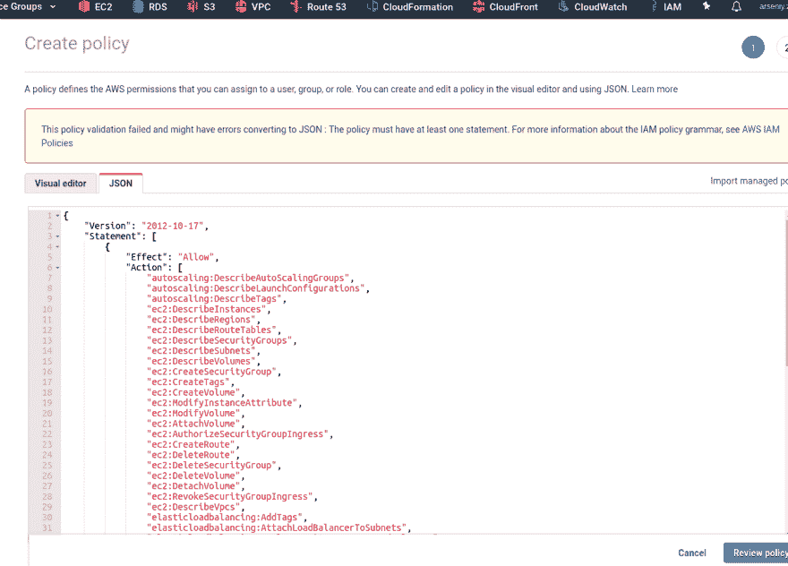](https://rtfm.co.ua/wp-content/uploads/2019/08/Screenshot_20190809_161414-1.png)

保存它:

[](https://rtfm.co.ua/wp-content/uploads/2019/08/Screenshot_20190809_161512-1.png)

转到*角色*，使用 EC2 类型创建一个角色:

[](https://rtfm.co.ua/wp-content/uploads/2019/08/Screenshot_20190809_161625.png)

点击*权限*，找到并附上上面添加的策略:

[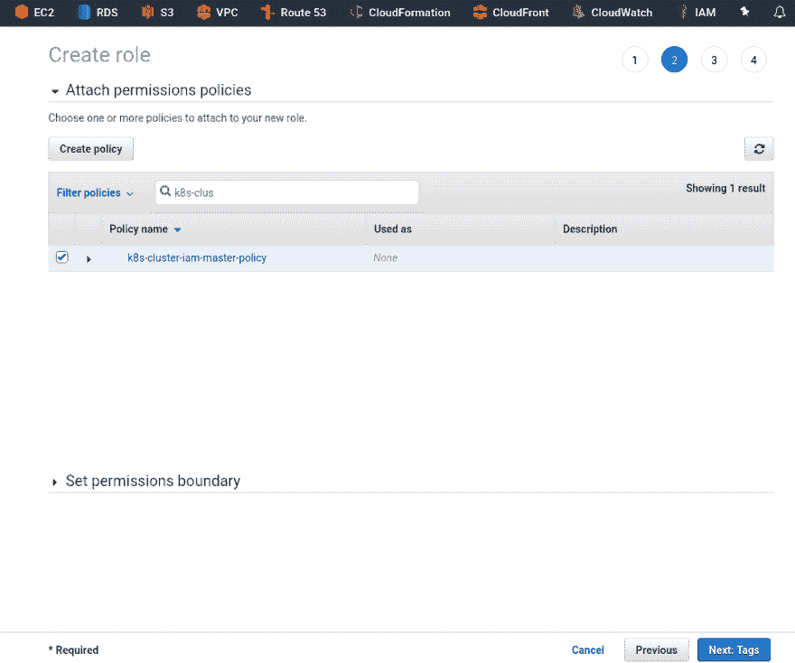](https://rtfm.co.ua/wp-content/uploads/2019/08/Screenshot_20190809_161716.png)

[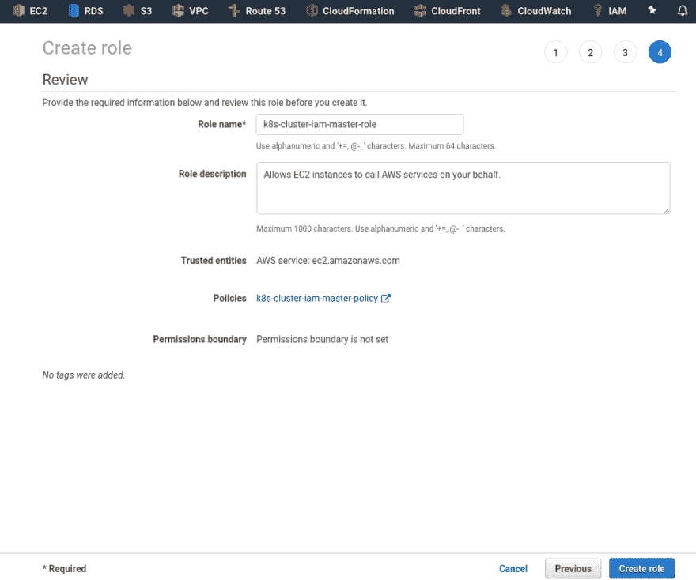](https://rtfm.co.ua/wp-content/uploads/2019/08/Screenshot_20190809_161807.png)

##### IAM 工作者角色

同样，为 worker 节点创建另一个策略:

```
{
    "Version": "2012-10-17",
    "Statement": [
        {
            "Effect": "Allow",
            "Action": [
                "ec2:DescribeInstances",
                "ec2:DescribeRegions",
                "ecr:GetAuthorizationToken",
                "ecr:BatchCheckLayerAvailability",
                "ecr:GetDownloadUrlForLayer",
                "ecr:GetRepositoryPolicy",
                "ecr:DescribeRepositories",
                "ecr:ListImages",
                "ecr:BatchGetImage"
            ],
            "Resource": "*"
        }
    ]
} 
```

保存为*k8s-cluster-iam-worker-policy*(显然可以使用任何名称):

[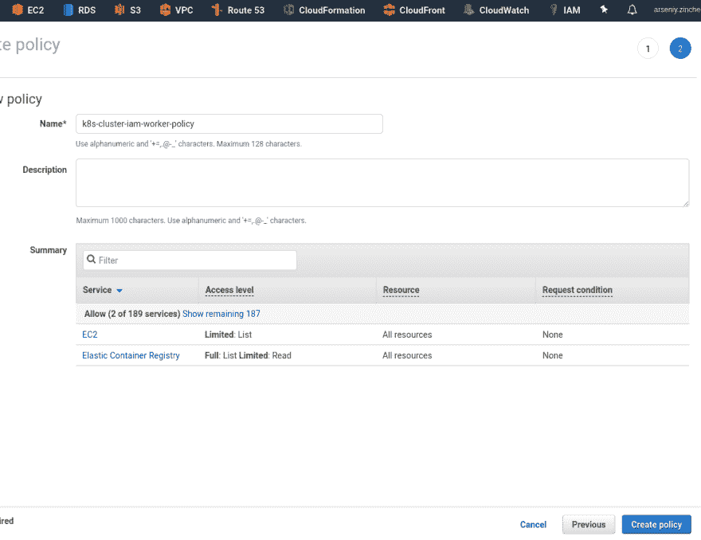](https://rtfm.co.ua/wp-content/uploads/2019/08/Screenshot_20190809_162026.png)

并创建一个*k8s-cluster-iam-master-role*:

[](https://rtfm.co.ua/wp-content/uploads/2019/08/Screenshot_20190809_162131.png)

#### 运行 EC2

使用 t2.medium 类型创建 EC2(最小类型，因为 cKubernetes master 至少需要 2 个 CPU 内核)，使用您的 VPC，并将*k8s-cluster-iam-master-role*设置为 IAM 角色:

[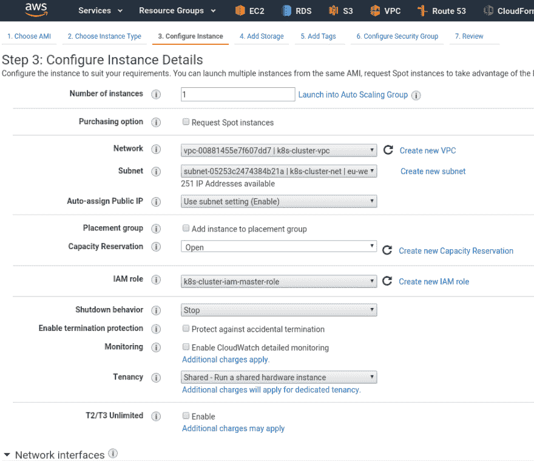](https://rtfm.co.ua/wp-content/uploads/2019/08/Screenshot_20190809_162304.png)

添加标签:

[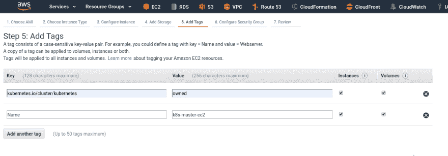](https://rtfm.co.ua/wp-content/uploads/2019/08/Screenshot_20190809_162337.png)

创建一个*安全组*:

[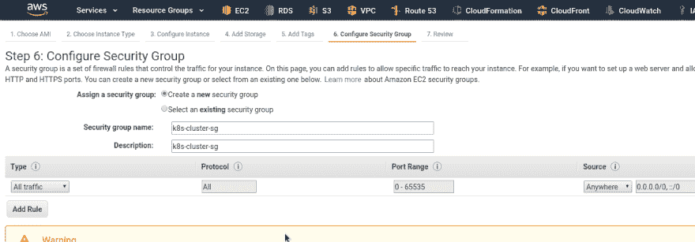](https://rtfm.co.ua/wp-content/uploads/2019/08/Screenshot_20190809_162418.png)

Wile Master 正在加速运行–使用*k8s-cluster-iam-Worker-role*以同样的方式创建一个 Worker 节点:

[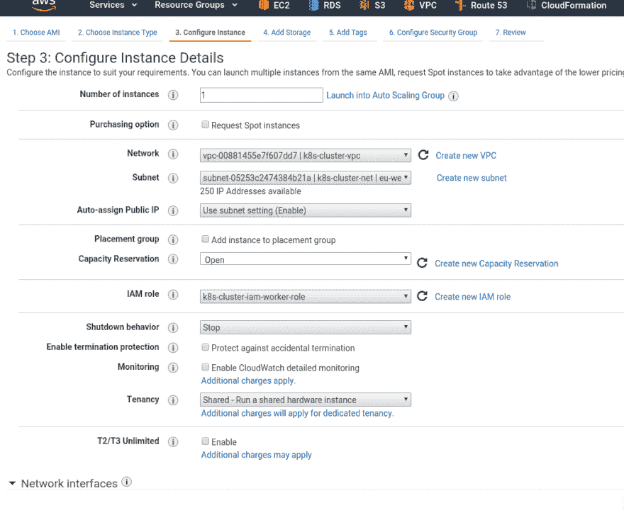](https://rtfm.co.ua/wp-content/uploads/2019/08/Screenshot_20190809_162648.png)

标签:

[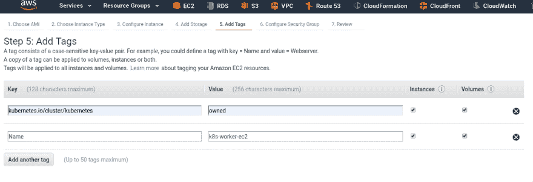](https://rtfm.co.ua/wp-content/uploads/2019/08/Screenshot_20190809_162716.png)

附加现有 SG:

[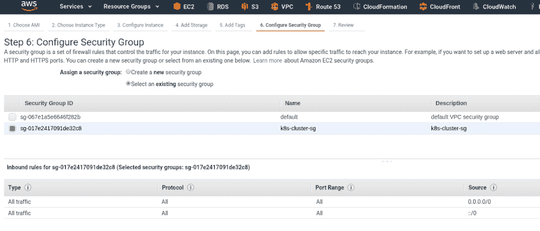](https://rtfm.co.ua/wp-content/uploads/2019/08/Screenshot_20190809_162740.png)

连接到任何实例并检查网络是否工作:

```
ssh -i k8s-cluster-eu-west-3-key.pem ubuntu@35.***.***.117 'ping -c 1 1.1.1.1'
PING 1.1.1.1 (1.1.1.1) 56(84) bytes of data.
64 bytes from 1.1.1.1: icmp_seq=1 ttl=54 time=1.08 ms 
```

很好。

### 一个 Kubernetes 集群建立起来

#### 不间断安装

在两个 EC2 上执行接下来的步骤。

更新软件包列表和已安装的软件包:

```
root@ip-10-0-0-112:~# apt update && apt -y upgrade 
```

添加 Docker 和 Kubernetes 库:

```
root@ip-10-0-0-112:~# curl -fsSL https://download.docker.com/linux/ubuntu/gpg | sudo apt-key add -
OK
root@ip-10-0-0-112:~# add-apt-repository "deb [arch=amd64] https://download.docker.com/linux/ubuntu $(lsb_release -cs) stable"
root@ip-10-0-0-112:~# curl -s https://packages.cloud.google.com/apt/doc/apt-key.gpg | sudo apt-key add -
OK
root@ip-10-0-0-112:~# echo "deb https://apt.kubernetes.io/ kubernetes-xenial main" > /etc/apt/sources.list.d/kubernetes.list
root@ip-10-0-0-112:~# apt update
root@ip-10-0-0-112:~# apt install -y docker-ce kubelet kubeadm kubectl 
```

还是做什么都只做一个命令:

```
root@ip-10-0-0-112:~# apt update && apt -y upgrade && curl -fsSL https://download.docker.com/linux/ubuntu/gpg | sudo apt-key add - && add-apt-repository "deb [arch=amd64] https://download.docker.com/linux/ubuntu $(lsb_release -cs) stable" && curl -s https://packages.cloud.google.com/apt/doc/apt-key.gpg | sudo apt-key add - && echo "deb https://apt.kubernetes.io/ kubernetes-xenial main" > /etc/apt/sources.list.d/kubernetes.list && apt update && apt install -y docker-ce kubelet kubeadm kubectl 
```

#### 主机名

在两个 EC2 上执行接下来的步骤。

Afaik 接下来的更改只需要在 Ubuntu 上完成，你不能更改 AWS 设置的主机名(本例中的 *ip-10-0-0-102* )。

现在检查主机名:

```
root@ip-10-0-0-102:~# hostname
ip-10-0-0-102 
```

获取它作为一个完全合格的域名(FQDN):

```
root@ip-10-0-0-102:~# curl http://169.254.169.254/latest/meta-data/local-hostname
ip-10-0-0-102.eu-west-3.compute.internal 
```

将主机名设置为 FQDN:

```
root@ip-10-0-0-102:~# hostnamectl set-hostname ip-10-0-0-102.eu-west-3.compute.internal 
```

现在检查:

```
root@ip-10-0-0-102:~# hostname
ip-10-0-0-102.eu-west-3.compute.internal 
```

在工作节点上重复。

#### 集群设置

创建文件`/etc/kubernetes/aws.yml` :

```
---
apiVersion: kubeadm.k8s.io/v1beta2
kind: ClusterConfiguration
networking:
  serviceSubnet: "10.100.0.0/16"
  podSubnet: "10.244.0.0/16"
apiServer:
  extraArgs:
    cloud-provider: "aws"
controllerManager:
  extraArgs:
    cloud-provider: "aws" 
```

使用以下配置初始化集群:

```
root@ip-10-0-0-102:~# kubeadm init --config /etc/kubernetes/aws.yml
[init] Using Kubernetes version: v1.15.2
[preflight] Running pre-flight checks
[WARNING IsDockerSystemdCheck]: detected "cgroupfs" as the Docker cgroup driver. The recommended driver is "systemd". Please follow the guide at https://kubernetes.io/docs/setup/cri/
[WARNING SystemVerification]: this Docker version is not on the list of validated versions: 19.03.1\. Latest validated version: 18.09
...
[kubelet-start] Writing kubelet environment file with flags to file "/var/lib/kubelet/kubeadm-flags.env"
[kubelet-start] Writing kubelet configuration to file "/var/lib/kubelet/config.yaml"
[kubelet-start] Activating the kubelet service
[certs] Using certificateDir folder "/etc/kubernetes/pki"
[certs] Generating "ca" certificate and key
[certs] Generating "apiserver" certificate and key
[certs] apiserver serving cert is signed for DNS names [ip-10-0-0-102.eu-west-3.compute.internal kubernetes kubernetes.default kubernetes.default.svc kubernetes.default.svc.cluster.local] and IPs [10.100.0.1 10.0.0.102]
...
[kubeconfig] Using kubeconfig folder "/etc/kubernetes"
[kubeconfig] Writing "admin.conf" kubeconfig file
[kubeconfig] Writing "kubelet.conf" kubeconfig file
[kubeconfig] Writing "controller-manager.conf" kubeconfig file
[kubeconfig] Writing "scheduler.conf" kubeconfig file
[control-plane] Using manifest folder "/etc/kubernetes/manifests"
[control-plane] Creating static Pod manifest for "kube-apiserver"
[control-plane] Creating static Pod manifest for "kube-controller-manager"
[control-plane] Creating static Pod manifest for "kube-scheduler"
[etcd] Creating static Pod manifest for local etcd in "/etc/kubernetes/manifests"
[wait-control-plane] Waiting for the kubelet to boot up the control plane as static Pods from directory "/etc/kubernetes/manifests". This can take up to 4m0s
[apiclient] All control plane components are healthy after 23.502303 seconds
[upload-config] Storing the configuration used in ConfigMap "kubeadm-config" in the "kube-system" Namespace
[kubelet] Creating a ConfigMap "kubelet-config-1.15" in namespace kube-system with the configuration for the kubelets in the cluster
...
[mark-control-plane] Marking the node ip-10-0-0-102.eu-west-3.compute.internal as control-plane by adding the label "node-role.kubernetes.io/master=''"
[mark-control-plane] Marking the node ip-10-0-0-102.eu-west-3.compute.internal as control-plane by adding the taints [node-role.kubernetes.io/master:NoSchedule]
...

Your Kubernetes control-plane has initialized successfully!

...

Then you can join any number of worker nodes by running the following on each as root:

kubeadm join 10.0.0.102:6443 --token rat2th.qzmvv988e3pz9ywa \

--discovery-token-ca-cert-hash sha256:ce983b5fbf4f067176c4641a48dc6f7203d8bef972cb9d2d9bd34831a864d744 
```

创建一个`kubelet`配置文件:

```
root@ip-10-0-0-102:~# mkdir -p $HOME/.kube
root@ip-10-0-0-102:~# cp -i /etc/kubernetes/admin.conf $HOME/.kube/config
root@ip-10-0-0-102:~# chown ubuntu:ubuntu $HOME/.kube/config 
```

检查节点:

```
root@ip-10-0-0-102:~# kubectl get nodes -o wide
NAME                                       STATUS     ROLES    AGE   VERSION   INTERNAL-IP   EXTERNAL-IP   OS-IMAGE             KERNEL-VERSION    CONTAINER-RUNTIME
ip-10-0-0-102.eu-west-3.compute.internal   NotReady   master   55s   v1.15.2   10.0.0.102    <none>        Ubuntu 18.04.3 LTS   4.15.0-1044-aws   docker://19.3.1 
```

您可以使用`config view` :
获取您的集群信息

```
root@ip-10-0-0-102:~# kubeadm config view
apiServer:
extraArgs:
authorization-mode: Node,RBAC
cloud-provider: aws
timeoutForControlPlane: 4m0s
apiVersion: kubeadm.k8s.io/v1beta2
certificatesDir: /etc/kubernetes/pki
clusterName: kubernetes
controllerManager:
extraArgs:
cloud-provider: aws
dns:
type: CoreDNS
etcd:
local:
dataDir: /var/lib/etcd
imageRepository: k8s.gcr.io
kind: ClusterConfiguration
kubernetesVersion: v1.15.2
networking:
dnsDomain: cluster.local
podSubnet: 10.244.0.0/16
serviceSubnet: 10.100.0.0/16
scheduler: {} 
```

##### `kubeadm reset`

如果您想完全销毁您的集群，从头开始设置它——使用`reset` :

```
root@ip-10-0-0-102:~# kubeadm reset 
```

并重置 IPTABLES 规则:

```
root@ip-10-0-0-102:~# iptables -F && iptables -t nat -F && iptables -t mangle -F && iptables -X 
```

#### 法兰绒 CNI 装置

从主节点执行:

```
root@ip-10-0-0-102:~# kubectl apply -f https://raw.githubusercontent.com/coreos/flannel/master/Documentation/kube-flannel.yml
podsecuritypolicy.policy/psp.flannel.unprivileged created
clusterrole.rbac.authorization.k8s.io/flannel created
clusterrolebinding.rbac.authorization.k8s.io/flannel created
serviceaccount/flannel created
configmap/kube-flannel-cfg created
daemonset.apps/kube-flannel-ds-amd64 created
daemonset.apps/kube-flannel-ds-arm64 created
daemonset.apps/kube-flannel-ds-arm created
daemonset.apps/kube-flannel-ds-ppc64le created
daemonset.apps/kube-flannel-ds-s390x created 
```

稍等片刻，再次检查节点:

```
root@ip-10-0-0-102:~# kubectl get nodes
NAME                                       STATUS   ROLES    AGE     VERSION
ip-10-0-0-102.eu-west-3.compute.internal   Ready    master   3m26s   v1.15.2 
```

`STATUS == Ready`，好的。

#### 附加工作节点

在工人节点上用 [`JoinConfiguration`](https://kubernetes.io/docs/reference/setup-tools/kubeadm/kubeadm-join/#config-file) :
创建一个`/etc/kubernetes/node.yml`文件

```
---
apiVersion: kubeadm.k8s.io/v1beta1
kind: JoinConfiguration
discovery:
  bootstrapToken:
    token: "rat2th.qzmvv988e3pz9ywa"
    apiServerEndpoint: "10.0.0.102:6443"
    caCertHashes:
      - "sha256:ce983b5fbf4f067176c4641a48dc6f7203d8bef972cb9d2d9bd34831a864d744"
nodeRegistration:
  name: ip-10-0-0-186.eu-west-3.compute.internal
  kubeletExtraArgs:
    cloud-provider: aws 
```

将此节点加入集群:

```
root@ip-10-0-0-186:~# kubeadm join --config /etc/kubernetes/node.yml
[preflight] Running pre-flight checks
[WARNING IsDockerSystemdCheck]: detected "cgroupfs" as the Docker cgroup driver. The recommended driver is "systemd". Please follow the guide at https://kubernetes.io/docs/setup/cri/
[WARNING SystemVerification]: this Docker version is not on the list of validated versions: 19.03.1\. Latest validated version: 18.09
[preflight] Reading configuration from the cluster...
[preflight] FYI: You can look at this config file with 'kubectl -n kube-system get cm kubeadm-config -oyaml'
[kubelet-start] Downloading configuration for the kubelet from the "kubelet-config-1.15" ConfigMap in the kube-system namespace
[kubelet-start] Writing kubelet configuration to file "/var/lib/kubelet/config.yaml"
[kubelet-start] Writing kubelet environment file with flags to file "/var/lib/kubelet/kubeadm-flags.env"
[kubelet-start] Activating the kubelet service
[kubelet-start] Waiting for the kubelet to perform the TLS Bootstrap...
... 
```

回到主节点，再次检查节点:

```
root@ip-10-0-0-102:~# kubectl get nodes
NAME                                       STATUS   ROLES    AGE     VERSION
ip-10-0-0-102.eu-west-3.compute.internal   Ready    master   7m37s   v1.15.2
ip-10-0-0-186.eu-west-3.compute.internal   Ready    <none>   27s     v1.15.2 
```

### 负载平衡器创建

最后一件事是运行 web 服务，让我们使用一个简单的 NGINX 容器并放置一个 [`LoadBalancer`](https://rtfm.co.ua/kubernetes-znakomstvo-chast-1-arxitektura-i-osnovnye-komponenty-obzor/#LoadBalancer) [服务](https://rtfm.co.ua/kubernetes-znakomstvo-chast-1-arxitektura-i-osnovnye-komponenty-obzor/#Services) :

```
kind: Service
apiVersion: v1
metadata:
  name: hello
spec:
  type: LoadBalancer
  selector:
    app: hello
  ports:
    - name: http
      protocol: TCP
      # ELB's port
      port: 80
---
apiVersion: apps/v1
kind: Deployment
metadata:
  name: hello
spec:
  replicas: 1
  selector:
    matchLabels:
      app: hello
  template:
    metadata:
      labels:
        app: hello
    spec:
      containers:
        - name: hello
          image: nginx 
```

应用:

```
root@ip-10-0-0-102:~# kubectl apply -f elb-example.yml
service/hello created
deployment.apps/hello created 
```

检查 [`Deployment`](https://rtfm.co.ua/en/kubernetes-part-1-architecture-and-main-components-overview/#Deployment) :

```
root@ip-10-0-0-102:~# kubectl get deploy -o wide
NAME    READY   UP-TO-DATE   AVAILABLE   AGE   CONTAINERS   IMAGES   SELECTOR
hello   1/1     1            1           22s   hello        nginx    app=hello 
```

[`ReplicaSet`](https://rtfm.co.ua/en/kubernetes-part-1-architecture-and-main-components-overview/#ReplicaSet) :

```
root@ip-10-0-0-102:~# kubectl get rs -o wide
NAME              DESIRED   CURRENT   READY   AGE   CONTAINERS   IMAGES   SELECTOR
hello-5bfb6b69f   1         1         1       39s   hello        nginx    app=hello,pod-template-hash=5bfb6b69f 
```

[之下](https://rtfm.co.ua/en/kubernetes-part-1-architecture-and-main-components-overview/#Pod) :

```
root@ip-10-0-0-102:~# kubectl get pod -o wide
NAME                    READY   STATUS    RESTARTS   AGE   IP           NODE                                       NOMINATED NODE   READINESS GATES
hello-5bfb6b69f-4pklx   1/1     Running   0          62s   10.244.1.2   ip-10-0-0-186.eu-west-3.compute.internal   <none>           <none> 
```

和[服务](https://rtfm.co.ua/en/kubernetes-part-1-architecture-and-main-components-overview/#Services) :

```
root@ip-10-0-0-102:~# kubectl get svc -o wide
NAME         TYPE           CLUSTER-IP      EXTERNAL-IP                                                              PORT(S)        AGE   SELECTOR
hello        LoadBalancer   10.100.102.37   aa5***295.eu-west-3.elb.amazonaws.com   80:30381/TCP   83s   app=hello
kubernetes   ClusterIP      10.100.0.1      <none>                                                                   443/TCP        17m   <none> 
```

在 AWS 控制台中检查 ELB:

[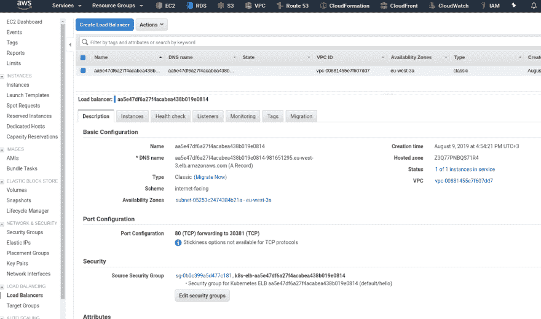](https://rtfm.co.ua/wp-content/uploads/2019/08/Screenshot_20190809_165633.png)

实例–这是我们的工作节点:

[](https://rtfm.co.ua/wp-content/uploads/2019/08/Screenshot_20190809_165650-1.png)

让我们回忆一下它是如何工作的:

1.  AWS ELB 将流量路由到工作节点(`NodePort`服务)
2.  在 Worker 节点上，通过`NodePort`服务，它将被路由到 Pod 的端口(`TargetPort`
3.  在带有`TargetPort`的 Pod 上，流量将被路由到一个容器的端口(`containerPort`

在上面的负载平衡器描述中，我们看到了下一个设置:

> 端口配置
> 
> 80 (TCP)转发到 30381 (TCP)

查看 Kubernetes 集群服务:

```
root@ip-10-0-0-102:~# kk describe svc hello
Name:                     hello
Namespace:                default
Labels:                   <none>
Annotations:              kubectl.kubernetes.io/last-applied-configuration:
{"apiVersion":"v1","kind":"Service","metadata":{"annotations":{},"name":"hello","namespace":"default"},"spec":{"ports":[{"name":"http","po...
Selector:                 app=hello
Type:                     LoadBalancer
IP:                       10.100.102.37
LoadBalancer Ingress:     aa5***295.eu-west-3.elb.amazonaws.com
Port:                     http  80/TCP
TargetPort:               80/TCP
NodePort:                 http  30381/TCP
Endpoints:                10.244.1.2:80
... 
```

这里是我们的`NodePort` : *http 30381/TCP*

您可以直接向节点发送请求。

查找工作节点的地址:

```
root@ip-10-0-0-102:~# kk get node | grep -v master
NAME                                       STATUS   ROLES    AGE   VERSION
ip-10-0-0-186.eu-west-3.compute.internal   Ready    <none>   51m   v1.15.2 
```

并连接到 *30381* 端口:

```
root@ip-10-0-0-102:~# curl ip-10-0-0-186.eu-west-3.compute.internal:30381
<!DOCTYPE html>
<html>
<head>
<title>Welcome to nginx!</title>
... 
```

检查 ELB 是否工作:

```
root@ip-10-0-0-102:~# curl aa5***295.eu-west-3.elb.amazonaws.com
<!DOCTYPE html>
<html>
<head>
<title>Welcome to nginx!</title>
... 
```

pod 的日志:

```
root@ip-10-0-0-102:~# kubectl logs hello-5bfb6b69f-4pklx
10.244.1.1 - - [09/Aug/2019:13:57:10 +0000] "GET / HTTP/1.1" 200 612 "-" "curl/7.58.0" "-" 
```

##### AWS 负载平衡器–未添加工作节点

当我尝试设置这个集群时，ELB 遇到了一个问题，即在创建负载平衡器 Kubernetes 服务时，没有将工作节点添加到 AWS 负载平衡器。

在这种情况下，尝试检查`ProviderID` ( [`--provider-id`](https://kubernetes.io/docs/reference/command-line-tools-reference/kubelet/) )是否出现在节点的设置中:

```
root@ip-10-0-0-102:~# kubectl describe node ip-10-0-0-186.eu-west-3.compute.internal | grep ProviderID
ProviderID:                  aws:///eu-west-3a/i-03b04118a32bd8788 
```

如果没有`ProviderID`，使用`kubectl edit node <NODE_NAME>`作为`ProviderID: aws:///eu-west-3a/<EC2_INSTANCE_ID>`添加:

[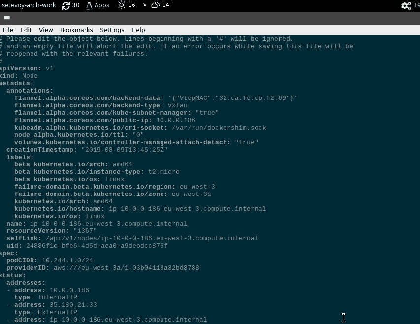](https://rtfm.co.ua/wp-content/uploads/2019/08/Screenshot_20190809_165039.png)

但是，当您使用`/etc/kubernetes/node.yml`文件和 [`JoinConfiguration`](https://kubernetes.io/docs/reference/setup-tools/kubeadm/kubeadm-join/#config-file) 加入一个节点时，必须对其进行设置。

完成了。

### 类似的帖子

*   <small>07/25/2019</small>[Kubernetes:第 1 部分-架构和主要组件概述](https://rtfm.co.ua/en/kubernetes-part-1-architecture-and-main-components-overview)
*   <small>03/27/2019</small>[Kubernetes:在 Arch Linux 上运行 Minikube](https://rtfm.co.ua/en/kubernetes-running-minikube-on-arch-linux/)