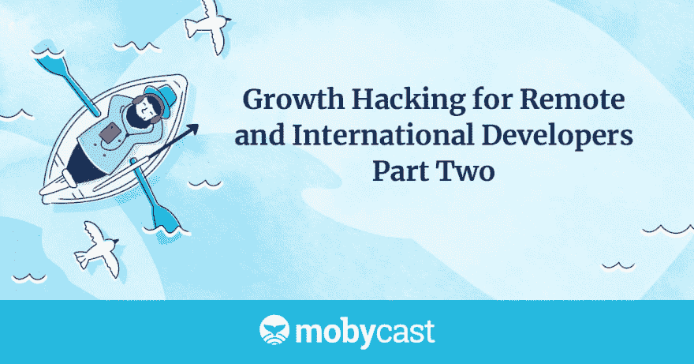

# 远程和国际开发者的成长黑客——第 2 部分

> 原文：<https://dev.to/jonxtensen/growth-hacking-for-remote-and-international-developers-part-2-3djj>

Kelsus 的克里斯·希克曼和乔恩·克里斯滕森以及 Secret Stache 的里奇·斯塔茨继续讨论如何发展高绩效的远程和国际工程团队。

[Youtube 链接](https://www.youtube.com/watch?v=AAe0lMaQL1U) :

### 该节目的一些亮点包括:

*   当前文化和变革视角:确定与人员和技术相关的流程、优势、有待改进的领域、态度和环境
*   提升:教导、指导和建立团队优势，成为世界级的开发人员
*   远程团队的理由:成本更低——不一定；如果做得不好，远程团队可能会花费更多，并且雇佣业余人员，而不是专业人员
*   留住人才的挑战:人们转向下一个最好的提议；开发商往往被品牌和金钱所吸引
*   开发者荒:顶尖人才被顶尖公司吸引；80-90%的人对为美国顶级公司工作更感兴趣，留下 10-20%的顶级开发人员
*   供需:远程离岸团队有聪明能干的人，但是技术必须克服生态系统
*   远程工作人员的积极品质:强大的沟通和软技能、高情商(EQ)、独立工作、能够管理时间、值得信赖
*   成长计划:作为学习和培训过程的一部分，通过实践来引导，进行代码评审，并定期举行会议和讨论
*   任何人都可以成为领导者:站出来，采取主动；理解管理者和领导者之间的区别
*   凯尔苏斯武器库的关键:异地静修，以聚在一起，学习，参与，是富有成效的

### 链接和资源

*   克里斯·希克曼的 AWS ECS:devo PS 和 Docker 现场秀(Ep 47)
*   [Mobycast 第 55 集:如何成为一名伟大的软件开发者(第一部分)](https://mobycast.fm/episode/how-to-become-a-great-software-developer-part-1/)
*   YouTube 上的 Bret Fisher
*   杰西·索恩的靶心:MVP 机器作者本·林德伯格和特拉维斯·索奇克
*   [HBO 电视台的球员](https://www.hbo.com/ballers)
*   凯尔苏斯
*   [秘密存储媒体](https://www.secretstache.com/)

### 成绩单

Rich:在 Mobycast 的第 72 集，我们将深入讨论如何发展高绩效远程和国际工程团队的第二部分。欢迎来到 Mobycast，这是一个关于云原生开发、AWS 和构建分布式系统的每周对话。让我们直接开始吧。

乔恩:欢迎你，克里斯，里奇。又是一集 Mobycast。

里奇:嘿。

克里斯:嘿，伙计们。回来真好。

乔恩:很高兴你回来了。瑞奇，你在忙什么？

Rich:哦，过去几周，我一直在招聘另一名开发人员，寻找一名前端高级 JavaScript 开发人员来整合我们正在做的一些 WordPress 工作。对我们来说，在合适的价位找到合适的人是一个挑战。

乔恩:当你第一次这么说的时候，我想象着 HBO 的球员，我想象着你做各种各样的大事来招募开发者，比如场边门票，演唱会门票。

里奇:是啊。我们有一个在南美和中美洲的招聘人员，我们过去和他一起工作过，但我们最终找到的那个人，至少我们正在试用，他在加拿大。他也在我的时区，所以那很好。他将是我们的第一个加拿大开发者，这并不重要，但是我们会看到的。

乔恩:听起来很棒。你呢，克里斯？

克里斯:最近，我开始做一些有趣的、有趣的、与众不同的事情。我是布雷特·费舍尔 YouTube 直播频道的嘉宾。它是从麦克风后面走出来的，在摄像机前面，所以请不要开玩笑说它有一张电台和视频的脸，但它很有趣。如果人们想去看看，这是 YouTube 上的 Bret Fisher，DevOps。Bret 在码头工人社区非常有名。我就是这样在多克尔松认识他的。

乔恩:是的。我看了，我觉得你做得很好。我觉得你很体面。观看它很有趣，感谢你在那里插入 Mobycast，感谢 Bret 邀请 Chris。这很酷。

克里斯:当然。

乔恩:至于我，几周前我告诉过你我买了一个新木筏。昨天，我们发现我们完全照顾到了我家漂流能力的两端。几周前，我们做了一些平水，玩得很开心，四处溅水，很容易。这个周末，我们决定做一些更具挑战性的事情，让我们假设每个人都是安全的，但安全也有一些运气。这真的不是我们所做的那次旅行，但我不认为我们会再回到过去。

克里斯:知道自己的极限很好。

乔恩:这不是因为我们有点老了，但是是的，我们玩得很开心。今天，我们将再次谈论远程开发者。它可能是美国的偏远地区，也可能是国际的偏远地区。上次我们谈到了你和我，Chris，如何与远程开发人员一起工作，对我来说，这是我整个职业生涯中一直在做的事情，而对你来说，这是最近的事情。

我真的很想和你谈谈这个问题，因为你最近才开始接触它，只是对它有了新的看法，而我离它如此之近，我几乎看不出有什么不同。我已经很多年没有和远程开发者一起工作了。但有趣的是，看到一些新人，他们习惯于与本地团队合作，这将如何改变你对事物的看法。那很有趣。

基本上，我们仍然在测试这个假设，我们认为人们花在高绩效团队上的时间——没有说远程团队不能高绩效，他们绝对可以——是他们软件开发技能和能力的一个重要指标。我们还认为，即使远程开发人员没有理由不能表现出色，但要达到这一点还是有点困难。没有支持基础设施让远程开发者学习那些在网飞或微软工作的人可能会学到的东西。

今天，我们将更详细地介绍一下您在 Kelsus 团队中所做的具体工作，Chris，您加入该团队后，帮助该团队从一个中高水平的团队转变为一个高绩效的团队。让我们开始吧，也许你可以用这个来给我们开场，克里斯。

克里斯:对。正如你提到的，我的背景更多地是与团队中位于同一地点的人在一起，我进入 Kelsus 时所在的各种不同的公司和团队，这与远在数千英里之外的团队完全不同，他们只通过即时消息、视频电话等进行交流。走进来，只是对这片土地进行一次调查，了解文化，看一看，然后花些时间弄清楚，“好吧，现在的文化是什么？”更多地了解我将要共事的这个新团队，它的优势是什么，我们还可以做些什么？

我们在上一集谈到了这一点，从文化态度的角度来看，这里有一些非常棒的核心优势，非常注重团队合作的氛围，非常乐于接受指导，学习新东西，不太自负。都是非常非常棒的事情。

另一方面，技术堆栈、一些流程等等，肯定不是我在其他团队中所习惯的。这是给这个远在数千英里之外的虚拟远程团队带来的挑战，我们如何利用这些优势，这些真正伟大的资产来提高水平，并让每个人都提高水平。这是第一部分，就像我们之前谈到的那样，只是对土地进行调查，了解团队，了解他们的个性。时机很巧，我们在乌拉圭进行了一次异地静修，我们在一起呆了一周。巩固这些关系并从那里开始真的很棒。

在那个时间点，我们并没有真正地大量使用云或者尽可能地大量使用云。当时我们并没有真正使用的东西，集装箱和码头。我们在开发移动应用方面有很强的背景，并开始更多地进入网络应用，但仍然没有真正的核心优势，只是运行分布式系统和后端服务。另外，运行生产操作软件的想法也不存在。这些是看我们如何继续前进，并开始教学，指导，并在团队中建立那些优势，以真正完成这些，并把他们从中到高转变为真正的世界级开发团队。

Jon:我们先讨论一下远程团队，因为我认为我们需要消除一些谣言。我想我们的听众可能不会有市场上的同样的谣言，但这就是为什么远程团队摆在首位？我认为我们需要消除的是，这不是因为它更便宜，这不是唯一的原因，它不一定会更便宜，事实上，很多时候，如果做得不好，远程团队会导致更多的支出。获得更便宜的开发者并不是真正的答案。如果你这样做了，你是出于错误的原因在做软件开发。

克里斯:也许只是补充一下，我想很多人都是这样的心态。这就是他们的做法[……]或者就像“我想省钱，所以我要有一个远程离岸团队。”正如你指出的，这不是最好的看待方式。你可能会被打得很惨。我们都看到了当你雇佣业余型和专业型员工时会发生什么。拥有远程分布式团队还有其他非常好的理由。

乔恩:克里斯，我最近一直在说，我真的相信这一点，美国缺乏开发者，美国的工作方式是顶级人才真正被顶级公司吸引，无论是初创公司独角兽，还是像网飞、谷歌、脸书和亚马逊、苹果这样的老牌公司，美国的顶级开发者几乎完全认同这一点。不完全是。很明显，有一些非常优秀的开发人员在为美国的一些咨询公司工作。但是假设你有 100 个顶尖的开发者。我敢说，他们中 80%到 90%的人会对为那些顶级美国公司工作更感兴趣。这使得在美国只有 10%或 20%的顶级开发人员可以从事非顶级工作，你同意吗，Chris？

克里斯:我可以肯定地说，在美国市场，在大都市地区的前 20 个城市，技术行业的工作机会非常多，你不需要成为一名伟大的开发人员。如果你是一名优秀的开发人员，你有一份工作，并且你可能每两三年就换一份工作。留住人才对许多公司来说都是一个挑战，他们只是没有意识到这只是一个持续的流动，因为每个人都在向下一个最好的报价移动。在排名前 20-25 位的市场中，这一点无疑是正确的。

乔恩:是的。这些开发商很大程度上被品牌和金钱所吸引。Slack 刚刚来到丹佛，他们上周举行了一次开放参观，参加人数很多。

克里斯:我知道，尤其是在硅谷，人们会看到那里产生的所有财富，以及所有的千万富翁和亿万富翁。很多人会去创业。一旦他们开始感觉到这个创业公司不会成功，不会是一个大的全垒打，他们就会去找另一个。这不仅仅是当前的报价或嗡嗡声，而且就像，“嘿，这将是一个大的全垒打吗？如果不是，我会继续前进。”

乔恩:对。如果你去美国非前 20 名的城市或世界其他非顶级城市，不是伦敦，不是布宜诺斯艾利斯，不是圣保罗——凯尔苏斯，那是在阿根廷的居住地或阿根廷的科连特斯——而是其他地方，那里有超级聪明的人，超级能干的人生活在那里，但这些公司不在这些地方招聘。突然之间，你有更多的超级聪明的人可以工作。事实上，在这些地方找到并雇佣真正优秀的、聪明的优秀开发人员比去旧金山为你的新创业项目或中型企业项目雇佣人员要容易得多。

克里斯:当然。供求关系。在一线城市，需求非常高，供应非常固定，供不应求。相比之下，在其他地方，需求没有那么高，只是因为那里没有生态系统。但是感谢科技，现在我们可以超越它，我们可以利用它。这就是我们正在谈论的问题。

乔恩:对。我会说有点不幸，有一个更高的酒吧时，聘请远程。我认为有些人可以在很难远程工作的现场型公司中取得真正的成功。克里斯，也许你可以谈一谈能够成功远程工作的人的一些特质？

克里斯:对。这里有相当多的东西涉及到它，但很多东西实际上并不是真的—

乔恩:特定的遥控器？

克里斯:都不是。确切地说，它甚至不是真正的核心技术。

乔恩:没错。

克里斯:在远程团队工作时，软技能非常非常重要。当你与某人共处一地，能够读懂肢体语言并进行面对面交流时，你不需要熟练掌握其中一些软技能，而如果你通过文本、即时消息甚至视频通话进行交流，你必须更有同理心，你必须拥有这些更好的软技能。这绝对是成为一个真正优秀的远程团队玩家的要素之一，你需要高情商(情商)，需要在技术和情感上有更多的平衡。良好的沟通技巧非常重要，因为你将会花大量的时间去做这件事，或者只是与分散在各处的队友沟通。

让他们知道发生了什么，你在做什么，当你在获得帮助时遇到问题，不小心与你的沟通，清晰简洁地与你的沟通，这样人们就不会以错误的方式理解它，然后你就开始以这种方式制造问题。良好的沟通非常非常重要。

另一个很重要的因素是独立工作的能力。管理您的时间，当您承诺并实际做事情时，像人们期望的那样站在旁边，即使您没有与团队的其他成员在一起，也不要分心，我们仍然在这里完成工作。

乔恩:我认为随之而来的还有信任。当你一个人工作时，你自己，不知何故，是一种信号，通过完成实际工作，但也通过你的存在和让人们知道你何时来何时去，与你一起工作的人建立一些信任，你专注并关心这份工作。

克里斯:当然。他们的一些属性，只是成长的心态，以及认识到持续学习非常重要，是其中的一部分。你必须是一个专业的学习者。你必须知道如何学习，并且能够自学，学习新技术、新技能，并跟上整个社区的发展。对一些人来说，这很难。太多了。

对一些人来说，告诉我该做什么要容易得多，我可以参加培训班或类似的活动，或者去参加一个会议，但如果你在一个远程团队，这肯定是更加自我指导的，这取决于你，你有责任进行自我发展。毫无疑问，像积极的态度和帮助这样的事情在这里大有帮助。显然，与不遥远的人有很多重叠。

乔恩:对。在本地工作，这些事情都不会有坏处。

克里斯:对。放大镜只是让这些对远程玩家来说更加重要。然后就是对你的其他队友和其他文化等等的意识和敏感性。只是我们是一个团队，有很多合作，真的没有空间给真正超级聪明傲慢的混蛋。成本太高了。我们希望在一起工作的时候有乐趣，我们需要像成年人一样去做，并且彼此配合得很好。这些软技能在这里真正发挥了作用。

乔恩:对。我只想再重复一次，因为它非常重要。这是沟通，书面和口头沟通技巧。当你谈到这一点的时候，我回想了许多和我一起工作过的最好的开发人员，觉得他们中的一些人在技术上可能并不比其他一些没有马上想到的人更好。

也许如果你被测量，它会像你能解决一个问题有多难，你得到了多少用户故事，多少时间有多少 bug 之类的事情，以及你的代码最终有多可维护，如果这些是测量的话。如果两个人在所有这些技术方面都是平等的，我肯定会把能够更好地交流他们正在做的事情和正在出现的问题以及他们脑海中正在发生的事情的人放在比不能交流的人更高的位置上。这太重要了。

克里斯:当然。

乔恩:太好了。我们很幸运，当你加入时，许多团队成员，如果不是大多数，都有这些事情发生，我们只需要做一些调整。我们做了哪些事情来培养他们？我们擅长什么，我们需要做什么？

克里斯:这又回到了上一集我们谈论的话题，我最初的印象是，我有点被我们刚刚经历的文化、团队和基本上所有这些特质所震撼。这些都在团队中存在并被考虑。这是一个非常好的地方，是一个起点。就像“增长计划是什么样的？我们现在如何提升我们的团队水平，让他们更加云化，学习 docker 和容器化，为什么他们应该这样做，如何做，以及如何操作？他们如何成为更好的后端分布式系统开发人员？我们如何让他们开始认识到 it 不仅仅是交付软件，现在还运行生产软件，这意味着什么？”下一步就像，“我们要怎么做？我们怎样才能让人们更上一层楼？这个增长计划是什么样的？”

这其中的一部分是一点回顾。我们在第 55 集的时候谈到过这个问题，当时我们在讨论“做这七件事来成为一名伟大的软件开发人员”，我们也谈到了我们在 Kelsus 正在做的事情。我将这个增长计划交给我们的开发人员，但我认为它非常重要，我们可以在这里更详细地讨论一下，我们设置了什么。我想首先，最重要的事情之一就是通过行动来领导，这非常重要，不仅仅是告诉人们做什么，而是实际上告诉他们如何去做，卷起袖子和他们一起去做。

我们做的第一件事就是，“让我们介绍 docker 和容器。让我们来看看这些应用程序，这些已经构建好的 web 应用程序，然后将它们封装起来，作为容器在 prod 中运行。”这总是一个很大的步骤，教导一个没有使用 Docker 和容器的团队现在处理抽象和随之而来的所有工具，即开发人员的思维方式。我们在之前的节目中也报道过这一点，这是一个巨大的文化转变和流程转变。

乔恩:自上而下是很关键的。很多改变你想让团队支持改变，因为这样会更好，但这一次，它必须有点自上而下，它必须像，“嘿，团队。我是克里斯。很高兴见到你们。这对我真的很重要。我很抱歉，但我是你的新老板，所以我们要这样做，在这里，我要开始了。”

你可以对许多不同的东西做同样的事情，也许如果没有 docker 和 containers，它可能是写得很好的单元测试，“嘿，我要写第一个 10 单元测试。看看我是如何做到的，看看它们是如何组合在一起的。将它们作为模板，但我们从现在开始就这样做，”与我所看到的相反，我并不是说这只是经理们的一个插曲，但对于作为经理和作为个人贡献者倾听的人来说，这是有意义的，这是你希望在你的经理身上看到的，以便在你的团队内部做出改变。

通过这样做，你表明它有多重要，你愿意在它上面花时间。如果有人说，“嘿，大家都在写单元测试吗？”人们可能会说，“是啊，是啊，是啊。”与此同时，他们在 CI/CD 系统之外逐字注释它，因为没有人有时间那样做。如果对领导层来说不是很重要，就会发生这种情况。Docker 和集装箱化显然对你很重要，所以你要花时间去研究它，使它成为 CI/CD 系统的一部分。

克里斯:对。让人们知道是很重要的。你在[…]上跳出来卖它们，为什么这很重要。不仅仅是“在这里，我们必须这样做”，而是为什么？有什么好处？我们为什么要这么做？毫无疑问，这是我们与我们的团队一起引入的所有这些特定事情的关键部分，随着这个增长计划，无论是切换到 docker 和 containers，在那之后或同时我们做的事情之一是代码审查。当我第一次使用它时，可能有一些代码审查过程，但它绝对没有被当作一等公民对待。

这也是一个立即凸显出来的问题。让我们更认真地对待这个问题，让我们真正做好代码审查，那看起来像什么。这又是卷起袖子，进入那里，花很多时间我自己做代码审查，并向人们展示一个彻底的有价值的代码审查与一个真正只是检查复选框类型的事情之间的区别。它也给出了我们为什么要这样做的理由？将来，我们可能还会深入地重新审视这一点，因为代码评审是我个人的事情之一。

乔恩:对。[……]一度。

克里斯:我可能有点生气，就像“哦，上帝。我不需要代码。我的代码很完美，只是让事情变得缓慢等等。”很多事情我做得更多，我有一个大的系统，我是主要的开发者，我没有在大的团队中工作。但是，你作为一个团队一起工作得越多，团队中的人就越多，这就变得更加重要，所以这是将来要谈论的事情。

但在凯尔萨斯这里，它绝对是工具。同样，我们的开发人员的增长计划只是通过进行这些彻底的代码审查，指出真正关键的主题，无论是像服务器端错误验证的重要性这样的事情，不要相信任何输入，即使访问它的唯一客户端可能是我们正在编写的客户端，你仍然必须对此非常偏执，并在服务器上净化你的输入，像错误发生时你该怎么办这样的事情？你如何处理安全类型问题，可读性，可维护性，编码标准？

所有这些，只是一些核心的关键原则，这些原则对于处理我们面临的升级挑战大有帮助。代码评审无疑是这个过程中非常重要的一部分。

乔恩:克里斯，我想，当你谈论这件事时，我想到的一件事是，可能有些人在听时会说，“是的，我需要一些指导，我希望我有一个经历过艰苦战斗、在高绩效团队中工作、知道一切、知道所有最佳实践并能教我的经理。”然后可能会有其他人说，“是的，我知道这些东西。如果我有一个老板告诉我做这种事情，我会说，'来吧，我不是一个孩子。'"

需要指出的是，你所面对的是需要通过自己的努力才能得到提升的人才，比如，“大家看，这就是高绩效团队的运作方式，这就是我们所做的，我将以身作则，”但对于那些可能超越这一点的人来说，他们正在进行代码审查，并有一个很好的[…]模型，也许他们并不希望他们的经理这样做，而是希望从内部领导，比如，“嘿，经理，这就是我们如何照顾自己并确保我们是一个高绩效团队在这点上支持我们。”

我只想指出。对于播客来说，这可能太微妙了，但这又回到了领导力的问题上。当你看到一个团队需要指导时，就像你一样以身作则，与天才一起工作，给他们成功所需的东西，这就是你的做法，然后与已经知道的团队合作，给他们空间，这就是他们所需要的。

克里斯:对。任何人都可以成为领导者。你只需要站出来采取主动。不一定非得是经理先生。也可以是团队里的其他人。在很大程度上，管理者和领导者是有区别的。在您的组织中同时拥有这两者是有原因的。这取决于你的具体情况，但总得有人去做。

乔恩:对。如果你看到一个团队没有做这些事情，没有表现得像一个高绩效的团队，或者没有把高绩效团队应该有的所有部分都准备好，那么有人，确切地说，有人必须承担起领导角色。

克里斯:对。你可能有团队说，“我们不需要做所有这些，因为我们已经是一个高绩效的团队了。”在那一点上，你只是说，“好吧，我们是完美的。我们无法改进。”就像问自己，“真的吗？是真的吗？”

乔恩:对。这要追溯到我讲过的那个故事。实际上，你可以不做这些事情就能逃脱惩罚。如果你有一群非常聪明、非常有才华的人，你可以在很短的时间内成功，并且可以很快完成很多工作。可能有时候这是有价值的，比如，“让我们抛弃所有的过程，花两个月的时间来编写一些代码。”也许偶尔这样做是值得的，但是你必须知道你在做什么，这必须是一个决定，而不是默认模式。

克里斯:对。除了以身作则，向人们展示，告诉他们为什么我们应该以这些新的方式做事的基本原理，代码审查，我们接下来要做的事情之一是建立每月工程团队会议的概念，在会议上我们深入研究特定的主题，这只是整个学习和培训过程的一部分。我们做出了这样的决定，这是足够重要的，我们要划出时间，我会定期这样做。事实证明，在大多数情况下，这是有价值的事情之一。这不是浪费时间。我们进行了许多有趣的讨论，涵盖了许多非常重要的话题。对于我们的开发人员来说，这是对增长计划的有益补充。

Jon:我想说的是，除此之外，在我们的空闲时间推动一些这样的技术对话非常有用。不要有密会和直接消息，而是实实在在的在 Slack 里把一些问题谈透，让人看到。这是相同的，因为很多时候，我们在每月的工程团队会议上所做的就是讨论我们解决的问题。一个月不止一次，仅仅是每天一次，对这个团队来说已经很大了。

克里斯:当然。回到沟通技巧，尤其是与远程团队的沟通技巧，这是我最讨厌的事情之一，我真的很担心与人进行一对一的对话，因为与同处一地的情况相比，远程团队的影响会被放大。如果你在走廊或某人的办公室，有可能周围还有其他人，进行真正私人的一对一交流，其他人不太可能真正参与或至少只是听到正在发生的事情，相比之下，如果你在空闲时间进行 DM，点对点的交流，其他人不会看到这一点。这对团队的其他成员或其他人来说可能是真正有价值的学习内容。将它放在一个公共频道上，让其他人可以看到，并经历这个过程是很棒的，因为有很多原因，无论是学习还是获得其他想法、其他观点，或者可能是如何修复它的提示。所以，超级重要。

乔恩:是的，也是……能见度，就像“看，这些人正在工作和谈论这个。”它只是有帮助。

克里斯:当然。

乔恩:另一件事是我们开始进行一对一的会谈。或许可以谈谈我们为什么要这么做。

克里斯:这件事发生在这个过程的大约一年后，在我们公司的年度务虚会上拉开了序幕。我们倾向于那个特别的静修处。我知道我们在想，“我们如何才能更加关注和更加关注开发人员的成长？”意识到我们团队成员中肯定有某些特质、特征和方面是我们真正想要鼓励和重视的。作为 Kelsus，作为一个工程团队，我们看重什么？我们希望看到人们如何成长？我意识到我们需要一个框架来将它正式化，这样人们就知道他们需要朝着什么方向努力。

我们开始为“这些是不同层次的开发人员，如果你愿意，这里是他们的特征和影响范围，以及他们能够做的活动等等”设计一个矩阵这导致了这些一对一会议的起源。我们的目的是定期与我们的队友单独会面，讨论这些内容，并以此为指导，了解他们定制的个人发展计划是什么样的，以及他们希望如何发展。

这是随着时间的推移而演变的，特别是对我个人来说，我肯定会采取更加定制化、更加灵活的方法。最重要的是个人发展，真正了解每个人，他们希望如何成长，什么对他们来说是重要的，然后给他们反馈和指导，让他们成为最好的开发人员或团队成员，无论他们的角色是什么，他们都可以在 Kelsus 工作。

它演变成这样，“让我们谈谈你想如何成长，你的一些长期目标是什么，”然后将它们分解成短期目标。有一些目标，让我们有一些具体的目标，让我们有一些日期，然后我们将定期工作，并检查这些一对一的会议。我注意到，与我交谈过的人都有一些共同的目标，那就是获得 AWS 认证以及他们拥有的各种认证级别，做类似[…]这样的事情，这是你在这些考试中必须真正了解的主题之一。

去做一个深潜，在我们的下一次会议上，回来教我，好像我对此一无所知。我让他们浏览并详细描述，然后我可以在中来回提问。对他们来说，这是一种非常有用的考试练习方式。看到人们坚持下去，然后参加考试并通过考试，看到他们的兴奋和通过考试的自豪感，这也真的很有意义。

乔恩:当然，这影响了整个团队。太棒了。这就是要点，就像高绩效团队相互影响，以求变得更好。

克里斯:当然。另一个常见的原因是提高英语技能。我们的团队位于阿根廷，所以西班牙语是第一语言，英语是第二语言。每个人都说英语，实际上说得相当好，但他们都可以提高。几乎每个和我打过交道的人，[……]每个人都认为这是“不，这真的很重要。”这是真的，在软件开发世界中，接触最多的机会就像英语是通用语一样。我们谈到了沟通技巧有多重要，所以能够熟练地用英语交流真的很重要。

我们花了很多时间只是，“好吧，提高你的英语技能意味着什么？你将如何衡量它？你怎么知道你已经变好了？”有一些目标和衡量标准。然后，人们可以做一系列不同的练习和活动。我们花了很多时间来经历这些。看到人们不断成长，每次与他们交流和交谈都变得更加容易，这是非常非常有趣或值得的。

乔恩:对。我昨天刚刚听了，我记不清了，隐藏的大脑，或者类似的东西，一个播客。不，这是一个不同的，但无论如何，这是关于棒球教练和如何在过去五年左右，有金钱球后，球队是用统计数据。现在，个人辅导是通过即时反馈循环完成的。人们过去总是认为，“当你成为一名大联盟球员后，你可能会变得更好，但你本质上是[…]演员，这是你将成为的那种球员。如果你是一个中等水平的击球手，你将永远是一个中等水平的击球手。”但是一旦他们进行了你所说的这种训练，这种训练会有非常快的反馈周期，让你调整、学习并有意识地练习，即使是大联盟的球员也会显著地改变他们的能力。这种有意的练习有多重要，我怎么说都不为过。

克里斯:对。这也是增长思维的一部分。其中很大一部分，尤其是棒球的例子，是人们只是说，“哦，我很平庸。”他们已经被定型了。他们是一个平庸的击球手，他们在那里是为了他们的手臂或者他们在那里是为了他们的防守能力。这就是他们练习防守的地方。

乔恩:即使[…]在这方面变得更好，他们似乎也可以在防守方面变得更好。这就是他们在那里的目的，他们的专业水平，但即使如此，使它变得更好。

克里斯:对。它完全适用于团队建设和作为开发人员的提升。确定你想要改进的目标是什么。这不是开创性的，这不是火箭科学。

乔恩:但确实如此。这是开创性的。10 年前、15 年前我们不是这样说话的，现在是。这是新的领域，这是可能的。但是一旦你知道了，就像，“哦，那很明显。”

克里斯:对，就是这样做，坚持下去。你必须对自己负责。你不能只是说你要做一些事情并设定目标，然后就像这样，“我最近三周很忙。我什么也没做。”你真的应该把它放在第一位。如果你要去做，如果你已经确定这是一个重要的目标，并且你要致力于它，那么就去做，为它腾出时间。

这是我和人们一起工作的另一件大事，你如何看待它？你需要在日历上划出这段时间。这很重要，你需要这样对待它。这不是爱好。这可不是什么好东西。把它当成我必须拥有的。

乔恩:我们也给人们提供在线培训的机会。它又回到了这个意向性。没有意向性的线上培训，几乎让人变本加厉。男人们，现在，突然之间，他们只是在追逐闪亮的课程，在每个培训课程上做 20%,然后他们知道的不够多，在任何事情上都没有真正的用处。

这些是人们参加的 Pluralsight 课程，Udemy 和 Udacity 课程，就像是，“来吧。”它们可能很棒，在有意的练习中可能真的很有用，但除此之外，你还不如看电视。去看一部很酷很有趣的电视剧，而不是花一点时间在 Udemy 上闲逛，什么也学不到。有了正确的学习心态，在线培训可能会很棒，但除此之外，不要在没有学习心态的情况下花费时间。

克里斯:对。正如你指出的，要有目的性。理解为什么你应该做这个培训。你必须认同它，你必须理解它的价值和实用性。

乔恩:很多是因为它闪闪发光，就像“哦，这个人工智能的东西会很酷。”是的，这很酷，但是你要知道你真的要这么做吗？沿着这条路开始，这很好，但要意识到这条路是一条漫长的路。你可能需要几年时间才能成为真正的人工智能专家。一旦你是，你打算把它作为你的职业吗？如果你觉得那很棒，就全押，只是不要押 5%、10%、15%，因为你只是在浪费时间。

克里斯:没错。也许我们能谈的最后一件事就是我们建立的场外静修。乔恩，这可能是你的一个借口，说，“嘿，我要去世界上一些非常酷的地方冲浪，”但这是我们的一个很棒的工具，再次，作为一个完全远程分布的团队，每年亲自聚会一次，一起出去玩一周，让它成为一系列不同活动的组合。比如出去玩玩，做做团队建设。但是，我们也有讲座和研讨会。我们在学习，我们在作为一个团队变得更好的过程中进行指导，让每个人都在同一个房间里。有些事情我们可以做得更好，这些年来我们已经有所进步。我们已经进行了三次这样的静修。每一个都变得更精简、更有效率、更吸引人。它已经成为武器库的关键。

乔恩:对。三分之二的时间里，海浪都没有那么好。

里奇:我知道。不是冲浪者太少，就是海浪太大，对吧？

乔恩:对。好吧。非常感谢，克里斯，谢谢你把这些放在一起，里奇。如果你愿意，我想我会再给你一次结案陈词，克里斯？

Chris:再一次总结一下，只有远程团队、分布式团队和国际团队面临挑战，但他们也有很多非常好的优势，制定增长计划，有这样的意图，可以获得巨大的回报。人才是全球性的，所以不要受地理界限的限制。同样，使用这些技术对我们来说是非常有益的，对其他任何人来说也是如此。

乔恩:对。我们可以拥有一支高绩效的团队，你也可以。我们可能会在未来帮助其他人有这样的经历，所以袖手旁观。再次感谢，我们下周再聊。

克里斯:好吧。再见。再见。

亲爱的听众，你坚持到了最后。感谢您抽出时间，并邀请您继续与我们在线交流。这一集以及节目笔记和其他有价值的资源可以在 mobycast.fm/72.获得。如果你有任何问题或其他见解，我们鼓励你在那里给我们留下评论。谢谢你。我们下周再见。

首页
剧集
博客
联系人
服务条款