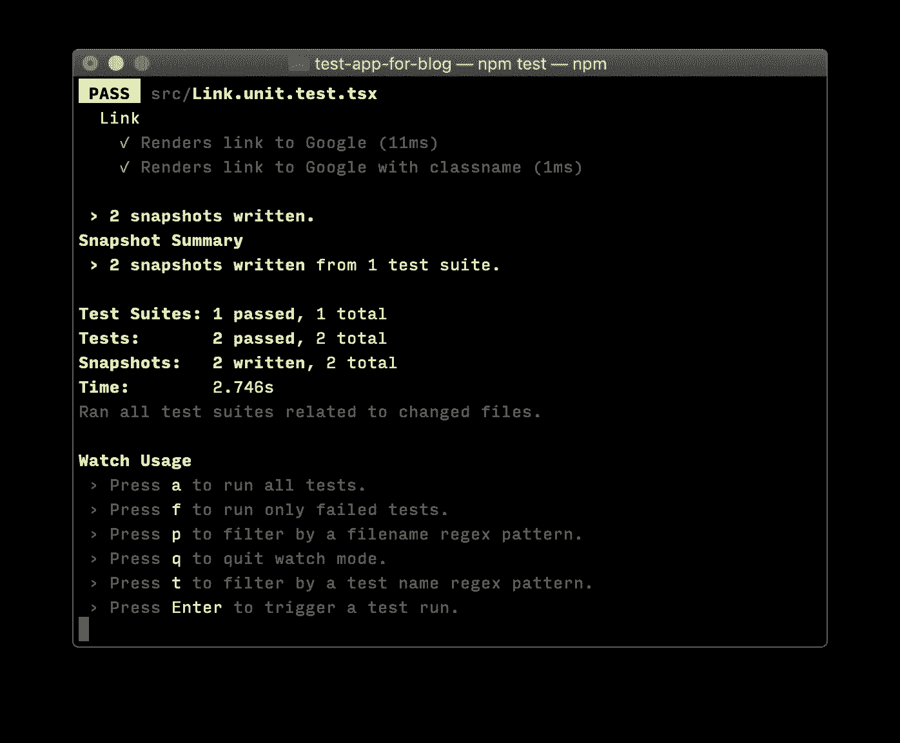

# 在 Typescript 上的 Create React 应用程序中配置 Jest 和 Enzyme

> 原文：<https://dev.to/thetrevorharmon/configuring-jest-and-enzyme-in-create-react-app-on-typescript-17mj>

我最近试图获得一个与 React(用 Typescript 创建 React 应用程序)一起工作的 Jest/Enzyme 测试环境，我阅读的所有文档都无法帮助我修复这个错误:

[](//images.ctfassets.net/ovu8iofw2r00/2X58RvTORPI3EX3YrlUUZE/68c431d1d397d52cb3b4d0d6b5eef125/error_message.png)

在大量阅读并尝试了少量解决方案后，我终于明白了如何去做。我将从 CRA 的一个普通安装(设置了 Typescript 标志)开始，作为我演示如何实现这一点的起点。

## 创建 React 应用程序

因为我正在使用 Create React 应用程序，所以我有一些现成的好处，其中之一就是 [Jest](https://jestjs.io) 。根据[文档](https://github.com/facebook/create-react-app#whats-included)，Create React App 自带:

> 一个快速的交互式单元测试运行程序，内置了对覆盖率报告的支持。

作为这个内置测试包的一部分，Create React App 为您设置了一些默认路径，包括作为测试配置路径的`./src/setupTests.js`。因为这个路径是为您设置的，所以如果您试图重命名文件或覆盖其他地方的路径，就会遇到冲突。

## 1。用 Typescript 设置 Jest

既然我们已经意识到了这一点，让我们用 Typescript 来设置 Jest。这些指令来自我在 Github 上由 [Basarat](https://github.com/basarat/) 找到的一个[起始资源。为了方便起见，我将它们包括在内。](https://github.com/basarat/typescript-book/blob/master/docs/testing/jest.md)

首先，安装 Jest 类型& TS-Jest:

```
yarn add @types/jest ts-jest -D 
```

接下来将一个`jest.config.js`添加到您的项目根目录中(在`src`之外)，并在该文件中添加以下内容:

```
module.exports = {
  "roots": [
    "<rootDir>/src"
  ],
  "transform": {
    "^.+\\.tsx?$": "ts-jest"
  },
  "testRegex": "(/__tests__/.*|(\\.|/)(test|spec))\\.tsx?$",
  "moduleFileExtensions": [
    "ts",
    "tsx",
    "js",
    "jsx",
    "json",
    "node"
  ],
} 
```

Basarat [很好地解释了这段代码](https://github.com/basarat/typescript-book/blob/master/docs/testing/jest.md#step-2-configure-jest)，但是需要理解的要点是，我们告诉 Jest 在遇到类型脚本文件时使用`ts-jest`。

## 2。安装酶

现在我们已经配置了 Jest，我们需要安装与酶相关的依赖项:

```
yarn add enzyme @types/enzyme enzyme-to-json enzyme-adapter-react-16 -D 
```

此外，我们需要告诉 Jest 使用我们的酶序列化程序。在`jest.config.js`的末尾增加以下一行:

```
"snapshotSerializers": ["enzyme-to-json/serializer"], 
```

其他教程告诉你添加`"setupTestFrameworkScriptFile": "<rootDir>/src/setupEnzyme.ts"`到你的 Jest 配置文件。然而，如果你在 CRA，我们之前讨论的陷阱将忽略这条线，并且**将阻止酶正常工作**。

## 3。配置酶

Enzyme 需要配置和实例化才能正常工作。如果它还不存在，在你的`src`目录中创建文件`setupTests.js`，并添加以下内容:

```
import { configure } from 'enzyme';
import * as Adapter from 'enzyme-adapter-react-16';

configure({ adapter: new Adapter() }); 
```

## 4。测试！

现在我们已经安装并配置了 Jest 和 Enzyme，让我们来测试一下！我写了一个基本的`Link`组件，它包装了`<a>` :

```
/*===================
  Link.tsx
 ===================*/

import React from 'react';

interface LinkProps {
  className?: string;
  href: string;
}

const Link: React.FC<LinkProps> = ({
  className,
  href,
  children
}) => {
  return (
    <a
      href={href}
      className={className}
    >
      {children}
    </a>
  );
}

export default Link; 
```

我还为链接组件编写了一个基本测试:

```
/*===================
  Link.unit.test.tsx
 ===================*/

import React from "react";
import { shallow } from 'enzyme';
import Link from './Link';

describe('Link', () => {
  it('Renders link to Google', () => {
    const link = shallow(<Link href="http://google.com">Link to Google</Link>);
    expect(link).toMatchSnapshot();
  });

  it('Renders link to Google with classname', () => {
    const link = shallow(<Link href="http://google.com" className="my-link-class">Link to Google</Link>);
    expect(link).toMatchSnapshot();
  });
}); 
```

一旦创建了组件和测试，运行`yarn test`来查看下面的输出:

[](//images.ctfassets.net/ovu8iofw2r00/22l4z7SZangqIhZqUMzmrG/2d3e054140f9855aee77f94038bc4870/Screen_Shot_2019-03-29_at_2.17.38_PM.png)

如果你看到类似的东西，你就在做生意了。测试愉快！