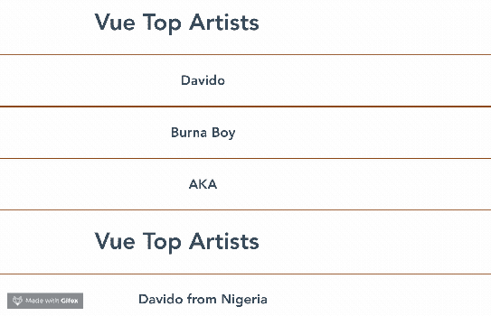

# 在 Vue.js 中使用事件发射器修改组件数据

> 原文：<https://dev.to/bnevilleoneill/modifying-component-data-with-event-emitters-in-vue-js-n5>

**由[nwo se lotana](https://blog.logrocket.com/author/nwoselotanna/)撰写**

这篇文章将向您介绍在 Vue.js 中，如何使用事件发射器将数据及其状态从子组件传递到父组件。

## 开始前…

这篇文章适合所有阶段的开发者，包括初学者。在阅读本文之前，您应该已经具备了以下几点:

*   已安装 node . js 10 . x 及以上版本。您可以通过在终端/命令提示符下运行以下命令来验证您是否知道:

```
node -v 
```

Enter fullscreen mode Exit fullscreen mode

*   代码编辑器——我强烈推荐 Visual Studio 代码
*   Vue 的最新版本，全球安装在您的机器上
*   安装在您机器上的 Vue CLI 3.0。为此，请先卸载旧版本的 CLI:

```
npm uninstall -g vue-cli 
```

Enter fullscreen mode Exit fullscreen mode

然后，安装新的:

```
npm install -g @vue/cli 
```

Enter fullscreen mode Exit fullscreen mode

*   在这里下载一个 Vue starter 项目
*   解压缩下载的项目
*   导航到解压缩后的文件，并运行命令以保持所有依赖项最新:

```
npm install 
```

Enter fullscreen mode Exit fullscreen mode

## 通过组件传递数据

为了将数据值从父组件(如`app.vue`)传递到 app 组件内部的子组件(如嵌套组件)，Vue.js 为我们提供了一个名为 props 的平台。属性可以称为自定义属性，您可以在组件上注册这些属性，这样您就可以在父组件中定义数据，给它一个值，然后将该值传递给一个属性，该属性可以在子组件中被引用。

这篇文章将向你展示这个过程的反向过程。为了从子组件向下传递和更新父组件中的数据值，以便所有其他嵌套组件也将被更新，我们使用 emit 构造来处理事件发射和数据更新。

[](https://logrocket.com/signup/)

## 演示

您将经历从子组件发出事件、在父组件上设置监听以便传递来自子组件的数据，然后最终更新数据值的过程。

如果您从一开始就阅读了这篇文章，那么您将已经下载并在 VS 代码中打开了起始项目。这个项目是这篇文章的完整代码。

之所以把它作为一个开始项目，是为了让你可以在被介绍到反转过程之前，先玩玩道具的概念。

### 入门

在文件夹中，您会发现两个子组件:`test.vue`和`test2.vue`，父组件是`app.vue`文件。我们将使用两个子组件的标题来说明这种事件发射方法。您的`Test.vue`文件应该是这样的:

```
<template>
  <div>
    <h1>Vue Top 20 Artists</h1>
    <ul>
      <li v-for="(artist, x) in artists" :key="x">
        <h3>{{artist.name}}</h3>
      </li>
    </ul>
  </div>
</template>
<script>
export default {
  name: 'Test',
  props: {
    artists: {
      type: Array
    }
  }
}
</script>
<!-- Add "scoped" attribute to limit CSS to this component only -->
<style scoped>
li{
    height: 40px;
    width: 100%;
    padding: 15px;
    border: 1px solid saddlebrown;
    display: flex;
    justify-content: center;
    align-items: center;
  }
a {
  color: #42b983;
}
</style> 
```

Enter fullscreen mode Exit fullscreen mode

要使标题从数据属性部分的隐式定义中接收标题，您需要创建数据部分并添加定义，然后在模板中添加插值符号，如下所示:

```
<template>
  <div>
    <h1>{{header}}</h1>
    <ul>
      <li v-for="(artist, x) in artists" :key="x">
        <h3>{{artist.name}}</h3>
      </li>
    </ul>
  </div>
</template>
<script>
export default {
  name: 'Test',
  props: {
    artists: {
      type: Array
    }
  },
  data() {
    return {
     header: 'Vue Top Artists'
    }
  }
}
</script> 
```

Enter fullscreen mode Exit fullscreen mode

如果您运行该应用程序，您将获得与开始时完全相同的界面。下一步是在单击时更改这个定义的属性。

### 切换表头

要切换标题，您必须在标题中添加一个单击事件监听器，并指定包含单击时应该发生的逻辑的函数。

```
<template>
  <div>
    <h1 v-on:click="callingFunction">{{header}}</h1>
    <ul>
      <li v-for="(artist, x) in artists" :key="x">
        <h3>{{artist.name}}</h3>
      </li>
    </ul>
  </div>
</template>
<script>
export default {
  name: 'Test',
  props: {
    artists: {
      type: Array
    }
  },
  data() {
    return {
     header: 'Vue Top Artists'
    }
  },
  methods: {
    callingFunction(){
      this.header = "You clicked on header 1";
    }
  }
}
</script> 
```

Enter fullscreen mode Exit fullscreen mode

现在你的头在点击时变成了调用函数内部的字符串。

[](https://res.cloudinary.com/practicaldev/image/fetch/s--HSpY4gXn--/c_limit%2Cf_auto%2Cfl_progressive%2Cq_66%2Cw_880/https://i2.wp.com/blog.logrocket.com/wp-content/uploads/2019/08/toggling-header-demo.gif%3Fresize%3D544%252C218%26ssl%3D1)

### 设置发射器

在这一阶段，您希望将相同的行为传递给父组件，以便在单击时，父组件中嵌套的每个标题都会发生变化。

为此，您将创建一个发射器，该发射器将在子组件中发出一个事件，父组件可以侦听该事件并做出反应(这与组件的事件侦听器逻辑相同)。

将`Test.vue`文件中的脚本部分更改为下面的代码块:

```
<script>
export default {
  name: 'Test',
  props: {
    artists: {
      type: Array
    },
    header: {
      type: String
    }
  },
  data() {
    return {
      // header: 'Vue Top Artists'
    }
  },
  methods: {
    callingFunction(){
      // this.header = "You clicked on header 1"
      this.$emit('toggle', 'You clicked header 1');
    }
  }
}
</script> 
```

Enter fullscreen mode Exit fullscreen mode

在这里，头部预期的数据类型被定义为一个属性。然后，在这个方法中，有一个 emit 语句告诉 Vue 在 toggle 上发出一个事件(就像任何其他事件一样——例如，一个 click 事件),并将字符串作为参数传递。这就是设置一个将在另一个组件中被监听的事件所需的全部内容。

### 监听发出的事件

现在，事件创建后要做的下一件事是监听并响应它。将这段代码块复制到您的`app.vue`文件:

```
<template>
  <div id="app">
    
    <Test v-bind:header="header" v-on:toggle="toggleHeader($event)" />
    <Test v-bind:artists="artists" />
    <test2 v-bind:header="header"/>
    <test2 v-bind:artists="artists" />
  </div> 
</template>
<script>
import Test from './components/Test.vue'
import Test2 from './components/Test2'
export default {
  name: 'app',
  components: {
    Test, Test2
  },
  data (){
    return {
      artists: [
       {name: 'Davido', genre: 'afrobeats', country: 'Nigeria'},
       {name: 'Burna Boy', genre: 'afrobeats', country: 'Nigeria'},
       {name: 'AKA', genre: 'hiphop', country: 'South-Africa'}
      ],
      header: 'Vue Top Artists'
    }
  },
  methods: {
    toggleHeader(x){
      this.header = x;
    }
  }
}
</script>
<style>
#app {
  font-family: 'Avenir', Helvetica, Arial, sans-serif;
  -webkit-font-smoothing: antialiased;
  -moz-osx-font-smoothing: grayscale;
  text-align: center;
  color: #2c3e50;
  margin-top: 60px;
}
</style> 
```

Enter fullscreen mode Exit fullscreen mode

在 template 部分，您可以看到第一个组件`Test`，上面有两个 Vue 指令。第一个是`v-bind`，它将初始 header 属性绑定到 artists 数组下的数据对象中的隐式定义；初始化时，显示字符串`Vue Top Artists`。

第二个指令是`v-on`，用于监听事件；要监听的事件是 toggle(记住，您已经在`Test`组件中定义了它)，它上面的调用函数是`toggleHeader`。这个函数被创建，来自子组件的字符串通过`$event`参数传递到这里显示。

### 言下之意

这将通过发射器将数据传递给父组件，因此因为其他组件嵌套在父组件中，所以每个嵌套组件中的数据都会重新呈现和更新。进入`test2.vue`文件，将这段代码块复制到其中:

```
<template>
  <div>
    <h1>{{header}}</h1>
    <ul>
      <li v-for="(artist, x) in artists" :key="x">
      <h3>{{artist.name}} from {{artist.country}}</h3>
      </li>
    </ul>
  </div>
</template>
<script>
export default {
  name: 'Test2',
  props: {
    artists: {
      type: Array
    },
    header: {
      type: String
    }
  }
}
</script>
<!-- Add "scoped" attribute to limit CSS to this component only -->
<style scoped>
li{
    height: 40px;
    width: 100%;
    padding: 15px;
    border: 1px solid saddlebrown;
    display: flex;
    justify-content: center;
    align-items: center;
  }
a {
  color: #42b983;
}
</style> 
```

Enter fullscreen mode Exit fullscreen mode

这里，数据插值被设置并指定为`props`对象中的一个字符串。在您的开发服务器上运行应用程序:

```
npm run serve 
```

Enter fullscreen mode Exit fullscreen mode

[](https://res.cloudinary.com/practicaldev/image/fetch/s--4uiniSCe--/c_limit%2Cf_auto%2Cfl_progressive%2Cq_66%2Cw_880/https://i1.wp.com/blog.logrocket.com/wp-content/uploads/2019/08/header-update-demo.gif%3Fresize%3D543%252C350%26ssl%3D1)

您会看到，一旦事件在父组件中被响应，所有组件都会更新它们的头，即使定义只在一个子组件中指定。你可以在 GitHub 上找到本教程的完整[代码。](https://github.com/viclotana/vue-props)

## 结论

您可以看到在 Vue 中使用带有发射器的事件的另一个有趣的方面:您现在可以在一个组件中创建一个事件，并在另一个组件中监听和响应它。这可能会有许多对您的工作流程非常有益的用例——祝您愉快！

* * *

**编者按:**看到这个帖子有问题？你可以在这里找到正确的版本。

## Plug: [LogRocket](https://logrocket.com/signup/) ，一款适用于网络应用的 DVR

[](https://res.cloudinary.com/practicaldev/image/fetch/s--6FG5kvEL--/c_limit%2Cf_auto%2Cfl_progressive%2Cq_auto%2Cw_880/https://i2.wp.com/blog.logrocket.com/wp-content/uploads/2017/03/1d0cd-1s_rmyo6nbrasp-xtvbaxfg.png%3Fresize%3D1200%252C677%26ssl%3D1)

[log rocket](https://logrocket.com/signup/)是一个前端日志工具，让你重放问题，就像它们发生在你自己的浏览器中一样。LogRocket 不需要猜测错误发生的原因，也不需要向用户询问截图和日志转储，而是让您重放会话以快速了解哪里出错了。它可以与任何应用程序完美配合，不管是什么框架，并且有插件可以记录来自 Redux、Vuex 和@ngrx/store 的额外上下文。

除了记录 Redux 动作和状态，LogRocket 还记录控制台日志、JavaScript 错误、stacktraces、带有头+体的网络请求/响应、浏览器元数据、自定义日志。它还使用 DOM 来记录页面上的 HTML 和 CSS，甚至为最复杂的单页面应用程序重新创建像素级完美视频。

[免费试用](https://logrocket.com/signup/)。

* * *

在 Vue.js 中用事件发射器修改组件数据的帖子[最先出现在](https://blog.logrocket.com/modifying-component-data-with-event-emitters-in-vue-js/) [LogRocket 博客](https://blog.logrocket.com)上。