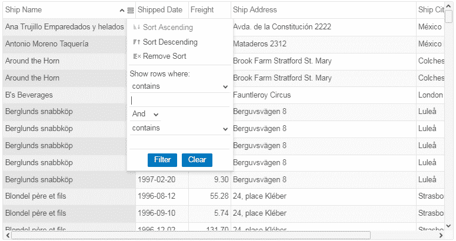
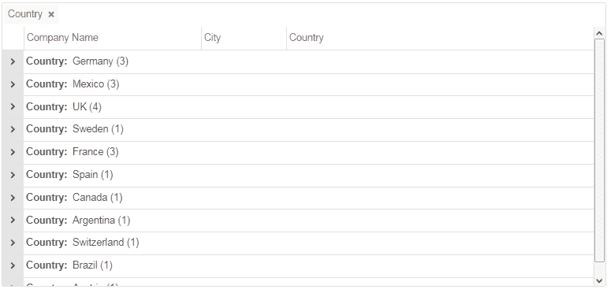
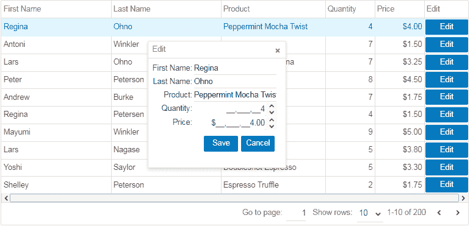

# 具有 React 特性的 jQwidgets 网格

> 原文：<https://dev.to/shanikanishadhi/jqwidgets-grid-with-react-features-35k0>

React 是一个轻量级的库，广泛用于网页的 UI/UX 设计。它提供了一个响应迅速且灵活的网格，使用 jQWidgets 以表格形式显示数据。

本文介绍了使用 typescript 为 React 创建 jQWidgets 网格的基本步骤。

## 安装 React:

React 是一个交互式库，它在数据改变时呈现正确的组件。要安装 React，我们首先需要安装 node.js 8.10 或更高版本。检查 node.js 和 npm 版本。

## 创建 React App:

使用 npm，我们将为 React 创建一个应用程序，如下所示。这将创建文件夹结构和名为 my-app 的目录。创建“我的应用程序”后，cd 到“我的应用程序”并键入 npm start。项目在 [http://localhost:3000](http://localhost:3000) 中打开。

```
npm i -g create-jqwidgets-react-app
npx create-jqwidgets-react-app my-app --typescript
cd my-app
npm install jqwidgets-script –save--dev
npm start 
```

Enter fullscreen mode Exit fullscreen mode

## 文件夹结构如下:

[](https://res.cloudinary.com/practicaldev/image/fetch/s--WmAf2ZSo--/c_limit%2Cf_auto%2Cfl_progressive%2Cq_auto%2Cw_880/https://thepracticaldev.s3.amazonaws.com/i/kpzs1ekkrwiqce1k9deo.png)

## 为 React 创建一个简单的 jQWidgets 网格组件:

一旦创建了所需的文件夹和文件，我们将处理 React 的 jQWidgets 网格组件所需的设置和导入。

## App.htm 文件:

我们将添加以下链接到 App.html 网页的一节。

```
<link rel="canonical" href="https://www.jqwidgets.com/react/react-grid/" />
<link rel="stylesheet" href="../jqwidgets/styles/jqx.base.css" type="text/css" />
<script type="text/javascript" src="../scripts/demos.js"></script>
<script src="./../node_modules/react/umd/react.production.min.js"></script>
<script src="./../node_modules/react-dom/umd/react-dom.production.min.js"></script> 
```

Enter fullscreen mode Exit fullscreen mode

## App.tsx 文件:

在 App.tsx 文件中，我们将首先从 jqwidgets-react 导入 jqxGrid。这将提供为 React 库创建的 jqxGrid 组件。我们将使用一些 CSS 文件来设计网格的样式。

```
import 'jqwidgets-scripts/jqwidgets/styles/jqx.base.css';
import 'jqwidgets-scripts/jqwidgets/styles/jqx.material-purple.css';
import JqxGrid, { IGridProps, jqx } from 'jqwidgets-scripts/jqwidgets-react-tsx/jqxgrid'; 
```

Enter fullscreen mode Exit fullscreen mode

接下来，我们将使用 jqxGrid 创建 App 类，我们将首先通过使用数据源属性(如数据字段、数据类型、id、记录等)设置网格来构造属性。稍后我们将为这个网格设置状态。

```
export class App extends React.PureComponent<{}, IGridProps> {
    constructor(props: {}) {
        super(props);
        const source: any = {
            datafields: [
                { name: 'Name', type: 'string' },
                { name: 'Sex'  , type: 'string' },
                { name: 'City', type: 'string' },
                { name: 'Address', type: 'string },
            ],
            datatype: 'xml',    
            id: 'NameID',
            record: 'Name',
            root: 'Name',
            url: './../sampledata/Details.xml'
        };  
//set the state for widget.
    this.state = {
        columns: [
            { text: 'Name', datafield: 'Name', width: 250 },
            { text: 'Sex', datafield: 'Sex', width: 100 },
            { text: 'City', datafield: 'City', width: 80 },                                                      { text: 'Address', datafield: 'Address', width: 350 },
        ],
        source: new jqx.dataAdapter(source)
    }
}
public render() {
    return (
        <JqxGrid
        // @ts-ignore
            width={this.state.width} source={this.state.source} columns={this.state.columns} autoheight={true} altrows={true}
        } />
      )
    }  
} 
```

Enter fullscreen mode Exit fullscreen mode

在您为网格定义了所有属性和状态之后，我们将使用`render()`来呈现这个组件。一旦您运行这个示例，您的网格将如下所示。

[](https://res.cloudinary.com/practicaldev/image/fetch/s--97-ii55v--/c_limit%2Cf_auto%2Cfl_progressive%2Cq_auto%2Cw_880/https://thepracticaldev.s3.amazonaws.com/i/eeb4ctutg26qfyxfurw4.png)

## 网格特征为 React:

jQWidgets Data Grid for React 是为专业使用而构建的，具有排序、过滤、分组、分页、编辑、拖放、嵌套网格等特性。在我们研究如何启用这些功能以获得更好的用户体验之前，我们需要为 App.html 的各个功能添加 bundle.js 文件，例如:在 App.htm 文件
中添加用于排序的 bundle 文件

```
<div id="app"></div>
<script src="../dist/grid_sorting.bundle.js"></script> 
```

Enter fullscreen mode Exit fullscreen mode

### 排序:

sortable 属性启用或禁用数据排序。在下面的代码示例中，启用了网格数据排序:

```
<JqxGrid ref={this.myGrid} onSort={this.myGridOnSort}
    width={getWidth('grid')} height={450} source={this.state.source} columns={this.state.columns} sortable={true} altrows={true} filterable={true} selectionmode={'multiplecellsadvanced'} />
</JqxGrid> 
```

Enter fullscreen mode Exit fullscreen mode

若要启用或禁用网格列的排序，可以将其 sortable 属性设置为 false。此外，当排序数据类型为日期、数字或布尔值时，应设置“datafield”数组中的“type”属性。【sort column 属性指定了默认的网格排序列，即当显示网格时，数据将被排序。“sortdirection”属性指定排序列的排序顺序。

```
sortcolumn: 'ColumnName',
sortdirection: 'asc' 
```

Enter fullscreen mode Exit fullscreen mode

“sortby”函数可用于通过 API 对网格进行排序。当网格数据完全加载时，应该调用这个函数。第一个参数是列的 DataField。第二个参数是排序顺序——“ASC”或“desc”。

### 过滤:

若要启用筛选功能，您需要将“可筛选”属性设置为 true。当 filterable 属性的值为 true 时，网格会在列弹出菜单中显示一个筛选面板。过滤可以在后台完成，也可以自定义。

```
<JqxGrid ref={this.myGrid} onFilter={this.onFilter}
     width={getWidth('grid')} source={this.state.source} columns={this.state.columns}
    filterable={true} sortable={true} ready={this.state.ready} autoshowfiltericon={true} /> 
```

Enter fullscreen mode Exit fullscreen mode

[](https://res.cloudinary.com/practicaldev/image/fetch/s--6mc97Ynp--/c_limit%2Cf_auto%2Cfl_progressive%2Cq_auto%2Cw_880/https://thepracticaldev.s3.amazonaws.com/i/jvptfv94iwqanrft33oa.png)

### 网格分组:

jqxGrid 组件支持对一列或多列进行数据分组。如果“groupable”属性设置为 true，则允许分组。最终用户可以通过将列标题拖到组面板来对数据进行分组。
下面的代码示例显示了一个带有一个分组列的网格模板:

```
<JqxGrid ref={this.myGrid}
    onGroupexpand={this.onGroupExpand} onGroupcollapse={this.onGroupCollapse}
                    // @ts-ignore
    width={getWidth('grid')} groupable={true} columns={this.state.columns}
    source={this.state.source} groups={['Country']} /> 
```

Enter fullscreen mode Exit fullscreen mode

[](https://res.cloudinary.com/practicaldev/image/fetch/s--LV7zvqDL--/c_limit%2Cf_auto%2Cfl_progressive%2Cq_auto%2Cw_880/https://thepracticaldev.s3.amazonaws.com/i/pmy96raofowubx57yt7l.png)

#### 网格分页:

内置的分页功能为以表格格式显示大量数据提供了额外的优势。将`pageable`属性设置为 true，以使分页可用。

```
<JqxGrid ref={this.myGrid}
    onPagechanged={this.onPageChanged}  onPagesizechanged={this.onPageSizeChanged}
          // @ts-ignore
          width={getWidth('grid')} source={this.state.source}   columns={this.state.columns}
          pageable={true} sortable={true} columnsresize={true}
          autoheight={true} selectionmode={'multiplerowsextended'} /> 
```

Enter fullscreen mode Exit fullscreen mode

当页面更改或页面大小更改时，将引发 Pagechanged 或 pagesizechanged 事件。

```
private onPageChanged(event: any): void {
        this.eventsLog.current!.style.display = 'block';
        const loggedElements = document.getElementsByClassName('logged');
        if (loggedElements.length >= 5) {
            this.myPanel.current!.clearcontent();
        }
        const args = event.args;
        const eventData = 'pagechanged <div>Page:' + args.pagenum + ', Page Size: ' + args.pagesize + '</div>';
        this.myPanel.current!.prepend('<div class="logged" style="margin-top: 5px;">' + eventData + '</div>');
        // get page information.
        const paginginformation = this.myGrid.current!.getpaginginformation();
        this.pagingInfo.current!.innerHTML = '<div style="margin-top: 5px;">Page:' + paginginformation.pagenum + ', Page Size: ' + paginginformation.pagesize + ', Pages Count: ' + paginginformation.pagescount + '</div>';
    }
    private onPageSizeChanged(event: any): void {
        this.eventsLog.current!.style.display = 'block';
        this.myPanel.current!.clearcontent();
        const args = event.args;
        const eventData = 'pagesizechanged <div>Page:' + args.pagenum + ', Page Size: ' + args.pagesize + ', Old Page Size: ' + args.oldpagesize + '</div>';
        this.myPanel.current!.prepend('<div style="margin-top: 5px">' + eventData + '</div>');
        // get page information.
        const paginginformation = this.myGrid.current!.getpaginginformation();
        this.pagingInfo.current!.innerHTML = '<div style="margin-top: 5px;">Page:' + paginginformation.pagenum + ', Page Size: ' + paginginformation.pagesize + ', Pages Count: ' + paginginformation.pagescount + '</div>';
    } 
```

Enter fullscreen mode Exit fullscreen mode

网格分页还在页导航区域显示下拉列表组件。默认情况下，大小选项为 5、10 和 20。“pager”属性使您能够设置不同的模式来显示网格的分页。“寻呼机”设置有两种模式，默认和简单。

[](https://res.cloudinary.com/practicaldev/image/fetch/s--uT--EHBr--/c_limit%2Cf_auto%2Cfl_progressive%2Cq_auto%2Cw_880/https://thepracticaldev.s3.amazonaws.com/i/tqzvg4q2ss7wi7rf9r4m.png)

### 网格单元格编辑:

网格单元编辑是网格交互性的重要特征之一。此功能类似于在 Excel 电子表格中输入数据的体验——一旦选择了网格单元格，就可以在开始键入文本时输入数据。网格的“可编辑”属性指定是否启用编辑。网格有显示和隐藏单元格编辑器的 API。“cellBeginEditEvent”方法允许您将特定单元格置于编辑模式。

```
this.cellBeginEditEvent = this.cellBeginEditEvent.bind(this);
this.cellEndEditEvent = this.cellEndEditEvent.bind(this); 
```

Enter fullscreen mode Exit fullscreen mode

“cellEndEditEvent”方法结束编辑操作，并确认或取消更改。

```
public render() {
        return (
            <div>
                <JqxGrid onCellbeginedit={this.cellBeginEditEvent} onCellendedit={this.cellEndEditEvent}
                    // @ts-ignore
                    width={getWidth('grid')} source={this.state.source} columns={this.state.columns}
                    editable={true} enabletooltips={true} selectionmode={'multiplecellsadvanced'} />
                <div style={{ fontSize: '12px', fontFamily: 'Verdana', marginTop: '30px' }}>
                    <div ref={this.beginEdit} />
                    <div ref={this.endEdit} style={{ marginTop: '10px' }} />
                </div>
            </div>
        );
    }
    private cellBeginEditEvent(event: any): void {
        const args = event.args;
        this.beginEdit.current!.innerHTML = 'Event Type: cellbeginedit, Column: ' + args.datafield + ', Row: ' + (1 + args.rowindex) + ', Value: ' + args.value;
    }
    private cellEndEditEvent(event: any): void {
        const args = event.args;
        this.endEdit.current!.innerHTML = 'Event Type: cellendedit, Column: ' + args.datafield + ', Row: ' + (1 + args.rowindex) + ', Value: ' + args.value;
    } 
```

Enter fullscreen mode Exit fullscreen mode

要确认编辑模式，我们必须按下`Esc`键。当新单元格的值对于任何列或网格都无效时，可以自定义网格来显示验证弹出消息。
[](https://res.cloudinary.com/practicaldev/image/fetch/s--EkCUVmNI--/c_limit%2Cf_auto%2Cfl_progressive%2Cq_auto%2Cw_880/https://thepracticaldev.s3.amazonaws.com/i/hvk1br01874fql85un35.png)

## 总结:

jQWidgets grid for React 是一个非常灵活和强大的工具，允许您在多个页面中添加大量数据。本文演示了使用 typescript 为 React 创建 jQWidgets 网格的基本步骤。我们还讨论了一些基本的交互特性，这些特性是任何网站的用户界面都需要的。网格还有很多其他的特性，你将不得不探索这些特性中的一点，并为你的页面使用最好的 UI/ UX 设计。