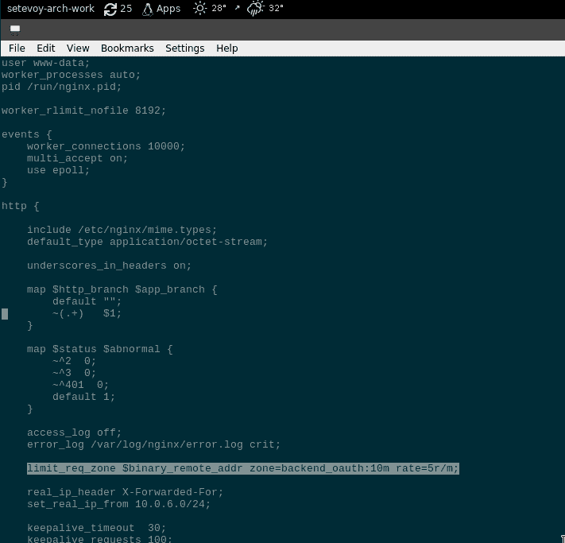
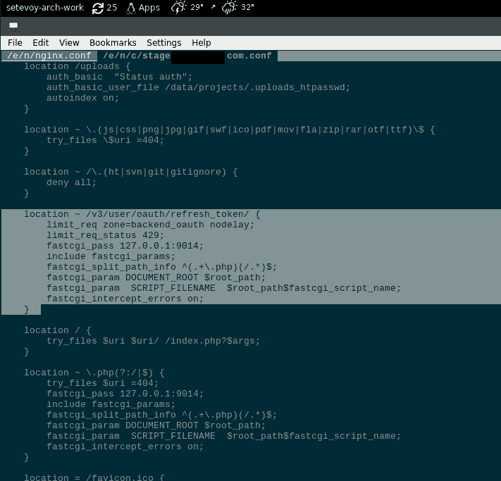

# NGINX:limit _ req–限制每个 IP 的请求

> 原文：<https://dev.to/setevoy/nginx-limitreq-limiting-requests-per-ip-3d76>

[](https://res.cloudinary.com/practicaldev/image/fetch/s--r6fzzO2X--/c_limit%2Cf_auto%2Cfl_progressive%2Cq_auto%2Cw_880/https://rtfm.co.ua/wp-content/uploads/2012/09/nginx_logo2.jpg) 下一个任务是为我们后端的 API 设置每个 IP 的限制:

1.  在`/user/oauth/refresh_token` URI 上添加请求限制器
2.  将一个 IP 的请求限制为每分钟 5 个
3.  如果达到限制–返回 *429 过多请求*响应

会用 NGINX [`ngx_http_limit_req_module`](http://nginx.org/en/docs/http/ngx_http_limit_req_module.html) 。

### `limit_req_zone`

为了进行限制，首先需要创建一个内存区域来存储 IP 地址和来自每个地址的请求。

将其添加到`nginx.conf`，`http {}`块:

```
...
limit_req_zone $binary_remote_addr zone=backend_oauth:10m rate=5r/m;
... 
```

[](https://rtfm.co.ua/wp-content/uploads/2019/08/Screenshot_20190808_142819.png)

这里:

*   `$binary_remote_addr`–带有访问者 IP 的变量
*   `zone=backend_oauth:10m`–名为 *backend_oauth* 的内存区，大小为 10mb(`$binary_remote_addr`的大小可以在 [`ngx_stream_limit_conn_module`](http://nginx.org/en/docs/stream/ngx_stream_limit_conn_module.html#limit_conn_zone) 文档中找到)
*   `rate=5r/m`–5 个请求/分钟限制

***亦作** :*

### `limit_req`

接下来，在虚拟主机的配置中添加一个新的`location`，在这里您要应用限制并添加`limit_req` :

```
...
    location ~ /v3/user/oauth/refresh_token/ {
        limit_req zone=backend_oauth nodelay;
        limit_req_status 429;
        fastcgi_pass 127.0.0.1:9014;
        include fastcgi_params;
        fastcgi_split_path_info ^(.+\.php)(/.*)$;
        fastcgi_param DOCUMENT_ROOT $root_path;
        fastcgi_param  SCRIPT_FILENAME  $root_path$fastcgi_script_name;
        fastcgi_intercept_errors on;
    }
... 
```

[](https://rtfm.co.ua/wp-content/uploads/2019/08/Screenshot_20190808_142955.png)

检查语法，重新读取配置:

```
root@bttrm-stage-app-2:/home/admin# nginx -t && systemctl reload nginx
nginx: the configuration file /etc/nginx/nginx.conf syntax is ok
nginx: configuration file /etc/nginx/nginx.conf test is successful 
```

### 阿帕奇基准

测试一下:

```
$ ab -n 100 -c 10 "https://stage.example.com/v3/user/oauth/refresh_token/" 
```

检查日志:

```
root@bttrm-stage-app-2:/home/admin# tail -f /var/log/nginx/stage.example.com-access.log | grep 194.***.***.26
194.***.***.26 - - [08/Aug/2019:14:26:29 +0300] "GET /v3/user/oauth/refresh_token/ HTTP/1.1" 404 27 "-" "ApacheBench/2.3"
194.***.***.26 - - [08/Aug/2019:14:26:29 +0300] "GET /v3/user/oauth/refresh_token/ HTTP/1.1" 429 162 "-" "ApacheBench/2.3"
194.***.***.26 - - [08/Aug/2019:14:26:29 +0300] "GET /v3/user/oauth/refresh_token/ HTTP/1.1" 429 162 "-" "ApacheBench/2.3"
... 
```

429 响应返回，所有作品。

### NGINX，`limit_req`和 AWS ALB

[在使用 AWS ALB 时发现](https://scottlinux.com/2014/11/20/rate-limiting-with-nginx-behind-aws-elb/)一个可能的问题(但这是在 2014 年发布的):使用`$binary_remote_addr`限制可能不起作用，如果是这样——尝试使用`$http_x_forwarded_for`代替。

虽然在我目前的情况下一切都很好，可能是因为я `set_real_ip_from`(见*[nginx:реальныйIPвлогахприиаботезаAWS 负载平衡器](https://rtfm.co.ua/nginx-realnyj-ip-v-logax-pri-rabote-za-aws-load-balancer/)帖子，Rus)。*

### 链接

*   [NGINX 限速简而言之](https://www.freecodecamp.org/news/nginx-rate-limiting-in-a-nutshell-128fe9e0126c/)
*   [Nginx 中的速率限制](https://medium.com/@christopherphillips_88739/rate-limiting-in-nginx-5af7511ab3ce)
*   [Nginx 中的 HTTP 请求处理阶段](http://www.nginxguts.com/2011/01/phases/)

### 类似的帖子

*   <small>06/26/2019</small> [NGINX:带 Ansible、NGINX map、HTTP 头的多分支部署](https://rtfm.co.ua/en/nginx-multi-branch-deployment-with-ansible-nginx-map-and-http-headers/)
*   <small>2017 年 04 月 12 日</small>T2】nginx:динамический上游
*   <small>3/23/2017</small>[engine:用户代理](https://rtfm.co.ua/draft-nginx-ban-user-agent/)
*   <small>03/17/2019</small> [NextCloud:用 PHP-FPM 在 NGINX 后面的 Debian 上安装服务器，在 Arch Linux 上安装客户端](https://rtfm.co.ua/en/nextcloud-installing-server-on-debian-behind-nginx-with-php-fpm-and-client-on-arch-linux/)