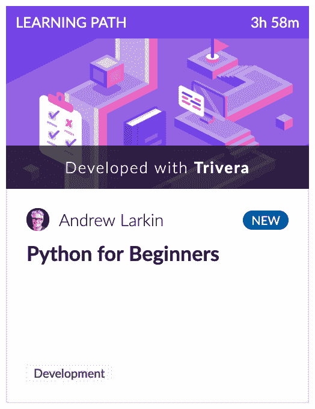
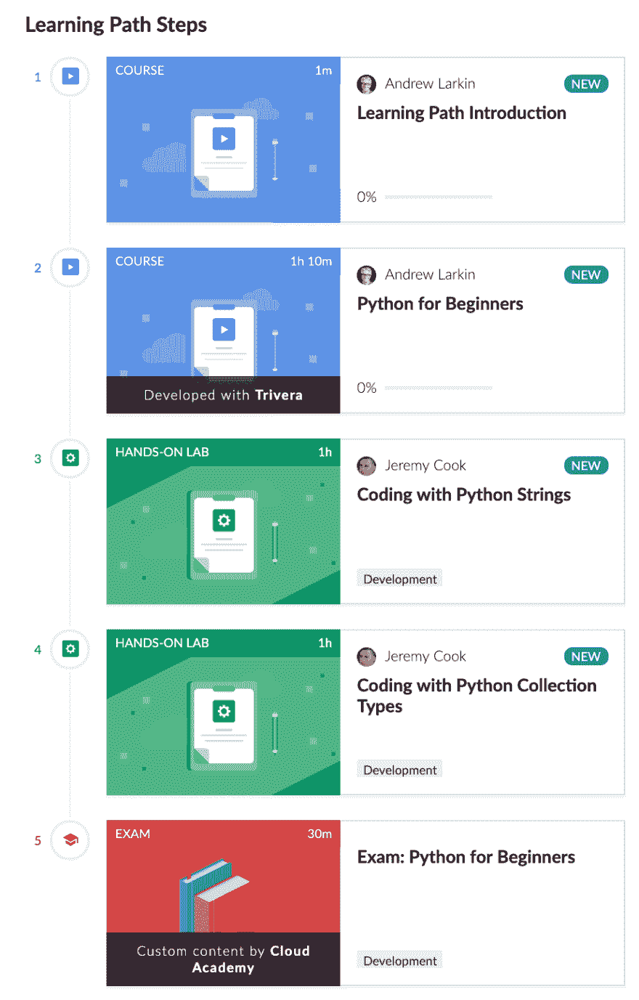

# 了解 Python 日期时间处理—云学院

> 原文：<https://dev.to/valerybriz/understanding-python-datetime-handling-cloud-academy-2ob2>

<figure>[](https://res.cloudinary.com/practicaldev/image/fetch/s--PwEwiiH7--/c_limit%2Cf_auto%2Cfl_progressive%2Cq_auto%2Cw_880/https://cdn-images-1.medium.com/max/1024/1%2A6azqUQZS_S3YZqi_gX4Tvw.jpeg) 

<figcaption>图片由 [Aron 视觉效果](https://unsplash.com/@aronvisuals?utm_source=unsplash&utm_medium=referral&utm_content=creditCopyText)上[下](https://unsplash.com/s/photos/time?utm_source=unsplash&utm_medium=referral&utm_content=creditCopyText)</figcaption>

</figure>

与另一个人交流日期和时间非常简单…对吗？

*“周一六点见”*听起来可以理解。

但是是上午还是下午？你说这话的时候，你的朋友和你在同一个时区吗？当我们需要在 Python 上使用和存储日期和时间时，我们会遇到同样的问题——甚至更多——因为我们可以用多种方式表达日期和时间。例如:

```
“July 15, 2019 07:05 pm”
“2019-15-07 19:05:53 CDT”
“2019-07-15T23:05:53.256587-05:00”
1563231953 
```

<svg width="20px" height="20px" viewBox="0 0 24 24" class="highlight-action crayons-icon highlight-action--fullscreen-on"><title>Enter fullscreen mode</title></svg> <svg width="20px" height="20px" viewBox="0 0 24 24" class="highlight-action crayons-icon highlight-action--fullscreen-off"><title>Exit fullscreen mode</title></svg>

所有这些字符串，甚至整数，都表示完全相同的日期和时间，但是它们看起来完全不同，对吗？在本文中，我们将讨论 Python 日期时间的最佳实践，以降低日常使用、格式化和存储日期时间时的复杂性。以下是我们将涉及的重点内容:

要更深入地了解 Python 的基本原理，请查看 Cloud Academy 的新 [Python 初学者学习路径](https://cloudacademy.com/learning-paths/python-for-beginners-637/)。它是为编程新手设计的，为想要学习如何使用 Python 脚本语言编程的人提供了一个理想的切入点。

[](https://res.cloudinary.com/practicaldev/image/fetch/s--t0CzH9o2--/c_limit%2Cf_auto%2Cfl_progressive%2Cq_auto%2Cw_880/https://cdn-images-1.medium.com/max/524/0%2AqIteDUutNiGWfFKX.png)

[](https://res.cloudinary.com/practicaldev/image/fetch/s--psgXu74S--/c_limit%2Cf_auto%2Cfl_progressive%2Cq_auto%2Cw_880/https://cdn-images-1.medium.com/max/924/0%2An3V55MIZr1CZiOa1.png)

### Python 日期时间最佳实践

当我们谈到 Python 日期时间格式标准时，我们指的是 ISO 8601(日期和时间格式)。这种格式在大多数数据库中使用，其结构如下:

```
YYYY-MM-DDThh:mm:ss.sss +00:00

or

YYYY-MM-DDThh:mm:ss.sss TZ 
```

<svg width="20px" height="20px" viewBox="0 0 24 24" class="highlight-action crayons-icon highlight-action--fullscreen-on"><title>Enter fullscreen mode</title></svg> <svg width="20px" height="20px" viewBox="0 0 24 24" class="highlight-action crayons-icon highlight-action--fullscreen-off"><title>Exit fullscreen mode</title></svg>

但是当我们向用户展示它时，我们可能想要改变它的外观。这是因为如果我们使用工具从用户那里获取数据，比如日历或选择输入，数据发送到后端的方式也会有所不同。

### 创建 Python 解析器

幸运的是，Python 有一个解析器，可以理解几乎所有的字符串格式。例如:

使用以下库:

```
from dateutil.parser import parse import datetime as dt from dateutil.tz import tzutc 
```

<svg width="20px" height="20px" viewBox="0 0 24 24" class="highlight-action crayons-icon highlight-action--fullscreen-on"><title>Enter fullscreen mode</title></svg> <svg width="20px" height="20px" viewBox="0 0 24 24" class="highlight-action crayons-icon highlight-action--fullscreen-off"><title>Exit fullscreen mode</title></svg>

解析器实际上会识别像这些写为文本的参数:

```
first_date = parse('January 31, 2010') print(type(first_date), first_date) 
```

<svg width="20px" height="20px" viewBox="0 0 24 24" class="highlight-action crayons-icon highlight-action--fullscreen-on"><title>Enter fullscreen mode</title></svg> <svg width="20px" height="20px" viewBox="0 0 24 24" class="highlight-action crayons-icon highlight-action--fullscreen-off"><title>Exit fullscreen mode</title></svg>

对象的类型如下:

```
>> parse("<class 'datetime.datetime'> 2010-01-31 00:00:00") 
```

<svg width="20px" height="20px" viewBox="0 0 24 24" class="highlight-action crayons-icon highlight-action--fullscreen-on"><title>Enter fullscreen mode</title></svg> <svg width="20px" height="20px" viewBox="0 0 24 24" class="highlight-action crayons-icon highlight-action--fullscreen-off"><title>Exit fullscreen mode</title></svg>

并且创建的对象看起来是这样的:

```
>> datetime.datetime(2010, 1, 31, 0, 0) 
```

<svg width="20px" height="20px" viewBox="0 0 24 24" class="highlight-action crayons-icon highlight-action--fullscreen-on"><title>Enter fullscreen mode</title></svg> <svg width="20px" height="20px" viewBox="0 0 24 24" class="highlight-action crayons-icon highlight-action--fullscreen-off"><title>Exit fullscreen mode</title></svg>

解析器也可以理解标准的符号，比如“星期六:

```
second_date = parse("Sat Oct 11 17:13:46 UTC 2003") print(type(second_date), second_date) >> <class 'datetime.datetime'> 2003-10-11 17:13:46+00:00 >> datetime.datetime(2003, 10, 11, 17, 13, 46, tzinfo=tzutc()) 
```

<svg width="20px" height="20px" viewBox="0 0 24 24" class="highlight-action crayons-icon highlight-action--fullscreen-on"><title>Enter fullscreen mode</title></svg> <svg width="20px" height="20px" viewBox="0 0 24 24" class="highlight-action crayons-icon highlight-action--fullscreen-off"><title>Exit fullscreen mode</title></svg>

我们也可以直接创建一个日期时间对象，不使用如下格式:

```
my_new_datetime = dt.datetime(2001, 1, 31, 10, 51, 0) print(my_new_datetime) >> 2001-01-31 10:51:00 
```

<svg width="20px" height="20px" viewBox="0 0 24 24" class="highlight-action crayons-icon highlight-action--fullscreen-on"><title>Enter fullscreen mode</title></svg> <svg width="20px" height="20px" viewBox="0 0 24 24" class="highlight-action crayons-icon highlight-action--fullscreen-off"><title>Exit fullscreen mode</title></svg>

### 创建带有 Unix 时间戳的 Python 日期时间

还有另一种方法来创建带有 unix 时间戳的 Python datetime。

> unix 时间戳是一种描述时间点的系统。它是自协调世界时(UTC)1970 年 1 月 1 日星期四 00:00:00 以来经过的秒数，减去闰秒。每天被视为正好包含 86400 秒，因此闰秒将从纪元开始减去。它被广泛应用于类 Unix 和许多其他操作系统和文件格式中。 [_(维基百科，2019) _](https://en.wikipedia.org/wiki/Unix_time) *。*

这种格式的主要特点是我们得到一个存储为整数的日期时间。所以我们可以用“fromtimestamp”方法直接将 Unix 时间戳转换成 Python datetime 对象，如下:

```
from_unix_datetime = datetime.datetime.fromtimestamp(528756281) print(from_unix_datetime) >> datetime.datetime(1986, 10, 4, 2, 14, 41) 
```

<svg width="20px" height="20px" viewBox="0 0 24 24" class="highlight-action crayons-icon highlight-action--fullscreen-on"><title>Enter fullscreen mode</title></svg> <svg width="20px" height="20px" viewBox="0 0 24 24" class="highlight-action crayons-icon highlight-action--fullscreen-off"><title>Exit fullscreen mode</title></svg>

还是反过来:

```
from_datetime_timestamp = dt.datetime.timestamp(from_unix_datetime) print(from_datetime_timestamp) >> 528756281.0 
```

<svg width="20px" height="20px" viewBox="0 0 24 24" class="highlight-action crayons-icon highlight-action--fullscreen-on"><title>Enter fullscreen mode</title></svg> <svg width="20px" height="20px" viewBox="0 0 24 24" class="highlight-action crayons-icon highlight-action--fullscreen-off"><title>Exit fullscreen mode</title></svg>

### 设置 Python 日期时间时区

现在，一个可选但重要的参数是 datetime 的时区。默认时区是 UTC 或项目中设置的时区。但是，如果 datetime 是在本地时间(比如说中部时间)捕获的，而存储该信息的数据库是 UTC 时间，那么它将有五个小时的差异。如果检索此日期时间的服务器使用东部时间(ET ),这可能会造成冲突。如果您没有在创建时设置时区，有一种方法可以在后面添加时区，如下:

```
my_new_datetime.replace(tzinfo=dt.timezone.utc) 
```

<svg width="20px" height="20px" viewBox="0 0 24 24" class="highlight-action crayons-icon highlight-action--fullscreen-on"><title>Enter fullscreen mode</title></svg> <svg width="20px" height="20px" viewBox="0 0 24 24" class="highlight-action crayons-icon highlight-action--fullscreen-off"><title>Exit fullscreen mode</title></svg>

或者我们可以在创作上设置:

```
dt.datetime(2001, 1, 31, 10, 51, 0, tzinfo=tzutc()) 
```

<svg width="20px" height="20px" viewBox="0 0 24 24" class="highlight-action crayons-icon highlight-action--fullscreen-on"><title>Enter fullscreen mode</title></svg> <svg width="20px" height="20px" viewBox="0 0 24 24" class="highlight-action crayons-icon highlight-action--fullscreen-off"><title>Exit fullscreen mode</title></svg>

另一件要考虑的事情是导入日期时间库的方式，有时在代码中我们需要调用基本日期时间库，有时我们需要包含不同方法的 datetime.datetime。为了避免这种情况，我们可以将 datetime 称为 dt，将 datetime.datetime 称为 datetime，或者直接从 dt.datetime.
中调用它

```
from datetime import datetime import datetime as dt 
```

<svg width="20px" height="20px" viewBox="0 0 24 24" class="highlight-action crayons-icon highlight-action--fullscreen-on"><title>Enter fullscreen mode</title></svg> <svg width="20px" height="20px" viewBox="0 0 24 24" class="highlight-action crayons-icon highlight-action--fullscreen-off"><title>Exit fullscreen mode</title></svg>

### 创建日期时间范围

下面是常见的 Python 错误，有一个错误是悄悄发生的，但是如果我们需要一个精确的日期时间范围，而我们的可视化日历工具没有时间选择，只有日期选择，它会影响我们。当我们需要从 00:00:00 开始的日期时间范围时，我们可以很容易地将其添加到初始日期，如下所示:

```
today_datetime = dt.datetime.today() # Create a new datetime with today parameters rounded_date = today_datetime.replace(hour=0, minute=0, second=0, microsecond=0) print(rounded_date) >>2019-07-26 00:00:00 
```

<svg width="20px" height="20px" viewBox="0 0 24 24" class="highlight-action crayons-icon highlight-action--fullscreen-on"><title>Enter fullscreen mode</title></svg> <svg width="20px" height="20px" viewBox="0 0 24 24" class="highlight-action crayons-icon highlight-action--fullscreen-off"><title>Exit fullscreen mode</title></svg>

我们还可以用 timedelta 在 datetime 中增加或减少时间。天数将用 30 天的时间初始化一个新的时间增量。

```
time_delta = dt.timedelta(days=30) print(dt.datetime.today() + time_delta) >> 2019-08-25 18:46:02.274584 
```

<svg width="20px" height="20px" viewBox="0 0 24 24" class="highlight-action crayons-icon highlight-action--fullscreen-on"><title>Enter fullscreen mode</title></svg> <svg width="20px" height="20px" viewBox="0 0 24 24" class="highlight-action crayons-icon highlight-action--fullscreen-off"><title>Exit fullscreen mode</title></svg>

或者比较两个日期减去一个:

```
last_week_day = dt.datetime.today() - dt.timedelta(days=7) print(last_week_day) >> 2019-07-19 18:49:43.580625 
```

<svg width="20px" height="20px" viewBox="0 0 24 24" class="highlight-action crayons-icon highlight-action--fullscreen-on"><title>Enter fullscreen mode</title></svg> <svg width="20px" height="20px" viewBox="0 0 24 24" class="highlight-action crayons-icon highlight-action--fullscreen-off"><title>Exit fullscreen mode</title></svg>

很简单，对吧？现在让我们使用一个更简单的工具来获取单个日期时间参数:

### 获取当前日期

获取当月的当前日期:

```
my_dt = dt.datetime.today() my_dt.day >> 31 
```

<svg width="20px" height="20px" viewBox="0 0 24 24" class="highlight-action crayons-icon highlight-action--fullscreen-on"><title>Enter fullscreen mode</title></svg> <svg width="20px" height="20px" viewBox="0 0 24 24" class="highlight-action crayons-icon highlight-action--fullscreen-off"><title>Exit fullscreen mode</title></svg>

获取当前星期几(在本例中是星期五):

```
my_dt.isoweekday() >> 5 
```

<svg width="20px" height="20px" viewBox="0 0 24 24" class="highlight-action crayons-icon highlight-action--fullscreen-on"><title>Enter fullscreen mode</title></svg> <svg width="20px" height="20px" viewBox="0 0 24 24" class="highlight-action crayons-icon highlight-action--fullscreen-off"><title>Exit fullscreen mode</title></svg>

获取一年中的当前月份(在本例中是二月):

```
my_dt.month >> 2 
```

<svg width="20px" height="20px" viewBox="0 0 24 24" class="highlight-action crayons-icon highlight-action--fullscreen-on"><title>Enter fullscreen mode</title></svg> <svg width="20px" height="20px" viewBox="0 0 24 24" class="highlight-action crayons-icon highlight-action--fullscreen-off"><title>Exit fullscreen mode</title></svg>

获取年份:

```
my_dt.year >> 2019 
```

<svg width="20px" height="20px" viewBox="0 0 24 24" class="highlight-action crayons-icon highlight-action--fullscreen-on"><title>Enter fullscreen mode</title></svg> <svg width="20px" height="20px" viewBox="0 0 24 24" class="highlight-action crayons-icon highlight-action--fullscreen-off"><title>Exit fullscreen mode</title></svg>

最后，我们通常不考虑的一个问题是:当我们将 datetime 对象设置为有效负载上的一个值，然后将它作为请求的数据发送时，会发生什么？

```
current_datetime = dt.datetime.today() requests.get(url="http://test_endpoint.com", json={ "date": current_datetime}) >> TypeError: Object of type datetime is not JSON serializable 
```

<svg width="20px" height="20px" viewBox="0 0 24 24" class="highlight-action crayons-icon highlight-action--fullscreen-on"><title>Enter fullscreen mode</title></svg> <svg width="20px" height="20px" viewBox="0 0 24 24" class="highlight-action crayons-icon highlight-action--fullscreen-off"><title>Exit fullscreen mode</title></svg>

大多数 Python 请求库不接受日期时间、日期或时间类型对象。首先，我们需要将其转换为字符串或整数。由于标准是 ISO 8601 格式，我们将简单地做如下:

```
requests.get(url="http://test_endpoint.com", json={"date": current_datetime.isoformat()}) 
```

<svg width="20px" height="20px" viewBox="0 0 24 24" class="highlight-action crayons-icon highlight-action--fullscreen-on"><title>Enter fullscreen mode</title></svg> <svg width="20px" height="20px" viewBox="0 0 24 24" class="highlight-action crayons-icon highlight-action--fullscreen-off"><title>Exit fullscreen mode</title></svg>

### 下一步

一旦掌握了 Python 中日期时间的基础知识，使用起来就会容易得多。学习完基础知识后，你就可以开始学习云计算学院的[python 编程了。](https://cloudacademy.com/learning-paths/pythonic-programming-628/)这条学习路径将帮助您掌握 Python 语言的高级特性，以确保您的代码干净、简洁、可读和可维护——或“Python 化”。

*原载于 2019 年 8 月 8 日*[*【https://cloudacademy.com】*](https://cloudacademy.com/blog/understanding-python-datetime-handling/)*。*