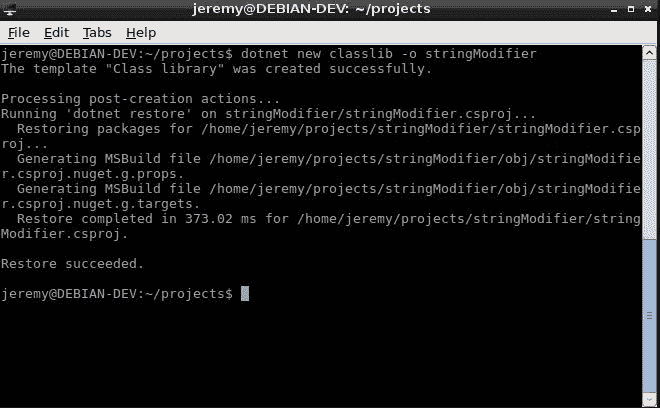
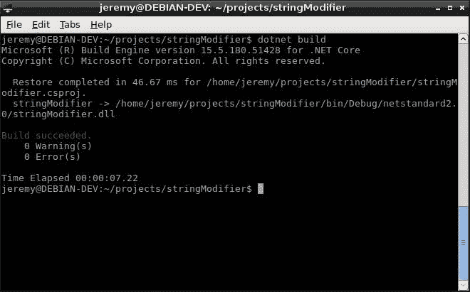
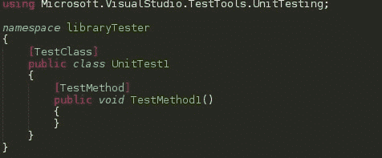
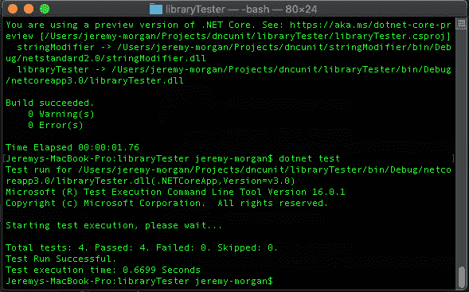

# 使用进行单元测试。网络核心

> 原文：<https://dev.to/pluralsight/unit-testing-with-net-core-4n89>

*[在推特上关注我](http://bit.ly/2JWE2uV)！很高兴听到大家对此的看法，以及对新文章的建议。*

如今很难找到没有单元测试的严肃软件。因此，如果您正在考虑迁移您的。NET 应用程序。NET Core，或者考虑在。NET Core，你的第一个问题可能是:我们可以对它进行单元测试吗？答案是肯定的，在本教程中，我将向您展示在中设置单元测试是多么容易。NET 核心与点网命令行界面。

## 第一步:让我们建立一个类库

对于本教程，我们将建立一个简单的类库称为“字符串修饰符”。顾名思义，它将用于修改字符串。我们将使用[。NET Core CLI](https://docs.microsoft.com/en-us/dotnet/core/tools/?tabs=netcore2x) 创建新的类库。

```
dotnet new classlib -o stringModifier 
```

<svg width="20px" height="20px" viewBox="0 0 24 24" class="highlight-action crayons-icon highlight-action--fullscreen-on"><title>Enter fullscreen mode</title></svg> <svg width="20px" height="20px" viewBox="0 0 24 24" class="highlight-action crayons-icon highlight-action--fullscreen-off"><title>Exit fullscreen mode</title></svg>

您应该会看到类似这样的内容:

[](https://res.cloudinary.com/practicaldev/image/fetch/s--ZQanb_lx--/c_limit%2Cf_auto%2Cfl_progressive%2Cq_auto%2Cw_880/https://thepracticaldev.s3.amazonaws.com/i/wcxfwm3f4cer8z2q0vdb.jpg)

这使用 dotnet CLI 在名为 stringModifier 的文件夹中创建一个新的类库。它创建了一个本质上只是一个基本类的应用程序。不过，我们将把它命名为更有用的东西。

将您的类重命名为 ChangeMyString。应该是这样的:

```
using System;

namespace stringModifier
{
    public class ChangeMyString
    {
    }
} 
```

<svg width="20px" height="20px" viewBox="0 0 24 24" class="highlight-action crayons-icon highlight-action--fullscreen-on"><title>Enter fullscreen mode</title></svg> <svg width="20px" height="20px" viewBox="0 0 24 24" class="highlight-action crayons-icon highlight-action--fullscreen-off"><title>Exit fullscreen mode</title></svg>

我们将创建一个为我们修改字符串的库，所以让我们添加一些方法到我们的字符串修饰符库中。

```
public static string makeAllUppercase(string inputString){
    return inputString.ToUpper();
} 
```

<svg width="20px" height="20px" viewBox="0 0 24 24" class="highlight-action crayons-icon highlight-action--fullscreen-on"><title>Enter fullscreen mode</title></svg> <svg width="20px" height="20px" viewBox="0 0 24 24" class="highlight-action crayons-icon highlight-action--fullscreen-off"><title>Exit fullscreen mode</title></svg>

这个方法将使你发送的任何字符串全部大写。

下一个方法将反转一个字符串:

```
public static string makeReverse(string inputString){
    char[] arr = inputString.ToCharArray();
    Array.Reverse(arr);
    return new string(arr);
} 
```

<svg width="20px" height="20px" viewBox="0 0 24 24" class="highlight-action crayons-icon highlight-action--fullscreen-on"><title>Enter fullscreen mode</title></svg> <svg width="20px" height="20px" viewBox="0 0 24 24" class="highlight-action crayons-icon highlight-action--fullscreen-off"><title>Exit fullscreen mode</title></svg>

现在，这些显然是为了演示的目的，很容易看到他们做什么，但让我们做一个快速的烟雾测试。

让我们确保应用程序构建成功。在项目所在的文件夹中运行以下命令:

```
dotnet build 
```

<svg width="20px" height="20px" viewBox="0 0 24 24" class="highlight-action crayons-icon highlight-action--fullscreen-on"><title>Enter fullscreen mode</title></svg> <svg width="20px" height="20px" viewBox="0 0 24 24" class="highlight-action crayons-icon highlight-action--fullscreen-off"><title>Exit fullscreen mode</title></svg>

它应该是这样的:

[](https://res.cloudinary.com/practicaldev/image/fetch/s--b3M36D9g--/c_limit%2Cf_auto%2Cfl_progressive%2Cq_auto%2Cw_880/https://thepracticaldev.s3.amazonaws.com/i/9vf4yc291m8zoifi9wdv.jpg)

我们可以进入 BIN 文件夹，验证工件是否已生成:

[](https://res.cloudinary.com/practicaldev/image/fetch/s--b57zJEwI--/c_limit%2Cf_auto%2Cfl_progressive%2Cq_auto%2Cw_880/https://thepracticaldev.s3.amazonaws.com/i/hynoql86ia266ge2jhjo.jpg)

现在你已经准备好了。

## 第二步:烟雾测试

让我们构建一个快速控制台应用程序，它调用类库只是为了进行快速的功能可视化测试。退出项目文件夹，我们希望使用 dotnet CLI 为此创建一个运行程序。

```
dotnet new console -n smrunner 
```

<svg width="20px" height="20px" viewBox="0 0 24 24" class="highlight-action crayons-icon highlight-action--fullscreen-on"><title>Enter fullscreen mode</title></svg> <svg width="20px" height="20px" viewBox="0 0 24 24" class="highlight-action crayons-icon highlight-action--fullscreen-off"><title>Exit fullscreen mode</title></svg>

这将为我们创建一个简单的“hello world”应用程序。打开 Project.cs 并使用
添加以下内容

```
using stringModifier; 
```

<svg width="20px" height="20px" viewBox="0 0 24 24" class="highlight-action crayons-icon highlight-action--fullscreen-on"><title>Enter fullscreen mode</title></svg> <svg width="20px" height="20px" viewBox="0 0 24 24" class="highlight-action crayons-icon highlight-action--fullscreen-off"><title>Exit fullscreen mode</title></svg>

然后将以下内容添加到主方法中:

```
Console.WriteLine("Hello World!");
Console.WriteLine(ChangeMyString.makeAllUppercase("Hello World!"));
Console.WriteLine(ChangeMyString.makeReverse("Hello World!")); 
```

<svg width="20px" height="20px" viewBox="0 0 24 24" class="highlight-action crayons-icon highlight-action--fullscreen-on"><title>Enter fullscreen mode</title></svg> <svg width="20px" height="20px" viewBox="0 0 24 24" class="highlight-action crayons-icon highlight-action--fullscreen-off"><title>Exit fullscreen mode</title></svg>

整个方法应该是这样的:

```
using System;
using stringModifier;

namespace smrunner
{
    class Program
    {
        static void Main(string[] args)
        {
            Console.WriteLine("Hello World!");
            Console.WriteLine(ChangeMyString.makeAllUppercase("Hello World!"));
            Console.WriteLine(ChangeMyString.makeReverse("Hello World!"));
        }
    }
} 
```

<svg width="20px" height="20px" viewBox="0 0 24 24" class="highlight-action crayons-icon highlight-action--fullscreen-on"><title>Enter fullscreen mode</title></svg> <svg width="20px" height="20px" viewBox="0 0 24 24" class="highlight-action crayons-icon highlight-action--fullscreen-off"><title>Exit fullscreen mode</title></svg>

现在，回到命令行，让我们添加一个对类库的引用:

```
dotnet add reference "../stringModifer/stringModifier.csproj" 
```

<svg width="20px" height="20px" viewBox="0 0 24 24" class="highlight-action crayons-icon highlight-action--fullscreen-on"><title>Enter fullscreen mode</title></svg> <svg width="20px" height="20px" viewBox="0 0 24 24" class="highlight-action crayons-icon highlight-action--fullscreen-off"><title>Exit fullscreen mode</title></svg>

这将自动将引用添加到类库中。您也可以在。csproj 文件:

```
<ItemGroup>
    <ProjectReference Include="..\stringModifier\stringModifier.csproj" />
</ItemGroup> 
```

<svg width="20px" height="20px" viewBox="0 0 24 24" class="highlight-action crayons-icon highlight-action--fullscreen-on"><title>Enter fullscreen mode</title></svg> <svg width="20px" height="20px" viewBox="0 0 24 24" class="highlight-action crayons-icon highlight-action--fullscreen-off"><title>Exit fullscreen mode</title></svg>

哪种方式都可以。现在我们准备运行它:

```
dotnet run 
```

<svg width="20px" height="20px" viewBox="0 0 24 24" class="highlight-action crayons-icon highlight-action--fullscreen-on"><title>Enter fullscreen mode</title></svg> <svg width="20px" height="20px" viewBox="0 0 24 24" class="highlight-action crayons-icon highlight-action--fullscreen-off"><title>Exit fullscreen mode</title></svg>

您应该会看到类似这样的内容:

[](https://res.cloudinary.com/practicaldev/image/fetch/s--hrLHBLPJ--/c_limit%2Cf_auto%2Cfl_progressive%2Cq_auto%2Cw_880/https://thepracticaldev.s3.amazonaws.com/i/kwxzelyrsjsru3xg9e8e.jpg)

现在我们可以验证这些方法是否如我们所期望的那样工作。但是我们会添加一些单元测试来确保万无一失。

> 记住:单元测试不仅仅是检查一个方法的单个功能。他们还检查当应用程序的其他部分改变时，功能不会改变。这是它们如此重要的部分原因。

## 步骤 3:构建单元测试

让我们为单元测试构建一个单独的项目。这是您将在构建后运行的项目，或者最好在每次部署时自动在构建服务器上运行。

退出您刚才所在的目录，让我们使用 dotnet CLI 创建另一个项目。这将是一个 MSTEST 单元测试项目。

```
dotnet new mstest -o libraryTester 
```

<svg width="20px" height="20px" viewBox="0 0 24 24" class="highlight-action crayons-icon highlight-action--fullscreen-on"><title>Enter fullscreen mode</title></svg> <svg width="20px" height="20px" viewBox="0 0 24 24" class="highlight-action crayons-icon highlight-action--fullscreen-off"><title>Exit fullscreen mode</title></svg>

这将在 libraryTester 目录中创建一个单元测试项目。现在我们打开 UnitTest1.cs，如果你以前构建过单元测试，你应该对它很熟悉。这看起来和传统. Net 中的测试一样。

[](https://res.cloudinary.com/practicaldev/image/fetch/s--iT1vD_0X--/c_limit%2Cf_auto%2Cfl_progressive%2Cq_auto%2Cw_880/https://thepracticaldev.s3.amazonaws.com/i/iquazxm941k9y64hqynu.jpg)

所以让我们增加几个测试。

首先，我们需要添加一个 using 语句来包含这个库。

```
using stringModifier; 
```

<svg width="20px" height="20px" viewBox="0 0 24 24" class="highlight-action crayons-icon highlight-action--fullscreen-on"><title>Enter fullscreen mode</title></svg> <svg width="20px" height="20px" viewBox="0 0 24 24" class="highlight-action crayons-icon highlight-action--fullscreen-off"><title>Exit fullscreen mode</title></svg>

我们想要运行的第一个测试是确保测试方法返回一个字符串。现在我们知道了这些方法的返回类型，但是我们想做一个测试，看看是否每个人都改变了它:

```
[TestMethod]
public void TestMUCReturnsString()
{
    string sample = "Test String";
    Assert.IsInstanceOfType(ChangeMyString.makeAllUppercase(sample), typeof(string));
}

[TestMethod]
public void TestMRReturnsString()
{
    string sample = "Test String";
    Assert.IsInstanceOfType(ChangeMyString.makeReverse(sample), typeof(string));
} 
```

<svg width="20px" height="20px" viewBox="0 0 24 24" class="highlight-action crayons-icon highlight-action--fullscreen-on"><title>Enter fullscreen mode</title></svg> <svg width="20px" height="20px" viewBox="0 0 24 24" class="highlight-action crayons-icon highlight-action--fullscreen-off"><title>Exit fullscreen mode</title></svg>

接下来，我们想要测试这些方法的实际功能。我们有几个测试案例来做这个。

```
[TestMethod]
public void TestMakeAllUppercase()
{
    string sample = "Test String";
    Assert.AreEqual(ChangeMyString.makeAllUppercase(sample), "TEST STRING");
}

[TestMethod]
public void TestMakeReverse()
{
    string sample = "Test String";
    Assert.AreEqual(ChangeMyString.makeReverse(sample), "gnirtS tseT");
} 
```

<svg width="20px" height="20px" viewBox="0 0 24 24" class="highlight-action crayons-icon highlight-action--fullscreen-on"><title>Enter fullscreen mode</title></svg> <svg width="20px" height="20px" viewBox="0 0 24 24" class="highlight-action crayons-icon highlight-action--fullscreen-off"><title>Exit fullscreen mode</title></svg>

现在我们在这里做的是断言我们期望方法返回的内容，然后在方法中插入测试字符串，看看它是否与我们期望的相匹配。

这是最终文件的样子:

```
using Microsoft.VisualStudio.TestTools.UnitTesting;
using stringModifier;
namespace libraryTester
{
    [TestClass]
    public class UnitTest1
    {
        [TestMethod]
        public void TestMUCReturnsString()
        {
            string sample = "Test String";
            Assert.IsInstanceOfType(ChangeMyString.makeAllUppercase(sample), typeof(string));
        }

        [TestMethod]
        public void TestMRReturnsString()
        {
            string sample = "Test String";
            Assert.IsInstanceOfType(ChangeMyString.makeReverse(sample), typeof(string));

        }

        [TestMethod]
        public void TestMakeAllUppercase()
        {
            string sample = "Test String";
            Assert.AreEqual(ChangeMyString.makeAllUppercase(sample), "TEST STRING");
        }

        [TestMethod]
        public void TestMakeReverse()
        {
            string sample = "Test String";
            Assert.AreEqual(ChangeMyString.makeReverse(sample), "gnirtS tseT");
        }
    }
} 
```

<svg width="20px" height="20px" viewBox="0 0 24 24" class="highlight-action crayons-icon highlight-action--fullscreen-on"><title>Enter fullscreen mode</title></svg> <svg width="20px" height="20px" viewBox="0 0 24 24" class="highlight-action crayons-icon highlight-action--fullscreen-off"><title>Exit fullscreen mode</title></svg>

这些是一些非常基本的测试，但现在应该是好的。让我们试一试。

## 步骤 4:构建单元测试

现在我们在 library tester 文件夹中，为了构建它，我们必须再次添加一个引用。

```
dotnet add reference "../stringModifier/stringModifier.csproj" 
```

<svg width="20px" height="20px" viewBox="0 0 24 24" class="highlight-action crayons-icon highlight-action--fullscreen-on"><title>Enter fullscreen mode</title></svg> <svg width="20px" height="20px" viewBox="0 0 24 24" class="highlight-action crayons-icon highlight-action--fullscreen-off"><title>Exit fullscreen mode</title></svg>

现在让我们测试构建。

```
dotnet build 
```

<svg width="20px" height="20px" viewBox="0 0 24 24" class="highlight-action crayons-icon highlight-action--fullscreen-on"><title>Enter fullscreen mode</title></svg> <svg width="20px" height="20px" viewBox="0 0 24 24" class="highlight-action crayons-icon highlight-action--fullscreen-off"><title>Exit fullscreen mode</title></svg>

看起来我们在这里没有任何失败，所以我们应该准备好了。

为了运行测试，我们将输入

```
dotnet test 
```

<svg width="20px" height="20px" viewBox="0 0 24 24" class="highlight-action crayons-icon highlight-action--fullscreen-on"><title>Enter fullscreen mode</title></svg> <svg width="20px" height="20px" viewBox="0 0 24 24" class="highlight-action crayons-icon highlight-action--fullscreen-off"><title>Exit fullscreen mode</title></svg>

[](https://res.cloudinary.com/practicaldev/image/fetch/s--VrtOZ0Ol--/c_limit%2Cf_auto%2Cfl_progressive%2Cq_auto%2Cw_880/https://thepracticaldev.s3.amazonaws.com/i/x2o9lw9t4o5xjfpb6su2.jpg)

我们的测试成功了！我们可以看到运行了 4 个测试，一切都是绿色的。

现在，让我们破坏一个测试，看看它是什么样子的。

让我们回到我们原来的图书馆。改一下:

```
public static string makeAllUppercase(string inputString){
    return inputString.ToUpper();
} 
```

<svg width="20px" height="20px" viewBox="0 0 24 24" class="highlight-action crayons-icon highlight-action--fullscreen-on"><title>Enter fullscreen mode</title></svg> <svg width="20px" height="20px" viewBox="0 0 24 24" class="highlight-action crayons-icon highlight-action--fullscreen-off"><title>Exit fullscreen mode</title></svg>

对此:

```
public static string makeAllUppercase(string inputString){
    return inputString;
} 
```

<svg width="20px" height="20px" viewBox="0 0 24 24" class="highlight-action crayons-icon highlight-action--fullscreen-on"><title>Enter fullscreen mode</title></svg> <svg width="20px" height="20px" viewBox="0 0 24 24" class="highlight-action crayons-icon highlight-action--fullscreen-off"><title>Exit fullscreen mode</title></svg>

让我们重构方法来传递字符串，而不是大写。保存它并构建它。

```
dotnet build 
```

<svg width="20px" height="20px" viewBox="0 0 24 24" class="highlight-action crayons-icon highlight-action--fullscreen-on"><title>Enter fullscreen mode</title></svg> <svg width="20px" height="20px" viewBox="0 0 24 24" class="highlight-action crayons-icon highlight-action--fullscreen-off"><title>Exit fullscreen mode</title></svg>

回到我们的库测试文件夹，再次运行测试:

```
dotnet test 
```

<svg width="20px" height="20px" viewBox="0 0 24 24" class="highlight-action crayons-icon highlight-action--fullscreen-on"><title>Enter fullscreen mode</title></svg> <svg width="20px" height="20px" viewBox="0 0 24 24" class="highlight-action crayons-icon highlight-action--fullscreen-off"><title>Exit fullscreen mode</title></svg>

[](https://res.cloudinary.com/practicaldev/image/fetch/s--yrhfuJIy--/c_limit%2Cf_auto%2Cfl_progressive%2Cq_auto%2Cw_880/https://thepracticaldev.s3.amazonaws.com/i/geqeofaxmvcw17gb4nln.jpg)

现在我们失败了。正如你在屏幕上看到的红色斑点，它抛出了一个错误。它期望测试字符串全部大写，但它没有。

这是单元测试的一个很大的特点，如果一些 yahoo 进入并重构了一些东西，破坏了功能，你的测试会马上发现它。

这就是在中构建单元测试有多容易。网芯！！

**注**

[](https://res.cloudinary.com/practicaldev/image/fetch/s--WCdr5D_V--/c_limit%2Cf_auto%2Cfl_progressive%2Cq_auto%2Cw_880/https://thepracticaldev.s3.amazonaws.com/i/e9kf40yvuymupx3ayoht.png)

我在本教程中使用了 Debian Linux，但是您不必这样做。使用 dotnet CLI 本教程在 Windows、Linux 或 OSX 中是相同的。这就是的美妙之处。网芯！

## 结论

单元测试非常重要。我不会将本教程作为一个讲座，但它们非常值得你花时间，而且经常被忽略。只是因为你在发展。NET 核心应用程序并不意味着它们不能进行单元测试，MSTEST 似乎与我迄今为止用它做的一切都很好。所以去做吧！！在评论里留下任何反馈或者 ***[在推特上吼我](http://bit.ly/2JWE2uV)***

### 进一步阅读

中测试的良好介绍。NET Core，查看刚刚发布的这篇文章:

[](/dotnet) [## 正在测试。网络核心

### 克里斯.诺林。NET Sep 5 ' 1912 分钟读取

#dotnet #beginners #tutorial #testing](/dotnet/testing-in-net-core-ojh)

### 你叫什么。网芯智商？？

[](https://res.cloudinary.com/practicaldev/image/fetch/s--fxXFrxDu--/c_limit%2Cf_auto%2Cfl_progressive%2Cq_auto%2Cw_880/https://thepracticaldev.s3.amazonaws.com/i/pv5cvzxdg7qjyxzsfe71.png)

我的 ASP.NET 核心技能智商是 200。不错，但是你能打败它吗？点击这里试试