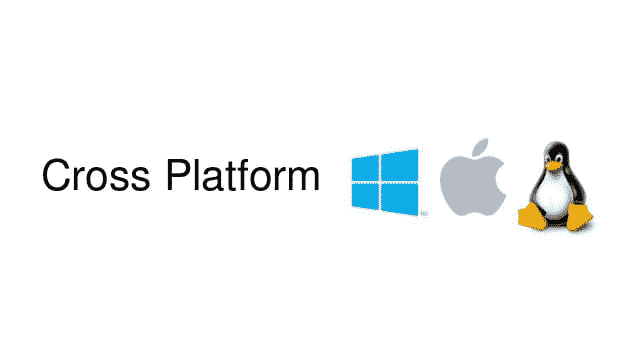

# 通过 CI 服务器上的电子实现自动跨平台部署(Travis)

> 原文：<https://dev.to/wagslane/automatic-cross-platform-deployments-with-electron-on-a-ci-server-travis-38m0>

这是一个关于如何在 Travis CI T1 上设置一个电子应用程序的教程，这样通过一个简单的拉取请求就可以将新版本部署到 T2 Github 发布 T3 上。

## 样板文件

我创建了一个[样板文件 rep](https://github.com/lane-c-wagner/electron-ci-boilerplate) o，它拥有将一个极简应用程序部署到 Github 版本的所有必要配置。如果你在教程中迷路了，你可以看看这个例子。此外，如果你还没有一个电子应用程序，只是想用它作为一个例子，请随意。

## 电子建造者

我们需要一个包来处理将应用程序打包成可执行文件并部署到 Github 版本。 [Electron Builder](https://github.com/electron-userland/electron-builder) 是一个出色的 npm 包，可以在所有三种操作系统上处理构建、签名、公证和部署电子应用程序。用纱线添加([电子建造商](https://www.npmjs.com/package/electron-builder#installation)推荐):

```
yarn add electron-builder --dev 
```

<svg width="20px" height="20px" viewBox="0 0 24 24" class="highlight-action crayons-icon highlight-action--fullscreen-on"><title>Enter fullscreen mode</title></svg> <svg width="20px" height="20px" viewBox="0 0 24 24" class="highlight-action crayons-icon highlight-action--fullscreen-off"><title>Exit fullscreen mode</title></svg>

[](https://res.cloudinary.com/practicaldev/image/fetch/s--MHVNRCLC--/c_limit%2Cf_auto%2Cfl_progressive%2Cq_auto%2Cw_880/https://qvault.io/wp-content/uploads/2019/08/electron-build-cross-platform-desktop-apps-with-web-technologies-8-638.jpg)

对于大多数配置，Electron Builder 使用应用程序的 package.json 文件。

```
{
  "name": "{APP_NAME}",
  "version": "{VERSION_NUMBER}",
  "description": "A minimal Electron application that deploys on CI servers",
  "main": "main.js",
  "scripts": {
    "start": "electron .",
    "release": "electron-builder",
    "test": "echo success"
  },
  "repository": "https://github.com/{USER_NAME}/{REPO_NAME}",
  "keywords": [
    "electron",
    "ci",
    "travis",
    "tutorial",
    "demo"
  ],
  "author": "{USER_NAME}",
  "build": {
    "appId": "{APP_ID}",
    "publish": "github",
    "dmg": {
      "contents": [
        {
          "x": 110,
          "y": 150
        },
        {
          "x": 240,
          "y": 150,
          "type": "link",
          "path": "/Applications"
        }
      ]
    },
    "appImage": {
      "license": "LICENSE"
    },
    "nsis": {
      "createDesktopShortcut": "always",
      "license": "LICENSE"
    }
  },
  "devDependencies": {
    "electron": "^4.0.1",
    "electron-builder": "^21.2.0"
  }
} 
```

<svg width="20px" height="20px" viewBox="0 0 24 24" class="highlight-action crayons-icon highlight-action--fullscreen-on"><title>Enter fullscreen mode</title></svg> <svg width="20px" height="20px" viewBox="0 0 24 24" class="highlight-action crayons-icon highlight-action--fullscreen-off"><title>Exit fullscreen mode</title></svg>

用您自己的值替换所有配置变量。配置变量都在{括号}中大写。

在您的目录根目录下应该有一个名为 license 的许可文件，在您的构建文件夹(build/license_en.txt)中应该有一个名为 license_en.txt 的副本。Electron builder 使用这些许可证作为安装程序的许可协议。

appId 的良好实践是反向域名。比如我们的是 *io.qvault.app* 。

如果您愿意，您可以设置您的测试脚本来实际运行测试，上面只是将“success”打印到屏幕上。我们将配置 Travis 在 CI 服务器上运行这些测试。

此时，您应该可以运行

```
yarn release --publish never 
```

<svg width="20px" height="20px" viewBox="0 0 24 24" class="highlight-action crayons-icon highlight-action--fullscreen-on"><title>Enter fullscreen mode</title></svg> <svg width="20px" height="20px" viewBox="0 0 24 24" class="highlight-action crayons-icon highlight-action--fullscreen-off"><title>Exit fullscreen mode</title></svg>

它会在本地将你的应用编译并打包到 *dist* 目录中。它将只为您的本地操作系统构建软件包，这是所期望的。

## 特拉维斯词

[](https://res.cloudinary.com/practicaldev/image/fetch/s--ptUZWvpG--/c_limit%2Cf_auto%2Cfl_progressive%2Cq_auto%2Cw_880/https://qvault.io/wp-content/uploads/2019/08/TravisCI-Full-Color.png)

导航到[https://travis-ci.org/](https://travis-ci.org/)，使用您的 Github 帐户注册。登录后，您应该能够选择要连接到 Travis 的存储库。

将这段代码复制到您的库的根目录
下的 *.travis.yml*

```
language: node_js

node_js:
  - '11.6.0'

# Always run two parallel builds: one on mac and one on linux
# the linux build will use wine to be able to build windows and
# linux apps
matrix:
  include:
    - os: osx
      osx_image: xcode10.2
      language: node_js
      node_js: "11.6.0"
      env:
        - ELECTRON_CACHE=$HOME/.cache/electron
        - ELECTRON_BUILDER_CACHE=$HOME/.cache/electron-builder

    - os: linux
      dist: trusty
      sudo: required
      services: docker
      language: generic

notifications:
  email: false

# cache some files for faster builds
cache:
  yarn: true
  directories:
    - node_modules
    - $HOME/.cache/electron
    - $HOME/.cache/electron-builder

# add git lfs for large file support
before_install:
  - |
    if ["$TRAVIS_OS_NAME" == "osx"]; then
      mkdir -p /tmp/git-lfs && curl -L https://github.com/github/git-lfs/releases/download/v2.3.1/git-lfs-$(["$TRAVIS_OS_NAME" == "linux"] && echo "linux" || echo "darwin")-amd64-2.3.1.tar.gz | tar -xz -C /tmp/git-lfs --strip-components 1
      export PATH="/tmp/git-lfs:$PATH"
    fi
before_script:
  - git lfs pull

# on PRs and merges to master and prod run tests and build the app
script:
  - |
    if ["$TRAVIS_OS_NAME" == "linux"]; then
      docker run --rm \
        -v ${PWD}:/project \
        -v ~/.cache/electron:/root/.cache/electron \
        -v ~/.cache/electron-builder:/root/.cache/electron-builder \
        electronuserland/builder:wine \
        /bin/bash -c "yarn --link-duplicates --pure-lockfile && yarn test"
    else
      yarn test
    fi
# only deploy to github on a merge to the prod branch
deploy:
  provider: script
  script: bash deploy.travis.sh
  skip_cleanup: true
  on:
    branch: prod

before_cache:
  - rm -rf $HOME/.cache/electron-builder/wine

# only run this script on pull requests and merges into 
# the 'master' and 'prod' branches
branches:
  only:
  - master
  - prod 
```

<svg width="20px" height="20px" viewBox="0 0 24 24" class="highlight-action crayons-icon highlight-action--fullscreen-on"><title>Enter fullscreen mode</title></svg> <svg width="20px" height="20px" viewBox="0 0 24 24" class="highlight-action crayons-icon highlight-action--fullscreen-off"><title>Exit fullscreen mode</title></svg>

上面文件中的注释应该解释每一步做什么，但是基本的想法是对每个拉请求进行测试，以验证拉请求不会破坏应用程序。然后，一旦代码被合并到 prod 分支中，我们就触发下面的部署脚本来构建我们的代码并将其推送到 Github 版本中:

将此文件复制到*deploy . Travis . sh*T2】

```
#! /bin/bash
if ["$TRAVIS_OS_NAME" == osx]; then
    # deploy on mac
    yarn release
else
    # deploy on windows and linux
    docker run --rm -e GH_TOKEN -v "${PWD}":/project -v ~/.cache/electron:/root/.cache/electron -v ~/.cache/electron-builder:/root/.cache/electron-builder electronuserland/builder:wine /bin/bash -c "yarn --link-duplicates --pure-lockfile && yarn release --linux AppImage --win"
fi 
```

<svg width="20px" height="20px" viewBox="0 0 24 24" class="highlight-action crayons-icon highlight-action--fullscreen-on"><title>Enter fullscreen mode</title></svg> <svg width="20px" height="20px" viewBox="0 0 24 24" class="highlight-action crayons-icon highlight-action--fullscreen-off"><title>Exit fullscreen mode</title></svg>

为了让您的 *.travis.yml* 脚本能够将代码上传到 Github 版本，您需要设置一个包含 API 令牌的环境变量。

在 Github 中，导航到您的个人设置/开发者设置/生成新令牌。然后转到 Travis 中的存储库设置，您可以添加一个环境变量。变量名为 GH_TOKEN，令牌是您在 Github 上创建的。确保这个变量在 Travis 上是私有的(默认)，这样它就不会在日志中打印这个令牌。

## 搞定！

现在，对 master 和 prod 的所有 pull 请求都应该运行测试，合并到 prod 分支的所有代码都应该触发一个新的发布。发布的资产和可下载的安装程序将发布到您的 Github 资源库中的[发布选项卡](https://github.com/lane-c-wagner/electron-ci-boilerplate/releases)下。

该版本将是一个草案，所以每次部署后，您需要手动从草案转换为已发布的版本，这只是点击一个按钮。

## 迷茫？

如果您迷路了，请随时回头查看[工作示例报告](https://github.com/lane-c-wagner/electron-ci-boilerplate)，并确保查看 Travis 中记录的错误。如果你有问题，我可以在我们的不和谐服务器这里:【https://discord.gg/EEkFwbv T2】

此外，如果您正在寻找更高级的选项，请查看一下 [Qvault 代码](https://github.com/Q-Vault/qvault)，它使用这种方法以及对代码签名、自动更新和公证的支持。

莱恩·瓦格纳

帖子[在 CI 服务器(Travis)](https://qvault.io/2019/08/08/automatic-cross-platform-deployments-with-electron-on-a-ci-server-travis/) 上自动跨平台部署电子版首先出现在 [Qvault](https://qvault.io) 上。