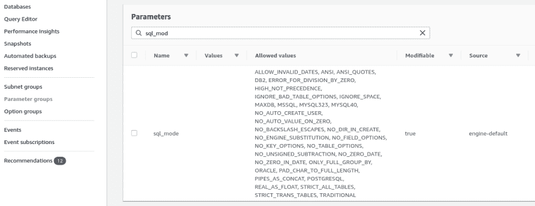

# AWS RDS:“SQLSTATE[22001]–数据对于列太长”使用 MariaDB 10.2

> 原文：<https://dev.to/setevoy/aws-rds-sqlstate-22001-data-too-long-for-column-using-mariadb-10-2-jk>

[](https://res.cloudinary.com/practicaldev/image/fetch/s---dkzETw5--/c_limit%2Cf_auto%2Cfl_progressive%2Cq_auto%2Cw_880/https://rtfm.co.ua/wp-content/uploads/2014/11/aws-logo-square-02-e1417012834176-1.png) 我们有一个用 AWS RDS MariaDB 作为后端的 PHP 应用程序。

在之前使用的 10.0 版本上，一切都很好，但是在我们升级到 MariaDB 10.2 之后，在测试过程中出现了错误:

> PDOException: SQLSTATE[22001]:字符串数据，右截断:1406 数据对于/Data/projects/project name/vendor/yi isoft/yii 2/db/command . PHP 中第 1 行的列“name”太长:1290

这里的第一个解决方案是将列的类型从`VARCHAR`改为`LONGTEXT`，就像这样:

```
MariaDB [dbname]> ALTER TABLE table_name MODIFY column_name LONGTEXT; 
```

但在目前的情况下，这不是正确的方式。

### 解

使用 10.0:
在旧的 MariaDB RDS 上检查`sql_mode`

```
MariaDB [(none)]> select @@sql_mode;
+------------+
| @@sql_mode |
+------------+
|            |
+------------+ 
```

而在新的上，有了 10.2:

```
MariaDB [dbname]> select @@sql_mode;
+-------------------------------------------------------------------------------------------+
| @@sql_mode                                                                                |
+-------------------------------------------------------------------------------------------+
| STRICT_TRANS_TABLES,ERROR_FOR_DIVISION_BY_ZERO,NO_AUTO_CREATE_USER,NO_ENGINE_SUBSTITUTION |
+-------------------------------------------------------------------------------------------+ 
```

看看新 RDS 附带的*参数组*:

[](https://rtfm.co.ua/wp-content/uploads/2019/08/Screenshot_20190808_154619.png)

这里是我们这里需要的——[`STRICT_TRANS_TABLES`](https://dev.mysql.com/doc/refman/8.0/en/sql-mode.html):

> 如果无法将给定的值插入到事务表中，请中止该语句。

现在，需要覆盖默认的" " *STRICT_TRANS_TABLES，ERROR_FOR_DIVISION_BY_ZERO，NO_AUTO_CREATE_USER，NO_ENGINE_SUBSTITUTION* :"值到`NO_AUTO_CREATE_USER,NO_ENGINE_SUBSTITUTION`:

[](https://rtfm.co.ua/wp-content/uploads/2019/08/Screenshot_20190808_155313.png)

重新连接到 MySQL 控制台，再次检查:

```
MariaDB [(none)]> select @@sql_mode;
+--------------------------------------------+
| @@sql_mode                                 |
+--------------------------------------------+
| NO_AUTO_CREATE_USER,NO_ENGINE_SUBSTITUTION |
+--------------------------------------------+ 
```

完成了。

### 类似的帖子

*   <small>08/08/2019</small>[AWS RDS:SQLSTATE[22001]–вMaria db 10.2 列的数据太长](https://rtfm.co.ua/data-too-long-for-column/)
*   <small>05/14/2019</small>[AWS:Maria db RDS–kill:您不是线程的所有者](https://rtfm.co.ua/en/aws-mariadb-rds-kill-you-are-not-owner-of-thread-2/)
*   <small>12/13/2016</small>[AWS:RDS Aurora db . T2 . medium vs T2 . nanoиMaria db](https://rtfm.co.ua/aws-rds-aurora-db-t2-medium-vs-t2-nano-i-mariadb/)
*   T009/03/2016 t1t2aws:rtfm 迁移，第 2 部分:手动基础架构创建–AIm，.