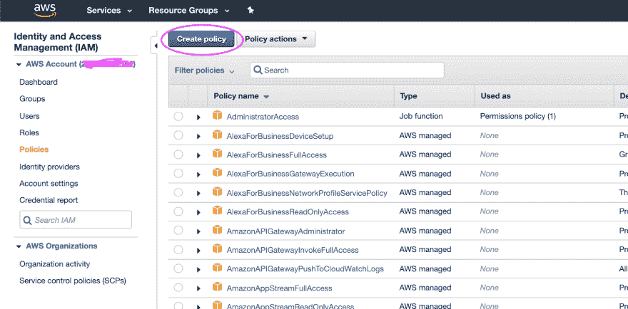
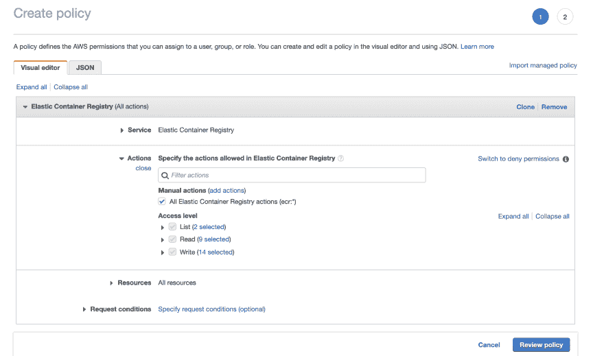
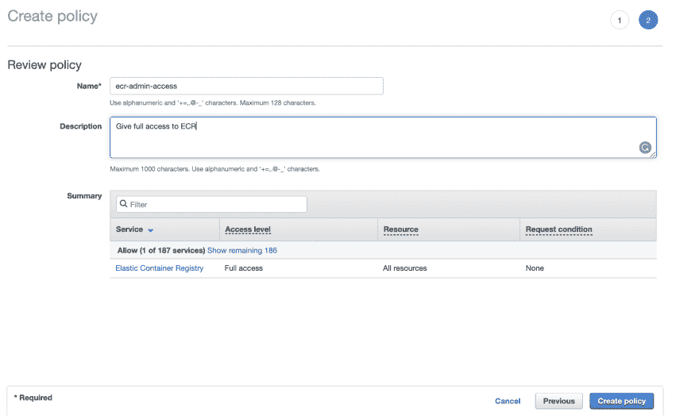
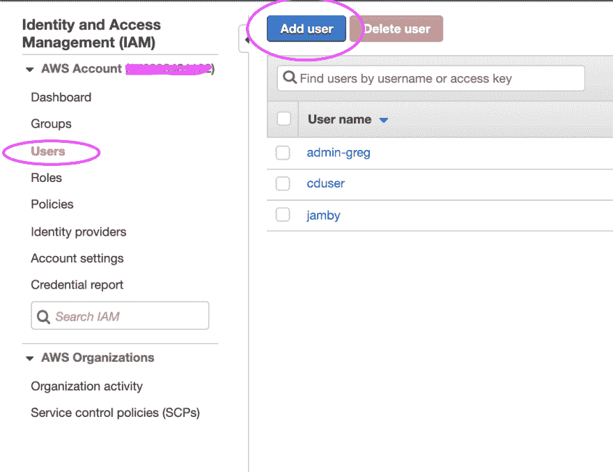
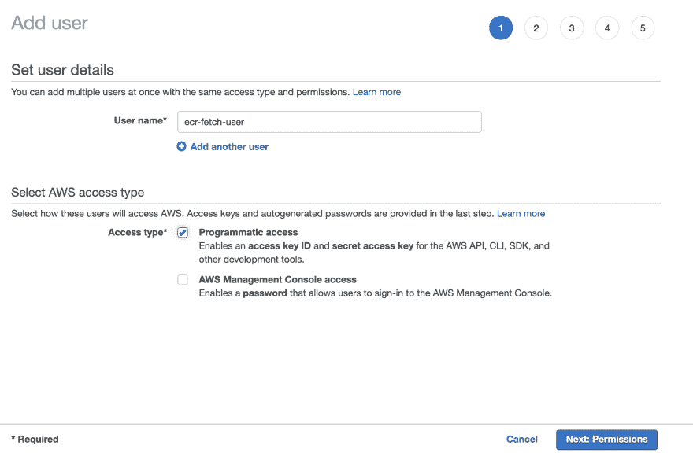
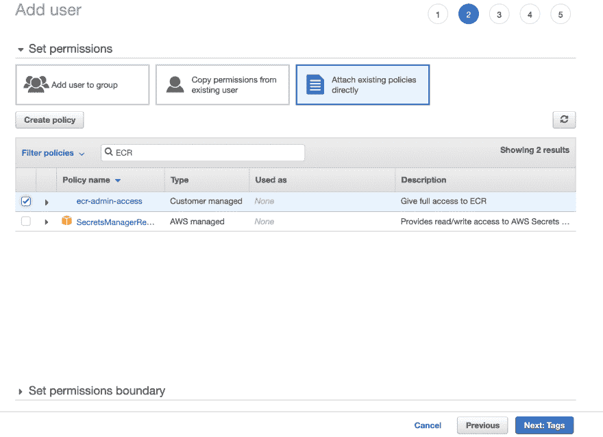
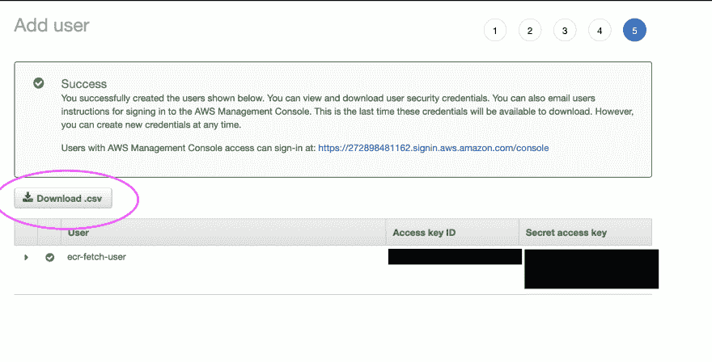
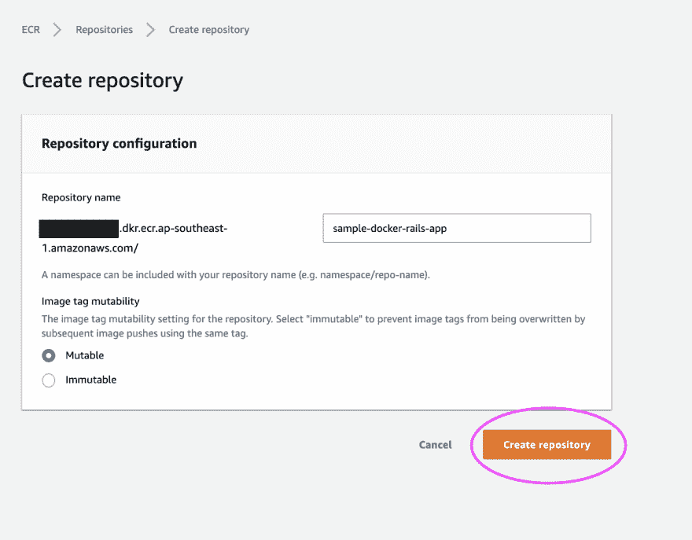
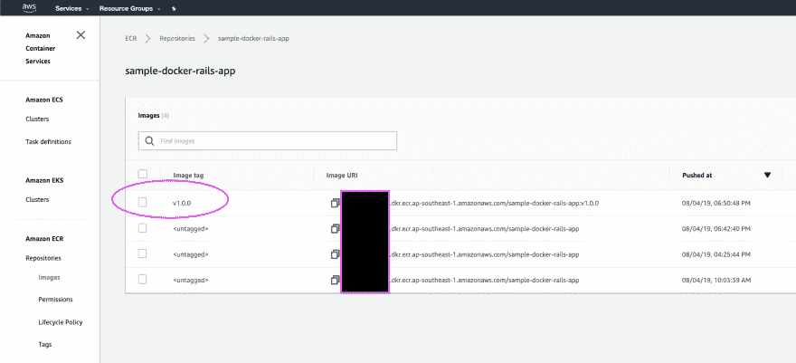

# 在 Amazon ECS 中部署 Rails:第 2 部分——将映像推送到 ECR

> 原文：<https://dev.to/raphael_jambalos/deploy-rails-in-amazon-ecs-part-2-push-an-image-to-ecr-43fl>

这是亚马逊 ECS 文章*部署 Rails 的第二部分。它是 Docker* 中更广泛的系列*的一部分，而不是“你好世界”。该系列将帮助您准备好您的应用程序:从在本地设置它到在 AWS 中将它部署为生产级工作负载。*

*   [在 Docker 中构建 Rails + Sidekiq web 应用](https://dev.to/jamby1100/more-than-hello-world-in-docker-run-rails-sidekiq-web-apps-in-docker-1b37)
*   **在亚马逊 ECS 中部署 Rails**
    *   [概念](https://dev.to/jamby1100/deploy-rails-in-amazon-ecs-part-1-concepts-26nl)
    *   **将图像推送到 ECR -我们在这里**
    *   [创建 RDS 数据库、任务定义和负载平衡器](https://dev.to/jamby1100/deploy-rails-in-amazon-ecs-part-3-create-the-rds-database-task-definition-and-load-balancer-1ffe)
    *   [创建 ECS 群集并将其全部连接在一起](https://dev.to/jamby1100/deploy-rails-in-amazon-ecs-part-4-create-an-ecs-cluster-338f)
    *   [配置 Sidekiq](https://dev.to/jamby1100/deploy-rails-in-amazon-ecs-part-5-integrate-sidekiq-and-redis-for-background-processing-150f)
*   [使用 AWS CodeDeploy 自动部署](https://dev.to/raphael_jambalos/automate-deployments-with-aws-codepipeline-52f5)
    *   [深入了解 AWS 代码构建](https://dev.to/jamby1100/automate-docker-build-with-aws-codebuild-9om)
*   高级 ECS 概念:
    *   服务发现和自动扩展-即将推出
    *   Fargate -即将推出

# 2 |设置 IAM 用户

在云中部署 Dockerized 应用程序的第一步是能够将您构建的图像上传到图像存储库中。对于本教程，我们将使用 AWS 弹性容器注册中心(ECR)。

你需要一个 AWS 账户。你可以在这里设置一个[。在本节中，我们将创建一个 IAM 策略，其中包含访问 ECR 所需的所有权限。然后，我们会将该策略附加到一个稍后将使用的新用户。](https://aws.amazon.com/premiumsupport/knowledge-center/create-and-activate-aws-account/)

**(2.1)** 完成 AWS 帐户设置后，我们来创建一个 IAM 策略。在“服务”选项卡上，搜索 IAM 并单击它。然后，单击左侧菜单中的“策略”选项卡。之后，点击“创建策略”。

[](https://res.cloudinary.com/practicaldev/image/fetch/s--KQFdTLTK--/c_limit%2Cf_auto%2Cfl_progressive%2Cq_auto%2Cw_880/https://thepracticaldev.s3.amazonaws.com/i/rzsn42rutib2s592li0i.png)

**(2.2)** 在下一页，选择*弹性容器注册表*作为服务，所有*弹性容器注册表动作*作为动作，*所有资源*作为资源。该权限授予我们的用户在 ECR 服务中执行任何操作的能力(例如将 docker 图像推送到 ECR 等)

[](https://res.cloudinary.com/practicaldev/image/fetch/s--Z18cXTH---/c_limit%2Cf_auto%2Cfl_progressive%2Cq_auto%2Cw_880/https://thepracticaldev.s3.amazonaws.com/i/7y5yft6754oe4eke3tb4.png)

**(2.3)** 在下一页中，添加 *ecr-admin-access* 作为名称，*将管理员权限赋予 ECR* 作为描述。然后，点击*创建策略*。

[](https://res.cloudinary.com/practicaldev/image/fetch/s--2OuZ78Gq--/c_limit%2Cf_auto%2Cfl_progressive%2Cq_auto%2Cw_880/https://thepracticaldev.s3.amazonaws.com/i/faaam1s7l3c1haiecwxb.png)

**(2.4)** 现在，进入左侧菜单的*用户*选项卡。然后，点击*创建用户*。

[](https://res.cloudinary.com/practicaldev/image/fetch/s--8i6jhw5o--/c_limit%2Cf_auto%2Cfl_progressive%2Cq_auto%2Cw_880/https://thepracticaldev.s3.amazonaws.com/i/uek0i7gzb7xm7jusgkoe.png)

**(2.5)** 在下一页中，添加 *ecr-fetch-user* 作为用户名，并启用*程序化访问*。访问 AWS 有两种主要方式:通过管理控制台(您现在正在使用的)或通过 CLI。启用*编程访问*将使我们能够仅通过 CLI 访问 AWS。然后，单击“下一步:权限”。

[](https://res.cloudinary.com/practicaldev/image/fetch/s--YHkT2Zxx--/c_limit%2Cf_auto%2Cfl_progressive%2Cq_auto%2Cw_880/https://thepracticaldev.s3.amazonaws.com/i/fy802k5vt9spyzd5sw8a.png)

**(2.6)** 在下一页，搜索我们在 2.1 中创建的策略: *ecr-admin-access* 。然后，勾选左边的复选框，点击“下一步:标签”

[](https://res.cloudinary.com/practicaldev/image/fetch/s--HjOJOOBE--/c_limit%2Cf_auto%2Cfl_progressive%2Cq_auto%2Cw_880/https://thepracticaldev.s3.amazonaws.com/i/8ol8tzgttuai6d8izztq.png)

**(2.7)** 点击下一页，跳过下一页。然后，检查您的 IAM 用户。查看后，点击“创建用户”。

**(2.8)** 下一页将显示访问密钥 ID (AKID)和密码。在后面的步骤中，您将使用这些凭证来访问 AWS。请务必下载 CSV 文件，因为这将是您最后一次看到这些凭据。

[](https://res.cloudinary.com/practicaldev/image/fetch/s--FHOG_o-U--/c_limit%2Cf_auto%2Cfl_progressive%2Cq_auto%2Cw_880/https://thepracticaldev.s3.amazonaws.com/i/bxwd98tdbenztxntp1lr.png)

**(2.9)** 使用[官方安装指南](https://docs.aws.amazon.com/cli/latest/userguide/cli-chap-install.html)设置您的 AWS CLI。单击左侧您正在使用的操作系统。

[](https://res.cloudinary.com/practicaldev/image/fetch/s--uNwkT6Hh--/c_limit%2Cf_auto%2Cfl_progressive%2Cq_auto%2Cw_880/https://thepracticaldev.s3.amazonaws.com/i/5dyssp47nx98qs7kxmjq.png)

在你输入`aws configure`的步骤，输入你从 2.8 下载的 AKID 和 secret。对于地区，选择“AP-东南-1”。

# 3 |创建一个 ECR 知识库

有了 AWS CLI 设置，让我们开始吧！

**(3.0)** 在生产设置中，您必须选择离您最近的 AWS 区域。为简单起见，选择右上角的新加坡地区(“ap-southeast-1”)。

**(3.1)** 在服务选项卡上，搜索 ECR 并点击它。在页面右侧，单击“创建存储库”。

[](https://res.cloudinary.com/practicaldev/image/fetch/s--In13Vv3J--/c_limit%2Cf_auto%2Cfl_progressive%2Cq_auto%2Cw_880/https://thepracticaldev.s3.amazonaws.com/i/z1ml8e0sfb3yvzpqzmbk.png)

**(3.2)** 在下一页，使用 *sample-docker-rails-app* 作为存储库名称。然后，单击“创建存储库”。

[](https://res.cloudinary.com/practicaldev/image/fetch/s--qOFe5vH_--/c_limit%2Cf_auto%2Cfl_progressive%2Cq_auto%2Cw_880/https://thepracticaldev.s3.amazonaws.com/i/3y9frxs6ub9ztkcb3j5m.png)

你会看到 URI 仓库。请注意这一点，我们将在步骤 5.2 中使用它。我们已经创建了一个图像库。有了提供的存储库的 URI，我们可以随心所欲地推送同一个图像的多个版本。

[](https://res.cloudinary.com/practicaldev/image/fetch/s--yrIqqu7_--/c_limit%2Cf_auto%2Cfl_progressive%2Cq_auto%2Cw_880/https://thepracticaldev.s3.amazonaws.com/i/5ahih8r16o6dlyegg59b.png)

# 4 |为 ECS 准备 Rails 5 应用

**(4.1)** 第一个，`cd`进入我们做的项目的根目录，最后[发布](https://dev.to/jamby1100/more-than-hello-world-in-docker-run-rails-sidekiq-web-apps-in-docker-1b37)。如果你决定跳过那篇博文，从[这里](https://github.com/jamby1100/rails-docker-project/releases/tag/v0.0.1)克隆它。

将此代码片段添加到 config/database.yml 文件中。

```
staging:
  adapter: postgresql
  encoding: unicode
  host: <%= ENV['POSTGRESQL_HOST'] %>
  username: <%= ENV['POSTGRESQL_USER_NAME'] %>
  password: <%= ENV['POSTGRESQL_PASSWORD'] %>
  pool: 5
  database: <%= ENV['POSTGRESQL_DB'] %> 
```

这允许我们的数据库凭证通过环境变量提供(而不是在这里硬编码)。

**(4.2)** 然后，使用命令:
创建 config/environments/development . Rb 文件的副本

```
cp config/environments/development.rb config/environments/staging.rb 
```

在步骤 4.1 和 4.2 中，我们创建了一个名为`staging`的新 Rails 环境。这是为了让我们能够区分本地的开发环境和容器上的暂存环境。

之后，提交你的进度:

```
git add .
git commit -m "Add staging environment"
git push origin master 
```

**(4.4)** 为了在我们的容器上运行我们的 rails 服务器，创建一个名为`config/docker_puma.rb`的新文件并粘贴下面的代码片段。我们将使用 Rails 的默认应用服务器 Puma。

```
# Change to match your CPU core count
workers 1

# Min and Max threads per worker
threads 1, 6

app_dir = File.expand_path("../..", __FILE__)
shared_dir = "#{app_dir}/shared"

# Default to production
rails_env = ENV['RAILS_ENV'] || "production"
environment rails_env

# Set up socket location
bind "unix://#{shared_dir}/sockets/puma.sock"

# Logging
# - Commened out this line so logs would pour into awslogs cloudwatch
# stdout_redirect "#{app_dir}/log/puma.stdout.log", "#{app_dir}/log/puma.stderr.log", true

# Set master PID and state locations
pidfile "#{shared_dir}/pids/puma.pid"
state_path "#{shared_dir}/pids/puma.state"
activate_control_app

on_worker_boot do
  require "active_record"
  ActiveRecord::Base.connection.disconnect! rescue ActiveRecord::ConnectionNotEstablished
  ActiveRecord::Base.establish_connection(YAML.load_file("#{app_dir}/config/database.yml")[rails_env])
end 
```

**(4.5)** 然后，创建 puma 需要的文件夹。

```
mkdir shared
mkdir shared/sockets
mkdir shared/pids 
```

之后，提交你的进度:

```
git add .
git commit -m "Add special docker puma config. Add folders for puma"
git push origin master 
```

# 5 |将图像推送到 ECR

在本节中，我们将把一个映像推送到 ECR。

**(5.1)** 让我们用这个命令构建一个 Docker 映像:`docker build . -t my-rails-app`。这可能需要一段时间。

**(5.2)** 构建完成后，让我们标记刚刚构建的图像。获取您在步骤 3.2 中记录的存储库的 URI，并运行:`docker tag my-rails-app:latest <uri-from-3.2>:v1.0.0`

**(5.3)** 然后，让我们通过键入`aws ecr get-login --no-include-email --region=ap-southeast-1`进行认证。该命令将输出一个从`docker login -u AWS -p`开始的字符串。这个字符串将用于登录我们在第 3 节中创建的 ECR 私有映像存储库。将整个字符串复制粘贴回终端。

对于使用 AWS CLI 2.0 的用户，可以使用命令:`aws ecr get-login-password | docker login --username AWS --password-stdin`。

**(5.4)** 现在让我们通过:`docker push <uri-from-3.2>:v1.0.0`将我们的图像推送到 ECR。您的本地机器现在一层一层地将图像推送到 ECR。它应该是这样的:

[](https://res.cloudinary.com/practicaldev/image/fetch/s--Nv_KhXhm--/c_limit%2Cf_auto%2Cfl_progressive%2Cq_auto%2Cw_880/https://thepracticaldev.s3.amazonaws.com/i/evazgje5cv3x8ijzs82j.png)

**(5.5)** 返回 AWS 管理控制台。在“服务”选项卡上，搜索 ECR 并单击它。然后，单击您在步骤 3.2 中创建的存储库

[](https://res.cloudinary.com/practicaldev/image/fetch/s--sYfTADgy--/c_limit%2Cf_auto%2Cfl_progressive%2Cq_auto%2Cw_880/https://thepracticaldev.s3.amazonaws.com/i/rxiiehtfuvq8cjpew9s5.png)

您应该可以看到刚刚上传的图片，标签为“v1.0.0”

[](https://res.cloudinary.com/practicaldev/image/fetch/s--yOsBwAIw--/c_limit%2Cf_auto%2Cfl_progressive%2Cq_auto%2Cw_880/https://thepracticaldev.s3.amazonaws.com/i/k02eu2l7w2dpc021zb9s.png)

# 接下来是什么？

你把你的第一张照片放进了 ECR。在下一篇文章的[中，您将构建所需的 AWS 资源，以便在 ECS 中设置您的 Rails 应用程序。](https://dev.to/jamby1100/deploy-rails-in-amazon-ecs-part-3-create-the-rds-database-task-definition-and-load-balancer-1ffe)

特别感谢我的编辑艾伦，他帮助这篇文章变得更加连贯。再次特别感谢 Richard Hessler 关于 AWS CLI 2.0 的提示

我很高兴听取你对这篇文章的评论/反馈。就在下面评论吧，或者给我留言！