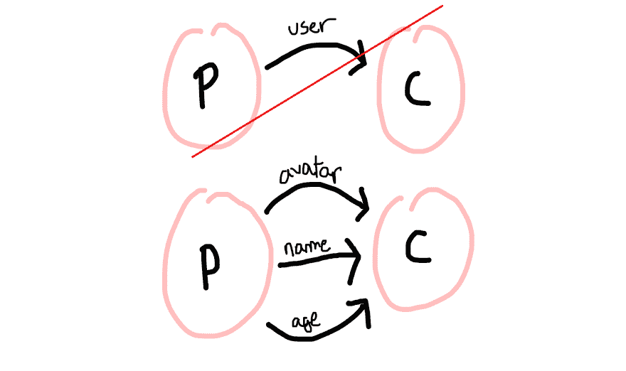

# 编写优雅且有弹性的组件的技巧

> 原文：<https://dev.to/christopherkade/writing-elegant-and-resilient-components-547i>

作为一名前端开发人员，构建有弹性和可重用的组件是我的首要任务，而且有很多理由支持经过深思熟虑的组件。

令人欣慰的是，今天的大多数 UI 库和框架都在很大程度上帮助您为您的项目(更重要的是，为您的团队)构建最好的组件。然而，记住一些准则可以帮助我们避免陷阱，尤其是在大规模应用程序中。

在本文中，我们将回顾我每天遵循的概念，它们是**库和框架不可知的**，意味着它们适用于 UI 组件整体。

1.  [采用模块化方法](#have-a-modular-approach)
2.  [给你的组件起个好名字](#name-your-components-well)
3.  [保持你的道具简单](#keep-your-props-simple)
4.  [将您的业务逻辑保存在容器组件中](#keep-your-business-logic-in-container-components)

## 有模块化的方法

[](https://res.cloudinary.com/practicaldev/image/fetch/s--gMLc629F--/c_limit%2Cf_auto%2Cfl_progressive%2Cq_auto%2Cw_880/https://thepracticaldev.s3.amazonaws.com/i/4qcceiqmxrsbh9tfewod.png)

理想情况下，您的组件应该遵循先[后](https://addyosmani.com/first/)的原则:

*   聚焦:一个组件，一个责任，如果一个组件做得太多，问问你自己是否能在某个地方提取那个逻辑。
*   独立:理想情况下，一个组件不应该依赖另一个组件来运行。传递简单直白的道具可以帮助你创造独立的元素。如果你曾经用过[故事书](https://storybook.js.org)，那么这样想:*我可以很容易地把这个成分提取到一个故事里吗？*。
*   eusable: UI 组件是乐高积木，它们应该很容易放在任何地方。同样，一个组件的可重用性通常是由其属性的简单性决定的(稍后将详细讨论这个主题)。
*   商城:在我目前咨询的一个项目中，我震惊地看到组件达到了 1000 行。保持👏他们👏小。一个小的组件可以很容易地阅读和解释，并且更容易测试。
*   测试这个组件需要多少嘲讽？这通常是问自己的一个好问题，复杂的组件需要事先模拟复杂的环境。请记住，最容易测试的组件被称为*纯组件*，这意味着对于给定的输入，组件将始终呈现相同的输出，不会产生任何副作用，并且不依赖于任何外部可变状态。

当然，您将处理真正依赖于您的业务逻辑的元素，这意味着您可能无法完全遵循这些指导方针，**这没关系**。有些组件并不意味着是可重用的，有些组件不会是独立的；但是记住这个原则是一个好的开始。

## 给你的组件起个好名字

[](https://res.cloudinary.com/practicaldev/image/fetch/s--bszdR2mQ--/c_limit%2Cf_auto%2Cfl_progressive%2Cq_auto%2Cw_880/https://thepracticaldev.s3.amazonaws.com/i/ba521gikvx8pp7r0e9xx.png)

我倾向于让我的组件名**简短**、**有意义**和**容易发音**。

这里有一些好的和不好的例子:

```
<!-- Good -->
<user-button></user-button>
<payment-details></payment-details>
<user-card></user-card>

<!-- Bad -->
<user-btn></user-btn> <!-- hard to pronounce -->
<user-guarantee-payment-tab></user-guarantee-payment-tab> <!-- too long -->
<ui-dropdown></ui-dropdown> <!-- every component is a UI element, no need to mention it --> 
```

<svg width="20px" height="20px" viewBox="0 0 24 24" class="highlight-action crayons-icon highlight-action--fullscreen-on"><title>Enter fullscreen mode</title></svg> <svg width="20px" height="20px" viewBox="0 0 24 24" class="highlight-action crayons-icon highlight-action--fullscreen-off"><title>Exit fullscreen mode</title></svg>

## 保持你的道具简单

[](https://res.cloudinary.com/practicaldev/image/fetch/s--4Sp1noxY--/c_limit%2Cf_auto%2Cfl_progressive%2Cq_auto%2Cw_880/https://thepracticaldev.s3.amazonaws.com/i/8m2zuyuos3rungws1pmm.png)

正如第一个技巧中提到的，道具可以成就或破坏一个组件。

*   避免传递复杂的对象结构，尽可能支持单个属性
*   为你的道具使用简单的名字。我们应该能够理解它的目的(即使是部分的)

基本上，**尽可能使用 Javascript 原语**(字符串、数字、布尔值)和函数作为道具。

## 将您的业务逻辑保存在容器组件中

[](https://res.cloudinary.com/practicaldev/image/fetch/s--cjWuvrMZ--/c_limit%2Cf_auto%2Cfl_progressive%2Cq_auto%2Cw_880/https://thepracticaldev.s3.amazonaws.com/i/6vnhey8xbr6upppmvs2h.png)

**容器组件**(比如布局)应该将计算和业务逻辑作为一个整体，以便将其结果作为道具传递给**表示组件**。

> 这种模式并不总是有效的，但是要记住它所提倡的思想是很重要的:复杂的和有状态的逻辑在分开时更容易维护。例如，在 React 应用程序的情况下，这个业务逻辑可以在一个自定义钩子中提取，所以这个“智能/无智能”组件模式实际上是关于关注点的分离。

通常，让每个组件处理自己的逻辑会导致它们很难在整个应用程序中重用，因为它们将被绑定到特定的上下文中。

## 不要过度

这些只是构建高效组件的一般技巧。当然，每个项目都有不同的需求，可能不允许您一直遵循这些指导方针。

正如丹·阿布拉莫夫在他的[写弹性组件](https://overreacted.io/writing-resilient-components/)的文章中所说:*不要被想象的问题*分心。请记住，不值得过度设计您的所有组件，也不值得强制执行可能不会带来有意义的差异的规则。

我希望这个简短的列表能帮助你们在日常工作中构建更好的 UI 组件。一如既往，如果你有任何问题，发推特给我[@克里斯托 _ 卡德](http://twitter.com/christo_kade) ❤️