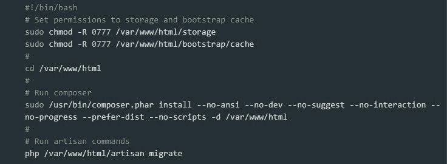

# 如何在 Amazon Web Services 上部署 Laravel:详细的分步指南

> 原文：<https://dev.to/updivision/how-to-deploy-laravel-on-amazon-web-services-a-detailed-step-by-step-tutorial-3pf1>

我们的开发人员经历了很多。这些是他们的故事。这是由我们的高级应用程序设计师 Cristi 讲述的。

如果你是一名网络开发人员，你可能听说过 Laravel。拿我来说，我经常使用它。Laravel 是一个开源的 PHP 模型-视图-控制器框架——有什么不喜欢的呢？

说到托管基于 Laravel 的应用程序，我经常使用亚马逊网络服务(AWS)，特别是 Elastic Beanstalk。这是一个可靠的托管解决方案，拥有您需要的所有基础设施(负载平衡器、自动伸缩、关系数据库、自定义 VPC)。

AWS 上的 Laravel 是一个性能非常好的组合，这使得它在 web 开发人员中非常受欢迎。这使得它不容易部署。外面的信息有限也于事无补。很少有博客文章只涉及整个过程的一部分。是的，亚马逊发布了一些文档，但它让你抓耳挠腮的次数多于理清事情的次数。

在 AWS 上部署我们的 Laravel 构建的项目时，我曾多次碰壁。我写了这篇文章，所以你不必。

在我们开始之前，我想说的是，我试图让本指南对很少或没有配置服务器经验的人尽可能友好。我包括了一堆参考链接，以防你想了解更多正在解释的内容。

虽然这篇文章足以让你的应用启动并运行，但是通过阅读文档还可以进行更多的定制。

## 0。先决条件

您应该已经拥有 AWS 帐户。如果没有，那就创建一个，然后继续阅读。

### 步骤 0.1 创建环境

*   访问您的 **AWS 控制台**
*   转到**弹性豆茎**
*   点击**创建应用程序**并完成表格
*   为你新申请动作**动作>创建环境**
*   在新窗口中选择 **Web 服务器环境**并点击**选择**
*   完成表单:→选择 PHP 作为您的**预配置平台** →对于**应用代码**，选择**示例应用** →点击**创建环境**
*   如果要修改更多设置，点击**配置更多选项**
*   进行所需的更改(最好设置/创建用于 ssh 的密钥对)
*   点击**创建环境**

### 步骤 0.2 配置环境

*   单击新创建的环境
*   在左侧菜单中点击**配置**
*   从**软件**中点击**修改**
*   在**容器选项**中:→将文档根目录设置为/public →进行其他必要的配置
*   在**环境属性**中，将所有的配置信息放入项目的。环境文件
*   点击**应用**

## 1。通过网络浏览器上传档案

*   在本地机器上，转到项目的根文件夹
*   将项目存档为. zip 文件
*   确保包含供应商文件夹
*   对于 Git 相关的文件，不需要 **tests** 文件夹

*   访问您的 **AWS 控制台**
*   转到**弹性豆茎**
*   转到您的**应用程序的仪表板**
*   点击**上传**和**部署**
*   对于**上传应用程序**,选择您刚刚创建的档案
*   为**版本标签**输入新的版本号
*   点击**部署**

## 2。使用代码部署

### 步骤 2.1 在 AWS 中配置代码部署应用程序

*   访问您的 **AWS 控制台**
*   转到**代码部署**
*   点击**创建应用**
*   完成表单:a .)输入所需的**应用程序名称** b .)选择**EC2/内部部署**作为**计算平台** c .)输入所需的**部署组名称** d.) **部署类型**是**就地部署** e.) **环境配置**:如果您的 web 应用程序使用负载平衡>选择负载平衡器的**自动扩展组**。如果您的 web 应用程序不使用负载平衡>选择 **Amazon EC2 实例**
*   对于**部署配置**，选择**代码部署默认。一次**
*   对于**服务角色**，选择一个授予 AWS CodeDeploy 对实例的访问权限的服务角色(例如**arn:AWS:iam::34325423432:role/elastic beanstalk-ec2-role**)
*   点击**保存**
*   现在您已经有了您的**部署组**(code deploy 将为每个部署执行的 EC2 实例的集合)

### 步骤 2.2 配置代码部署到位桶中

*   在 Bitbucket 中安装 **CodeDeploy 附加组件**
*   点击 Bitbucket 项目库中的**设置**
*   点击**代码部署设置**
*   **如果您没有 AWS 角色:**→按照说明创建新的 AWS 角色→从下拉列表中选择角色 ARN 和地区→点击保存&继续
*   **如果您有一个 AWS 角色:**→选择要使用的 AWS 应用程序(您在上面的步骤 2.1 中创建的)和 S3 存储桶→单击保存

### 步骤 2.3 YML 文件配置

您需要通过使用 appspec.yml 告诉 CodeDeploy 如何部署到您的实例。然后，将 **appspec.yml** 添加到您的项目的根目录(参见下面的示例):

*   在项目的根目录下创建一个脚本文件夹，并包含您想要运行的脚本
*   从上面的例子来看，AfterInstall.sh 可能是这样的:

### 步骤 2.4 在单实例环境中部署

*   Ssh 到您的 EC2 实例:
    **ssh -i ~/。PEM【ec2-user@ec2-xx-xx-xx-xxx.compute-1.amazonaws.comT2**

*   检查 CodeDeploy 代理是否已安装并运行:
    **sudo 服务 code deploy-代理状态**

*   如果您看到类似错误的消息:没有运行 AWS CodeDeploy 代理，请启动服务:
    **sudo 服务 code deploy-代理启动**

*   如果您看到类似 codedeploy-agent:command not found 的错误消息，您必须安装 code deploy 代理。为此，请运行以下代码:

*   如果 CodeDeploy 代理安装成功，请转到 Bitbucket 进行第一次部署。

### 步骤 2.5 在负载平衡环境中部署

*   访问您的 **AWS 控制台**
*   转到 **EC2**
*   点击左侧菜单中的**自动缩放组**
*   选择与您的负载平衡器对应的组
*   注意与**自动缩放组**相对应的**启动配置**名称
*   点击左侧菜单中的**启动配置**
*   选择您需要的配置
*   点击**动作>复制启动配置**
*   在新页面上点击**编辑详细信息**
*   在内容-处置:附件后的**用户数据**文本区点击**高级详情**；filename="user-data.txt "添加:

*   点击**跳过查看**
*   点击**创建启动配置**
*   选择一个密钥对
*   检查*我确认我有权访问选定的私钥文件，如果没有这个文件，我将无法登录到我的实例*并点击**创建启动配置**
*   点击左侧菜单中的**自动缩放组**，然后选择您的平衡器组
*   点击**动作>编辑**
*   在**启动配置**的详细信息选项卡中，选择新创建的配置，点击**保存**
*   现在您需要用下面的代码更新项目根目录中的 **appspec.yml** 文件

*   在项目的脚本文件夹中添加 **RegisterWithELB.sh** 和**注销 LB.sh**
*   将修改推送到位桶

### 步骤 2.6 从 Bitbucket 部署

*   转到 Bitbucket 上的项目存储库
*   点击**分支**
*   单击要部署到 AWS 的分支
*   点击**部署到 AWS**
*   选择所需的**部署组**
*   点击**开始部署**
*   现在，您可以在 **CodeDeploy 控制台**中检查部署的状态

## 结论

如果运气好的话，现在您应该有一个运行在 Elastic Beanstalk 上的 Laravel 应用程序。请随意调整安装和配置文件以满足您的需求。下一步是什么？如果您正在考虑监控您的环境或与其他 AWS 服务集成，请查看 Elastic Beanstalk 文档。

我希望您喜欢这篇关于使用 Elastic Beanstalk 将 Laravel 部署到 AWS 的文章。你自己有什么提示或建议吗？或者一些问题？欢迎在评论中提问。

编码快乐！