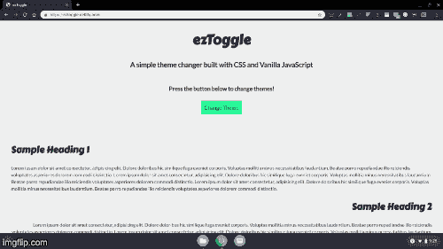

# 简单 JavaScript 主题切换

> 原文：<https://dev.to/theryanfurrer/simple-javascript-theme-toggle-46ea>

## 【ezToggle 简介

过去的这个周末，我创建了[ez toggle](https://eztoggle.netlify.com/)——一个使用 HTML、CSS 和基本 JavaScript 为你的网站添加主题切换的简单方法。

这是我的第一个 JavaScript 成功故事，但是，对于那些正在寻找一种简单的方法来为你的站点添加亮/暗主题切换的人来说，这可能就是它了！

最棒的是，它包含了最少的 JavaScript，所以任何人都可以使用它。

```
var body = document.querySelector('body');
var bodyClass = body.classList;
var themeToggle = document.querySelector('#theme-toggle');
var footer = document.querySelector('.footer');
var light = document.querySelector('.light');
var dark = document.querySelector('.dark');

themeToggle.addEventListener('click', () => {
    body.classList.toggle("light");
    body.classList.toggle("dark");
    themeToggle.classList.toggle("btn-light");
    themeToggle.classList.toggle("btn-dark");
    footer.classList.toggle("footer-light");
    footer.classList.toggle("footer-dark");
}); 
```

<svg width="20px" height="20px" viewBox="0 0 24 24" class="highlight-action crayons-icon highlight-action--fullscreen-on"><title>Enter fullscreen mode</title></svg> <svg width="20px" height="20px" viewBox="0 0 24 24" class="highlight-action crayons-icon highlight-action--fullscreen-off"><title>Exit fullscreen mode</title></svg>

现在，如果你的页脚没有改变颜色，你可以从中删除 3 行——真正的秘密在于使用 CSS 变量。让我们来看看如何在你的网站中实现这一点！

## 入门

首先，你需要 CSS & JS 文件，这些文件可以在 [GitHub Repo](https://github.com/ryanfurrer/ezToggle) 中找到。

我最近发现了 CSS 变量，并且绝对*喜欢*它们，并且知道它们会非常适合这个项目——以及每一个向前发展的项目。

如果您不知道，CSS 变量是一个 CSS 属性，您可以定义一次并在整个文档中调用。这对于颜色、过渡、边距/填充等等非常有用！无论你在 CSS 中重复什么，都可以变成一个变量。

这对于主题来说尤其重要，因为您可以在设置的变量中更改一次颜色，它们将在整个文档中更改。

```
/*--------------------Reusable Variables--------------------*/
:root {
    /*--------------------Light Theme Variables (Default)--------------------*/
    --light-theme-background-color: #eee;
    --light-theme-darker-background-color: #ccc;
    --light-theme-text-color: #333;
    --light-theme-link-color: #ff6347;
    --light-theme-link-hover-color: #fa2600;
} 
```

<svg width="20px" height="20px" viewBox="0 0 24 24" class="highlight-action crayons-icon highlight-action--fullscreen-on"><title>Enter fullscreen mode</title></svg> <svg width="20px" height="20px" viewBox="0 0 24 24" class="highlight-action crayons-icon highlight-action--fullscreen-off"><title>Exit fullscreen mode</title></svg>

## 关于 CSS 变量的更多内容

如果你看下面的代码，你会发现我只在 3 个属性中定义了灯光主题。

`.light {
background: var(--light-theme-background-color);
color: var(--light-theme-text-color);
transition: var(--theme-change-timing);
}`

我把`var(--light-theme-text-color);`放在文档的任何地方，它都会呈现出与我们在`--light-theme-text-color: #333;`中定义的`#fff;`相同的颜色。为什么我在`.light`和`.dark`两个类中定义了主题？因为我可以简单地将所述类添加到`body`标签中，然后 **BAM** 你就可以改变主题了。

## 设置

### HTML

首先，我们需要对我们的`body`标签:
应用一类光线

```
<body class="light"> 
```

<svg width="20px" height="20px" viewBox="0 0 24 24" class="highlight-action crayons-icon highlight-action--fullscreen-on"><title>Enter fullscreen mode</title></svg> <svg width="20px" height="20px" viewBox="0 0 24 24" class="highlight-action crayons-icon highlight-action--fullscreen-off"><title>Exit fullscreen mode</title></svg>

这将默认主题设置为我们的`.light`类中定义的任何内容。如果你想默认主题是暗的，就把它改成`<body class="dark">`。

### CSS

设置 CSS 涉及几个步骤。第一步是在`:root` psudo 类中定义 CSS 变量。这样做的原因是，您不必在页面的不同元素中重复变量。当您在`:root`中声明它们时，每个元素都可以访问它们。

```
/*--------------------Reusable Variables--------------------*/
:root {
    /*--------------------Light Theme Variables (Default)--------------------*/
    --light-theme-background-color: #eee;
    --light-theme-darker-background-color: #ccc;
    --light-theme-text-color: #333;
    --light-theme-link-color: #ff6347;
    --light-theme-link-hover-color: #fa2600;

    /*--------------------Dark Theme Variables--------------------*/ 
    --dark-theme-background-color: #333;
    --dark-theme-darker-background-color: #111;
    --dark-theme-text-color: #eee;
    --dark-theme-link-color: #00fa9a;
    --dark-theme-link-hover-color: #00955b; 

    /*--------------------Other Variables--------------------*/ 
    --link-hover-timing: all 0.25s ease-in-out;
    --theme-change-timing: all 1s ease-in-out;
} 
```

<svg width="20px" height="20px" viewBox="0 0 24 24" class="highlight-action crayons-icon highlight-action--fullscreen-on"><title>Enter fullscreen mode</title></svg> <svg width="20px" height="20px" viewBox="0 0 24 24" class="highlight-action crayons-icon highlight-action--fullscreen-off"><title>Exit fullscreen mode</title></svg>

接下来，我为每个主题创建了一些类。这包括车身的一般主题`.light`和`.dark`，以及`btn-light`和`.btn-dark`，以及`.footer-light`和`.footer-dark`。

```
/*--------------------Light Theme Styles (Default)--------------------*/
.light {
    background: var(--light-theme-background-color);
    color: var(--light-theme-text-color);
    transition: var(--theme-change-timing);
}

.light a {
    color: var(--light-theme-link-color);
}

.light a:hover {
    color: var(--light-theme-link-hover-color);
}

.footer-light {
    background: var(--light-theme-darker-background-color);
} 
```

<svg width="20px" height="20px" viewBox="0 0 24 24" class="highlight-action crayons-icon highlight-action--fullscreen-on"><title>Enter fullscreen mode</title></svg> <svg width="20px" height="20px" viewBox="0 0 24 24" class="highlight-action crayons-icon highlight-action--fullscreen-off"><title>Exit fullscreen mode</title></svg>

请记住，将您创建的任何类应用到 HTML 文件中的适当元素，以便它们都得到适当的主题。

### JavaScript

首先，我们需要定义变量。您应该在文件的顶部这样做，这样如果您在这个主题切换函数之外调用这些变量，它们对您是可用的。

```
var body = document.querySelector('body');
var bodyClass = body.classList;
var themeToggle = document.querySelector('#theme-toggle');
var footer = document.querySelector('.footer');
var light = document.querySelector('.light');
var dark = document.querySelector('.dark'); 
```

<svg width="20px" height="20px" viewBox="0 0 24 24" class="highlight-action crayons-icon highlight-action--fullscreen-on"><title>Enter fullscreen mode</title></svg> <svg width="20px" height="20px" viewBox="0 0 24 24" class="highlight-action crayons-icon highlight-action--fullscreen-off"><title>Exit fullscreen mode</title></svg>

如果你选择不设置页脚的样式，你可以直接删除它，但是，对于 ezToggle，我把页脚设置得比页面的其他部分更暗，所以我必须在这里定义它，这样它就可以在下面的函数中被调用:

```
themeToggle.addEventListener('click', () => {
    body.classList.toggle("light");
    body.classList.toggle("dark");
    themeToggle.classList.toggle("btn-light");
    themeToggle.classList.toggle("btn-dark");
    footer.classList.toggle("footer-light");
    footer.classList.toggle("footer-dark");
}); 
```

<svg width="20px" height="20px" viewBox="0 0 24 24" class="highlight-action crayons-icon highlight-action--fullscreen-on"><title>Enter fullscreen mode</title></svg> <svg width="20px" height="20px" viewBox="0 0 24 24" class="highlight-action crayons-icon highlight-action--fullscreen-off"><title>Exit fullscreen mode</title></svg>

该函数监听点击 themeToggle 按钮——网站上显示“更改主题”的按钮

[](https://res.cloudinary.com/practicaldev/image/fetch/s--KFtd3GPY--/c_limit%2Cf_auto%2Cfl_progressive%2Cq_auto%2Cw_880/https://thepracticaldev.s3.amazonaws.com/i/r9hpuhvjydatg7qx6yro.png)

当按钮被点击时，它首先识别它所附加的元素的类。然后它将指定的类切换到所述元素上。它在亮类和暗类之间切换。

[](https://imgflip.com/gif/37hyc5)

## 包装完毕

以下是将 ezToggle 应用到您的网站所需的步骤总结:

1.  在你的 HTML 中对“主体”应用亮类或暗类
2.  在:root 伪类中定义 CSS 变量。请确保更改、添加或删除主题所需的任何颜色。
3.  为你的主题和任何被主题化的项目创建、添加或删除任何必要的类。
*Be sure to add these classes to the appropriate elements in your HTML file*

5.  定义 JavaScript 变量
6.  享受你的主题切换！

我希望你喜欢并理解我的第一篇技术博客。我期待着在未来做更多这样的事情。

如果您在使用 ezToggle 时有任何疑问或问题，请不要犹豫，通过 DEV 或 [Twitter](https://twitter.com/ryanfurrer_dev) 联系我。

### 参考文献

*   [MDN - *元素*。类别列表](https://developer.mozilla.org/en-US/docs/Web/API/Element/classList)
*   [MDN -切换事件](https://developer.mozilla.org/en-US/docs/Web/API/HTMLDetailsElement/toggle_event)
*   [重复](https://eztoggle.netlify.com/)