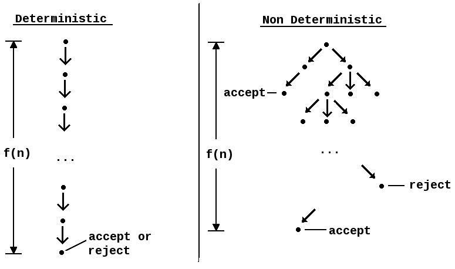

# prolog 中的类型和模式检查(第 2 部分):mavis

> 原文：<https://dev.to/terminusdb/type-and-mode-checking-in-prolog-part-2-mavis-427a>

正如我们在这个关于 prolog 类型的简短系列文章的第 1 部分中所讨论的，prolog 有一个相当优雅但安静的方法来应对某些错误。利用非决定论可以非常方便地搜索空间，但有时我们只是不知道我们写了什么，而不是沉默的失败，我们希望看到一个错误。

我们在第 1 部分中提出的解决这个问题的一种方法是使用 Hindley-Milner 类型(HM)检查来静态地发现我们在哪里有与我们期望的不同类型的变量。

在本文中，我们将采取不同的策略，在 mavis 中使用动态类型和模式检查。HM 很棒，但它并不是真正为 prolog 而写的，而是为函数式语言而写的，所以没有考虑任何模式。当修改已经存在的代码时，它也可能是有点限制性和沉重的。我们当然可以通过引入依赖类型来提高它，但是我们不打算在本系列中讨论这个问题(尽管这会有多酷？！).

有了 Mavis，我们可以逐步指定两种模式和相当复杂的类型，并在必要时添加它们。缺点是类型检查只发生在运行时，而不是静态检查。不幸的是，这意味着我们只能在测试或部署过程中捕获 bug，但至少我们能捕获它们！

我在产品代码中使用了这两种技术，发现它们都很有用，但是目前 Mavis 的功能更全面，也更灵活，所以我用它完成了大部分开发。

什么是模式？Prolog 是一种谓词语言，我们可以认为任何给定的变量替换在谓词处为真或假。但是很多时候，我们在 prolog 中编程时实际做的是获取我们所知道的一些绑定变量，以便找到其他也满足谓词的变量。我们通常指的是一个谓词，它只搜索给定的一组已经实例化的变量的绑定。

以下面的程序为例:

```
/**
 * zip(+A:list(any),+B:list(any),-C:list(any)) is det.
 * zip(-A:list(any),-B:list(any),+C:list(any)) is det.
 *
 * Zip two lists into a list of pairs (or unzip, in the other two
 * modes)
 */
zip([A|RestA],[B|RestB],[(A-B)|Zip]) :-
  zip(RestA,RestB,Zip).
zip([],[],[]). 
```

从查询以下目标的结果来看，这个声明的好处是显而易见的:

```
?- zip([1,2,3],a,C).
ERROR: Unhandled exception: The term a is not in the domain list(any) 
```

我们已经有效地阻止了 zip 在传递无意义的参数时无声地失败。但是所有这些复杂的模式描述意味着什么呢？

上述程序有两种模式行。我们用前面的“+”表示必需的参数，用“-”表示提供的参数。如果一个参数是必需的(“+”)，它必须在谓词被调用时被绑定。如果它被提供('-')，它可以被绑定也可以不被绑定，但是如果它是未绑定的，我们将保证提供一个绑定。

事实上，绑定时间状态比这要复杂一点。很可能有一个“框架”,它在一个定义的术语中有未绑定的变量。例如，您可以获得这样一个列表框架，其目标是:

```
?- length(L,3).
L = [_6186, _6192, _6198]. 
```

这是`+`吗？如果它与类型声明兼容，Mavis 将其解释为绑定的。要要求完全定义的输入，您可以使用`++`。在未来，我们希望在 Mercury 中给出的名称之后，包含更多用户自定义的特定名称。

[](https://res.cloudinary.com/practicaldev/image/fetch/s--KIRgkDgw--/c_limit%2Cf_auto%2Cfl_progressive%2Cq_auto%2Cw_880/http://blog.terminusdb.com/asseimg/inner-image-03.png)

该模式的最后一部分描述了谓词应该具有的确定性。上面的 Zip 被认为是“det ”,这意味着在所有描述的模式中，如果它的输入类型正确，它将精确地返回一个替换。不同的确定性限定符在 mavis 文档中列出如下:

*   失败:0 个解决方案
*   半定:0 或 1 解
*   det: 1 溶液
*   多:不止一个解决方案
*   nondet:包括 0 在内的任意数量的解

还有*允许的*模式，它们被上面给出的模式*所覆盖，使事情变得更加混乱。例如，我可以用下面两个不同的目标调用 zip，这两个目标都被认为是合法的，不会产生错误。* 

```
?- zip([1,2,3],[4,5,6],[1–4, 2–5, 3–6]).
true.
?- zip([1,2,3],[4,5,6],[1–4, 2–5, 3–7]).
false. 
```

在第一个案例中，我们提供了所有的参数。这比给定的任何模式都更能提供信息，因此导致决定论被降级。我们从“det”转变为“semidet”。这种降级由 mavis 自动为我们处理。我们还可以向后运行查询*，因为我们已经在上面提供了适当的模式行。这是我们想要指定多个模式行的主要原因。* 

 *```
?- zip(A,B,[1–4, 2–5, 3–6]).
A = [1, 2, 3],
B = [4, 5, 6]. 
```

Mavis 对于在测试过程中发现生产代码中的 bug 非常有用。我已经恢复了大量的混乱，特别是在我自己关于各种谓词的决定论的想法中的错误。这反过来会对性能产生巨大的影响，因为不受控制和非预期的非确定性会对速度产生惊人的巨大影响。

然而，有很多事情我不满意，我希望看到改进。我会把它们列在这里，作为 mavis 未来的愿望清单。

*   应该有更多静态完成的工作。许多模式和类型声明提供了大量信息来产生编译时错误。
*   通过更多的声明性工作，我们甚至可以自动对查询进行重新排序，为特定模式产生更理想的结果——在某些情况下，我们甚至可以改进终止行为！
*   这些类型至少应该给我们提供 Hindley-Milner 类型声明的灵活性，带有可以重复使用的自由类型变量。这将为‘zip’提供一个更加令人愉快和具体的类型。
*   在不久的将来的某一天，看到依赖型的人走上正轨会很好。对于动态的情况，就像我们目前对 mavis 所做的那样，用一种简单的方式实现起来应该不会太难！

你可以在这里查看最新的消息来源:[https://github.com/GavinMendelGleason/mavis](https://github.com/GavinMendelGleason/mavis)*