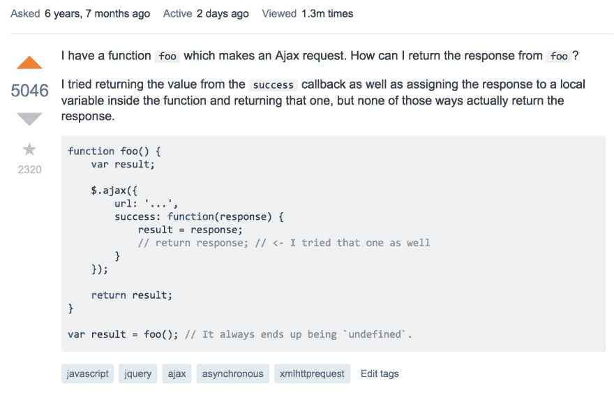
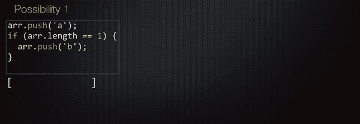
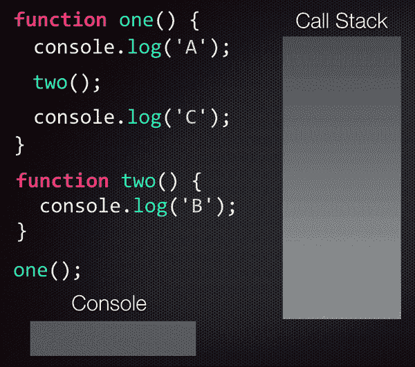

# 用 JavaScript 开发异步感知——第一部分:同步与异步、线程和事件循环

> 原文：<https://dev.to/nem035/developing-async-sense-in-javascript-part-i-sync-vs-async-threads-and-the-event-loop-280p>

本系列文章将深入探讨 JavaScript 中的主要异步模式，比较回调、承诺和异步/等待的一些权衡，并展示每个模式是如何建立在前一个模式之上的。

我们将尝试解开诸如事件循环、单线程、运行完成和非阻塞等概念。

我们将看到如何处理“同时”发生的事情，甚至可能消除时间的顾虑。

## 为什么？

用 JavaScript 管理异步代码并不直观。

[](https://res.cloudinary.com/practicaldev/image/fetch/s--pJIUb-4---/c_limit%2Cf_auto%2Cfl_progressive%2Cq_66%2Cw_880/https://miro.medium.com/max/784/1%2A2JDKf-wts0XO_wrQzs6HoQ.gif)

在 [StackOverflow](http://stackoverflow.com/) 上，以下[问题](https://stackoverflow.com/questions/14220321/how-do-i-return-the-response-from-an-asynchronous-call)是所有类别中[投票最多](https://stackoverflow.com/questions?page=3&sort=votes)和[观看最多](https://stackoverflow.com/search?page=3&tab=Relevance&q=views%3a250)问题之一:

[](https://res.cloudinary.com/practicaldev/image/fetch/s--O7gBbX8O--/c_limit%2Cf_auto%2Cfl_progressive%2Cq_auto%2Cw_880/https://miro.medium.com/max/1400/1%2AnXg6Q2J1w4qVInh5PRRRqA.png)

如果您不是这门语言的新手，很容易忘记这段代码到底有多混乱。需要一些时间来适应非线性异步流中的视觉跳跃，以自然地识别数据将在何时何地到达。

但是我们不要妄下结论。

在我们进入 JavaScript 中异步的杂草之前，让我们首先澄清当我们称一段代码为异步时，我们通常指的是什么。

## 什么是异步？

思考同步和异步之间区别的一种方式是:

*   同步意味着事情按时间顺序一个接一个地发生。
*   异步意味着事情按时间顺序彼此独立地发生。

当您同步执行一个任务时，您会等待它完成，然后再继续执行另一个任务。异步执行任务时，可以在前一个任务完成之前继续执行另一个任务。

*同步:做 3 个任务*

[](https://res.cloudinary.com/practicaldev/image/fetch/s--_ldS7SFJ--/c_limit%2Cf_auto%2Cfl_progressive%2Cq_66%2Cw_880/https://miro.medium.com/max/1200/1%2AfhERWyN9qV3p0bCQHUDscw.gif)

*异步:执行 3 项任务*

[](https://res.cloudinary.com/practicaldev/image/fetch/s--WfJ9wYQL--/c_limit%2Cf_auto%2Cfl_progressive%2Cq_66%2Cw_880/https://miro.medium.com/max/1200/1%2AK4LDgtNLROfU3crUVf4uYw.gif)

*注意:异步代码是[并发代码](https://en.wikipedia.org/wiki/Concurrent_computing)的子集。*

> 并发计算是一种计算形式，其中多个计算在重叠的时间段内同时执行，而不是按顺序执行(一个计算完成，下一个计算开始)。

## 螺纹

编程语言中最常见的允许我们执行并发代码的结构是一种叫做 [*线程*](https://en.wikipedia.org/wiki/Thread_(computing)) 的东西。

至少，线程可以被认为是一段代码的可中断执行。一个[可中断的](https://en.wikipedia.org/wiki/Interrupt)任务是一个可以分块执行的任务(暂停和继续)。

这些块可以一个接一个地运行，我们可以在每个块之间做其他任务，我们可以并行运行这些块，等等。

并行只是并发执行的一种形式(并且依赖于硬件！我们实现真正并行的唯一方法是在[多核](https://en.wikipedia.org/wiki/Multi-core_processor)机器上运行我们的代码。

这里有一个简单的例子来说明并发执行不一定是并行的。

假设我们必须完成以下两项任务:

1.  打电话给 ATT 取消我们的订阅
2.  写博客

如果我们要同时完成这些任务，事情会是这样的:

*   给 ATT 打电话，让他等一下
*   开始撰写我们的博客文章
*   一旦接线员回答，我们就停止写作并取消我们的订阅
*   一旦我们挂断电话，我们就完成了我们的博客文章

这两项任务同时进行，相互交错，但实际上并不是并行完成的。我们总是一次做一件事。

*注:这通常被称为[时间分片](https://en.wikipedia.org/wiki/Time_slice)。在单核机器上，操作系统将线程的执行分成小块，这些小块仍然串行运行，但交换的速度足以欺骗我们的感官，使其看起来是同时进行的。*

在一个真正并行的场景中，我们让我们的室友打电话给 ATT，同时我们写博客，两项任务将完全独立完成。

*注意:如果你对学习并行和并发感兴趣，我建议从这个由[罗布·派克](https://en.wikipedia.org/wiki/Rob_Pike)撰写的[精彩演讲](https://vimeo.com/49718712)开始。*

### 并发增加复杂性

线程允许我们同时多次执行任何一段代码，包括同一个代码。这导致了代码复杂性的显著增加，尤其是当并发执行与共享资源交互时。

当多个线程对一个共享资源进行操作时，它们会在谁先获得共享数据的竞赛中结束。这个问题通常被称为[竞争条件](https://en.wikipedia.org/wiki/Race_condition)。如果管理不当，很容易导致[数据损坏](https://en.wikipedia.org/wiki/Data_corruption)。

[](https://res.cloudinary.com/practicaldev/image/fetch/s--2u5UYgxO--/c_limit%2Cf_auto%2Cfl_progressive%2Cq_66%2Cw_880/https://miro.medium.com/max/1200/1%2AmiIHhTpq-up0zUguVY3KPw.gif)

[](https://res.cloudinary.com/practicaldev/image/fetch/s--FYZJHFb4--/c_limit%2Cf_auto%2Cfl_progressive%2Cq_66%2Cw_880/https://miro.medium.com/max/1200/1%2AkDefIeP6qLsxG1_Xc6S80g.gif)

为了进一步演示这种复杂性，让我们假设我们有以下代码片段，它在两个线程中大约同时执行，其中两个线程都在同一数组上操作:

```
arr.push('a');
if (arr.length == 1) {
  arr.push('b');
} 
```

这段代码可以有多少种结果？这很容易分辨吗？当这段代码由两个线程执行时，arr 可以包含什么？

让我想想。我们有多少独特的陈述？

注意:在语句 2 中，为了简洁起见，我们将 arr 的长度检查、与 1 的比较和对布尔值的求值合并到一个语句中。原子操作的实际划分是特定于语言的。

这三个有序语句可以由两个线程中的任何一个执行，有重叠。

让我们来看看几种可能性:

[](https://res.cloudinary.com/practicaldev/image/fetch/s--M-dMdW2X--/c_limit%2Cf_auto%2Cfl_progressive%2Cq_66%2Cw_880/https://cdn-images-1.medium.com/max/1440/1%2A2gt7m4tL_UPo4vrwraMjcA.gif)

即使没有计算所有的可能性，我们也可以立即认识到，这个代码的输出是很难预测的。如果没有一些安全机制，多线程代码实际上是不可能驯服的。

另一个常见的问题是当两个或更多的线程为了继续执行而永久地等待对方时。这导致了执行中的一个“锁”，称为[死锁](https://medium.com/r/?url=https%3A%2F%2Fen.wikipedia.org%2Fwiki%2FDeadlock)。

一个常见的解决竞态条件的方法是使用[互斥](https://medium.com/r/?url=https%3A%2F%2Fen.wikipedia.org%2Fwiki%2FMutual_exclusion)原则，包括像[锁(互斥)](https://medium.com/r/?url=https%3A%2F%2Fen.wikipedia.org%2Fwiki%2FLock_%28computer_science%29)、[信号量](https://medium.com/r/?url=https%3A%2F%2Fen.wikipedia.org%2Fwiki%2FSemaphore_%28programming%29)或[监视器](https://medium.com/r/?url=https%3A%2F%2Fen.wikipedia.org%2Fwiki%2FMonitor_%28synchronization%29)这样的数据结构来保护共享资源([临界区](https://medium.com/r/?url=https%3A%2F%2Fen.wikipedia.org%2Fwiki%2FCritical_section))。这些数据结构基本上都是一种锁定机制(有时只是一个变量)，用于同步多个线程，以特定的顺序与数据进行交互。

如果我们采用上面的代码片段，那么我们可以使用一个假设的锁来确保在向 arr 添加数据时线程不会重叠:

```
// lock execution to the current thread. 
// Any new thread reaching this line will be queued up 
// until the locking thread releases the lock
lock(); 

arr.push('a');
if (arr.length == 1) {
  arr.push('b');
}

unlock(); // free execution for the next thread

// only possible output is ['a', 'b', 'a'] 
```

但是 JavaScript 是如何处理并发的呢？语言中没有锁。

一方面，这很好，因为我们不必担心死锁之类的问题和互斥体之类的概念，它们可能会使代码[难以推理出](https://ternarysearch.blogspot.com/2013/07/multithreading-is-hard.html)。尽管如此，当我们的 JavaScript 应用程序运行时会发生很多事情，如果所有事情都同步运行，速度会非常慢。

JavaScript 中存在线程吗？

## JavaScript 和线程

“JavaScript 是单线程的”这一说法在 JS 生态系统中被广泛分享。

这实际上意味着什么？

这意味着 **JavaScript 事件循环由单个线程**处理。

*注意:工人的增加允许我们在 [web](https://developer.mozilla.org/en-US/docs/Web/API/Web_Workers_API/Using_web_workers) 和 [NodeJS](https://nodejs.org/api/worker_threads.html) 上实现 JS 中的语言级多线程，但他们是以一种特殊的方式实现的，其中[每个工人都有自己的事件循环](https://www.w3.org/TR/workers/#the-event-loop)。*

### 什么是事件循环？

[事件循环](https://developer.mozilla.org/en-US/docs/Web/JavaScript/EventLoop#Event_loop)是 JavaScript 运行时的一部分，它一次执行一个任务队列中的任务。一个任务队列可以被认为是一个数组，我们以一种[先进先出](https://en.wikipedia.org/wiki/FIFO_(computing_and_electronics))的方式从一端推入，从另一端拉出。任务的一次执行称为一个节拍。

下面是它在伪代码中的样子:

```
function eventLoop() {
  // perform loop ticks, "forever"
  while (true) {
    var nextTask = taskQueue.getNextTask();
    nextTask();
  }
} 
```

注意:让事情变得更复杂的是，事件循环实际上可以有多个任务队列。

```
function eventLoop() {
  // perform loop ticks, "forever"
  while (true) {
    var tastQueue = selectTaskQueue();
    var nextTask = taskQueue.getNextTask();
    nextTask();
  }
} 
```

对于本文来说，知道任务可以从多个地方以不可预知的顺序被放入事件循环就足够了，这种顺序几乎不受程序员的控制。

任务实际上可以是 JavaScript 应用程序中发生的任何事情。一个典型的例子是给 [`setTimeout`](https://developer.mozilla.org/en-US/docs/Web/API/WindowOrWorkerGlobalScope/setTimeout) 的回调，它应该在 N 毫秒内执行。在浏览器中，任务可以是一个重画作业，一个来自网络或用户输入的 [ajax](https://developer.mozilla.org/en-US/docs/Web/Guide/AJAX) 响应回调。在 NodeJS 中，它可以是网络请求回调或 I/O 操作。

*注意:任务也可以调度其他任务。*

JavaScript 中及其周围的所有这些不同的进程一起工作，在事件循环中调度任务，然后事件循环按顺序执行它们。

*注意:任务的实际顺序取决于任务的创建时间、任务类型([微 vs 宏](https://jakearchibald.com/2015/tasks-microtasks-queues-and-schedules/))、创建者以及任务的重要性。*

我们可以把事件循环想象成游乐园里的单座过山车，里面有许多排队等候乘坐的人，一个接一个。你什么时候去取决于你什么时候排队，你有多重要，或者一个朋友是否给你留了位置，但是一次只有一个人可以参加。

实际上，许多这些操作都是在单独的线程中执行的。在[浏览器](https://www.chromium.org/developers/the-rendering-critical-path#TOC-Browser-Thread-Architecture)中，诸如 [DOM](https://dom.spec.whatwg.org/) 解析、 [CSS 布局](https://www.w3.org/Style/CSS/specs.en.html)和样式化或者网络等系统通常运行在单独的线程中。NodeJS 自动将许多 I/O(例如文件系统读写)和 CPU 密集型操作(例如加密操作)卸载到[工作线程池](https://nodejs.org/en/docs/guides/dont-block-the-event-loop/#what-code-runs-on-the-worker-pool)中。所有这些可能在不同线程中工作的操作仍然在同一个单线程事件循环中调度任务。

解析和执行我们代码的 JS 引擎(例如 [V8](https://developers.google.com/v8/) )运行在主线程上，在任务队列中具有最高的优先级。这意味着 JavaScript 代码的执行将优先于处理网络响应或浏览器中 DOM 更新或 NodeJS 中 I/O 操作的任务。

这种行为的另一面是，JS 代码有一个特殊的属性，叫做 [*运行完成*](https://en.wikipedia.org/wiki/Run_to_completion_scheduling) 。JavaScript 中的函数代码是原子的。一个函数一旦开始就会结束。

*注意:生成器和 async/await 打破了这种语义，因为它们允许函数部分运行。*

这也意味着我们有一个[单一调用栈](https://developer.mozilla.org/en-US/docs/Glossary/Call_stack)。一个 [*调用栈*](https://en.wikipedia.org/wiki/Call_stack) 是一个[数据结构](https://en.wikipedia.org/wiki/Stack_(abstract_data_type))，它保持对[点](https://en.wikipedia.org/wiki/Pointer_(computer_programming))的跟踪，当每个活动函数完成执行时(按 [LIFO](https://www.geeksforgeeks.org/lifo-last-in-first-out-approach-in-programming/) 顺序)应将控制返回到该点。通过使用单个调用堆栈，我们只允许在代码中使用单个流程。

下面是一个调用栈如何工作的例子。注意我们如何将函数`one`保留在调用栈中，直到其中的所有代码(包括对`two`的嵌套函数调用)执行完毕。

[](https://res.cloudinary.com/practicaldev/image/fetch/s--fYIRi8xd--/c_limit%2Cf_auto%2Cfl_progressive%2Cq_66%2Cw_880/https://miro.medium.com/max/1200/1%2AB2v5_pqD-zbzJNOhAc-A2A.gif)

除了拥有单一的调用堆栈之外，我们还受限于可以向其中添加多少信息。

```
function recurseForever() {
 recurseForever();
}
recurseForever();

// outputs
// Uncaught RangeError: Maximum call stack size exceeded 
```

试图超过调用堆栈的限制称为堆栈溢出。

提示:我们可以做一点尝试/捕捉技巧来找出调用堆栈的确切大小。

```
// Credit: http://2ality.com/2014/04/call-stack-size.html
function computeMaxCallStackSize() {
  try {
    return 1 + computeMaxCallStackSize();
  } catch (e) {
    return 1;
  }
} 
```

从另一个角度来看，当同步代码运行时，没有异步代码可以运行。一旦调用堆栈为空，异步代码就可以运行。

事实上，异步代码本质上只是一段被安排在稍后运行的同步代码。

这种任务执行的单线程性就是为什么，如果浏览器中的渲染引擎想要重画，但 JS 仍在运行，我们会得到不稳定。如果一个功能需要很长时间才能完成，网络应用程序将无法处理用户交互(如点击或[滚动](https://www.html5rocks.com/en/tutorials/speed/scrolling/))。

一个比较著名的例子是 DOM [元素](https://developer.mozilla.org/en-US/docs/Web/API/Element)上的 [`innerHTML`](https://developer.mozilla.org/en-US/docs/Web/API/Element/innerHTML) 属性。解析这个属性设置的字符串实际上是一个同步操作，在主线程上运行，在它完成之前阻止任何交互。

当循环运行时，尝试点击笔中的任意位置。

*注意:当您运行手写笔时，您的用户界面将在短时间内被阻止。*

### 这有什么关系？

**好 UX ===无阻塞**

想到的一个类比就是客服行业。当我们打电话给一家公司与客户服务部门交谈时，我们通常会被放在等待队列中，并被阻止，直到有代表可以自由联系。被等待真糟糕。效率很低。一个更好的客户服务系统应该是我们在最方便的时候安排回电。

也许 JavaScript 为我们提供了一种以非阻塞方式处理异步代码的结构？

接下来:开发异步感知第二部分——回调