# 想学棱角分明？这是我们由丹·瓦林教授的 33 节免费课程！

> 原文：<https://dev.to/scrimba/want-to-learn-angular-here-s-our-free-33-part-course-by-dan-wahlin-5880>

[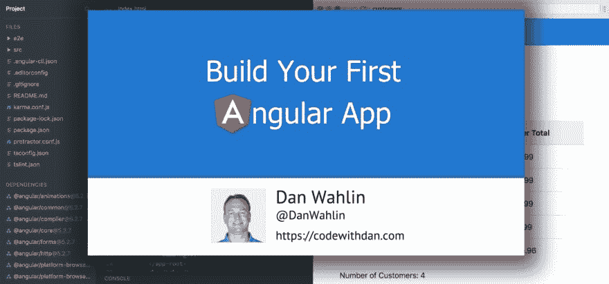 ](https://scrimba.com/g/gyourfirstangularapp?utm_source=dev.to&utm_medium=referral&utm_campaign=gyourfirstangularapp_launch_article) *点击图片进入课程。*

根据 [Stack Overflow 开发者调查 2018](https://insights.stackoverflow.com/survey/2018/#most-popular-technologies) **，** Angular 是最受专业开发者欢迎的框架/库之一。因此，学习它会大大增加你获得网络开发工作的机会。

> 这就是为什么我们与最著名的框架专家之一合作，并在 Scrimba 创建了一个免费的角度课程。

讲师 [Dan Wahlin](https://twitter.com/DanWahlin) 是一名谷歌开发专家，他为业内一些最大的公司提供培训、架构和开发服务，并在 Udemy 和 Pluralsight 上创建了一些最受欢迎的培训课程。他也经常在世界各地的开发者大会上发言。

[在本课程](https://scrimba.com/g/gyourfirstangularapp?utm_source=dev.to&utm_medium=referral&utm_campaign=gyourfirstangularapp_launch_article)中，Dan 将指导您使用 TypeScript 创建您的第一个 Angular 应用程序。完成本课程后，你将增加宝贵的技能。

现在让我们来看看课程是如何组织的！

### 第一部分:课程概述

[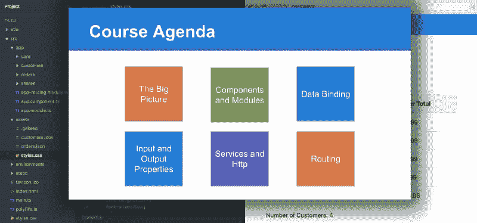](https://res.cloudinary.com/practicaldev/image/fetch/s--pB40nb8e--/c_limit%2Cf_auto%2Cfl_progressive%2Cq_auto%2Cw_880/https://cdn-images-1.medium.com/max/800/1%2AmHUNNtNB1aF6s1juYuJ7Jw.png)

在介绍视频中，Dan 概述了课程、Angular 的主要方面以及课程的布局。他还告诉你一点他的背景，以便你在跳入你的新应用程序的代码之前熟悉他。

### 第二部分:应用概述

在这一部分中，Dan 向我们展示了我们将要构建的应用程序。它旨在让我们专注于 Angular 的关键构建模块。通过创建一个显示客户数据和订单的应用程序，我们将专注于 Angular 的关键方面，如组件、模块、服务和路由。此外，在课程中，我们将了解每个应用程序都具有的强大功能，如排序和过滤。

[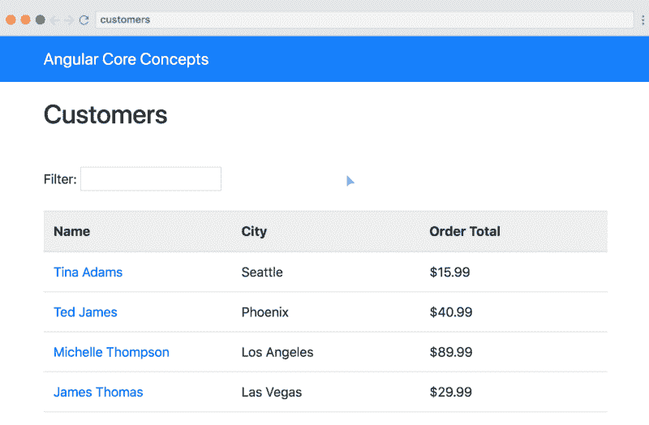](https://res.cloudinary.com/practicaldev/image/fetch/s--9j1OxjMX--/c_limit%2Cf_auto%2Cfl_progressive%2Cq_auto%2Cw_880/https://cdn-images-1.medium.com/max/800/1%2A_bYYJCud9vhxaSSvKmqH6Q.png)

### 第三部分:角度 CLI

在这一部分，我们学习使用 Angular CLI(命令行界面)工具的基本知识，并浏览基本命令:

```
ng --version  
ng --help  
ng new my-app-name  
ng generate [component | directive | pipe | service | class | interface | enum | guard]  
ng build   
ng serve  
ng lint   
ng tests 
```

例如，`ng --new my-app-name`将为我们创建一个新的空白 Angular 应用程序，我们可以使用`ng -generate`来创建我们的应用程序的一部分。

`ng build`将为我们构建一切，`ng serve -o`甚至将启动一个开发服务器，并打开一个浏览器窗口供我们查看我们的应用程序。

### 第四部分:项目文件概述

在本课程的视频中，Dan 简要介绍了用于生成空白 Angular 应用程序的 CLI 命令，并简要介绍了应用程序文件夹中的配置文件，如`tslint`、`tsconfig`和`protractor`。

### 第五部分:大局

在这里，我们学到了一个有用的抽象概念，即组件类似于乐高积木——我们构建组件，然后用它们粘在一起制作一个应用程序。我们还快速复习了 JavaScript 语言家族，并了解了类型脚本的适用范围。

[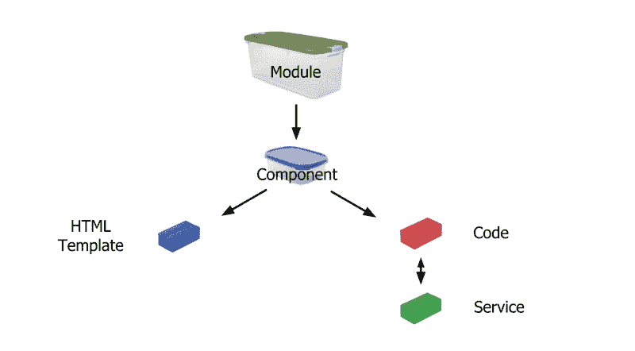](https://res.cloudinary.com/practicaldev/image/fetch/s--nJDs3Hp7--/c_limit%2Cf_auto%2Cfl_progressive%2Cq_auto%2Cw_880/https://cdn-images-1.medium.com/max/800/1%2As2TcwSmQM7_BAA25NC3lVQ.png)

Dan 为我们提供了一个很好的心智模型，让我们在使用 Angular 时思考我们的代码，这样我们就可以想象它适合放在哪里。

### 第 6 部分:组件&模块——概述

如果不进行抽象，角度代码的图表可能如下所示。

[](https://res.cloudinary.com/practicaldev/image/fetch/s--9SzC2ziR--/c_limit%2Cf_auto%2Cfl_progressive%2Cq_auto%2Cw_880/https://cdn-images-1.medium.com/max/800/1%2AOTT4yeJg6630S2I43WRGxg.png)

组件由代码和 HTML 模板组成，它可以有一个选择器，所以我们可以在我们的 HTML 中调用它。

```
<appcomponent></appcomponent> 
```

每个组件包括:

[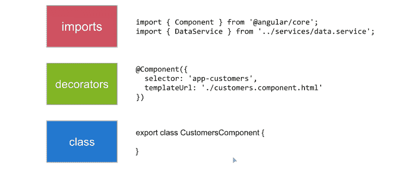](https://res.cloudinary.com/practicaldev/image/fetch/s--eGKkfKnx--/c_limit%2Cf_auto%2Cfl_progressive%2Cq_auto%2Cw_880/https://cdn-images-1.medium.com/max/800/1%2A-12cVJ5V8OG1SBWI4hraSg.png)

然后，Dan 解释了每个部分是什么，以及它们如何适应组件开发的角度。关于角度的一个伟大的事情是它是非常可预测的。一旦你学会了如何创建你的第一个组件，你就可以创建更多的组件了。

### 第 7 部分:组件&模块——App 组件

在课程的这一部分，我们来看一个`HelloWorld`组件。

[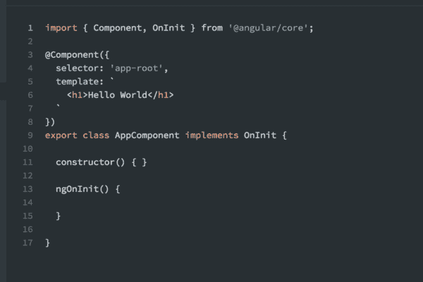](https://res.cloudinary.com/practicaldev/image/fetch/s--Cjcmsbhi--/c_limit%2Cf_auto%2Cfl_progressive%2Cq_auto%2Cw_880/https://cdn-images-1.medium.com/max/600/1%2AUYiWpdm6Aqf4PmcbHdSXGg.png)
[T6】](https://res.cloudinary.com/practicaldev/image/fetch/s--SPF8vqkf--/c_limit%2Cf_auto%2Cfl_progressive%2Cq_auto%2Cw_880/https://cdn-images-1.medium.com/max/600/1%2AwproObAyLBo-EOBM-r3P8A.png)

Dan 为我们分解了组件的每个方面，并解释了它是如何使用的，Angular 是如何处理我们的组件的，它是如何添加到`app.module`中的，以及最终它是如何呈现在我们的屏幕上的。

我们了解到`selector: 'app-root'`允许我们稍后使用`<app-root></app-root>`从 HTML 中调用组件

我们也先睹为快数据绑定，我们将在后面的章节中了解更多。

### 第 8 部分:组件&模块——App 模块

在这个截屏中，我们花了更多的时间来了解我们在之前的演员阵容中提到的`app.module`的内部运作，并了解`NgModule`和`BrowserModule`。

### 第 9 部分:组件&模块—添加客户组件

在本文中，Dan 向我们提供了一些使用 CLI 创建组件的技巧，然后展示了如何手动创建组件。我们学习如何构造一个组件，进一步扩展我们从第 6 部分学到的知识。

[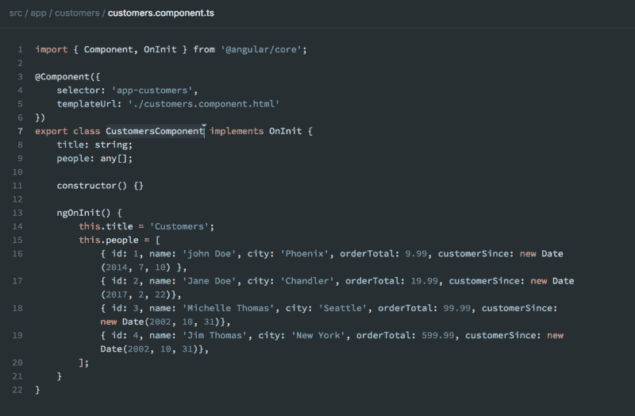](https://res.cloudinary.com/practicaldev/image/fetch/s--vXgMU63O--/c_limit%2Cf_auto%2Cfl_progressive%2Cq_auto%2Cw_880/https://cdn-images-1.medium.com/max/800/1%2AC2YJ7m1pbHjXSHC0Fv0baQ.png)

现在，我们引入一些数据来模拟我们的 API，并了解模块如何帮助我们保持代码的组织性和易于重用。

### 第 10 部分:组件&模块—添加客户列表组件

在这一部分中，我们创建了一个`customers-list.component`,这是一个 HTML 表，用于显示我们的客户列表。我们快速在`customers.module`中注册，并使用`<app-customers-list></app-customers-list>`选择器显示我们的空桌子。

[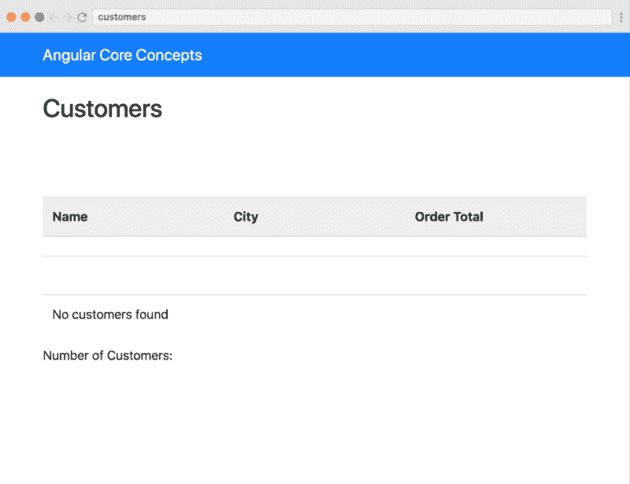](https://res.cloudinary.com/practicaldev/image/fetch/s--bahIntuN--/c_limit%2Cf_auto%2Cfl_progressive%2Cq_auto%2Cw_880/https://cdn-images-1.medium.com/max/800/1%2ACeqVsl_JlKtnPXzgSVismQ.png)

下一步是用一些数据填充这个表。

### 第 11 部分:组件&模块—添加一个过滤文本框组件

在我们向表中添加一些数据之前，Dan 向我们展示了如何向表中添加一个`filter-textbox.component`,我们强调了创建一个组件的角度方法，在一个模块中注册它，并通过选择器在我们的 HTML 中使用它。

[](https://res.cloudinary.com/practicaldev/image/fetch/s--rti7DS_U--/c_limit%2Cf_auto%2Cfl_progressive%2Cq_auto%2Cw_880/https://cdn-images-1.medium.com/max/800/1%2Ab9SgU3SuhQINc87r56DDwg.png)

### 第 12 部分:组件&模块——添加共享模块和接口

在这一节中，Dan 谈到了如何使用`shared.module`——一个模块，我们将想要在整个应用程序中共享的组件或其他功能放在这里，而不仅仅是在`customers`中。

我们还快速复习了 TypeScript 接口，以及如何在 Angular 应用程序中使用它们来提供更好的代码帮助和提高生产率。

```
export interface ICustomer {  
    id: number;  
    name: string;  
    city: string;  
    orderTotal?: number;  
    customerSince: any;  
} 
```

### 第十三部分:数据绑定——数据绑定概述

在这一章中，我们将学习数据绑定，学习一些技巧，并看看如何在我们的应用程序中添加数据绑定。

我们通常在模板中绑定数据。当一个组件获取我们的数据并将其绑定到一个模板中时，数据绑定就开始发挥作用了。我们可以使用`Property Binding`将数据放入模板，使用`Event Binding`处理用户事件并从模板中获取数据。Angular 为在模板中添加数据绑定提供了一种健壮而简洁的方式，这种方式既快捷又容易记忆。

Dan 为我们提供了一张方便的幻灯片来记忆所需的语法…

[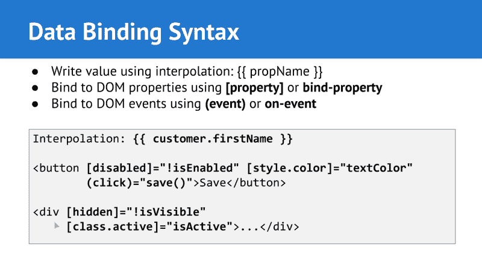](https://res.cloudinary.com/practicaldev/image/fetch/s--njFKHerp--/c_limit%2Cf_auto%2Cfl_progressive%2Cq_auto%2Cw_880/https://cdn-images-1.medium.com/max/800/1%2AFt7Mj_TaGsUJ4GRdmJNGPQ.png)

…还有一些关于角度的指令，例如，`ngFor`，用于遍历集合中的项目并从项目中获取一些属性，还有`ngIf`，用于在 DOM 中添加和移除 HTML 元素。

### 第 14 部分:数据绑定—数据绑定入门

在这个演员阵容中，我们使用前一章的知识，与`Property Binding`和`Event Binding`一起玩，以更好地理解它们在 Angular 中是如何工作的。

Dan 展示了我们如何使用`[hidden]`属性动态显示一个`h1`元素:

```
<h1 [hidden]="!isVisible">{{ title }}</h1> 
```

并绑定 DOM 事件如点击:

```
<button (click)="changeVisibility()">Show/Hide</button> 
```

### 第 15 部分:数据绑定——指令和插值

这里我们来看看插值。基本原理是，我们需要从每个客户那里获取数据，以便在第 10 部分的表中生成一个表行。

这是事情开始整合的部分:我们使用指令`ngFor`遍历`filteredCustomers`中的每个客户，并将来自客户的数据插入到一个表行中。我们学习了一些使用`ngIf`有条件地呈现数据的技巧。

[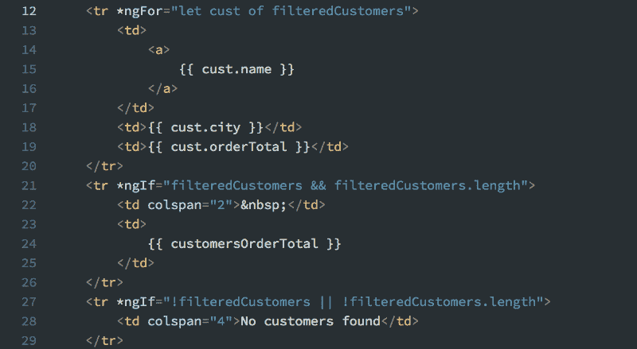](https://res.cloudinary.com/practicaldev/image/fetch/s--Bnxa4HxH--/c_limit%2Cf_auto%2Cfl_progressive%2Cq_auto%2Cw_880/https://cdn-images-1.medium.com/max/800/1%2AxMU7cyyy5ooxLJPBct0PEw.png)

最后我们得到了一张漂亮的桌子！

[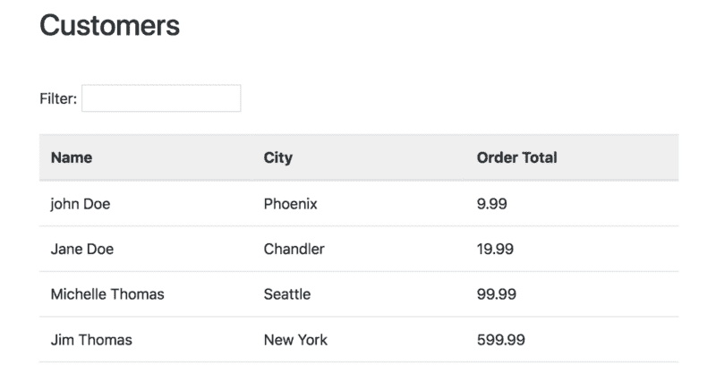](https://res.cloudinary.com/practicaldev/image/fetch/s--y4mXNR1J--/c_limit%2Cf_auto%2Cfl_progressive%2Cq_auto%2Cw_880/https://cdn-images-1.medium.com/max/800/1%2ABO_isrPNvKI9u80bXLOnyA.png)

### 第十六部分:数据绑定——事件绑定

当我们需要处理一个事件时，比如鼠标移动或点击，这是至关重要的。在这个截屏中，Dan 指导我们添加功能来对表中的数据进行排序。我们将从本章开始，并在我们课程的服务部分结束。

我们在`customer-list.component` :
中创建了一个占位符事件处理程序

```
sort(prop: string) {  
     // A sorter service will handle the sorting 
} 
```

在`customers-list.component.html` :
中添加绑定

```
<tr>  
    <th (click)="sort('name')">Name</th>  
    <th (click)="sort('city')">City</th>  
    <th (click)="sort('orderTotal')">Order Total</th>  
</tr> 
```

### 第 17 部分:数据绑定—输入属性

我们在`customers.component`中的`people`数组中有一些数据，我们需要将它传递到`customers-list.component`中的`filteredCustomers`数组中，有效地将数据从父组件传递到子组件。

为此，我们将使用 Angular 的`Input`属性，它依赖于一个名为 Input():
的装饰器

```
@Input() get customers(): ICustomer[] {  
    return this._customers  
}

set customers(value: ICustomer[]) {  
     if (value) {  
     this.filteredCustomers = this._customers = value;  
     this.calculateOrders();  
     }  
} 
```

并在我们的父组件模板中绑定到它，以将数据从父组件传递到子组件(本例中为 app-customers-list):

```
<app-customers-list [customers]="people"></app-customers-list> 
```

### 第 18 部分:数据绑定——使用管道

哇！到目前为止，我们做得相当好！

[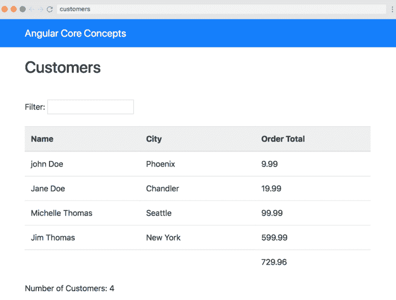](https://res.cloudinary.com/practicaldev/image/fetch/s--wxfk_xg7--/c_limit%2Cf_auto%2Cfl_progressive%2Cq_auto%2Cw_880/https://cdn-images-1.medium.com/max/800/1%2Av51xQi5Ard63tF0-0dd-2Q.png)

有几件事可能看起来有点奇怪——“John”是小写的，我们没有“$”符号来显示我们的订单所用的货币。

这确实是我们获取数据的方式，所以我们可以直接去更新它，或者我们可以使用一个名为 Pipes 的内置角度功能来为我们更新它！

一些最简单的管道看起来像这样:

```
{{ cust.name | uppercase }} // renders JOHN 
{{ cust.name | titlecase }} // renders John 
```

但是有时你可能想拥有自己的定制管道，Dan 向我们展示了如何构建一个定制`capitalize`管道(注意 Angular 包括一个名为`titlecase`的管道——但是我们在这里学习！)以及如何在我们的应用程序中使用它。

### 第 19 部分:数据绑定—添加过滤

在这个演员表中，Dan 带领我们从第 11 部分开始向我们的`filter-textbox.component`添加功能

我们学习了更多关于 Angular `Output`和`EventEmitter`属性的知识，创建了过滤器事件处理程序，并将其绑定到过滤器文本框:

```
<filter-textbox (changed)="filter($event)"></filter-textbox> 
```

好了，我们现在可以筛选客户的姓名了！

[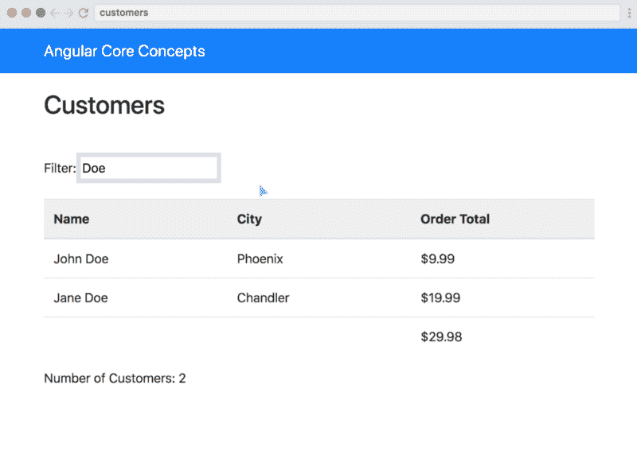](https://res.cloudinary.com/practicaldev/image/fetch/s--sPb4XtrL--/c_limit%2Cf_auto%2Cfl_progressive%2Cq_auto%2Cw_880/https://cdn-images-1.medium.com/max/800/1%2A8oM5-CM9n7Ic46M4l4IS8w.png)

### 第 20 部分:服务和 Http —服务概述

在这一章中，我们来看看角度服务。Angular 的一个优点是，它是一个完整的框架，为通过服务管理状态和对象提供内置支持。我们在前面的图表中看到了服务。由于我们不希望组件知道如何做太多事情，我们将依赖服务来与服务器通信、执行客户端验证或计算等。

[](https://res.cloudinary.com/practicaldev/image/fetch/s--9SzC2ziR--/c_limit%2Cf_auto%2Cfl_progressive%2Cq_auto%2Cw_880/https://cdn-images-1.medium.com/max/800/1%2AOTT4yeJg6630S2I43WRGxg.png)

组件应该专注于呈现数据和处理用户事件。当需要执行额外的功能时，它们应该委托给服务，以提供更易维护的应用程序和更好的代码重用。

这正是服务所做的——应用程序的一些可重用功能，这不应该是任何组件所关心的。

幸运的是，丹为我们准备了一张方便的幻灯片。

[](https://res.cloudinary.com/practicaldev/image/fetch/s--xndG-AEa--/c_limit%2Cf_auto%2Cfl_progressive%2Cq_auto%2Cw_880/https://cdn-images-1.medium.com/max/800/1%2ADzy9aUGQUu_RXuQ3Wx6RDg.png)

### 第 21 部分:服务和 Http——创建和提供服务

从前面的一章中，我们已经看到了`Injectible`的引入，它是一个装饰器，允许所谓的依赖注入或简称 Angular 内置的另一个强大特性)。

我们将使用 DI 来访问一个`HttpClient`服务，我们将使用它与 RESTful 服务进行通信。我们将把 HttpClient 添加到我们的`data.service`和`@Injectible()`装饰器的构造函数中，这将使 DI 成为可能。

[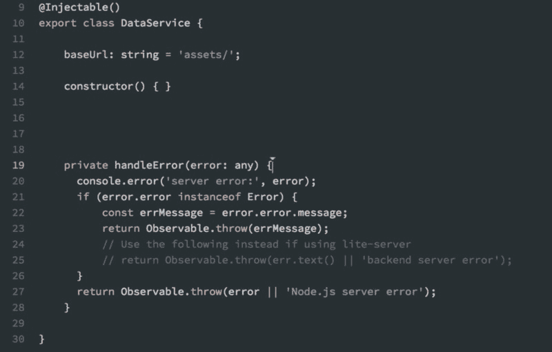](https://res.cloudinary.com/practicaldev/image/fetch/s--iKJCE7c4--/c_limit%2Cf_auto%2Cfl_progressive%2Cq_auto%2Cw_880/https://cdn-images-1.medium.com/max/800/1%2A6sbs_J-0b6_SH1XqpB7k-g.png)

### 第 22 部分:服务和 Http——用 HttpClient 调用服务器

在本文中，Dan 介绍了来自`RxJS`的 Observables——JavaScript 的反应式扩展，它不是 Angular 的一部分，但默认情况下包含在所有 Angular 项目中。

我们将使用可观测量来处理异步代码。简而言之，它允许我们开始一个操作，然后订阅返回的数据。一旦数据从服务器返回，订阅就结束了，我们可以取消订阅。

Dan 讨论了调用服务器的必要代码，然后使用 RxJS 管道和操作符订阅响应。

这里有一个我们如何获得订单的例子:

[](https://res.cloudinary.com/practicaldev/image/fetch/s--QwnUpRRw--/c_limit%2Cf_auto%2Cfl_progressive%2Cq_auto%2Cw_880/https://cdn-images-1.medium.com/max/800/1%2ALZp4nkmFIm4MGJAhQFU4sA.png)

### 第 23 部分:服务和 Http——将服务注入组件

现在我们有了获取数据的方法，我们需要将服务注入到我们的组件中。我们现在可以将`customers.component`中的`this.people`从硬编码改为调用服务并以这种方式获取数据。

我们需要把我们的`data.service`带到`app.module`，然后在`customers.component`我们可以:

```
import { DataService } from '../core/data.service'; 
```

现在我们可以将我们的`DataService`直接注入到组件的构造函数中:

```
constructor(private dataService: DataService) {} 
```

### 第 24 部分:服务和 Http——订阅一个可观察的

现在我们可以使用我们注入的`dataService`，调用`getCustomers()`并订阅我们的`Observable<ICustomer[]>`来获取数据。

这很简单:

```
ngOnInit() {  
    this.title = 'Customers';  
    this.dataService.getCustomers()  
        .subscribe((customers: ICustomer[]) =>  
        this.people = customers); 
```

现在我们还有最后一个服务要看— `SorterService`

### 第 25 部分:服务和 Http——使用排序服务

目前，如果我们点击我们的列标题，什么也不会发生。

Dan 很方便地为我们提供了一个预先编写好的服务，我们可以使用它，所以在这一章中，我们将练习将服务引入到我们的组件中，在这里是`customers-list.component`。

与其他服务一样，我们需要导入它:

```
import { SorterService } from '../../core/sorter.service'; 
```

然后我们将`SorterService`注入我们的构造函数:

```
constructor(private sorterService: SorterService) {} 
```

依赖注入使得访问可重用代码(如排序器或数据服务)变得非常容易。

最后，我们在我们的`sort()`函数中使用它:

```
sort(prop: string) {  
    this.sorterService.sort(this.filteredCustomers, prop);  
} 
```

### 第 26 部分:路由——路由概述

本章将介绍路由，它是现代应用程序的重要组成部分。当你构建一个 Angular 应用程序时，你想在用户与它交互时显示不同的组件。在我们的例子中，当用户点击客户时，我们可能希望向他们显示订单。路由是非常灵活地实现这一点的一种方式。

路由用于将一个特定的 URL 链接到一个组件，在接下来的几章中，我们将关注角度图的顶部。

[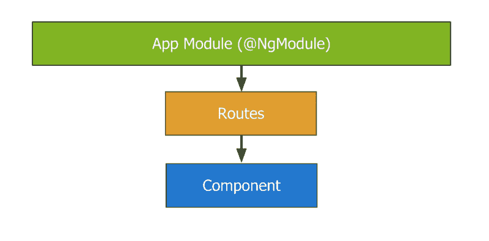](https://res.cloudinary.com/practicaldev/image/fetch/s--kFvbbfhK--/c_limit%2Cf_auto%2Cfl_progressive%2Cq_auto%2Cw_880/https://cdn-images-1.medium.com/max/800/1%2Aog4k_DGep_esiA5I1ALgzg.png)

路由的一个非常重要的部分是，如果用户标记了一个特定的 URL，它会将用户带回特定的组件，并且不需要复杂的显示/隐藏逻辑。

### 第 27 部分:路由——创建一个有路由的路由模块

我们从一个熟悉的模块容器例程开始，创建一个`app-routing.module`。

`app-routing.module`的主要目的是在一个数组中定义路线:

```
const routes: Routes = [  
    { path: '', pathMatch: 'full', redirectTo: '/customers'},  
    { path: '**', redirectTo: '/customers' }  
]; 
```

`routes`的三个关键属性是:

*   `path` —你的用户去哪里，所以`path: ''`将是你的应用的根。`path: '**'`是通配符匹配。它通常放在最后，用于覆盖`routes`中未指定的任何路线的情况
*   `pathMatch` —对于要显示的特定组件，路线应如何精确匹配
*   `redirectTo` —当路径匹配时，这是我们将用户发送到的地方。在我们的例子中，我们将它们发送到`/customers`。

### 第 28 部分:路由—使用路由器出口

为了在我们的`app.component`模板中使用角度路由，我们用`<router-outlet></router-outlet>`替换了`<app-customers></app-customers>`。最终，这只是一种方式来说:'嘿，这是一个组件将去的地方，当我们击中我们的路线'。

当我们找到一条路线时，那么一个与这条路线相关联的组件会神奇地出现在`<router-outlet></router-outlet>`的位置。

### 第 29 部分:路由—添加客户路由模块和路由

在这一章中，Dan 将所有的东西放在一起，我们将一条`/customer`路线连接到`customers.component`。

首先，我们创建一个`customers-routing.module`，并像这样从第 28 部分指向`customers.component`的路线:

```
const routes: Routes = [  
    { path: 'customers', component: CustomersComponent }  
]; 
```

现在，当我们在 Scrimba 浏览器地址栏中键入“客户”**时，我们会得到我们的`customers.component`。**

[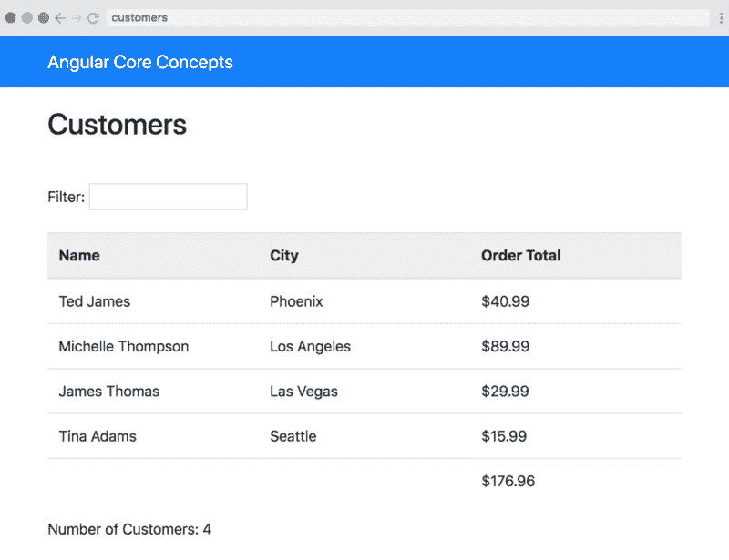](https://res.cloudinary.com/practicaldev/image/fetch/s--NHWXpZP8--/c_limit%2Cf_auto%2Cfl_progressive%2Cq_auto%2Cw_880/https://cdn-images-1.medium.com/max/800/1%2AdrUS_faas9AzJIvfW-EKxg.png)

### 第 30 部分:路由-添加带有路由的订单组件

在这个片段中，我们将快速回顾我们是如何通过路由来显示客户的，现在是时候通过路由来显示他们的订单了。

不过，有个小问题。当我们单击一个客户时，我们需要显示与该客户相关的订单数据。所以我们需要传递一些动态数据到我们的路由中。

我们可以通过在我们的`orders-routing.module`中传递一个`route parameter`来实现，比如:

```
const routes: Routes = [  
    { path: 'orders/:id', component: OrdersComponent}  
]; 
```

注意`/:id`语法。在路由中，`:`符号表示它后面的值将被动态替换，`id`只是一个变量，所以它可以是任何像`:country`或`:book`的值。

### 第 31 部分:路由—访问路由参数

在之前的截屏中，我们看到了如何创建`orders/:id`路线，现在`orders.component`需要以某种方式获取`id`并显示客户相关订单。为此，我们需要访问`id` route 参数。

一种方法是:

```
let id = this.route.paramMap.get('id'); 
```

这种方式的好处是，我们可以订阅`paramMap`，当`id`中的任何数据发生变化时，我们会收到通知。但是我们只需要一次。

我们可以用`snapshot`来表示:

```
let id = this.route.snapshot.paramMap.get('id') 
```

只是拍一张你的网址的即时照片，然后给你，这正是我们在这种情况下所需要的。

但是现在我们有一个问题。我们的`id`是一个字符串，但是要从我们的`DataService`获得订单，它需要是一个数字。我们可以用`parseInt()`来转换，但是丹教了我们一个巧妙的`+`技巧:

```
let id = +this.route.snapshot.paramMap.get('id') 
```

现在我们可以调用`DataService`来获取订单并将其呈现给`orders.component`。

### 第 32 部分:路由——用 routerLink 指令链接到路由

我们要做的最后一件事是在客户姓名上添加一个链接，这样我们就可以单击它来查看他们的订单。

在第 28 部分中，我们已经添加了`<router-outlet></router-outlet`，现在我们只需要告诉我们的应用程序，当我们导航到`/orders/:id`时，我们希望显示`orders.component`。

我们可以通过在`customers-list.component.html`行中添加一个指向客户姓名的链接来实现，在该行中，我们映射所有要显示的数据。我们已经有了我们的客户对象，所以我们可以将`id`传递给我们的路由。

```
<a [routerLink]="['/orders', cust.id]">  
    {{ cust.name | capitalize }}  
</a> 
```

现在我们可以看到订单了！

[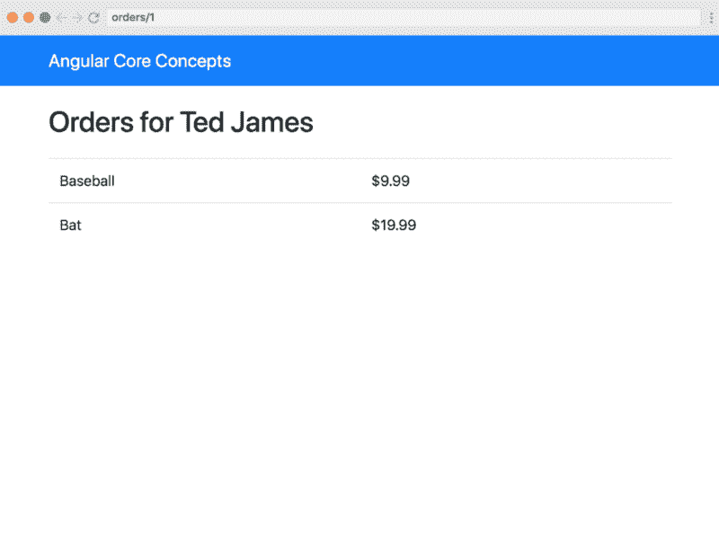](https://res.cloudinary.com/practicaldev/image/fetch/s--u-6cZqIz--/c_limit%2Cf_auto%2Cfl_progressive%2Cq_auto%2Cw_880/https://cdn-images-1.medium.com/max/800/1%2AM3o56Z9ikhkMt6tLbndzdQ.png)

但是，嘿，我们怎么回去？我们可以点击浏览器上的“返回”按钮，但如果有一个应用程序链接就更好了，因为我们已经知道了路由。让我们把它加到最底部的`customers-list.component.html`。

```
<a routerLink="/customers">View All Customers</a> 
```

### 第 33 部分:课程总结

非常好，我们现在有自己的应用程序了！

我们可以总结一下，快速回顾一下所做的事情。不要忘记观看课程的实际截屏，因为 Dan 是一位优秀的教师，所以您将会在与他一起学习的过程中获得很多乐趣！

谢谢你，丹！

[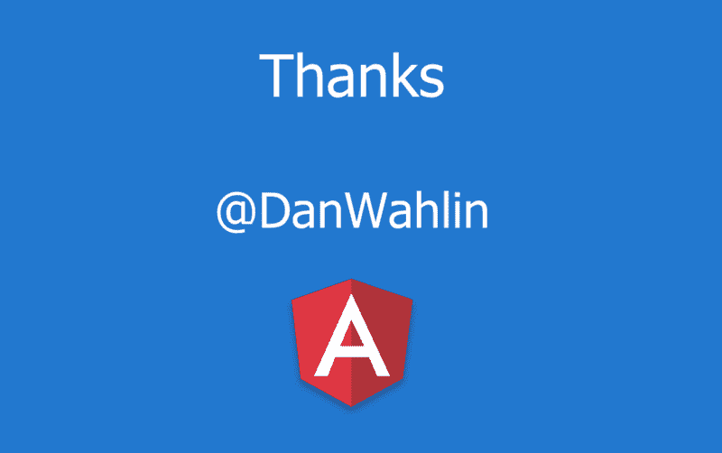](https://scrimba.com/p/pQxesM/?utm_source=dev.to&utm_medium=referral&utm_campaign=gyourfirstangularapp_launch_article)

如果你对前端和后端技术感兴趣，请确保[在 Twitter 上关注 Dan](https://twitter.com/danwahlin)！