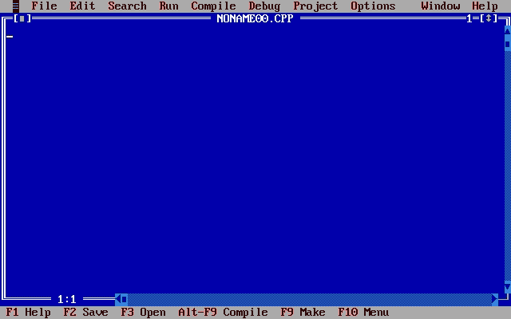

# 代码编辑器改变了我们的工作

> 原文：<https://dev.to/camerenisonfire/code-editors-change-our-work-bgn>

从一开始，人类就一直在寻找用工具扩展个人能力的方法。我们开始使用工具来创造更先进的工具。几千年来，我们的技术不断发展。随着计算机软件的发明，我们的工具发泄虚拟。软件的增长比人类创造的任何其他工具集都要快。随着这种爆炸式增长，人们用来制作软件的核心工具之一——源代码编辑器——也发生了演变。

> 这是我的博客 [Imago Dev](https://imago.dev) 的交叉帖子。

### 进化编辑

大约 10 年前，我在一所高中的课程中第一次学习了编程。除了在前两个程序中使用记事本之外，我们使用了 Borland 的 Turbo C++。现在看界面，它看起来很丑而且过时了，说实话，即使在那个时候它看起来也过时了。一旦你越过了过度饱和的蓝色编辑器面板和单调的灰色工具栏，你会发现一个对于初学者来说相当不错的集成开发环境。它编译并执行代码，语法突出显示关键字，显示编译时错误的位置，并有一个调试器在运行时单步调试代码。

在我使用 Turbo C++后的十年里，源代码编辑器的能力和范围都有了实质性的增长。这些年来，我使用了许多编辑器，现在登陆 VS Code 进行 web 开发，Intellij IDEA 用于 Java、Scala 和更繁重的 Javascript 工作。与 Turbo 相比，很难相信这些工具有多先进。在编辑器内置的大量功能和大量可用的扩展之间，软件开发人员在一个全面的工具中拥有一切。

### 速度&流量

将开发人员需要的所有功能放入一个工具中可以极大地提高生产率。强大的搜索功能允许瞬间跳转到不同的代码部分。只需点击一下按钮，就可以重构错综复杂的组件。构建、测试和部署可以通过一个热键开始。

毫无疑问，源代码编辑器在加速开发过程方面已经走了很长的路；然而，人们必须为了速度而小心速度。简单地更快地创建代码，如果不是解决正确问题的正确代码，只会让你更快地走上错误的道路。针对 VS 代码设置的最新技巧和扩展不会解决设计不佳的应用程序架构。

假设您正在构建的内容和构建方式是合理的，开发人员在构建时遇到的摩擦越少越好。不仅问题解决得更快，而且开发人员可以用有限的认知负荷更清晰地思考。你越少考虑多余的任务，比如如何构建或者函数在哪里，你就越能专注于真正的问题。

达到编辑器创建这种速度和流量的程度可能需要一些前期投资。像 Intellij 这样的高级编辑器可能非常庞大，以至于要知道您需要的特性驻留在哪里需要进行一些搜索。编辑人员可能还需要一些第三方扩展来很好地处理您的项目。即使是最基础的编辑，比如 Vi，也要花心思去学习如何操作。值得庆幸的是，有很多很棒的教程，通常是由编辑器的创建者提供的，讲述如何掌握这些强大的工具。

### 评估

> 我想，如果你唯一的工具是一把锤子，那么把一切都当成钉子是很有诱惑力的。亚伯拉罕·马斯洛

工具改变了我们看待问题的方式。如果使用得当，工具可以使任务变得更容易；然而，当一个工具被最好地使用时，一个有限的想法会导致我们以错误的方式处理问题。这不仅会使解决问题变得更加困难，还会导致更多的问题。正是因为这种重要性，我们必须花时间去了解我们的工具，包括如何最佳地使用我们现有的工具，以及还有哪些其他可用的工具。

源代码编辑器也不例外。有了这样一个强大的工具，每个开发人员都会花费大量的时间来使用，这些工具对最终的应用程序有很大的影响。

你的编辑如何影响你的作品？