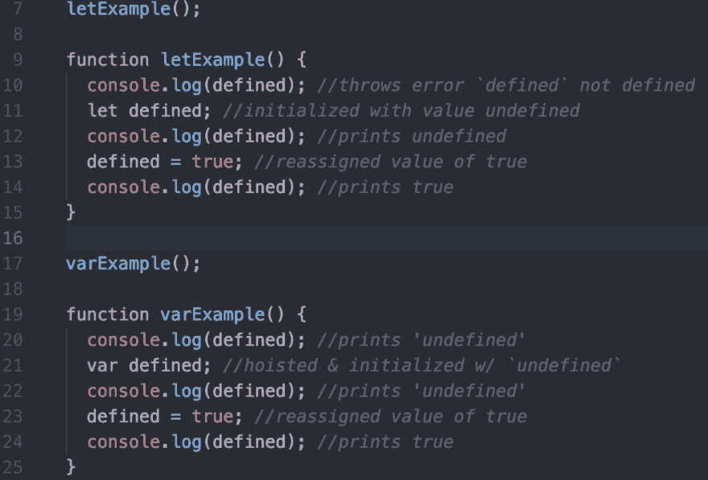

# 回归基础——JavaScript 提升 101

> 原文：<https://dev.to/mollynem/back-to-basics-javascript-hoisting-101-1c8d>

复习编程语言的基础知识总是一个好时机！在这个系列中，我将回顾 JavaScript 的一些基础知识。重要的是，我们要重新认识语言在幕后是如何工作的，当然，能够用简单的术语解释概念也是很好的练习。

本周我们回顾[提升](https://developer.mozilla.org/en-US/docs/Glossary/Hoisting)——它是什么，函数和变量提升，以及一些关键要点。

#### 什么是吊装？

编译 JavaScript 代码时，变量和函数声明被“提升”到它们作用域的顶部。根据变量声明的位置，作用域可以是全局的，也可以是局部的。无论哪种方式，变量声明都被提升到特定范围的顶部。函数也被提升，但是是在程序的最顶端。函数甚至被提升到全局变量之上。提升就是为什么您可能会看到函数在声明之前就被成功调用了——为了使这成为可能，在代码执行之前，它们被拉(提升)到程序的顶部。

值得注意的是，当代码被提升时，它并没有在你的程序中进行物理重定位。相反，你的程序会被扫描所有变量/函数声明，这些关系保存在[词法环境](https://www.ecma-international.org/ecma-262/6.0/#sec-lexical-environments)中。您的代码保持其原始格式和结构，而变量/函数声明可通过词法环境访问。

#### 吊装功能:

*   **函数声明**被提升到程序的最顶端。在实际声明之前，可以在代码中调用它们。以下示例记录无误:

<figure> 

<figcaption>功能声明被吊到程序顶部</figcaption>

</figure>

*   **函数表达式**在程序中没有完全挂起。相反，只有声明会被提升，因为它被识别为变量(提示:`var`关键字)。变量值的实际赋值(在这个例子中是一个函数)没有被提升。在下面的例子中，您首先会得到一个错误，指出 expression 不是一个函数。这是因为没有悬挂作业，只有宣言。`expression()`的第二次调用成功了，因为程序已经通过程序 ad 解析达到了将函数赋值给`var expression`的目的。

<figure> 

<figcaption>声明被悬挂，但不赋值函数值</figcaption>

</figure>

#### 吊装变量:

变量被提升到其作用域(局部或全局)的顶部。用`var`声明的变量的提升与用`const`或`let`声明的变量略有不同。

*   **var 变量**被提升，初始化，但赋值`undefined`。与函数表达式类似，只提升声明，而不是变量值的实际赋值。下面的代码演示了如何提升`var`变量，用值`undefined`初始化，然后在程序达到赋值后重新赋值。

<figure> 

<figcaption>吊起，初始化，赋值未定义</figcaption>

</figure>

*   **let/const 变量**稍微复杂一点。这些变量被提升，但在被求值之前保持未初始化状态。与被提升的*和用值`undefined`初始化的*变量`var`不同，`let` / `const`变量被提升，但根本不初始化。这意味着它们处于未初始化的词法环境中。试图访问未初始化的变量会引发引用错误。一旦程序被执行并到达变量声明，你的`let` / `const`变量将被初始化。它要么用一个值(如果在声明行中赋值)初始化，要么用`undefined`初始化，直到在代码的后面赋值。

这一开始可能会比较混乱，所以让我们看看下面的例子。您将看到首先抛出一个错误，因为当变量存在于词法环境中时，它保持未初始化状态，直到程序到达变量声明行。第 11 行变量被初始化，但是被赋值为`undefined`，因为没有赋值。第 13 行该变量被赋予一个值，该值覆盖了先前的值`undefined`。

<figure> 

<figcaption>被提升，但一旦在代码</figcaption>

</figure>

中声明到达，则初始化&赋值

看看下面的例子，它并排展示了`let` / `var`变量及其提升差异:

<figure> 

<figcaption>注意 var 提升和初始化方式的区别，let 不是</figcaption>

</figure>

#### 重点外卖！

*   变量声明是悬挂的，而变量定义不是。
*   函数声明是悬挂的，而函数表达式不是。
*   带`var`的变量被提升，初始化，赋值`undefined`
*   带有`let` / `const`的变量被提升，但是在到达它们的变量声明代码之前保持未初始化。然后，它们或者被赋予`undefined`或者被赋予一个值，这取决于值赋予是否存在。
*   在函数作用域的顶部声明变量是很有帮助的。这样，变量的来源就很清楚，也更容易识别它们的范围。
*   在使用之前声明并初始化你的变量，以避免由于不正确的提升假设而产生的错误。