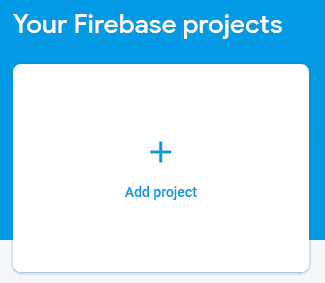
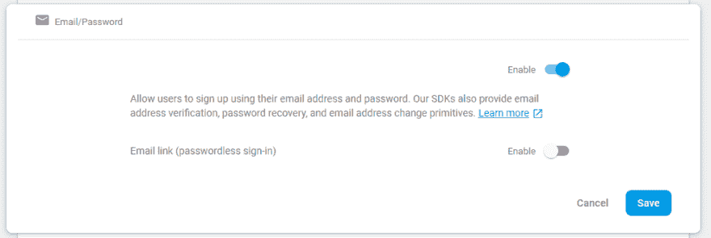
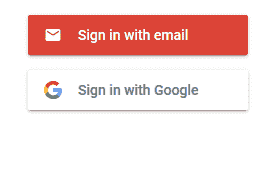

# Firebase 身份验证入门

> 原文：<https://dev.to/terabytetiger/getting-started-with-firebase-authentication-2bg7>

*注意:我不是 Firebase 的附属公司*

## 什么是 Firebase？

Firebase 是谷歌提供的一系列工具，包括云数据库、认证、托管和用于网络和移动应用的无服务器功能。Firebase 的吸引力之一是能够开始使用免费层计划，并且只需要在您的项目达到一定的使用次数时付费。

在这篇文章中，我将介绍认证工作的基础。

## 创建项目

“项目”是指你的网站/应用程序和连接到 Firebase 的服务。从[firebase.google.com](https://firebase.google.com)，你可以登录(右上角)并点击“转到控制台”(也在右上角)。

### 控制台

控制台是所有项目所在的地方。将项目添加到您的帐户后，它们将出现在此处。选择一个项目卡会将您带到该项目的仪表板，在那里您可以调整项目的设置。

### 添加项目

添加项目是一个非常快速的过程。点击“添加项目”卡，添加您的项目名称，根据需要调整位置，并接受条款和条件(当然是在阅读完之后)——就这样！

[](https://res.cloudinary.com/practicaldev/image/fetch/s--Lz4JteYn--/c_limit%2Cf_auto%2Cfl_progressive%2Cq_auto%2Cw_880/https://thepracticaldev.s3.amazonaws.com/i/5nddfohh5j9l2dst9v0b.PNG)

### 关于自由项目的说明

这可能是一个很好的时机来提及每个项目都有自己的计划，所以你不必担心你的项目会超过自由层的限制(尽管自由项目的数量是有限制的- [更多细节](https://firebase.google.com/support/faq))。

## 连接我们的网页

在使用 Firebase 的服务之前，我们必须在页面和 Firebase 之间创建一个链接。为此，请单击看起来像 html 结束标记的图标(左起第三个白色背景图标):

[](https://res.cloudinary.com/practicaldev/image/fetch/s--JNj9GJCL--/c_limit%2Cf_auto%2Cfl_progressive%2Cq_auto%2Cw_880/https://thepracticaldev.s3.amazonaws.com/i/0apq3izkgnkx9p0tktqv.PNG)

在这里，您将添加您的应用程序的昵称(这可以是任何东西)，如果您愿意，还可以添加主机(通过 Firebase 部署您的网站-我不会在本文中涉及主机，所以我没有选中它)。

一旦你点击“注册应用程序”，你将会得到一个 HTML 代码块和添加到你的`<body>`末尾的指令(但是在尝试使用 Firebase 之前)。

我将把它添加到一个样板 HTML 文件(`index.html`):

**注意，您需要添加提供的 firebaseConfig 对象值**

```
<!DOCTYPE html>
<html lang="en">
<head>
  <meta charset="UTF-8">
  <meta name="viewport" content="width=device-width, initial-scale=1.0">
  <meta http-equiv="X-UA-Compatible" content="ie=edge">
  Firebase Example
</head>
<body>
  <div id="firebaseui-auth-container">
    <!-- This is where the Login ui will load -->
  </div>
  <!-- The core Firebase JS SDK is always required and must be listed first -->
<script src="https://www.gstatic.com/firebasejs/6.3.3/firebase-app.js"></script>

  <!-- TODO: Add SDKs for Firebase products that you want to use
https://firebase.google.com/docs/web/setup#config-web-app -->
  <script src="https://www.gstatic.com/firebasejs/6.3.3/firebase-auth.js"></script>
<script>
  // Your web app's Firebase configuration
  var firebaseConfig = {
    REPLACE THIS WITH THE CODE PROVIDED BY FIREBASE
  };
  // Initialize Firebase
  firebase.initializeApp(firebaseConfig);
</script>
</body>
</html> 
```

Enter fullscreen mode Exit fullscreen mode

### 短暂的崩溃

这个块加载 Firebase，类似于您曾经使用过 jQuery 的情况。

```
<!-- The core Firebase JS SDK is always required and must be listed first -->
<script src="https://www.gstatic.com/firebasejs/6.3.3/firebase-app.js"></script> 
```

Enter fullscreen mode Exit fullscreen mode

该块将被您希望页面加载的其他服务所替换。在本例中，我们正在加载认证服务:

```
<!-- TODO: Add SDKs for Firebase products that you want to use
https://firebase.google.com/docs/web/setup#config-web-app -->
<script src="https://www.gstatic.com/firebasejs/6.3.3/firebase-auth.js"></script> 
```

Enter fullscreen mode Exit fullscreen mode

最后，这个块向 Firebase 提供细节，创建一个到项目的连接。这就像给你的朋友打电话，然后等他们回答。一旦他们回答了，你就可以说得他们耳朵都掉了！

```
<script>
  // Your web app's Firebase configuration
  var firebaseConfig = {
    REPLACE THIS WITH THE CODE PROVIDED BY FIREBASE
  };
  // Initialize Firebase
  firebase.initializeApp(firebaseConfig);
</script> 
```

Enter fullscreen mode Exit fullscreen mode

* * *

现在我们已经创建了项目，让我们添加身份验证。

## 认证

许多应用程序希望利用认证系统的力量，但试图理清与各种服务的连接*和*允许电子邮件登录可能需要大量工作。令人欣慰的是，Firebase 让您可以轻松地从一项服务开始，并随着时间的推移添加其他服务。

### 启用认证

要启用身份验证，请单击身份验证卡或从左侧导航栏中选择“身份验证”，然后在页面加载后选择“设置登录方法”。您可以在这里设置希望用户能够登录的提供商。

[](https://res.cloudinary.com/practicaldev/image/fetch/s--75-A4dUr--/c_limit%2Cf_auto%2Cfl_progressive%2Cq_auto%2Cw_880/https://thepracticaldev.s3.amazonaws.com/i/26cqysfdcw94fs3n0md0.PNG)

在本教程中，我将涉及电子邮件/密码和谷歌，因为这是我过去用过的两个选项。

#### 邮箱/密码

最基本的登录选项，这允许用户使用他们的电子邮件/密码来注册/登录。启用此功能就像在登录提供商列表中点击“电子邮件/密码”后，点击第一个切换开关，然后点击“保存”一样简单。

[](https://res.cloudinary.com/practicaldev/image/fetch/s--lHNiR7Or--/c_limit%2Cf_auto%2Cfl_progressive%2Cq_auto%2Cw_880/https://thepracticaldev.s3.amazonaws.com/i/olj7eq07bcnb1vkot7yt.PNG)

#### 谷歌签到

这将允许用户使用他们的 Google 帐户登录(类似于您登录 Firebase 的方式)。类似于电子邮件/密码，您可以将启用开关切换到“启用”，但这里有一个额外的步骤。您需要添加一个支持电子邮件，它需要是一个有效的 Gmail 帐户。这是为了让用户在需要时提交支持电子邮件。

[](https://res.cloudinary.com/practicaldev/image/fetch/s--QMhD4mbt--/c_limit%2Cf_auto%2Cfl_progressive%2Cq_auto%2Cw_880/https://thepracticaldev.s3.amazonaws.com/i/lzr3hi15uvrr9l2qaf3n.PNG)

#### 其他选项

对于外部服务，有关连接到提供商的详细信息可以在相应的文档中找到(此处链接):

*   [脸书](https://firebase.google.com/docs/auth/web/facebook-login)
*   [推特](https://firebase.google.com/docs/auth/web/twitter-login)
*   [GitHub](https://firebase.google.com/docs/auth/web/github-auth)
*   [微软](https://firebase.google.com/docs/auth/web/microsoft-oauth)
*   雅虎
*   [电话号码](https://firebase.google.com/docs/auth/web/phone-auth)

## 认证界面

现在我们有了与 Firebase 对话的连接设置，我们需要为用户添加接口。为此，我将使用 [Firebase UI](https://github.com/firebase/firebaseui-web) ，其中包括添加以下内容:

```
 // ...
      // Initialize Firebase
      firebase.initializeApp(firebaseConfig);
    </script>
    <!-- Firebase UI -->
+    <script src="https://cdn.firebase.com/libs/firebaseui/3.5.2/firebaseui.js"></script>
+    <link
+      type="text/css"
+      rel="stylesheet"
+      href="https://cdn.firebase.com/libs/firebaseui/3.5.2/firebaseui.css"
+    />    
+    <script src="./auth.js"></script>
  </body>
</html> 
```

Enter fullscreen mode Exit fullscreen mode

这些添加将加载我们需要的 Firebase UI 信息，但是我们需要告诉它使用什么配置(这就是`auth.js`文件的用处)。

### [T1】auth . js](#authjs)

首先，我们需要在与我们的`index.html`文件相同的目录中创建`auth.js`。

在`auth.js`中，我们将添加以下内容:

```
// 1) Create a new firebaseui.auth instance stored to our local variable ui
const ui = new firebaseui.auth.AuthUI(firebase.auth());

// 2) These are our configurations.
const uiConfig = {
  callbacks: {
    signInSuccessWithAuthResult(authResult, redirectUrl) {
      return true;
    },
    uiShown() {
      document.getElementById('loader').style.display = 'none';
    },
  },
  signInFlow: 'popup',
  signInSuccessUrl: 'signedIn',
  signInOptions: [
    firebase.auth.EmailAuthProvider.PROVIDER_ID,
    firebase.auth.GoogleAuthProvider.PROVIDER_ID,
    // Additional login options should be listed here
    // once they are enabled within the console.
  ],
};

// 3) Call the 'start' method on our ui class
// including our configuration options. 
ui.start('#firebaseui-auth-container', uiConfig); 
```

Enter fullscreen mode Exit fullscreen mode

现在，如果您在浏览器中打开您的`index.html`文件，您应该在页面上看到以下内容:

[](https://res.cloudinary.com/practicaldev/image/fetch/s--986I7iar--/c_limit%2Cf_auto%2Cfl_progressive%2Cq_auto%2Cw_880/https://thepracticaldev.s3.amazonaws.com/i/aewcmkoizxqwjxlus4o1.PNG)

🎉恭喜你。您已经有了一个可以使用的身份验证 UI！(虽然在服务器上才能用；例如，如果您之前配置了 firebase 主机)

## [TB tetiger](https://github.com/TerabyteTiger)/[firebase——举例](https://github.com/TerabyteTiger/firebase-example)

<article class="markdown-body entry-content container-lg" itemprop="text">

# fire base-示例

</article>

[View on GitHub](https://github.com/TerabyteTiger/firebase-example)