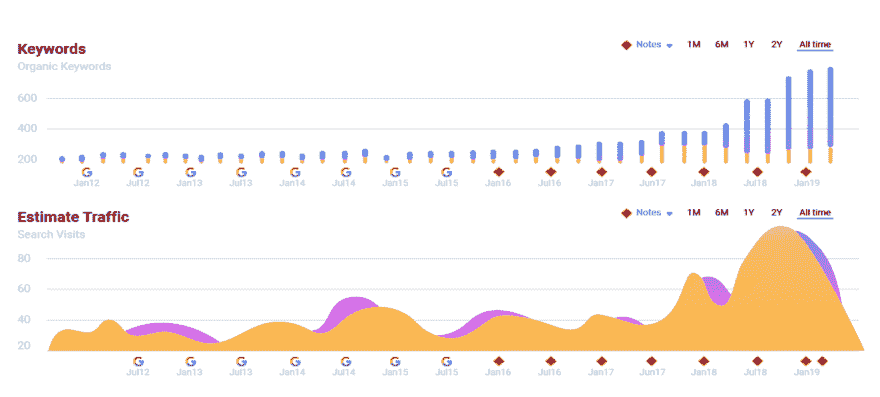

# 我如何帮助开发人员为公司博客写作

> 原文：<https://dev.to/ioana__b/how-i-help-devs-write-for-the-company-blog-ama-mnp>

我在这里潜伏了一年多，就在我加入一家罗马尼亚的产品开发公司之后。我是他们团队的第一个内容作者。我的角色是为公司的商店制作内容，同时也帮助我的开发同事在博客上写他们自己的东西。

“帮助我的开发同事写作”——在纸上听起来很棒。除了我几乎不知道程序员的大脑是如何工作的，他们对什么有反应，以及在我让他们写之前我能把事情扩展到什么程度。

请记住，我是在那些喜欢不断学习和挑战自我的人中这样做的——以至于这就是公司文化的核心。尽管如此，即使在这种环境下，我也需要用自己的方式赢得他们对我所做的事情的信任，我到底为什么在那里，以及我如何才能帮助他们。

那时候我开始读《开发与传播》。

我注意到你们很多人都在讨论写作，它在你们职业生涯中的重要性，把你们的东西拿出来等等。

所以我在这里，制作我自己的开发者帐号，分享我帮助开发者把他们的东西放到网上的旅程。

### 1。学习阶段:人、关键词研究和新工具

为什么开发人员会费心在博客上写东西？他们有自己的项目和数不清的任务要担心，他们最不需要的就是一个营销人员唠叨他们的博客文章。

这是去年的我。从那时起，我学会了将这些想法视为挑战，而不是威慑。所以我选择了三条路(同时):

*   我开始询问人们关于他们的项目，他们的技术斗争，以及他们的下一步是什么(这些谈话通常发生在午餐休息时间等等)。当然，我大部分时间都没有真正理解这些术语，但是我试图倾听、吸收，有时还建议(以微妙的方式或不微妙的方式)他们尝试写下他们开发生活中发生的任何事情。猜猜谁很快成了办公室里令人生畏的人？:)
*   我开始为我即将发表的第一篇科技文章起草带有关键词研究的思维导图。我用这些关键词精心设计了战略性的标题变体，这些变体将成为该主题上一系列其他作品的灵感来源。这帮助我开始触及表面，并真正熟悉行业中的技术术语、趋势和社区。
*   我与我的营销经理、董事总经理和首席技术官开了一次会，并展示了我对一个 SEO 工具的研究，该工具将帮助我们更好地管理我们的内容。太好了，现在我可以确保每个人的物品都得到妥善保管。

**注意**:我之所以能够做到这些，是因为首席执行官、首席技术官和营销经理都是“更进一步”的倡导者，他们都是出色的作家，这一点不会被忽视。人们很容易感觉到你实际上在实践你所说的，所以有一些开发人员已经在定期地写东西，模仿他们在高层管理中看到的。

### 2。新作品，新风格

我慢慢地开始在博客上写我的第一篇文章，在我们的 Slack 频道上分享，并得到他们的反馈...简而言之，人们看到了这个问题的严重性。

### 3。寻求帮助

很明显，我发表的大部分内容都需要帮助。这来之不易。

我向开发人员询问关于软件开发文章的反馈。我缠着首席执行官解释这一切的商业方面。
我不断要求每个人给我一些关于内部计划的见解。
我被唠叨着去送东西。

一句话:这种动态驱动结果。

### 4。秀，不要说

2018 年底，有 [8 篇科技文章发表](https://around25.com/blog/?utm_source=devt&utm_medium=post&utm_campaign=devs-who-write-blog)(2017 年为 1 篇)。这种势头必须保持下去，所以当我的同事度假回来时，我拿出了一些关于写作最佳实践的指南，并在一次关于写作内容的所有“为什么”和“如何”的演示中使用了它们。

分享了关于长期职业资产的想法，并使用了邪恶的计划(数据、图表、有趣的视觉效果、gif)。

片段:

### 5。立即行动+跟进

每当有人愿意尝试写作的时候，我会和他们就这个话题聊上一会儿，让他们知道我随时可以提供建议、优化和任何形式的编辑。

然后我会跟进，视情况而定——如果我感觉到决心，我会在一周后跟进；如果有犹豫的话，我可能会在一个月后或者任何我觉得合适的时候回来。

关键的一步是找到推动对方和让他们知道你一直在支持他们之间的平衡。

### 6。努力投入

我还做的是，当需要我的帮助时，我不会不遗余力。

有校对要做吗？我一个人尽可能快地做，以便尽快把事情做完。

是否有更彻底的改变要做(逻辑结构、流程、转换)？我在会议室预定了一个小时——也许两个小时——并邀请我的同事参加一个紧张的并排编辑会议。我不会用我的内容替换他们的文本；我宁愿交换一个解决方案，提供替代方案，并引导人们找到他们自己的最佳词汇。

### 7。...那就制造点噪音

我并不回避为那些写作的人唱赞歌。这是我在一篇文章发表后马上发布的内容:

让人为自己加紧比赛而心存感激？太好了。

## 毕竟...

不同的人用不同的笔画。

有些人只需要内心的触发来写作，你可能只需要激起那些动机。另外一些人需要持续的支持和跟进。
有些人在想要咆哮或向客户证明他们所说的是正确的时候写作。
此外还有“冒名顶替综合症”的问题:一群 *looot* 人就是不认为他们有话要说。即使他们花了一两个月的时间去寻找一个独特的实现，他们也不会想到一群其他的开发人员可能会搜索那个特定的解决方案。

我这篇文章的重点是强调，如果你想办法*在那里*并为你知道有相关事情要说的人提供鼓励或建设性反馈，你会取得多大的成就。

你曾经帮助过其他开发者吗？结果如何？我很高兴听到更多的旅程，并从你们那里学到好的实践。如果你需要更多的建议... *do* 问吧，免费！