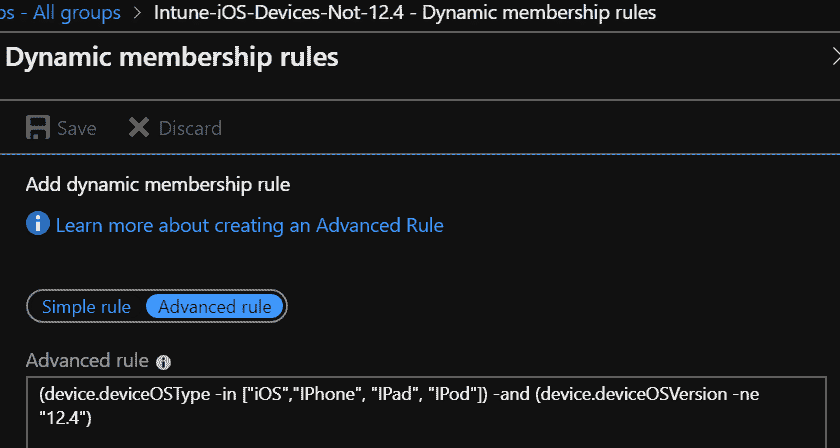

# Intune 自定义通知

> 原文：<https://dev.to/merill/intune-custom-notifications-2cg0>

谷歌最近公布了一些[重大 iOS 安全漏洞](https://www.theverge.com/2019/7/30/20746827/apple-ios-security-flaw-imessage-google-project-zero)的细节。好在苹果已经在几周前的 iOS 12.4 更新中发布了其中 5 款的补丁。糟糕的是，超过 90%的公司用户群没有应用更新。

这是使用 Intune 新的[自定义通知](https://docs.microsoft.com/en-us/intune/custom-notifications)功能来定位和通知尚未更新到最新版本的设备的绝佳机会。

为此，您可以使用“动态设备”选项在 Azure AD 中创建一个动态组。对组的查询相当简单，如下所示

```
(device.deviceOSType -in ["iOS","IPhone", "IPad", "IPod"]) -and (device.deviceOSVersion -ne "12.4") 
```

<svg width="20px" height="20px" viewBox="0 0 24 24" class="highlight-action crayons-icon highlight-action--fullscreen-on"><title>Enter fullscreen mode</title></svg> <svg width="20px" height="20px" viewBox="0 0 24 24" class="highlight-action crayons-icon highlight-action--fullscreen-off"><title>Exit fullscreen mode</title></svg>

[](https://res.cloudinary.com/practicaldev/image/fetch/s--kDaA5oib--/c_limit%2Cf_auto%2Cfl_progressive%2Cq_auto%2Cw_880/https://merill.net/assets/2019-08-06_22h04_08.png)

等待组被填充(可能需要几分钟到一个小时或更长时间，具体取决于您的 Azure AD 中有多少设备)。

接下来进入 Intune >设备>发送自定义通知，为您的用户编写并发送通知。您可以每天发送此消息，因为这只是一个动态组，它将针对尚未更新的剩余设备。

[](https://res.cloudinary.com/practicaldev/image/fetch/s--EDV6CNsK--/c_limit%2Cf_auto%2Cfl_progressive%2Cq_auto%2Cw_880/https://merill.net/assets/2019-08-06_22h09_49.png)