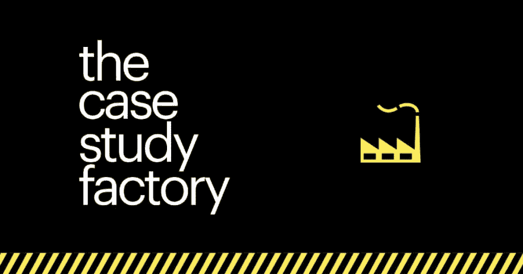

# 案例研究工厂

> 原文：<https://dev.to/uxcollective/the-case-study-factory-2f33>

#### 公式化的案例研究方法会危及年轻专业人士的批判性思维能力吗？

作为一家[大型在线设计出版物](http://uxdesign.cc/)的编辑，我们每周都会收到大量电子邮件，推销将在我们网站上发布的案例研究。我们收到的大部分信息来自刚刚起步的学生和设计师，他们正在寻找机会让自己的作品接触到更广泛的受众。

*   2019 年上半年向 UX 集体提交了 271 个案例研究
*   每天在媒体上发布 38 个新的案例研究，标签为“UX”
*   在 Medium 上发表的所有 UX 相关文章中，52%是案例研究(仅考虑英文文章，不包括垃圾邮件和内容营销)

我们知道组织和撰写案例研究需要做多少工作，以及它们对其他刚刚进入该行业的设计师有多大帮助。每天都有如此多的案例研究发表，这一事实表明我们的行业比以往任何时候都更加活跃。

但是，鉴于大量的案例研究，公司如何才能找到他们想要的人才呢？而设计师在应聘一个职位的时候如何才能脱颖而出？为了能够回答这些问题，我们决定后退一步，试图弄清楚为什么一开始会产生这么多的案例研究。

> 每个月都有数百名专业人士加入职场——他们每个人的投资组合中都有几个案例研究。

注意到 Medium 上有大量主题为“[我的新设计学校](https://medium.com/tag/lambda-school/latest)让我兴奋的地方”的文章，以及平台上发布的许多案例研究的[看似熟悉的结构](https://medium.com/tag/ironhack/latest)，我们决定对向 UX 集体提交案例研究的学生进行调查。

通过与 15 名 UX 训练营的应届毕业生的电子邮件交谈，我们了解到:

*   大多数学校为学生提供案例研究的模板
*   一些学校在每个项目结束时“强烈鼓励学生在媒体上分享他们的案例研究”
*   一些学校甚至建议学生在媒体上使用哪些标签，以最大限度地提高他们作品的知名度

> “实际上，我们[学校 1]的教师要求我们为 Medium 撰写案例研究。我们的助教安排了一次演示，并鼓励我们认真对待它。她向我们展示了几个例子，并给了我们一些关于给我们的文章加标签的内部技巧。”
> 
> —来自一个受欢迎的 UX 训练营的学生

即使没有在同一所学校学习过的设计师最终也会使用类似的结构，因为他们在创建自己的案例之前会研究现有的案例。他们认为，如果其他设计师以一种特殊的方式设计它们，那么一定是有原因的。

案例研究的相似性使得设计师很难展示他们独特的思维、技能和观点。如果其他候选人的案例乍看起来一模一样，你如何在申请职位时脱颖而出？

继续阅读:

[案例研究工厂](https://essays.uxdesign.cc/case-study-factory/)

* * *