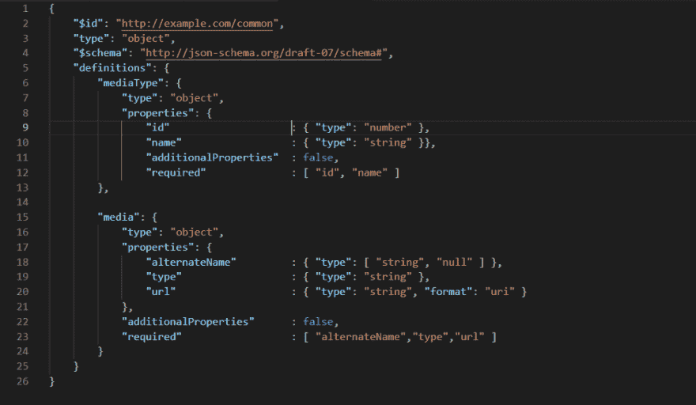
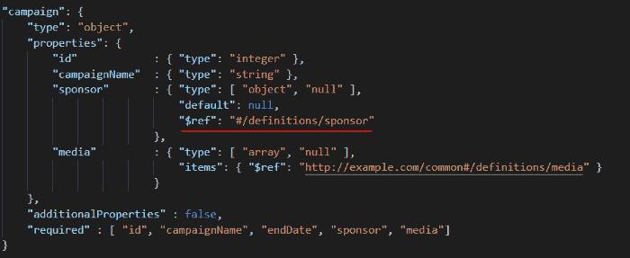
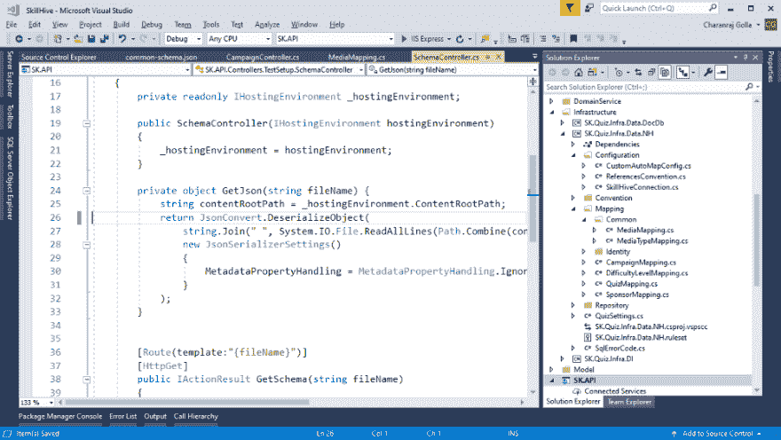

# 使用外部 JSON 文件在 Postman 中进行 JSON 模式验证

> 原文：<https://dev.to/charanrajgolla/json-schema-validation-in-postman-using-external-json-files-1jnc>

Postman 是测试 API 的优秀工具。API 调用的响应可以根据 JSON 模式进行验证，以确保值在类型和格式方面是有效的。在本文中，我们将探讨如何将外部 JSON 文件加载到 Postman 中，以避免模式重复，从而使测试更易于维护。

Postman(从 v7.3.4 开始)不支持引用外部库和文件的能力。这意味着我们必须将模式加载到环境变量中来解析和使用它。

## JSON 模式入门&微型验证器库

在我们开始之前，明智的做法是了解一下 [JSON 模式](https://json-schema.org/understanding-json-schema/)和用于模式验证的[微型验证器库](https://geraintluff.github.io/tv4/)。出于演示的目的，我们有四个实体:活动、媒体、赞助商和媒体类型。活动需要一个媒体对象和可选的赞助商。发起人需要一个媒体对象。

以下是上面列出的实体的模式。

*   `common-schema.json` —包含将在整个应用程序中重用的公共元素的模式
*   `advertisement-schema.json` —包含与应用程序中称为广告的模块相对应的所有元素的模式。

<figure>

<figcaption>Figure-1 common-schema.json</figcaption>

</figure>

对 GitHub 的看法:[https://gist . GitHub . com/charan Raj-golla/82 BD 2e 51733 CEC 512 aab 8 F2 D1 e 2713 e 0](https://gist.github.com/charanraj-golla/82bd2e51733cec512aab8f2d1e2713e0)

<figure>

<figcaption>Figure-2 advertisement-schema.json</figcaption>

</figure>

关于 GitHub 的看法:[https://gist . GitHub . com/charan Raj-golla/1823 c 488895 c 177 C4 c449 C4 CBC 11 c 407](https://gist.github.com/charanraj-golla/1823c488895c177c4c449c4cbc11c407)

tiny Validator 的以下方法可用于验证 API 响应的结果:

*   `tv4.validate()`
*   `tv4.validateResult()`
*   `tv4.validateMultiple()`

这些方法接受四个参数:

*   `data`
*   `schema`
*   `checkRecursion`
*   `banUnknownProperties`

前两个是强制性的，没有它们验证就不会工作。为`checkRecursion`传递`true`将递归地验证嵌套模式。如果除了模式中定义的属性之外，还有其他属性，将`banUnknownProperties`设置为`true`将导致模式错误。这是我们在编写测试时必须知道的关于这个库的最基本的东西。

接下来，我们需要对 JSON 模式中的`$ref`和`$id`关键字有一些了解。`$ref`逻辑上被它所指向的东西所取代。该引用节可以在同一文件中，也可以在外部文件中。`$ref`的值是一个 URI，`#`符号(井号)之后的部分是“片段”或“命名锚”，格式为 JSON 指针。

接下来是`$id`属性。`$id`的值是一个 URI，用于两个目的:

*   它声明了模式的唯一标识符。(图 4)
*   它宣布了一个基地 URI，URIs 决心反对它。(图 5)

给定一个子模式，在这种情况下，地址提供了一种不使用 JSON 指针来引用子模式的方法。这意味着您可以通过一个唯一的名称来引用它们，如下例所示(图 4)。

<figure>

<figcaption>Figure-4 Unique identifier in a schema.</figcaption>

</figure>

在使用`$id`提供基本 URI 的情况下，存在于同一文件中的子模式可以被引用为`"$ref" : "#/definitions/sponsor"`，这实质上意味着:

1.  转到此文档的根目录
2.  用关键字定义查找值
3.  在该对象中找到关键赞助商值

<figure>

<figcaption>Figure-6 Using JSON pointer</figcaption>

</figure>

回到我们的示例，Campaign 对象中的 Media 属性需要一个 Media 类型的对象数组。必须根据 items 属性指定数组项的架构。媒体的模式存在于一个名为 common-schema.json 的单独文件中(图 1)。这里我们使用绝对 URI 和 JSON 指针。一旦我们开始编写测试，使用绝对 URI 的意图就很清楚了。请注意，Postman 不会对给定的 URI 进行任何网络调用。

> 尽管`$ref`的值是一个 URI，但它不是网络定位器，只是一个标识符。这意味着该模式不需要在该 URI 上可访问，但它可能是可访问的。如何处理外部模式 URIs 基本上取决于验证器的实现，但是不应该假设验证器会获取在`$ref`值中指示的网络资源。

## 设置验证

在对集合运行测试之前，需要将模式加载到 Postman 的环境变量中。在解决方案中包含所有架构，并添加一个控制器来读取架构文件。

<figure>

<figcaption>Figure-7 Visual Studio solution setup</figcaption>

</figure>