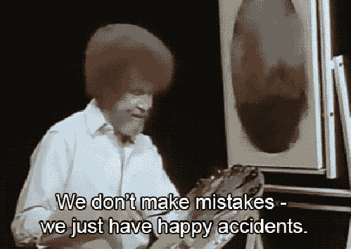

# 漏斗:我如何挑选小项目

> 原文：<https://dev.to/charlesdlandau/the-funnel-how-i-pick-small-side-projects-2pbb>

在这篇文章中，我将解释我接受一个小项目的思考过程。我应该说，我并不是把这种方法作为一个框架或者一个好主意来提供...我刚刚意识到，我其实有一个过程，它是没有记录的。所以我把它写下来。

#### 1。领域

我想探索的领域是什么？

对我来说，兼职项目是关于扩展、展示技能或探索一个领域。领域是“知识的范围”想一个你想了解更多、练习工作或展示精通的领域。

对于编程或技术方面的项目，答案通常是一个技术领域，但也可能是一个特定的框架或编程模型。所有这些都是你在漏斗的这一部分可能有的答案:

*   MapReduce
*   函数式编程
*   姜戈
*   Java 语言(一种计算机语言，尤用于创建网站)
*   面向对象的程序设计(Object Oriented Programming)
*   语源
*   无监督机器学习
*   EmberJS
*   查托普西奥
*   熊猫云

最后两个是编造的，但你明白其中的意思。你有没有把范围缩小到你有**动力与**一起工作的领域？没有吗？不要继续！

#### 2。解决办法

我将实施什么样的解决方案？

你的*小*项目有你非常了解的具体的、可实现的、定义明确的目标。这是因为你幻想做那样的项目，但是是为了钱。这也是因为这个项目完全是由你构思的，或者是一个由志同道合的人组成的小团队。

此外，在做一个能直接促进你日常工作或主要焦点的副业之前，要仔细考虑。我试图想出一些有见地的东西来说，但这是一个灰色地带，我真的不能。

所有这些都是你在漏斗的这一部分可能有的答案:

*   编写一个 ReactJS/VueJS/WhateverJS 组件来做一件事
*   使用方法 Z 实现预测 Y 的 ML 模型
*   让我的学习板上的灯闪烁
*   使用我最喜欢的设计框架
*   重构那个慢的东西！写一篇关于它的博客
*   建立 CI/CD 渠道
*   攻击编码挑战(例如在 [CodeWars](https://www.codewars.com) 或 [HackerRank](https://www.hackerrank.com) 上)
*   写首诗！

那么你有一个**解决方案**来实现吗？即使没有写在任何地方？没有吗？没关系，但是不要继续。

#### 3。工具

我将在这个项目中使用哪些工具？

有时，由于领域或解决方案的原因，工具是预先确定的。例如，如果域是 Vue 或者解决方案是“在 INTERCAL/Ook 中编写 FizzBuzz！/Whitespace "那你就用 Vue 或者自我折磨。这是你的生活，我不会评判你。

有时你想在项目中期更改或添加工具，但我试图对解决问题的工具有一个好的想法，并知道从哪里开始。如果你最终切换到了一些你在开始之前没有想过要使用的工具，这是一个令人高兴的意外。

所有这些都是你在漏斗的这一部分可能有的答案:

*   反应钩
*   戈里普斯
*   独轮车
*   谷歌视觉 API
*   虚拟代码
*   GreenPlum

...但实际上，它可以是您多年来使用过的任何工具。或者锤子。

知道要用什么工具了吗？你对使用这些工具感到兴奋吗？没有？没关系，继续找，但不要继续！

#### 4。空间

我能为这个项目腾出生活空间吗？

适合漏斗的最窄部分，我认为这是准备任何副业项目最困难的部分，即使是一个小项目。在你的生活中为工作腾出空间。你已经有动力了，否则你就不会为前面的步骤而烦恼，但是这真的重要到可以挤出时间吗？分配一些宝贵的精神能量？

这一步的活动变化很大，取决于你如何平衡工作和生活。这也取决于你如何对待项目。这一步还包括创建一个项目居住的空间，可以简单到`git init`或`mkdir myNewProject`，也可以复杂到`all get out`。在这方面，您可以考虑的一些事情有:

*   许多大城市的用户组和本地开发社区将举办“项目之夜”，在那里你可以带着项目出现。你甚至可能会得到一些帮助。
*   你可以计划每周有几天呆在办公室或者去图书馆多呆一个小时。或者当你有几个小时的休息时间时，可以临时做一下。
*   你可能要对配偶、重要的另一半、小人物等负责。你如何与他们沟通你将投入的额外工作？
*   这会被放到我的博客上吗？在我的 GitHub 上？一个应用商店？
*   这个项目能适应我资源有限的大脑吗？

...最后一个是个大问题。如果大脑需要先处理生活和工作，暂停甚至放弃项目。我可以优先考虑生活中的小项目，但每个特定的小项目都是优先级很低的活动。

你为这个项目在生活中腾出了**空间**吗？没有吗？好吧，等你找到了再回来。

#### stdout

我们已经建立了自己的漏斗，那么它会带来什么呢？

嗯，也许没什么。也许我们构建了整个漏斗，然后决定无论如何都不继续这个项目。事实上，我认为走开比开始“倒酒”更频繁是有益健康的。你不需要理由，你不欠任何人去做一个副业。

但是，如果你把你的时间、努力和知识投入到漏斗中，那么我认为三个主要的东西会从底部出来:

1.  你的工作成果是你预想的吗？这是你开始时认为你会做的吗？**谁在乎？**你干了一件事！太酷了！

2.  你如何谈论你的工作产品
    也许你开始展示一个你认为很难理解的很酷的功能。也许你想向未来的雇主展示你的技术才能。也许你只是想用 Haskell 写一次。告诉我们你做过的最酷的事。

3.  你的收获
    如果你做了所有这些思考、工作、探索，花时间远离你的新生儿/猫/杂耍教学视频，你没有花任何时间去思考你学到了什么或你是如何成长的...我不明白你为什么开始。

#### 最后的想法

这个博客是一个小项目，我的外卖是 TBD。如果有的话，这是一个很好的机会来盘点我的思维过程，开一些玩笑。现在轮到你了:分享一下你是如何挑选小副业的！