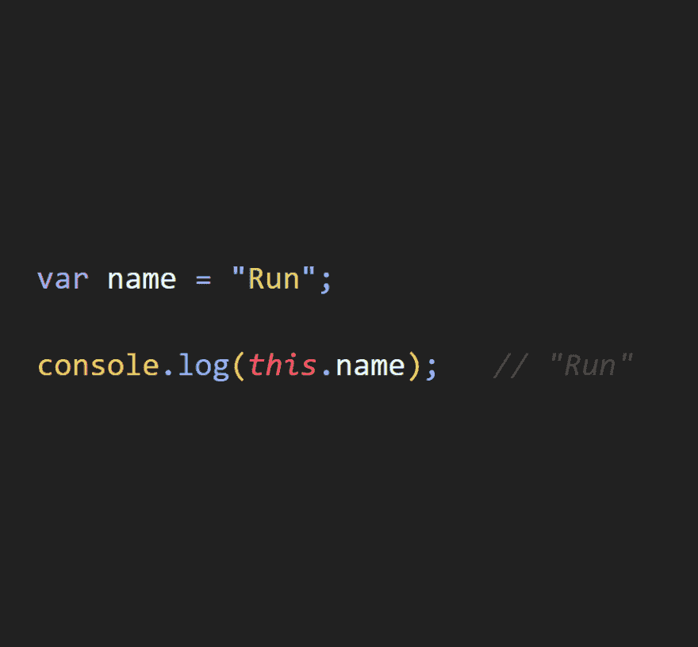
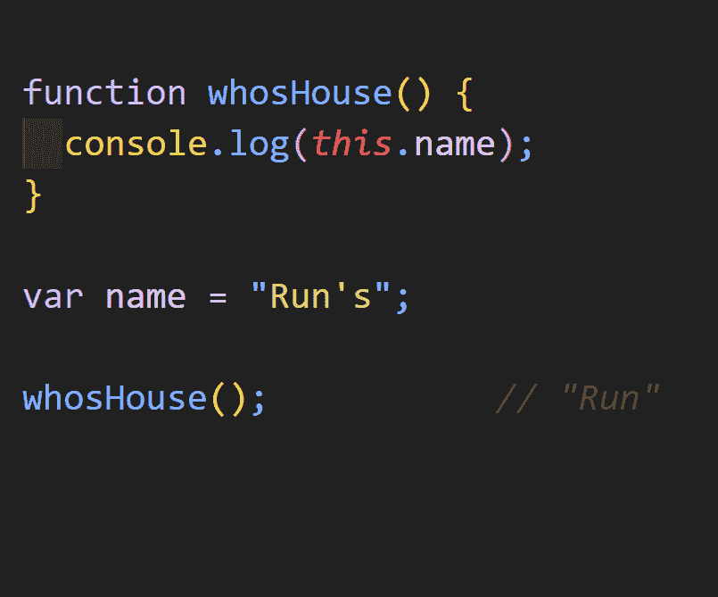
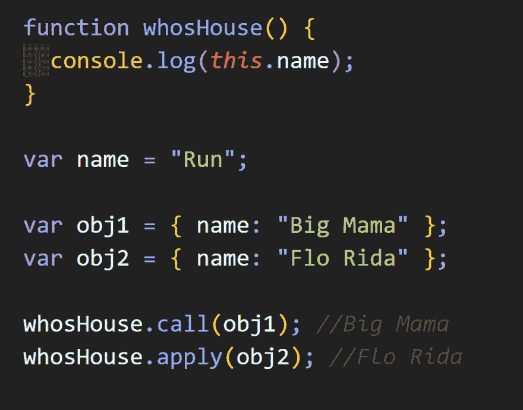
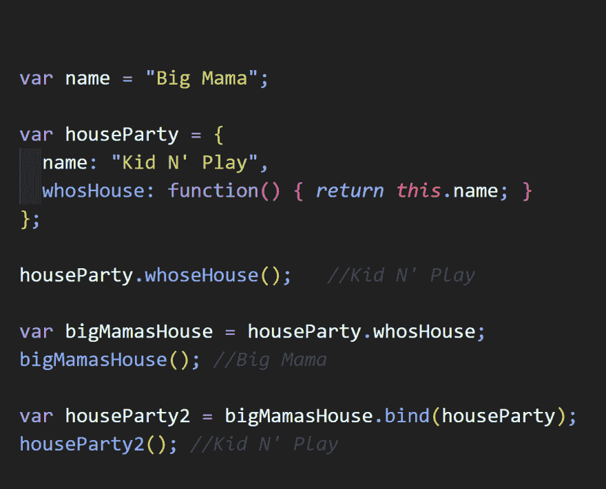
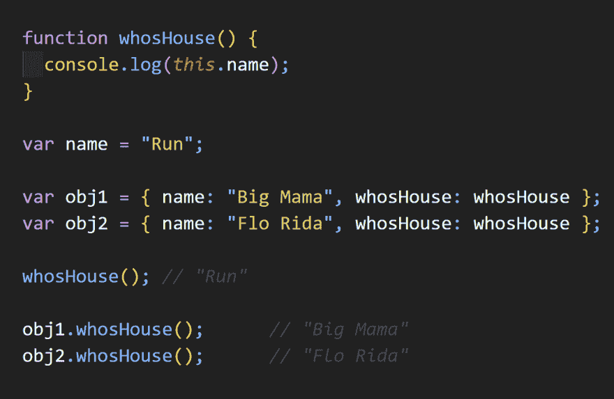
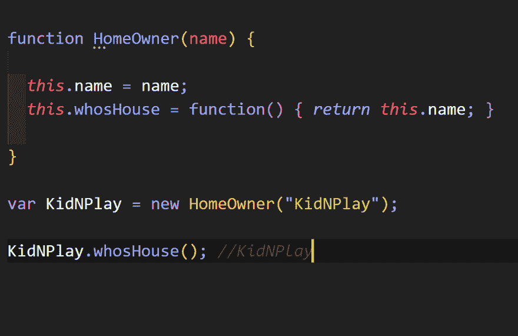

# 谁的房子？这个名字的房子！

> 原文：<https://dev.to/geoffreyianward/who-s-house-this-name-s-house-59da>

### ***【这个】*就可以了。评估 javascript 关键字*‘this’*的值。**

在编码中，没有什么比关键字“this”更能引起大众的困惑和恐慌了。“这”是什么？“这个”是怎么来的？这个是谁的？“这”是什么意思？？即使问一些关于“这个”的合理问题，也会让你看起来有些疯狂。没事的，冷静点，我们要一起踏上这段旅程。我们来谈谈在 javascript 中评估关键字‘this’的值。

简单地说，“this”是一个指向某个对象的关键字。它通常被定义在一个函数中，但是它可以在大多数其他上下文中安全地使用，而不会抛出一个错误(尽管它很可能不表示您正在寻找的值，除非您正在寻找一些非常奇怪的值)。当考虑“this”时，要记住的最重要的事情是记住“this”是何时被调用的，而不是“this”是何时被声明的。声明对关键字“this”没有任何权力，它在代码中浮动，没有任何意义或价值，直到 **BOOM** -代码被调用，现在“this”指向一个对象，完全基于它在程序中被调用的时间。因此，可以放心地忽略“this”是如何声明的或何时定义的，而完全专注于“this”是如何以及何时被调用的。还和我在一起吗？没有吗？别担心，我们会一起到达那里的。跟我来。

在审查代码时，有 6 种主要的方法来确定“this”的值。当试图确定“这个”的值时，按照这个列表，你应该能够确定“这个”的值。“this”的这些调用如下，按照我们将回顾它们的顺序:

*   全球参考
*   自由函数调用
*   调用、绑定或应用
*   方法调用
*   建设模式
*   箭头功能

**全球参考** -我很难想出你想故意这么做的时候。尽管如此，我们仍然非常欢迎你公开宣布“这个”,没有理由也没有约束。在这种情况下，‘这个’还是要指向某个东西。在大多数情况下，“这”将指向全局对象，高于所有其他对象的对象，主对象，尊贵的主对象，又名*全局窗口*。在 javascript 中，大多数“事物”实际上是对象，并且大多数代码运行在一个巨大的对象中——这个“窗口”保存着其中包含的所有对象的原型属性。所以当你在全局作用域中使用' this '时，它会指向全局对象，并找出附属于该对象的键。如果不小心的话，这可能会产生意想不到的结果。任何用关键字“var”声明的变量都会附加到全局窗口上，可以使用“this”来访问(在 ES6 的实现中，关键字“const”和“let”不会附加到窗口上，所以如果您不想寻找意外的连接，使用它们会更安全)。正如你在下面的例子中看到的，可以引用‘this’向我们展示它 ***润之家*** 。

**自由函数调用**——任何时候一个函数被自由调用，我们称之为自由函数调用。这些对于简洁的纯功能性来说是很棒的，不依赖于任何其他系统，不依赖于其他对象。然而，当使用关键字“this”时，这些可能会很糟糕。对 FFI 使用“this”的结果是“this”再次指向全局窗口。如果我是一个喜欢打赌的人(我不是，除非你对一匹不会输的马有可靠的把握)，我会说，所有错过的“this”连接(我们在“商业”中称之为“thissed”连接)中有 90%最终会无意中指向全球窗口。在这个例子中，我们创建了一个函数，它会问一个经典的问题:“谁的房子？”我们可以在这里看到，使用 FFI，它仍然肯定是 ***Run 的房子*** 。

**打电话，申请或绑定** -哦，这些家伙。他们是休伊，杜伊，和卢伊“这是史高治·麦克老鸭。大体相同，用*稍微不同的颜色帽子*来区分它们，调用、应用和绑定是操纵关键字‘this’来表示我们为其选择的值的强大工具。Call 和 Apply 的工作基本相同，通常可以互换(两者的主要区别在于参数的输入方式，但我们将在另一天讨论这一点)。两者都接受一个参数，并在调用附加到“this”的方法之前将“this”附加到该参数。听起来很迟钝，但它实际上创建了一个直接的视觉化的‘这’将指向哪里。我们有我们的“谁的房子？”函数，我们在这里调用了几次。通常，这将是 Run 的房子，但是我们使用 Call 和 Apply 来发送“this”来追踪这些值。在这两个调用的情况下，现在调用和应用 cause‘this’分别指向 ***大妈家*** 和 ***弗洛·里达家*** 。

Bind 的操作与它的两个表亲稍有不同。虽然 Call 和 Apply 会立即触发该方法，但 Bind 不会触发该方法。相反，它将一个参数附加到方法上，并创建一个全新的函数，供以后调用。这些连接是永久的，因此 Bind 不能被重新分配。这样做绝对是愚蠢的。如果你想用已经绑定的东西重新赋值，你只需要创建另一个函数。在这个例子中，我们的全局名称是 Big Mama。我们创建了一个名为 Kid N' Play 的对象，用一个方法再次确定“谁的房子？”。我们在下面看到“this”的值是如何改变的，以及我们如何使用 BIND 的能力将它重新附加到 Kid N' Play 上！现在是 ***小鬼当家*** 。

**方法调用**——说到方法，我们到了！方法是最常见的...确定“这个”值的方法。幸运的是，这也是最简单的方法之一。当使用关键字“this”调用一个方法时，我们只需查看方法调用前的点的左边。这就是“这”将指向的。就这么简单！我们甚至不必在这里久住，这太简单了。在下面的例子中，当 whosHouse 作为一个方法被调用时，我们只需看点的左边。我们看到 obj1 和 obj2，并且在每种情况下‘this’都指向那些对象。我们带着**回来了*大妈家*T5*弗洛·里达家*T9】。看，“这个”并不难，对吧？我知道你最终会找到乐趣的。**

**构造模式** -通常当我们开始使用构造函数时，我们会实现关键字‘this’。当我们这样做时，必须记住“this”永远不会指向构造函数本身。相反，“this”将指向我们正在查看的构造函数的任何新实例。在这里，我们使用“new”关键字来创建一个新的对象，一个更好的对象，一个独特的儿童游戏对象。当我们调用 whosHouse 函数时，“this”将引用这个新对象，而不是用来构建它的构造函数对象。你知道吗，豪斯医生的电影最初是考虑到威尔·史密斯和 DJ 爵士杰夫而创作的？你现在知道了。继续前进。

在确定“this”的值时，我们还有最后一个因素，但首先让我们谈谈确定“this”时的查找层次。Javascript 将尝试基于某些因素的存在来分配“this”。按重要性排列，它们是:

*   首先，它检查函数是否是用 new 关键字调用的。构造函数的实例获得第一优先权。
*   其次，它检查函数是否是用 call、bind 或 apply 调用的。正如您所想象的，这些绑定覆盖了其他绑定并取代了它们。
*   第三，它检查函数是否通过上下文对象调用。这是我们常见的方法调用。看这个点的左边！
*   最后，Javascript 将查看全局窗口。如果“这”是评估一些非常奇怪的东西，它可能指向这里。

箭头函数 -我在这里只简单地介绍一下，因为老实说，箭头函数应该有自己的位置(和 ES6 的大部分实现一样，这是我渴望详细讨论的一个特性)。箭头函数是一个较新的问题，但是随着 ES6 约定的传播，它们变得越来越常见。箭头函数对“this”有一个有趣的影响。与其他方法相反，它们将“this”绑定到声明它的词法范围。我说过不用担心“this”在哪里声明？在这种情况下，把它扔出窗外。箭头函数可能是一种强有力的方式来使“这”服从你的意志，或者如果你不注意，它们可能会使你的整个代码偏离轨道(这种情况发生在比我小的人身上，但从来没有发生在我身上，没有先生)。不管怎样，我计划写一篇更大的关于 Arrow 函数的能力的文章，我们将在其中进一步讨论这个问题。

所以现在就这样吧！一旦你理解了它被调用的环境，这真的没那么可怕。一旦你理解了这些环境，你只需要在运行时评估它们，看看“这”会把你引向何方。在那之前-谁的房子？ ***润之家*** 。

