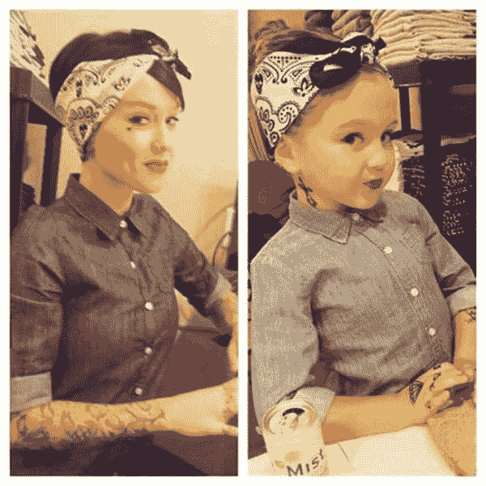

# Object.create 是什么？(剧透:它创造了物体)

> 原文：<https://dev.to/chapmancarin/what-s-object-create-spoiler-it-creates-objects-1nl3>

Object.create 是新的。

尽管与“new”关键字的圆滑外形相比，Object.create 可能看起来很笨拙，但它是一种方法，是道格拉斯·克洛克福特——每个人都喜欢的脾气暴躁的 JavaScript 爷爷——创建的，以规避他认为的“new”关键字的问题。

Object.create()是一个非常简单的方法。它有一个强制参数和一个可选参数(你可能不应该使用)。

第一个参数是您希望用作“父”对象的对象，您的全新弹跳婴儿对象将从该对象继承其方法和属性。

`const babyObj = Object.create(parentObj);`

第二个参数本质上等同于 Object.defineProperties。(如果您不熟悉，但希望熟悉，请查看这里的。但是您真正需要知道的是，这个可选参数允许您向新的 baby 对象添加属性，例如下面这个新的 babyObj 是如何添加了“bad:idea”属性的。)

`const babyObj = Object.create(parentObj, { bad: {value: idea} })`

不过，第二个参数的语法非常笨拙。所以，真实的谈话:不要使用它。只需创建新的婴儿对象，然后在对象创建后，使用好的旧点符号添加您想要的任何新属性。就这样，你有了一个全新的依赖型婴儿 bj，他继承了你所有的(可能有缺陷的)财产。

从这里开始，babyObj 将继续获得它自己的新属性，这些属性对你来说毫无意义，你将无法访问或理解。

这就像如果你的婴儿对象在成长过程中喜欢 Run-D.M.C .因为当然你的婴儿继承了你所有的音乐品味，但然后婴儿对象开始听 Post Malone，并且实际上似乎很喜欢它——这是你，亲爱的父母对象绝对没有的属性，并且你的婴儿对象没有从你那里继承。
 
在那种情况下，你不可能突然也听信马龙的帖子并声称那是你自己的财产。你不应该试图这样做，因为你会看起来很傻，你会让你的宝贝对象尴尬，整个世界都会说，“哇，这绝对是个错误。”放松，坚持你自己的属性，看着你的宝贝对象在这个世界上前进，成为一个完全成熟的对象，拥有自己的新属性，有一天它很可能会后悔，删除 babyObj.postMalone。你的 babyObj 将永远拥有你传递给它的属性。(尽管从技术上讲，它可以用自己的值覆盖它们，而且很可能会在大学里这样做，但现在不要担心这个。只是享受你的物体按照你自己的形象被创造出来。)

换句话说，用 JS 术语来说，使用 Object.create 产生的对象的新实例继承了用作原型的对象的所有属性。这意味着，如果你试图访问新对象上的一个属性，但该属性在新对象上不存在，JavaScript，作为一个体贴的甜心，会说，“哦，那里不存在，但我看到我可以查找那个婴儿对象的原型对象，天哪，那个属性*在父/原型对象上存在吗*，所以开始！”婴儿对象可以访问父对象以及祖父母对象、曾祖父母对象、曾曾祖父母对象等的所有属性。一直到最初的伊甸园，大写的 O 形物体。

同样，用 JS 术语来说，这意味着在对象实例上查找失败将会沿着原型继承链下降。如果在任何地方找到了想要的属性，那么婴儿对象将可以访问该属性。但是和上面例子中的 Post Malone 一样，旧对象不能访问新对象的属性。

`const parentObj = { haircut: "sensible", clothing: "typical"}
const babyObj = Object.create(parentObj);
babyObj.haircut; // "sensible"`

特别要注意的是，一个对象的新实例是一个全新的对象；它是不是*而不是*它所来自的原型对象的副本，所以如果你改变父/原型对象，对象的子/新实例*将*继承那些改变，但是如果你改变子/新对象，那些改变将不会影响父/原型对象。

`babyObj.haircut = "tri-hawk with devil lock";
console.log(babyObj.haircut); // "tri-hawk with devil lock"
console.log(parentObj.haircut); // "sensible"`

除了仅用于创建新对象之外，Object.create 在使用时真正展示了它的功能，例如，在子类化示例中，使用伪经典实例化模式，这要求您显式设置所有新对象实例的原型，以便访问您在超类构造函数上设置的所有优秀属性和超级方法。

`const ParentHuman = function(){
this.creature = "individual";
this.haircut = "sensible";
this.clothing = "typical";
}
ParentHuman.prototype.enjoy = function(music){
console.log("Run D.M.C");
}
const ChildHuman = function(){
ParentHuman.call(this);
this.haircut = "tri-hawk with devil lock";
}
ChildHuman.prototype = Object.create(ParentHuman.prototype);
ChildHuman.prototype.constructor = ChildHuman;
const Jr = new ChildHuman();
Jr.creature // "individual"
Jr.haircut // "tri-hawk with devil lock";
Jr.enjoy() // "Run D.M.C." ...(for now)`

Object.create 解决了子类化存在的一些问题，它使得通过 prototype 将新的子类与超类连接起来变得非常简单。出于这个原因以及其他原因，Object.create 不容忽视。闪亮的*新的*东西也很酷，但是下次你想创建一个新的对象而不需要重写方法和属性的时候，请记住 Object.create。