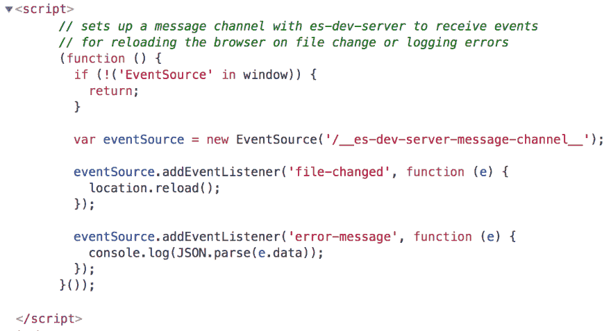
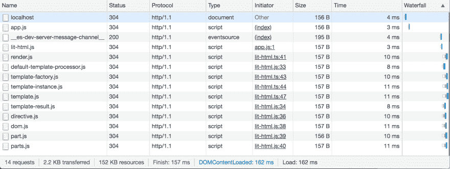

# 无构建开发(2): es-dev-server

> 原文：<https://dev.to/open-wc/developing-without-a-build-2-es-dev-server-1cf5>

# 开发无构建:es-dev-server

本文是关于无构建开发的系列文章的一部分:

1.  [简介](https://dev.to/open-wc/developing-without-a-build-1-introduction-26ao)
2.  [es-dev-server(本文)](https://dev.to/open-wc/developing-without-a-build-2-es-dev-server-1cf5)
3.  测试(即将推出！)

在[介绍文章](https://dev.to/open-wc/developing-without-a-build-1-introduction-26ao)中，我们研究了不同的工作流和浏览器 API。在本文中，我们将研究如何设置`es-dev-server`，以及它如何帮助我们在没有构建的情况下进行开发。

## es-dev-server

es-dev-server 是一个可组合的 web 服务器，在没有构建步骤的情况下开发时，它专注于开发人员的生产力。通过选项，您可以选择额外的功能，如缓存、文件更改时重新加载、SPA 路由、解析裸模块导入和支持旧浏览器的兼容模式。

## 设置

首先，让我们创建一个空的 npm 项目并安装`es-dev-server` :

```
npm init
npm i -D es-dev-server 
```

在项目的根目录下创建一个`index.html`:

```
<!DOCTYPE html>
<html>
<head></head>

<body>
  <div id="app"></div>
  <script type="module" src="./src/app.js"></script>
</body>

</html> 
```

并创建一个虚拟的`src/app.js`文件:

```
console.log('hello world'); 
```

我们现在可以用`es-dev-server` :
运行我们的应用程序

```
npx es-dev-server --open 
```

没有任何额外的标志，`es-dev-server`就像一个常规的静态文件服务器。任何额外的功能都需要显式启用。

## 裸进口

在没有任何构建工具的情况下进行开发时，首先会遇到的一个问题是如何处理这样的裸模块导入:

```
import foo from 'foo'; 
```

开箱即用时，浏览器会抛出一个错误，因为它不知道如何处理这些类型的导入。在我们的[上一篇文章](https://dev.to/open-wc/developing-without-a-build-1-introduction-26ao)中，我们探索了如何通过使用即将推出的浏览器 API import maps 来使用这些导入。

在浏览器正确支持导入地图之前，我们可以使用 dev 服务器的`--node-resolve`标志。这将使用 NodeJS 模块解析重写模块中的导入，然后将它们提供给浏览器。

为了了解这是如何工作的，让我们将一个 HTML 模板库`lit-html`添加到我们的项目:

```
npm i -D lit-html 
```

更改`src/app.js`以导入:

```
import { render, html } from 'lit-html';

const template = html`<p>Hello world!</p>`;
render(template, document.getElementById('app')); 
```

现在让我们重新启动我们的服务器，添加节点解析标志:

```
npx es-dev-server --node-resolve --open 
```

如果您检查 network 选项卡，您将看到模块如预期的那样得到了正确的服务。`src/app.js`改写为:

```
import { render, html } from './node_modules/lit-html/lit-html.js';

const template = html`<p>Hello world!</p>`;
render(template, document.getElementById('app')); 
```

## 观看模式

当你编辑文件的时候，重新加载浏览器是一个很好的提高生产力的方法。

要启用此选项，请使用`watch`标志:
重新启动服务器

```
npx es-dev-server --watch --node-resolve --open 
```

现在修改一个服务文件中的任何内容，例如在`app.js`中呈现的 html。您将看到浏览器自动重新加载更新后的代码。

重新加载使用`EventSource` API 完成，Edge 和 IE11 不支持。dev 服务器注入一个小脚本，它连接到消息通道端点:

[](https://res.cloudinary.com/practicaldev/image/fetch/s--imLkAHHS--/c_limit%2Cf_auto%2Cfl_progressive%2Cq_auto%2Cw_880/https://thepracticaldev.s3.amazonaws.com/i/pqtk7vbxxkm3d88lfgxs.png)

## 缓存

如果文件没有改变，使用文件系统的最后修改时间戳返回 304。这大大加快了重新加载的速度。您可以在您的浏览器中通过关闭`Disable cache`并刷新来测试:

[](https://res.cloudinary.com/practicaldev/image/fetch/s---9FdBitG--/c_limit%2Cf_auto%2Cfl_progressive%2Cq_auto%2Cw_880/https://thepracticaldev.s3.amazonaws.com/i/qszke0x58csc9eu9337g.png)

## 文件夹结构

不是每个项目在项目的根中都有一个单独的`index.html`。因为`es-dev-server`就像一个普通的网络服务器一样工作，它可以提供来自任何文件夹的文件。

例如，让我们创建一个名为`demo`的新文件夹，并将我们的`index.html`移动到其中。

我们将需要调整脚本 src 路径来反映这一变化:

```
<script type="module" src="../src/app.js"></script> 
```

我们需要告诉服务器打开演示文件夹:

```
npx es-dev-server --node-resolve --open /demo/ 
```

应该会显示应用程序，而不做任何更改。

### 改变根目录

为了去掉 URL:
中的`/demo/`部分，我们可能会改变 web 服务器的根目录

```
npx es-dev-server --root-dir /demo/ --open 
```

然而，这是行不通的，因为 web 服务器只能服务于其根目录下的文件。默认情况下，这是当前工作目录。在我们的例子中，web 服务器需要能够提供`src`文件夹和`node_modules`文件夹的内容。

这是在 monorepo 中工作时的一个常见问题，因为您希望从包子目录中提供文件。您需要服务的许多模块都在项目的根目录中，因此您需要将根目录向上移动两级:

```
npx es-dev-server --root-dir ../../ --open packages/my-package/index.html 
```

## SPA 路由

如果您正在构建一个单页面应用程序，您可能会进行某种形式的前端路由。为了启用深度链接或刷新，web 服务器应该在更深的路径上返回您的`index.html`。这有时被称为历史 API 回退。

设置路由器超出了本文的范围，但是使用`--app-index`标志:
很容易启用该选项

```
npx es-dev-server --node-resolve --app-index index.html --open 
```

使用`--app-index`标志时，如果你没有传递一个明确的路径到`--open`，服务器会自动打开你的应用的索引上的服务器。

## 兼容旧浏览器

尽管我们可以使用主流浏览器的最新版本进行开发，但我们仍然需要在生产中支持旧版本的浏览器。我们也可能会使用一些新的浏览器功能，这些功能在所有主流浏览器的最新版本中还不被支持。

如果每次我们想在这些浏览器上运行我们的应用程序时，我们都必须运行一个生产版本，这将是一个遗憾。`es-dev-server`支持多种兼容模式，有助于实现这一点。

启用兼容模式后，服务器会为旧浏览器处理必要的多填充和代码转换。这将我们带入构建工具的领域，因此我们不再是纯粹的“没有构建工具的开发”。我认为这很好，因为我们使用它只是为了浏览器的兼容性。你必须明确地选择加入这种行为。

让我们看看它是如何工作的。向`app.js`添加一个动态导入，以便在点击按钮时延迟加载模块:

```
import { html, render } from 'lit-html';

async function lazyLoad() {
  await import('lit-html/directives/until.js');
}

const template = html`
  <button @click=${lazyLoad}>Click me!</button>
`;
render(template, document.getElementById('app')); 
```

动态导入实际上不做任何功能性的事情。如果我们在 Chrome、Safari 和 Firefox 上运行它，效果会很好。因为 Edge 还不支持动态导入，所以我们不能在那里运行这段代码。

我们可以打开最轻的兼容模式`esm`来处理这种情况:

```
npx es-dev-server --node-resolve --compatibility esm --open 
```

随着`esm`的启用，`es-dev-server`注入 [es-module-shims](https://www.npmjs.com/package/es-module-shims) 并将加载器脚本添加到您的索引中。您不需要为此更改任何代码。您可以在索引文件中查看注入的脚本:

[](https://res.cloudinary.com/practicaldev/image/fetch/s--4iZ1QNUQ--/c_limit%2Cf_auto%2Cfl_progressive%2Cq_auto%2Cw_880/https://thepracticaldev.s3.amazonaws.com/i/l8kome6iuhstjb8p4ycr.png)

有一些额外的样板文件，因为其他兼容模式可能会添加更多的聚合填充。聚合填充经过哈希处理，因此可以在浏览器中进行主动缓存。

除了`esm`还有`modern`和`all`兼容模式。这些模式为通用浏览器 API 注入聚合填充，并使用`@babel/preset-env`将最新的 javascript 语法转换为兼容的格式。

在兼容模式下，你的代码兼容 Chrome、Safari、Firefox 和 Edge 的最新两个版本。

在`all`中，兼容模式支持被扩展到旧的浏览器，一直到 IE11。在不支持 es 模块的浏览器上，它们被转换成 [systemjs 模块](https://www.npmjs.com/package/systemjs)。

转换会降低服务器的速度，所以我不建议在常规开发中使用`modern`或`all`模式。你可以在你的`package.json`中创建单独的脚本，并且只有当你在老版本的浏览器上查看你的应用程序时才在兼容模式下运行。

模式对性能的影响可以忽略不计，所以应该可以使用。

## 导入地图

在上一篇文章中，我们简要讨论了导入映射，这是一个即将推出的浏览器特性，可以处理裸模块导入。`es-module-shims`和`systemjs`都支持导入贴图。如果启用了兼容模式，dev 服务器会负责调整您的导入映射以与这些库一起工作，使之成为开发过程中一个可行的工作流。

import maps API 还没有完全稳定下来，所以如果你正在走这条路，最好关注一下这个标准是如何发展的。[查看本文](https://dev.to/open-wc/on-the-bleeding-edge-3cb8)了解使用导入地图的工作流程。

## 更多选项

[查看官方文档](https://github.com/open-wc/open-wc/tree/master/packages/es-dev-server)了解更多选项，例如将 dev 服务器作为一个库与其他工具集成，以及安装定制中间件。

## 入门

要开始一个为您设置开发服务器的项目，使用`open-wc`项目脚手架:

```
npm init @open-wc 
```

它用 web 组件库`lit-element`设置项目。您可以将它替换为您选择的任何库，该设置并不特定于 web 组件。