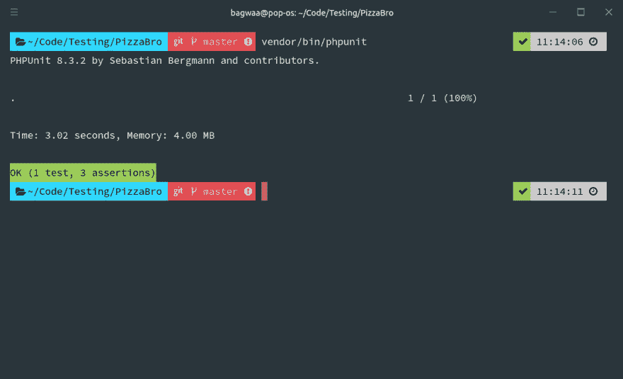
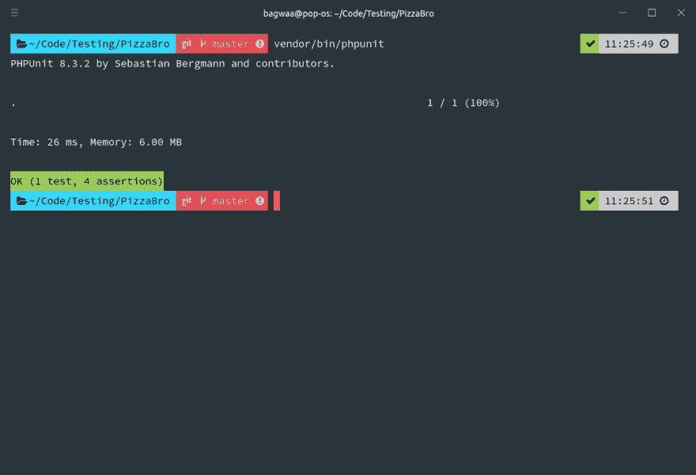

# 用 PHPUnit 和预言嘲弄依赖

> 原文：<https://dev.to/bagwaa/mocking-dependencies-with-phpunit-and-prophecy-2pig>

如今，单元测试是开发和编程的重要部分，在 PHP 社区中，最广泛采用的是 [PHPUnit](https://phpunit.de/) 。

这些年来，我见过各种各样的单元测试库和框架来来去去，但是 [PHPUnit](https://phpunit.de/) 似乎是最能引起我共鸣的一个，现在几乎是我选择的单元测试框架。

在那段时间里，我也尝试了许多嘲讽框架，从标准的 [PHPUnit 嘲讽库](https://phpunit.de/manual/6.5/en/test-doubles.html)到[嘲讽库](http://docs.mockery.io/en/latest/#)，但我最喜欢的是[预言](https://github.com/phpspec/prophecy)，不仅因为它使用简单，还因为它是 PHPUnit 本身的一部分。

在我们开始测试之前，我们需要确保我们在同一页上，我们需要提到[依赖注入](https://en.wikipedia.org/wiki/Dependency_injection)，这将使我们能够孤立地测试我们的代码。

## 什么是依赖注入？

当运行我们的测试时，我们通常会测试依赖于项目中其他代码单元的代码单元，这些依赖关系通常使用[依赖注入](https://en.wikipedia.org/wiki/Dependency_injection)注入到我们的类中，这使我们能够隔离测试。

如果没有依赖注入，我们的代码将是紧密耦合的，这将使测试非常困难，在某些情况下是不可能的。让我们快速看一下 PHP 中的依赖注入是什么样子的。

```
// PizzaMaker.php

namespace App;

use App\Repositories\PizzaRepository;

class PizzaMaker
{
    protected $repository;

    public function __construct(PizzaRepository $repository)
    {
        $this->repository = $repository;
    }

    public function makePizza(array $toppings) : Pizza
    {
        $pizza = new Pizza($toppings);

        $this->repository->save($pizza);

        return $pizza;
    }
} 
```

在这个例子中，我们有一个负责生成`Pizza`的`PizzaMaker`类，但是你会看到，当我们调用`makePizza()`时，我们正在创建新的`Pizza`，然后将我们创建的传递到`PizzaRepository()`的`save()`方法中

`PizzaRepository`类处理将`Pizza`持久化到数据库，因此，它必须向数据库发送请求来存储该信息。

当我们运行我们的测试时，在大多数情况下，我们希望避免碰到数据库，如果我们不这样做，那么我们的测试套件将变得依赖于我们的数据库连接，并将减慢我们的测试。

当您有一个或两个测试时，这不是太大的问题，但是当您有数千个测试时，您可能需要等待 20 分钟来运行整个测试套件。

## 命中数据库和服务意味着测试变慢

您可能会坐在那里想知道为什么等待这么长时间的慢速测试是一个问题？嗯，这是因为我们想要非常快速的单元测试，这样我们就可以在红色、绿色、重构循环中有一个快速的反馈循环。

如果你等待测试通过的时间很长，那么你就不会运行它们，当然你也不会采用 TDD 来驱动你的代码设计。

让我们看看我们例子中的`PizzaRepository`，这通常是调用数据库的类，然而，在这种情况下，我们使用`sleep(3)`来模拟对数据库的缓慢调用。

另外，请注意，我知道数据库通常不会花 3 秒钟来保存记录，我只是将此作为降低测试套件速度的一个极端例子，这样我们只需一次测试就可以清楚地看到不同之处。

```
// PizzaRepository.php

namespace App\Repositories;

use App\Pizza;

class PizzaRepository
{
    public function save(Pizza $pizza)
    {
        // Simulate a long running database action for 3 seconds.
        sleep(3);

        $pizza->save();

        return $pizza;
    }
} 
```

接下来，让我们创建世界上最好的比萨饼类型，并创建一个简单的测试来确保我们可以在`PizzaMaker`类上使用`makePizza()`方法创建一个`Pizza`。

```
// PizzaMakerTest.php

use App\PizzaMaker;
use App\Repositories\PizzaRepository;
use PHPUnit\Framework\TestCase;

class PizzaMakerTest extends TestCase
{
    public function test_it_can_create_an_hawaiian_pizza()
    {
        $pizzaMaker = new PizzaMaker(new PizzaRepository);

        $pizza = $pizzaMaker->makePizza([
            'Ham',
            'Pineapple'
        ]);

        $this->assertContains('Ham', $pizza->getToppings());
        $this->assertContains('Pineapple', $pizza->getToppings());
        $this->assertNotContains('Fish', $pizza->getToppings());
    }
} 
```

接下来，我们需要使用这个快速反馈循环，让我们运行我们的测试套件，确保一切都正常工作，并且我们的测试是绿色的。

[](https://res.cloudinary.com/practicaldev/image/fetch/s--hUqiTDXW--/c_limit%2Cf_auto%2Cfl_progressive%2Cq_auto%2Cw_880/https://thepracticaldev.s3.amazonaws.com/i/w3roqrzpba0xp3ujv7cr.png)

胜利！通过了！-但是，我们先不要开香槟庆祝，这个测试有一个很大的问题，看看单独运行这个测试所花的时间。

```
Time: 3.02 seconds, Memory: 4.00 MB 
```

哎哟！，那个测试花了整整`3.02`秒来运行，这可不好。

在这一点上应该很明显，通过运行我们的测试，我们也调用了非常慢的`PizzaRepository`类上的`save()`方法。

## 什么是模拟，我们为什么需要它？

当我们想要替换一个正在测试的类的依赖项时，会用到 mock，在上面的例子中，测试运行得很慢，因为我们间接调用了包含一个`sleep(3)`的`PizzaRepository`类的`save()`方法

我们只需要用一个 mock 来替换这种依赖关系，它看起来和行为可能是一样的，但是不会将任何东西保存到数据库中，也不会在其中包含那个可怕的`sleep(3)`调用。

## 用预言创造嘲弄

我们所要做的就是创建一个对`PizzaRepository`依赖的模拟，然后在测试时将它传递给我们的`PizzaMaker`类，让我们稍微重构一下测试，看看这个会是什么样子。

```
// PizzaMakerTest.php

use App\Pizza;
use App\PizzaMaker;
use Prophecy\Argument;
use PHPUnit\Framework\TestCase;
use App\Repositories\PizzaRepository;

class PizzaMakerTest extends TestCase
{
    public function test_it_can_create_a_hawaiian_pizza()
    {
        $repository = $this->prophesize(PizzaRepository::class);

        $repository->save(Argument::type(Pizza::class))
                   ->shouldBeCalledOnce();

        $pizzaMaker = new PizzaMaker($repository->reveal());

        $pizza = $pizzaMaker->makePizza([
            'Ham',
            'Pineapple'
        ]);

        $this->assertContains('Ham', $pizza->getToppings());
        $this->assertContains('Pineapple', $pizza->getToppings());
        $this->assertNotContains('Fish', $pizza->getToppings());
    }
} 
```

在我们再次运行测试以查看结果之前，我们有一些事情要讨论，因为我们已经添加了两行额外的代码并修改了第三行。

在测试的第一行，我们添加了:-

```
$repository = $this->prophesize(PizzaRepository::class); 
```

这将创建一个新的模拟实例`PizzaRepository`，它看起来是一样的，然而，这个模拟类上的所有方法在被调用时将什么都不做，这包括运行缓慢的`save()`方法，在这种情况下它将返回`null`。

在下一行，我们设置了一些期望值，我们不关心`PizzaRepository`是否真的保存了数据，我们关心的只是它被要求正确保存数据。

```
$repository->save(Argument::type(Pizza::class))
           ->shouldBeCalledOnce(); 
```

在这里，我们在模拟上设置了一些预期的行为，当我们运行测试时，我们预期会发生一些事情，如果这些预期没有达到，那么测试将失败。

在本例中，我们对被模仿的`PizzaRepository`对象设置了以下期望。

*   将在`PizzaRepository`上调用`save()`方法
*   将使用类型为`Pizza`的参数调用`save()`方法。(例如，如果我们试图传入一个类型为`Taco`的对象，它将无法通过测试)
*   `save()`方法将被调用一次，且只能调用一次

我们对测试做的最后修改也是最重要的修改是改变我们在测试中构造`PizzaMaker`的方式。因为我们在代码中是聪明的程序员，并且使用了依赖注入，所以这很容易。

之前，我们是这样构建`PizzaMaker`的:-

```
$pizzaMaker = new PizzaMaker(new PizzaRepository); 
```

我们注入了真正的`PizzaRepository`类，非常适合生产，但是不太适合测试。

同样，这里需要注意的一点是，我们不关心测试`PizzaRepository`依赖项，它在其他地方有自己单独的测试，我们关心的只是测试`PizzaMaker`类。

好了，让我们用我们之前创建的模拟测试来替换测试中的`PizzaRepository`,并设置一些期望。

```
$pizzaMaker = new PizzaMaker($repository->reveal()); 
```

简单！然而，你可能想知道那个`reveal()`调用是什么，我们从来没有创建过它，不是吗？那是从哪里来的？

如果我们转储掉没有显示的`$repository`对象的类类型，我们会看到下面的内容:-

```
var_dump(get_class($repository));
// string(32) "Prophecy\Prophecy\ObjectProphecy" 
```

让我们看看当我们做同样的事情，但是添加了`reveal()`调用时，我们得到了什么。

```
var_dump(get_class($repository->reveal()));
// string(42) "Double\App\Repositories\PizzaRepository\P1" 
```

好的，这很有趣，我们有一个`Double\App\Repositories\PizzaRepository\P1`类，但是它在什么地方适合所有的东西呢？这是什么？

让我们使用 PHP `Reflection`类，做一些更深入的研究，看看我们是否能弄清楚这里发生了什么。

```
$repository = $this->prophesize(PizzaRepository::class);

$class = new ReflectionClass($repository->reveal());
$parent = $class->getParentClass()->getName();

var_dump($parent);
// string(32) "App\Repositories\PizzaRepository" 
```

啊哈！所以 Double 的父代是`string(32) "App\Repositories\PizzaRepository"`,这就是为什么我们的`PizzaMaker`乐于通过依赖注入来接受它。

好了，在杂草中挖够了，让我们进行测试。

[](https://res.cloudinary.com/practicaldev/image/fetch/s--OU49gUPC--/c_limit%2Cf_auto%2Cfl_progressive%2Cq_auto%2Cw_880/https://thepracticaldev.s3.amazonaws.com/i/yff7906hagzg9hoejly3.png)

看到那有多快了吗？`26 ms`对`3s`当我们不嘲笑它的时候。

我们已经创建了一个`PizzaRepository`的模拟实例，设置了一些应该在`PizzaRepository`上调用的期望，然后使用`reveal()`来获得我们模拟的`PizzaRepository`版本，它是`PizzaRepository`的子版本，然后使用依赖注入将它注入到`PizzaMaker`中。

这只是一个非常简单的模拟例子，我们还可以创建不同类型的模拟类，我将在另一篇文章中详细介绍。

## 那我们应该嘲笑一切吗？

这里简单的答案是否定的，而且很容易感觉到嘲笑一切的诱惑，但这不是一个好主意。

例如，如果你测试一个类，这个类有一个依赖项，这个依赖项做一些字符串操作，那么如果这个对象很简单，并且不涉及任何第三方服务或数据库，我通常会传入这个对象。

仅仅因为你可以模仿它并不意味着你应该这样做，有时只是传入一个简单依赖的实例就可以了。

此外，注意不要嘲笑你正在测试的类，这听起来很明显，但是你应该只嘲笑依赖项，我见过刚开始测试的开发人员试图嘲笑他们正在测试的类，显然这样做没有多大价值。

## 做有助于晚上睡眠的事情

像往常一样，你做多少嘲讽和测试很大程度上取决于你自己，不要试图达到 100%的覆盖率，也不要嘲笑每一个独立的依赖项，只要做那些有助于你晚上睡觉和使用一些常识的事情。