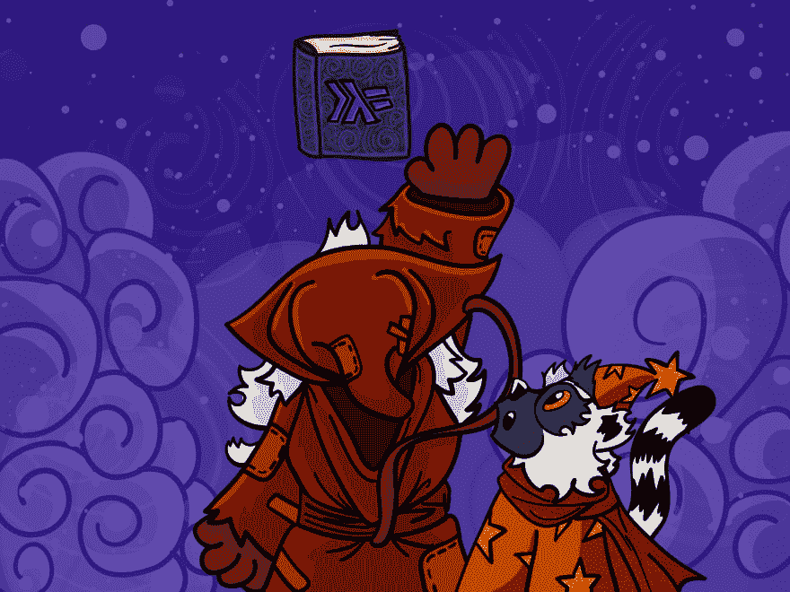
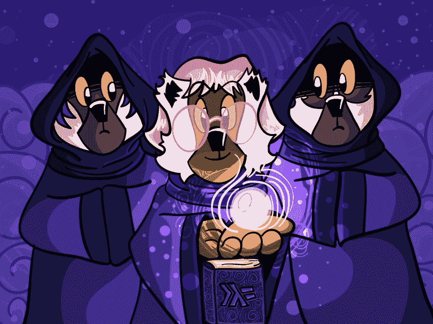
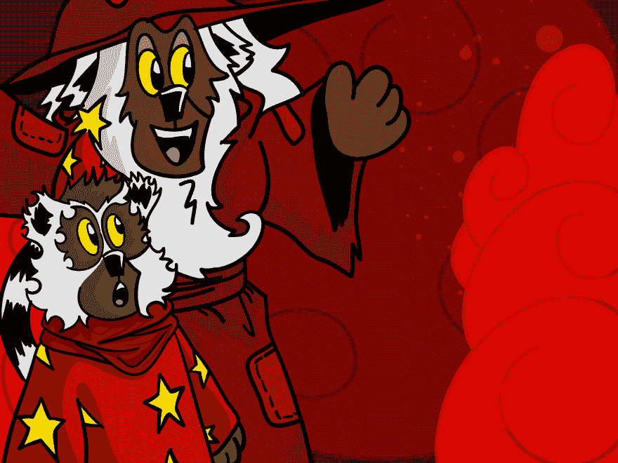
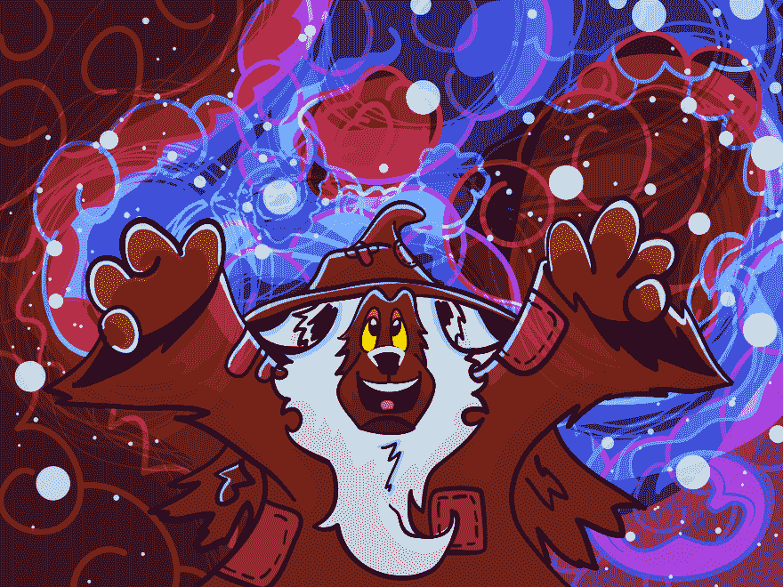

# 红宝石魔法书的故事-第四部分-哈斯克尔狐猴

> 原文：<https://dev.to/baweaver/tales-of-the-ruby-grimoire-part-four-the-lemurs-of-haskell-3p4f>

这是东南红宝石 2019 演讲的文本版本，也是传奇红宝石魔法书的许多故事中的第一个，这是一本关于红宝石黑暗魔法的伟大而可怕的书。

我把它分成几个部分，这样就不会让人不知所措，因为最初的演讲非常形象。如果您想跳到其他部分，目录在这里:

**目录**

1.  第一部分——魔法书
2.  第二部分——斯卡拉狐猴
3.  [第三部分 Javascript 的狐猴](https://dev.to/baweaver/tales-of-the-ruby-grimoire-part-three-the-lemurs-of-javascript-5ac9)
4.  第四部分——哈斯克尔的狐猴
5.  [第五部分——论魔法的本质](https://dev.to/baweaver/tales-of-the-ruby-grimoire-part-five-on-the-nature-of-magic-g63)

# 《红宝石魔法书》的故事——第四部——哈斯克尔的狐猴

其中瑞德向哈斯克尔的狐猴学习透镜艺术。

## 介绍哈斯克尔狐猴

[](https://res.cloudinary.com/practicaldev/image/fetch/s--1Qjp2px0--/c_limit%2Cf_auto%2Cfl_progressive%2Cq_auto%2Cw_880/https://thepracticaldev.s3.amazonaws.com/i/w7sjs104nxl4jxxhgj88.png)

现在我给你上最后一课，来自哈斯克尔王国的智者们。

[](https://res.cloudinary.com/practicaldev/image/fetch/s---a0hOgM1--/c_limit%2Cf_auto%2Cfl_progressive%2Cq_auto%2Cw_880/https://thepracticaldev.s3.amazonaws.com/i/ngr5euyxbsfgxg5yhk5c.png)

他们出身于象牙塔，他们带来的知识甚至远远超过我，但这些知识的迷人含义动摇了我们思考编程的方式的基础！

他们带来了透镜艺术，一种聚焦于某物并看到或改变其价值的能力。我不能说我完全理解它们，但觉得它们很吸引人。

## [镜片上的](#on-lenses)

[](https://res.cloudinary.com/practicaldev/image/fetch/s--kbJoWXRe--/c_limit%2Cf_auto%2Cfl_progressive%2Cq_auto%2Cw_880/https://thepracticaldev.s3.amazonaws.com/i/8mdi000pkhe4uigtsha1.png)

透镜允许 Haskell 的狐猴深入观察嵌套的数据结构，并在不改变数据的情况下对这些数据执行魔法。

他们从 Hackage 的书中告诉我的例子起初令人困惑，所以我采取了一些自由，试图让它为我自己所理解。

我不能说我理解`makeLenses`除此之外，他们如何填充大量代码使镜头工作，但我也许能解释其余的:

```
import Control.Lens hiding (element)
import Control.Lens.TH
{-# LANGUAGE TemplateHaskell #-}

data Atom =
  Atom { _element :: String, _point :: Point }

data Point =
  Point { _x :: Double, _y :: Double }

$(makeLenses ''Atom)
$(makeLenses ''Point)

moveNorth :: Atom -> Atom
moveNorth = over (point . y) (+ 1) 
```

<svg width="20px" height="20px" viewBox="0 0 24 24" class="highlight-action crayons-icon highlight-action--fullscreen-on"><title>Enter fullscreen mode</title></svg> <svg width="20px" height="20px" viewBox="0 0 24 24" class="highlight-action crayons-icon highlight-action--fullscreen-off"><title>Exit fullscreen mode</title></svg>

我们有数据`Atom`和`Point`，一个`Atom`包含一个`Point`。我们为他们两个制作镜头:

```
-- Atom  = [ element, point ]
-- Point = [ x, y ]

$(makeLenses ''Atom)
$(makeLenses ''Point)

moveNorth :: Atom -> Atom
moveNorth = over (point . y) (+ 1) 
```

<svg width="20px" height="20px" viewBox="0 0 24 24" class="highlight-action crayons-icon highlight-action--fullscreen-on"><title>Enter fullscreen mode</title></svg> <svg width="20px" height="20px" viewBox="0 0 24 24" class="highlight-action crayons-icon highlight-action--fullscreen-off"><title>Exit fullscreen mode</title></svg>

...我们创建一个函数，将一个`Atom`移动到北方，返回一个新的原子，大概是移动到北方了。

现在这个点有了一个`x`和`y`坐标，但是这个函数在做什么呢？

根据我的理解，让我们简化一下:

```
-- Atom  = [ element, point ]
-- Point = [ x, y ]

moveNorth = over (point . y) (+ 1) 
```

<svg width="20px" height="20px" viewBox="0 0 24 24" class="highlight-action crayons-icon highlight-action--fullscreen-on"><title>Enter fullscreen mode</title></svg> <svg width="20px" height="20px" viewBox="0 0 24 24" class="highlight-action crayons-icon highlight-action--fullscreen-off"><title>Exit fullscreen mode</title></svg>

`over`是一个函数，允许我们执行一个函数`over`看起来像或者行为像`lense`的东西。我们在`Atom`的点上做了一些事情，特别是它的`y`点，而`over`的那个`y`点我们加一。

lense 允许我们指定某个东西的路径，并运行函数`over`或者从这些结构中获取值。

## 镜片用红宝石？`dig`！

[](https://res.cloudinary.com/practicaldev/image/fetch/s--pCbbhA_6--/c_limit%2Cf_auto%2Cfl_progressive%2Cq_auto%2Cw_880/https://thepracticaldev.s3.amazonaws.com/i/6ytu0opix74k7jeg0tsm.png)

这看起来很抽象，但是你可能已经知道 Ruby 方法`dig`，它是 lense 概念的一半`get`。

```
hash = { a: { b: { c: 1 } } }
hash.dig(:a, :b, :c)
=> 1 
```

<svg width="20px" height="20px" viewBox="0 0 24 24" class="highlight-action crayons-icon highlight-action--fullscreen-on"><title>Enter fullscreen mode</title></svg> <svg width="20px" height="20px" viewBox="0 0 24 24" class="highlight-action crayons-icon highlight-action--fullscreen-off"><title>Exit fullscreen mode</title></svg>

它允许我们挖掘，以找到一个值，深嵌套在一个散列或数组，甚至两者的混合。这里需要注意的是路径:

```
:a, :b, :c 
```

<svg width="20px" height="20px" viewBox="0 0 24 24" class="highlight-action crayons-icon highlight-action--fullscreen-on"><title>Enter fullscreen mode</title></svg> <svg width="20px" height="20px" viewBox="0 0 24 24" class="highlight-action crayons-icon highlight-action--fullscreen-off"><title>Exit fullscreen mode</title></svg>

因此，如果我们想尝试在 Ruby 上应用这样的东西，可能会有点困难，但我们可以接近。记住，瑞德，我不是哈斯克尔狐猴。

## 制作“透镜”

[](https://res.cloudinary.com/practicaldev/image/fetch/s--HL5N8M1S--/c_limit%2Cf_auto%2Cfl_progressive%2Cq_auto%2Cw_880/https://thepracticaldev.s3.amazonaws.com/i/ffe74snjnj13tytazoah.png)

出于这个练习的目的，我们可以假设我们有一组嵌套了`a, b, c`的散列，其值从`1`到`5` :

```
hashes = (1..5).map { |n|
  { a: { b: { c: n } } }
}
=> [{:a=>{:b=>{:c=>1}}}, …] 
```

<svg width="20px" height="20px" viewBox="0 0 24 24" class="highlight-action crayons-icon highlight-action--fullscreen-on"><title>Enter fullscreen mode</title></svg> <svg width="20px" height="20px" viewBox="0 0 24 24" class="highlight-action crayons-icon highlight-action--fullscreen-off"><title>Exit fullscreen mode</title></svg>

我们将用这些来演示。

我们可以从捕获类中的路径开始，我们称之为作用域。看到了吗？听起来像 Lense！

```
class Scope
  def initialize(*paths)
    @paths = paths
  end
end 
```

<svg width="20px" height="20px" viewBox="0 0 24 24" class="highlight-action crayons-icon highlight-action--fullscreen-on"><title>Enter fullscreen mode</title></svg> <svg width="20px" height="20px" viewBox="0 0 24 24" class="highlight-action crayons-icon highlight-action--fullscreen-off"><title>Exit fullscreen mode</title></svg>

在其中，我们想捕捉我们之前的道路的想法。

### `Scope#get`

我们需要做的第一件事是有一个获取值的方法。我们可以将`dig`包装在一个函数中来实现这一点。

```
class Scope
  def get
    -> collection {
     collection.dig(*@paths)
    }
  end
end 
```

<svg width="20px" height="20px" viewBox="0 0 24 24" class="highlight-action crayons-icon highlight-action--fullscreen-on"><title>Enter fullscreen mode</title></svg> <svg width="20px" height="20px" viewBox="0 0 24 24" class="highlight-action crayons-icon highlight-action--fullscreen-off"><title>Exit fullscreen mode</title></svg>

因为它返回一个函数，所以我们可以像使用占位符类一样使用它。

```
scope = Scope.new(:a, :b, :c)
hashes.map(&scope.get)
=> [1, 2, 3, 4, 5] 
```

<svg width="20px" height="20px" viewBox="0 0 24 24" class="highlight-action crayons-icon highlight-action--fullscreen-on"><title>Enter fullscreen mode</title></svg> <svg width="20px" height="20px" viewBox="0 0 24 24" class="highlight-action crayons-icon highlight-action--fullscreen-off"><title>Exit fullscreen mode</title></svg>

现在设置？设置要难得多。

### `Scope#deep_clone`

我们需要做的第一件事是克隆对象，以确保我们没有变异我们不想要的东西。这是一个深度克隆哈希的快速方法，我是几年前在 Lemur Lemur Go 上找到的。我不完全知道它在做什么，但它工作，它克隆得很深！

```
class Scope
  def deep_clone(hash)
    Marshal.load(Marshal.dump(hash))
  end
end 
```

<svg width="20px" height="20px" viewBox="0 0 24 24" class="highlight-action crayons-icon highlight-action--fullscreen-on"><title>Enter fullscreen mode</title></svg> <svg width="20px" height="20px" viewBox="0 0 24 24" class="highlight-action crayons-icon highlight-action--fullscreen-off"><title>Exit fullscreen mode</title></svg>

_(作者确实知道这是干什么的)_

### `Scope#set`

我们首先将它封装在一个函数中，这个函数用一个`value`或一个`function`来转换它找到的值，在这个函数中……

```
class Scope
  def set(value = nil, &fn)
    -> collection { … }
  end
end 
```

<svg width="20px" height="20px" viewBox="0 0 24 24" class="highlight-action crayons-icon highlight-action--fullscreen-on"><title>Enter fullscreen mode</title></svg> <svg width="20px" height="20px" viewBox="0 0 24 24" class="highlight-action crayons-icon highlight-action--fullscreen-off"><title>Exit fullscreen mode</title></svg>

我们克隆初始集合，使其“无突变”。哈斯克尔的狐猴对我的无国籍概念并不特别感兴趣，但目前已经足够接近了。

```
cloned_collection = deep_clone(collection) 
```

<svg width="20px" height="20px" viewBox="0 0 24 24" class="highlight-action crayons-icon highlight-action--fullscreen-on"><title>Enter fullscreen mode</title></svg> <svg width="20px" height="20px" viewBox="0 0 24 24" class="highlight-action crayons-icon highlight-action--fullscreen-off"><title>Exit fullscreen mode</title></svg>

然后我们得到设置新值所需的路径:

```
*lead_in, target_key = @paths 
```

<svg width="20px" height="20px" viewBox="0 0 24 24" class="highlight-action crayons-icon highlight-action--fullscreen-on"><title>Enter fullscreen mode</title></svg> <svg width="20px" height="20px" viewBox="0 0 24 24" class="highlight-action crayons-icon highlight-action--fullscreen-off"><title>Exit fullscreen mode</title></svg>

在我们最初的 get 示例中，我们使用了`a, b, c`，所以假设这里也是一样的。这将使我们的路径到达我们想要设置值的地方:

```
*lead_in, target_key = [:a, :b, :c]
# lead_in = [:a, :b], target_key = :c 
```

<svg width="20px" height="20px" viewBox="0 0 24 24" class="highlight-action crayons-icon highlight-action--fullscreen-on"><title>Enter fullscreen mode</title></svg> <svg width="20px" height="20px" viewBox="0 0 24 24" class="highlight-action crayons-icon highlight-action--fullscreen-off"><title>Exit fullscreen mode</title></svg>

现在我们知道我们在看哪里，我们可以到达我们的目标:

```
target_location = cloned_collection
  .dig(*lead_in) 
```

<svg width="20px" height="20px" viewBox="0 0 24 24" class="highlight-action crayons-icon highlight-action--fullscreen-on"><title>Enter fullscreen mode</title></svg> <svg width="20px" height="20px" viewBox="0 0 24 24" class="highlight-action crayons-icon highlight-action--fullscreen-off"><title>Exit fullscreen mode</title></svg>

就我个人而言，我觉得这很有趣，而且有点讽刺意味的是，你不得不做某事。我们不会将`dig`一直设置到底部，因为设置`1 = 1`不会太有效。

我们需要覆盖上面一层的值以确保它不变，但是我们使用什么值呢？

```
new_value = block_given? ?
  yield(target_location[target_key]) :
  value 
```

<svg width="20px" height="20px" viewBox="0 0 24 24" class="highlight-action crayons-icon highlight-action--fullscreen-on"><title>Enter fullscreen mode</title></svg> <svg width="20px" height="20px" viewBox="0 0 24 24" class="highlight-action crayons-icon highlight-action--fullscreen-off"><title>Exit fullscreen mode</title></svg>

如果给我们一个块，我们就给它一个目标值，如果没有，我们就退回到上面那个值。

假设我们得到了一个函数，我们的第一个散列，它看起来像这样:

```
# block:           -> x { x + 1 }
# target_location: { c: 1 }
# target_key:      :c
new_value = yield(target_location[target_key])
=> 2 
```

<svg width="20px" height="20px" viewBox="0 0 24 24" class="highlight-action crayons-icon highlight-action--fullscreen-on"><title>Enter fullscreen mode</title></svg> <svg width="20px" height="20px" viewBox="0 0 24 24" class="highlight-action crayons-icon highlight-action--fullscreen-off"><title>Exit fullscreen mode</title></svg>

它会屈服于一个加 1 的函数，目标值本身就是 1。

现在的问题是如何让它坚持下去！为什么要覆盖值所在的键，这就是为什么我们也需要`lead_in`:

```
target_location[target_key] = new_value 
```

<svg width="20px" height="20px" viewBox="0 0 24 24" class="highlight-action crayons-icon highlight-action--fullscreen-on"><title>Enter fullscreen mode</title></svg> <svg width="20px" height="20px" viewBox="0 0 24 24" class="highlight-action crayons-icon highlight-action--fullscreen-off"><title>Exit fullscreen mode</title></svg>

现在，无论我们从新值得到什么，我们都要覆盖目标键上的目标位置，使它指向新值！

哈斯克尔狐猴对我的这种做法很反感，但同样，这很有效，所以我不会太在意它们。

如果我们在一组散列上使用它，它可以根据一个路径深入设置一个值:

```
class Scope
  def set(value, &fn) …
end

scope = Scope.new(:a, :b, :c)
hashes.map(&scope.set { |v| v + 1 })
=> [{:a=>{:b=>{:c=>2}}}, {:a=>{:b=>{:c=>3}}}, {:a=>{:b=>{:c=>4}}}, {:a=>{:b=>{:c=>5}}}, {:a=>{:b=>{:c=>6}}}] 
```

<svg width="20px" height="20px" viewBox="0 0 24 24" class="highlight-action crayons-icon highlight-action--fullscreen-on"><title>Enter fullscreen mode</title></svg> <svg width="20px" height="20px" viewBox="0 0 24 24" class="highlight-action crayons-icon highlight-action--fullscreen-off"><title>Exit fullscreen mode</title></svg>

如果我们在一组散列上使用它，它可以根据路径设置一个深度值。

现在想象一下，如果这些路径使用`===`来遍历，或者继续搜索，直到找到第一条路径，这可能会非常有趣！我不能说我已经写了太多关于哈斯克尔狐猴的东西，我相信它们因为某种原因不喜欢我。

*还需要注意的是，作者并不一定认同黑魔王绯红，喜欢调侃*

## 超越魔法

[](https://res.cloudinary.com/practicaldev/image/fetch/s--ti9jlR4a--/c_limit%2Cf_auto%2Cfl_progressive%2Cq_auto%2Cw_880/https://thepracticaldev.s3.amazonaws.com/i/vdt65xsgmqi4a6zm3pbq.png)

瑞德被克瑞森的故事的所有含义、可能性以及魔法书里的其他内容迷住了。

“还有多少故事？”瑞德问

“哦，更多更多的人，来自远远超过一切的部落和社会。从乖戾的爪哇狐猴到神秘的口齿不清狐猴，一直到秩序井然的蟒蛇狐猴甚至更远！这些只是许多故事中的一小部分。”克瑞森回答道。

[](https://res.cloudinary.com/practicaldev/image/fetch/s--jwTRWdDY--/c_limit%2Cf_auto%2Cfl_progressive%2Cq_auto%2Cw_880/https://thepracticaldev.s3.amazonaws.com/i/6h30xxb11s1ojdkgzymb.png)

“外面有整个宇宙，超乎想象的力量，还有更多魔法书的章节可以学习！想象一下，如果我们从所有的狐猴身上学到他们所有的技巧和魔法，会有多大的潜力！我们将会解脱……”

[](https://res.cloudinary.com/practicaldev/image/fetch/s--Zy6-njun--/c_limit%2Cf_auto%2Cfl_progressive%2Cq_auto%2Cw_880/https://thepracticaldev.s3.amazonaws.com/i/y26t25s8pq4thrrl4o31.png)

…然后是一声尖锐的断裂声，以及魔法书在他们身后关上时的劈啪声，魔法消失了。

[](https://res.cloudinary.com/practicaldev/image/fetch/s--y4kxLEB5--/c_limit%2Cf_auto%2Cfl_progressive%2Cq_auto%2Cw_880/https://thepracticaldev.s3.amazonaws.com/i/925jm9bbirug76027kjf.png)

于是瑞德慢慢转过身，他身后的景象比黑魔王克里森更让他害怕。斯卡利特回来了，她并不觉得有趣。

## 第四部分结束

第四部分到此结束，随之而来的是更多的资源。`dig`确实在 Ruby core 中，但是`bury`或`set`类型的方法是一个激烈争论的话题。做这件事有许多方法，但还没有达成一致意见。

不过，请享用资源！我肯定会先看 adit.io，再看 Haskell 的其他部分，因为它更容易访问。

*   [Xf -变换函数](https://github.com/baweaver/xf)
*   [关于在 Ruby Pt 1 中处理深层哈希](https://medium.com/@baweaver/on-dealing-with-deep-hashes-in-ruby-xf-part-one-scopes-f63447d59ee1)
*   [在 Ruby Pt 2 中处理深层散列](https://medium.com/@baweaver/on-dealing-with-deep-hashes-in-ruby-xf-part-two-traces-23b52546a753)
*   [adit.io 的插画镜头教程](http://adit.io/posts/2013-07-22-lenses-in-pictures.html)
*   [Hackage - Lenses](http://hackage.haskell.org/package/lens)
*   [Hackage-lens 示例](https://github.com/ekmett/lens/wiki/Examples)

**目录**

1.  第一部分——魔法书
2.  第二部分——斯卡拉狐猴
3.  [第三部分 Javascript 的狐猴](https://dev.to/baweaver/tales-of-the-ruby-grimoire-part-three-the-lemurs-of-javascript-5ac9)
4.  第四部分——哈斯克尔的狐猴
5.  [第五部分——论魔法的本质](https://dev.to/baweaver/tales-of-the-ruby-grimoire-part-five-on-the-nature-of-magic-g63)