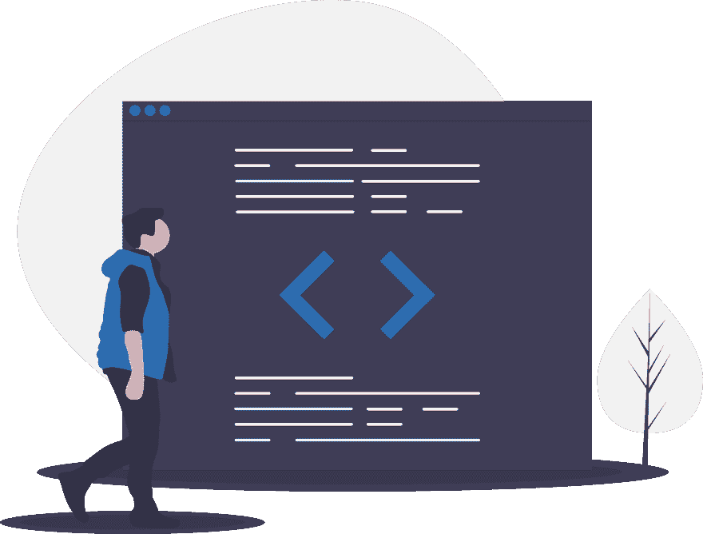
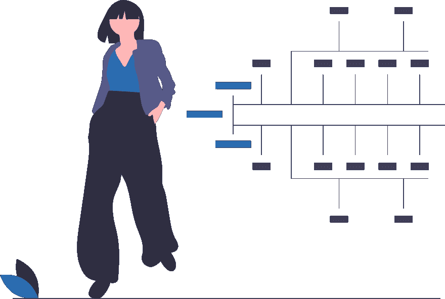

# 选择编程语言

> 原文：<https://dev.to/andrioid/choosing-a-programming-language-3nme>

想象一下，你是一名首席技术官、一名技术主管，或者是一个必须做出影响公司未来数年的早期技术决策的人。你选择什么编程语言？

# 抽象的成本

系统往往有两种类型的复杂性。业务领域的复杂性和技术领域的复杂性。根据我的经验，技术复杂性占据了过多的空间。

当然，有杰出的程序员，他们很好地管理复杂性，不管他们用什么语言编码。但是人们有不同的技能，一个伟大的团队有许多不同类型的成员。

# 可读性

当我接受第一份编程工作时，我期待着“写一些令人敬畏的代码”。但是，写代码不是我的主要工作。阅读它是。

有一些工具可以帮助管理这一点。编码标准、linters、代码格式器都试图使阅读彼此的代码更容易。

但是，如果我们的编程语言的每一个特性都是有代价的呢？如果你给 10 个程序员同样的任务，实现会有多相似？我认为如果你有许多不同类型的实现，那么你的编程语言就太复杂了。

为了高效地编写代码，我们也需要高效地阅读代码。

# 依赖关系

在某种程度上，我们需要我们的编程语言中的一些东西，不是语言特性，而是库特性。我们需要打开一个文件，解析 HTTP 头，解码 JSON，或者与数据库对话。

我们添加到程序中的每一个依赖都是有代价的，即使代码是免费的。如果维修工被公交车撞了怎么办？维护者变得恶意怎么办？如果有严重的安全漏洞怎么办？

为什么 PHP 在 90 年代后期的 web 开发中战胜了 Perl？我敢打赌，这是因为 PHP 的标准库非常好，并且有很好的文档记录。

另一种方法是 Javascript 的 NPM，这里没有标准库。每个小东西都有自己的包装。好处是 JS 社区真的进步了，你可以找到任何你能想到的东西的包。缺点是对于嵌套依赖，我们不知道我们实际上依赖的是什么代码。目前还没有 NPM 世界末日，只是 left-pad 和一个偶然的比特币矿工的故事。

我认为这是显而易见的。如果我们正在构建的东西需要在未来几年都是可靠的，那么我们需要一个标准的库，当糟糕的事情发生时，它可以提供安全更新和建议。记住，我们不包括依赖，我们采用它们。

# 招聘人才

在某些时候，我们都需要帮助。这种帮助通常是通过雇人的方式来找我们的。如果不是这一点，我现在可能正在用 Erlang、Elixir 和 Elm 编程。我认为这些语言非常有趣，不仅仅是因为它们都以字母 e 开头。

但现实摆在面前，我们需要一批人来招聘，这些人要么了解你的技术，要么很容易就能学会。

例外的情况是，当一个组织决定投资某样东西，拥有教新人的资源，并愿意为人才支付额外费用。

# 表现

性能很重要。但是，以“足够好”而不是“完美”为目标。“完美”在这篇文章的其他部分几乎肯定会有不好的一面。

你的项目需要一些核心性能吗？有“硬”实时要求的系统可能会限制您的选择。“软”实时在几乎任何语言中都是可行的。

我们曾经在单个 CPU 的世界里编程。那个世界已经不存在了。请选择一种能很好地处理多重执行的语言。

一个实际的例子是网上商店的 checkout-API 调用。客户已经提交了一个支付令牌、一份订单和一封我们需要验证的电子邮件。这些事情都不互相依赖，但这三件事都需要完成才能成功。

# 开发者体验

对我来说，一个好的开发者体验包括以下内容。

*   代码易于阅读和理解。
*   我选择的编辑器(或 IDE)支持该语言。
*   有一个好的、*可靠的*调试器可用。
*   易于编写和运行测试，无论是在本地还是在构建系统中。

# 最后的话

我们试图规划未来，但没有人真正知道它会带来什么。所以，瞄准未来 5 年，时间会证明一切。

你会选择哪种语言，为什么？

## 学分

非常感谢[的](https://undraw.co)[@ Nina limpi](https://twitter.com/ninalimpi)Undraw精彩的插图。