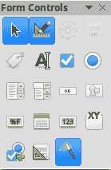
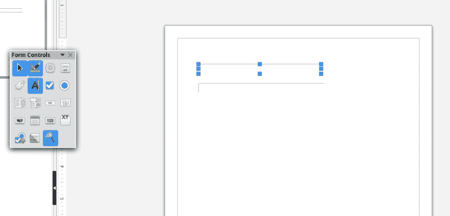
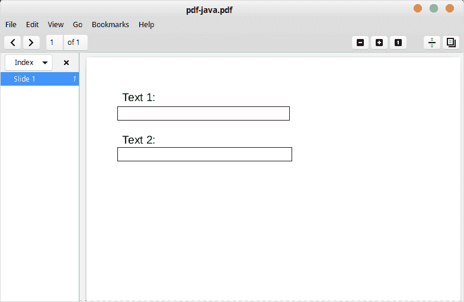
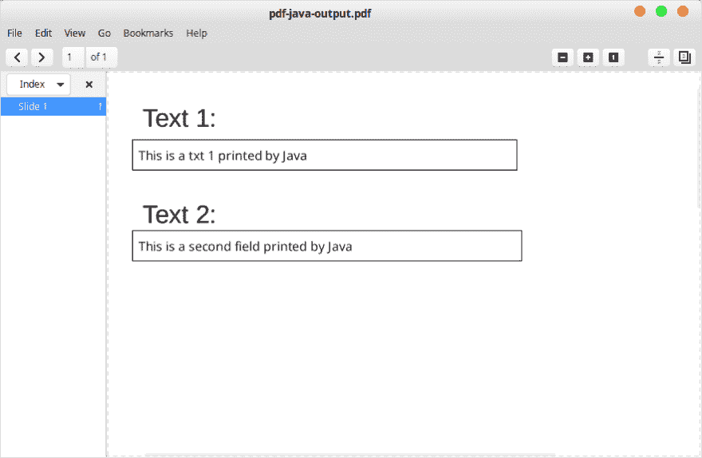

# 如何用 Java 创建和填写自己的 PDF 表单

> 原文：<https://dev.to/sandrogiacom/how-to-create-and-fill-out-your-own-pdf-form-with-java-87b>

## 简介

在本教程中，您将学习如何使用 [PDFBox](http://www.pdfbox.org/) 库用 Java 填充 PDF 文档。此外，您将了解如何创建自己的表单或将可编辑字段添加到现有的 PDF 文档中。

## 创建简单表单

为了创建一个表单，让我们使用 [LibreOffice Draw](https://www.libreoffice.org/) 。

显示表单工具栏。查看菜单>工具栏>表单控件。

[](https://res.cloudinary.com/practicaldev/image/fetch/s--EvP9230G--/c_limit%2Cf_auto%2Cfl_progressive%2Cq_auto%2Cw_880/https://thepracticaldev.s3.amazonaws.com/i/o8z8zkhckpmj6q52b0vq.png)

在空白文档中，输入两个文本字段:

[](https://res.cloudinary.com/practicaldev/image/fetch/s--u0fB0LLz--/c_limit%2Cf_auto%2Cfl_progressive%2Cq_auto%2Cw_880/https://thepracticaldev.s3.amazonaws.com/i/xpg0iq3une70xwepc1zv.png)

显示文本字段的属性:

[](https://res.cloudinary.com/practicaldev/image/fetch/s--RvWCONVO--/c_limit%2Cf_auto%2Cfl_progressive%2Cq_auto%2Cw_880/https://thepracticaldev.s3.amazonaws.com/i/hstcje005dcteunlby13.png)

分别将字段重命名为“txt_1”和“txt_2”。另外，将“只读”属性保留为“是”。

将文档导出为 PDF。我的就像是'/tmp/pdf-java.pdf '

我的模板看起来像这样:

[](https://res.cloudinary.com/practicaldev/image/fetch/s--ihL7IGhm--/c_limit%2Cf_auto%2Cfl_progressive%2Cq_auto%2Cw_880/https://thepracticaldev.s3.amazonaws.com/i/5elldti2dfjq20kqypju.png)

## 通过 Java 填充 PDF

创建一个新的 maven Java 项目，并在下面添加依赖项:

```
<dependency>
  <groupId>org.apache.pdfbox</groupId>
  <artifactId>pdfbox</artifactId>
  <version>2.0.16</version>
</dependency> 
```

用下面的代码创建一个 Java 类:

```
 public static void main(String[] args) {
        try {
            PDDocument pDDocument = PDDocument.load(new File("/tmp/pdf-java.pdf"));
            PDAcroForm pDAcroForm = pDDocument.getDocumentCatalog().getAcroForm();
            PDField field = pDAcroForm.getField("txt_1");
            field.setValue("This is a first field printed by Java");
            field = pDAcroForm.getField("txt_2");
            field.setValue("This is a second field printed by Java");
            pDDocument.save("/tmp/pdf-java-output.pdf");
            pDDocument.close();
        } catch (IOException e) {
            e.printStackTrace();
        }
    } 
```

运行程序并查看结果:

[](https://res.cloudinary.com/practicaldev/image/fetch/s--hpsdOZ1H--/c_limit%2Cf_auto%2Cfl_progressive%2Cq_auto%2Cw_880/https://thepracticaldev.s3.amazonaws.com/i/ax3oe78n9beau9y4n0at.png)

记住，结尾文件保存到了:“/tmp/pdf-java-output.pdf”。

github 上的完整源代码:

[https://github.com/sandrogiacom/pdf-java](https://github.com/sandrogiacom/pdf-java)

## 结论

在这个简短的教程中，我们学习了如何从用 LibreOffice Draw 创建的 PDF 模板中填充 PDF。发挥你的创造力来创建漂亮的模板，进行自动化，创建批处理文件等等。

在评论中留下你的用例。

回头见！

[](https://twitter.com/sandrogiacom)