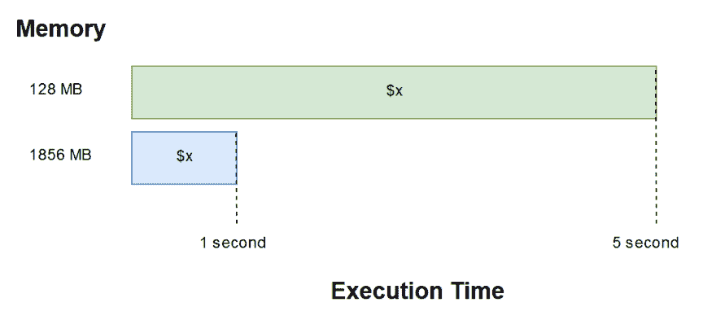
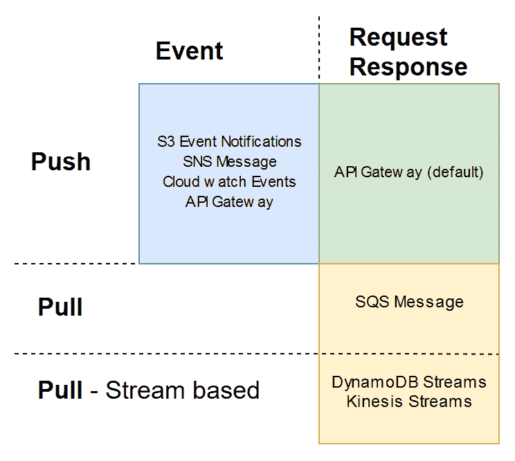
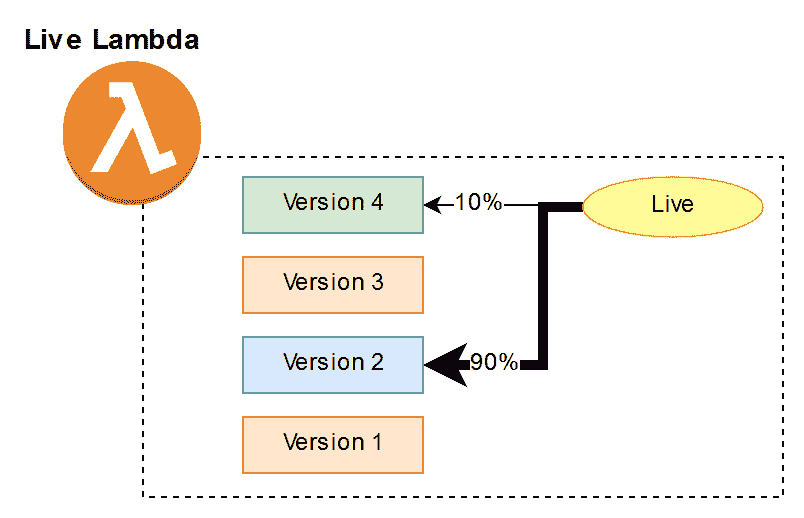

# 你需要知道的 13 个 AWS Lambda 设计考虑事项——第 1 部分

> 原文：<https://dev.to/rehanvdm/13-aws-lambda-design-considerations-you-need-to-know-about-part-1-1k4k>

当你听到“无服务器”这个词时，AWS Lambda 很可能是你想到的第一件事。这并不奇怪；科技风暴袭击了我们的行业，并带来了一个全新的解决方案范例。AWS Lambda 是我接触到的第一项功能即服务(FaaS)技术，和其他技术一样，我起初非常挑剔。**没有服务器需要管理，它会自动扩展，内置容错功能，并且按使用付费**——所有这些听起来都像是梦。

权力越大，责任越大。无服务器设计需要了解不同的服务以及它们如何相互作用。就像任何其他技术一样，也有一些棘手的问题需要解决，但与无服务器所能提供的强大功能相比，它们显得微不足道。为了防止这个梦想变成噩梦，在使用 AWS Lambda 进行设计时，请记住以下几点。

在这个由两部分组成的系列中，我们将深入探讨技术细节，比如配置选项和您需要了解的任何限制。第二部分将关注如何使用我们在第一部分中涉及的技术考虑来有效地设计无服务器和 Lambda 系统。最后，您应该对围绕 AWS Lambda 进行设计时需要牢记的关键注意事项有了更清晰的理解。

**这是一篇为[杰弗逊·弗兰克](https://www.jeffersonfrank.com/)写的文章，可以在这里[或者在我的](https://www.jeffersonfrank.com/aws-blog/aws-lambda-design-considerations-part-1/)[博客](https://www.rehanvdm.com/uncategorized/13-aws-lambda-design-considerations-you-need-to-know-about-part-1/index.html)上找到。**

# 技术注意事项

## 1)功能记忆

Lambda 的内存设置决定了电量和计费单位。有 44 个选项可供选择，从最慢或最低的 128 MB 到最大的 3，008 MB。这给了你相当多的选择！如果你分配的内存太少，你的程序可能需要更长的时间来执行，甚至可能超过 15 分钟的时间限制。另一方面，如果你给*分配了太多的*内存，你的功能可能连四分之一的能量都用不到，最终会让你损失一大笔钱。

找到你的功能的最佳点是至关重要的。AWS 表示，如果您分配 1，792 MB，您将获得相当于 1 个 vCPU 的内存，这是一个英特尔至强内核或 AMD EPYC 内核的线程。这就是他们所说的内存设置和 CPU 能力之间的关系。有一些人进行了实验，并得出结论，在 1，792 MB 内存之后，您*确实得到了第二个 CPU 内核，等等，但是这些内核的利用率无法确定。*

**越便宜并不总是越好**—有时选择前期成本较高的高内存选项可以减少整体执行时间。这意味着同样数量的工作可以在更短的时间内完成，所以**通过微调内存设置并找到最佳点，你可以让你的功能执行得更快，而不是同样低的内存设置。**与价格较低的选择相比，您最终可能会为您的功能支付相同甚至更少的费用。

底线是 **CPU 和内存不应该在你的设计考虑列表**中排在前面。AWS Lambda 就像其他无服务器技术一样，旨在水平扩展。将问题分解成更小、更易管理的部分并并行处理它们比许多垂直扩展的应用程序更快。**设计功能然后根据需要微调内存设置** **稍后**。

> 将问题分解成更小的可管理的部分，并行处理它们比许多垂直规模的应用程序更快。

## 2)调用

AWS Lambda 有两种调用模型和三种调用类型。这意味着有两种获取数据的方法和三种将数据发送给 Lambda 函数的方法。调用模型和类型决定了函数如何响应失败、重试和伸缩等事件的特征，我们将在后面使用这些特征。

**调用模型:**

*   Push:当另一个服务向 Lambda 发送信息时。
*   pull:AWS 管理的 Lambda 从另一个服务轮询数据，并将信息发送给 Lambda。

发送部分可以用三种方式之一来完成，称为**调用类型**:

*   请求响应:这是一个**同步**动作；这意味着将发送请求并等待响应。这样，调用者可以接收数据处理的状态。
*   事件:这是一个**异步**动作；请求数据将被发送，Lambda 只确认它收到了事件。在这种情况下，调用者不关心特定事件的处理是否成功。它唯一的工作就是传送数据。
*   预演:这只是一个测试函数，用于检查调用者是否被允许调用该函数。

以下是展示不同模型和可用调用类型的几个示例:

*   **API 网关请求**是一个**推送** **模型**，默认情况下有一个**请求响应** **调用**HTTP 请求被发送到 Lambda 函数，然后 API 网关等待 Lambda 函数返回响应。
*   **S3 事件通知、SNS 消息、Cloudwatch 事件**是**推送模式**和**事件调用**
*   **SQS 消息**是一个**拉** **模型**和一个**请求响应** **调用** AWS 有一个 Lambda 函数，从队列中拉出数据，然后发送给你的 Lambda 函数。如果它成功返回，AWS 管理的轮询 Lambda 将把它从队列中删除。
*   **DynamoDB 流和 Kinesis 流**是**拉**T4】模型并有**请求响应**T8】调用。这个特别有趣，因为它从流中提取数据，然后同步调用*我们的* Lambda。稍后，您将看到，如果 Lambda 失败，它将尝试无限期地处理该消息(或者直到它过期)，从而阻止其他消息被处理。

据我所知，没有进行事件类型调用的拉模型。拉模型进一步分为两个部分，基于流的和基于非流的。另外，请注意，通过在将数据发送到 Lambda 之前添加一个头，可以将 API 网关调用类型更改为 Event (async)。

## 3)失败和重试行为

这可能是最重要的考虑之一:Lambda 如何失败和重试是基于调用类型的。对于所有基于 ***事件*** 的调用，如果 Lambda 抛出一个错误，它将被再调用两次——总共三次，中间有一个延迟。如果配置了死信队列(DLQ)，消息将被发送到配置的 SQS 或 SNS 主题，或者错误将被发送到 CloudWatch。

对于 ***RequestResponse*** 调用类型，调用者需要处理返回的错误。对于 API 网关(推送+请求响应),调用者可能会记录失败，然后重试。当涉及到 Kinesis 流(基于拉流+请求响应)时，它充当 FIFO 队列/流。这意味着如果 Lambda 错误地处理了第一条消息，它将阻止整个流被处理，直到该消息过期或被成功处理。

> ***幂等系统:给定相同的输入，系统总是输出相同的结果。*T3】**

重要的是**理解每种调用类型**的失败和重试行为，作为一般的经验法则，将所有函数设计成幂等的。这基本上意味着，如果用相同的输入数据多次调用该函数，那么输出将/必须总是相同的。当您这样设计时，重试行为在您的系统中不会成为问题。

## 4)版本和别名

AWS 为您的 Lambda 代码提供现成的版本和别名。这可能不像你想的那样简单和有用。有几件事要记住:

*   版本控制只适用于 Lambda 代码，而不适用于它所使用和依赖的基础设施。
*   版本一旦发布，基本上就变成只读的了。

**有三种方式可以使用版本和别名**。一个 Lambda 函数，每当代码或配置发生变化时，它都会获得一个新的版本号。别名将被用作 stage 并指向 Lambda 函数的正确版本。

同样，必须注意的是，如果旧版本(例如，版本 3(现在的 Live alias/stage))需要更改，它不能更改，因此您甚至不能快速增加超时设置。为了更改它，您需要使用新设置将版本 3 重新部署为版本 5，然后将 Live alias 指向版本 5。请记住，第 5 版实际上比第 4 版更老，这很快就会变得不必要的复杂。

我想到的第二种方法是蓝绿色部署。这就不那么复杂了，你会有三个不同的 Lambdas，每个阶段一个——蓝色是旧版本，绿色是新版本。就像 Lambda 的每个新部署被版本化之前一样。然后，当您准备好进行新的代码更改时，您可以创建一个别名，例如，指定 90%的流量使用旧版本，然后 10%的请求转到新版本。这被称为金丝雀部署，虽然 AWS 没有这样标记，但它允许您逐渐将流量转移到新版本。

第三种方法是最简单的，可以很好地与诸如 CloudFormation、SAM 和 CICD(持续集成持续部署)管道之类的 IaC(基础设施即代码)工具配合使用。它基于的原则是**每个 Lambda 都与其环境/基础设施“紧密”耦合。**整个环境和 Lambda 一起部署，任何回滚都意味着需要再次部署以前版本的基础架构和 Lambda。这将版本控制的责任转移给了正在使用的 IaC 工具。每个 Lambda 函数名都包括 stage，并作为一个整体与基础设施一起部署。

## 5) VPC

将 Lambda 放在 VPC 内部的主要原因是，它可以访问 VPC 内部其他 AWS 资源的内部 IP 地址/端点。如果该函数不需要访问 VPC 内的任何资源，强烈建议将其放在 VPC 之外。~~原因是在 VPC 内部，每个 Lambda 容器将创建一个新的弹性网络接口(ENI)和 IP 地址。您的 Lambda 将受到扩展速度以及您拥有的 IP 地址和 Eni 数量的限制。~~ **【更新:见末尾为:改进的 VPC 联网】**

一旦将 Lambda 放入 VPC，它就失去了与公共互联网的所有连接。这是因为附属于 Lambdas 的 Eni 只有私有 IP 地址。因此，最佳做法是将 Lambda 分配给 VPC 内部的三个专用子网，然后连接这些专用子网以通过其中一个公共子网中的 NAT。然后，NAT 将拥有一个公共 IP，并将所有流量发送到互联网网关。这还有一个好处，即来自所有 Lambdas 的出口流量将来自单个 IP 地址，但是它引入了单点故障，这当然可以通过在 NAT 实例上使用 NAT 网关来减轻。

## 6)安全

与所有 AWS 服务一样，最小特权原则应该应用于 Lambda 函数的 IAM 角色。创建 IAM 角色时，不要将资源设置为 all (*)，而是设置特定的资源。以这种方式设置和分配 IAM 角色可能很烦人，但最终还是值得一试的。通过浏览 IAM 角色，您将能够知道 Lambda 正在访问哪些资源，以及它们是如何被使用的(从 Action 属性)。它还可以用于快速发现服务依赖关系。

## 7)并发和伸缩

~~如果您的功能在 VPC 内，必须有足够的 IP 地址和 Eni 用于扩展。Lambda 可能会扩展到耗尽其所在子网/VPC 的所有 IP 和/或 Eni 的程度。~~ **【更新:见末尾为:改进的 VPC 联网】**

为了防止这种情况，请将 Lambda 的并发性设置为合理的值。默认情况下，AWS 为您的帐户中组合的所有 Lambdas 设置了 1000 个并发执行的限制，其中您可以分配 900 个，另外 100 个保留给没有限制的函数。

对于推模型调用(例如:S3 事件)，Lambda 随着传入请求的数量而扩展，直到达到并发或帐户限制。对于所有拉模型调用类型，缩放不是即时的。对于具有请求响应调用类型(例如:DynamoDB 流和 Kinesis)的基于流的拉模型，运行的并发 Lambdas 的数量将与流的碎片数量相同。

与带有请求响应调用类型(例如:SQS)的非基于流的拉模型相反，Lambdas 将逐渐加速以尽可能快地清除队列。从 5 个并发的 Lambdas 开始，然后以每分钟 60 个的速度增加到总共 1000 个，或者直到再次达到极限。

## 8)冷启动

**每个 Lambda 都是服务器上的一个实际容器**。当您的 Lambda 被调用时，它会尝试将数据发送到一个 warm Lambda，一个已经启动的 Lambda 容器，它只是坐在那里等待事件数据。如果它没有找到任何暖的 Lambda 容器，它将启动一个新的 Lambda 容器，等待它准备好，然后发送事件数据。在某些情况下，等待时间可能很长。

请注意，如果容器在一定时间内没有收到事件数据，它将被销毁，从而减少函数的热 Lambdas 数量。某些编译型语言如 Java 冷启动需要几秒钟，而解释型语言如 JavaScript 和 Python 通常需要几毫秒。当您的 Lambda 在 VPC 中时，冷启动时间会增加更多，因为它需要等待 ENI(私有 IP 地址)才能准备就绪。

在某些环境下，甚至几毫秒也可能意义重大。保持容器保温的唯一方法是手动 ping 它。这通常是通过 Cloudwatch 事件规则(cron)和另一个 Lambda 来完成的，cron 可以设置为五分钟。CloudWatch 规则将调用 Lambda，该 Lambda 将 ping 您想要保持温暖的函数，请记住，一次 ping 只会保持一个温暖的 Lambda 容器活动。如果你想保持三个 Lambda 容器的热度，那么 ping Lambda 必须同时并行调用这个函数三次。

**【更新:改进的 VPC 联网】**

*   现在，当首次创建 Lambda 函数或更新其 VPC 设置时，超平面会创建一个共享网络接口，从而提高函数设置性能和可伸缩性。这种一次性设置可能需要 90 秒才能完成。
*   共享相同安全**组:子网配对**的同一帐户中的功能使用相同的网络接口。这意味着并发的 Lambdas 和 ENIs 之间不再有直接的相关性。