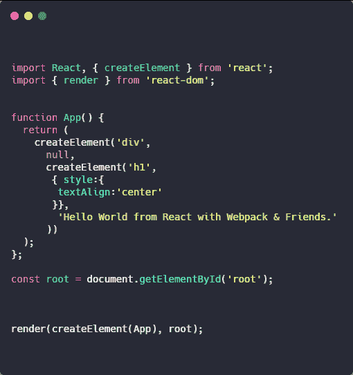
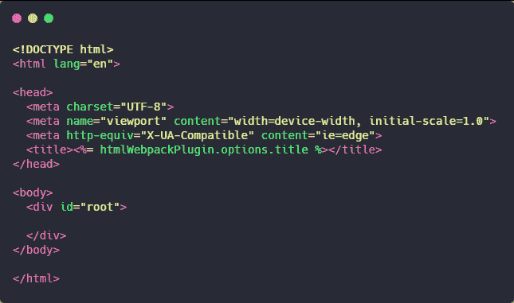
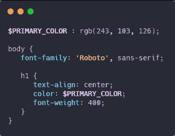
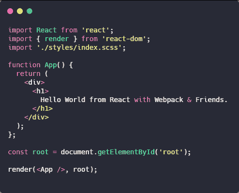
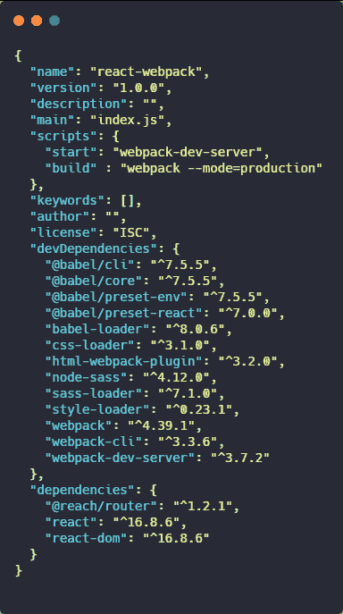
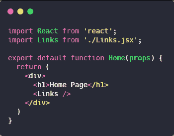
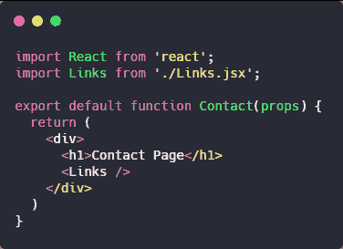
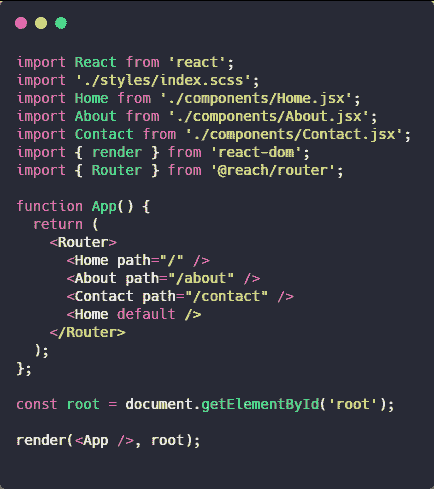

# 如何从头开始配置 React with Webpack & Friends

> 原文：<https://dev.to/macmacky/how-to-configure-react-with-webpack-friends-from-the-ground-up-2c5g>

##### 早上好伙计们！

我刚刚发现你们很多人喜欢我的 [Vue 和 Webpack Post](https://dev.to/macmacky/how-to-configure-webpack-and-vue-from-the-ground-up-4c19) ，所以我想你可能对我们如何用每个人都喜欢的框架和头号(目前) [React](https://2018.stateofjs.com/front-end-frameworks/overview/) (技术上来说是一个库)实现这个很好奇。

统计
[npm 下载量-React vs Vue vs Angular](https://www.npmtrends.com/react-vs-vue-vs-angular)
[Google Trends-React vs Angular vs Vue](https://trends.google.com/trends/explore?date=today%205-y&geo=US&q=%2Fm%2F012l1vxv,%2Fg%2F11c6w0ddw9,Vue)
[NPM 依赖包-第 4 个 React、第 18 个 Vue、第 48 个-Angular](https://www.npmjs.com/browse/depended)
[stack overflow 调查 2019 -最受喜爱的框架](!https://insights.stackoverflow.com/survey/2019#technology)
写这篇帖子的时候

所以还是言归正传吧。请在执行此操作之前安装 Node.js。从你的桌面运行这个命令。

```
 mkdir react-webpack && cd react-webpack
   npm init --y 
```

<svg width="20px" height="20px" viewBox="0 0 24 24" class="highlight-action crayons-icon highlight-action--fullscreen-on"><title>Enter fullscreen mode</title></svg> <svg width="20px" height="20px" viewBox="0 0 24 24" class="highlight-action crayons-icon highlight-action--fullscreen-off"><title>Exit fullscreen mode</title></svg>

基本上，这意味着我们正在创建一个名为 **react-webpack** 的目录( **md** ，并将我们当前的目录( **cd** )桌面更改为 **react-webpack** ，并使用默认配置的 **npm init - y** 命令创建一个 package.json 文件。

```
 npm i -D @babel/cli @babel/core @babel/preset-env @babel/preset-react
   babel-loader webpack webpack-cli webpack-dev-server html-webpack-plugin 
   node-sass sass-loader css-loader style-loader 
```

<svg width="20px" height="20px" viewBox="0 0 24 24" class="highlight-action crayons-icon highlight-action--fullscreen-on"><title>Enter fullscreen mode</title></svg> <svg width="20px" height="20px" viewBox="0 0 24 24" class="highlight-action crayons-icon highlight-action--fullscreen-off"><title>Exit fullscreen mode</title></svg>

**i** 别名为**安装**。
**-D** 表示我们把它作为开发依赖来安装。

**[@babel](https://dev.to/babel) /cli** 和 **[@babel](https://dev.to/babel) /core** :这些包让我们可以在命令行中传输我们的 JavaScript 代码，或者我们可以通过编程来传输它。

**[@ babel](https://dev.to/babel)/preset-env**:这个包让我们在代码中使用 JavaScript 的最新特性，主要是 ES6 特性和一些 ES7 和 ES8 特性。如果你想使用**异步/等待**特性，你可能需要 **[@babel](https://dev.to/babel) /polyfill** 库。

**[@ babel](https://dev.to/babel)/preset-react**:我们需要这个包，这样我们就可以在组件中使用 **JSX**
或 **JavaScript XML** 语法。

[](https://res.cloudinary.com/practicaldev/image/fetch/s--H1teC8hv--/c_limit%2Cf_auto%2Cfl_progressive%2Cq_auto%2Cw_880/https://thepracticaldev.s3.amazonaws.com/i/l3fjsk0t73uhggu11lhb.png)
[T6】](https://res.cloudinary.com/practicaldev/image/fetch/s--KkbnBpr_--/c_limit%2Cf_auto%2Cfl_progressive%2Cq_auto%2Cw_880/https://thepracticaldev.s3.amazonaws.com/i/vg7kp2a3et4vkydnhnms.png)

上面两张图功能相当。 **JSX** 的优点是它比第二个使用 **JavaScript** 的**更可读**。在第一种情况下，我们用声明性的方式做这件事，而在第二种情况下，我们用命令性的方式做这件事。正如文档所说 **React** 是用于构建 **UI** 的**声明性**库，而不是**命令性**。基本上是什么把**[@ babel](https://dev.to/babel)/preset-react**预置的东西**trans files**我们的 **JSX** 代码转换成 **JavaScript** 。因为浏览器看不懂 **JSX** 。

babel-loader : Webpack 需要它来用 babel 传输我们的 Javascript 代码。

webpack 和**webpack-CLI**:webpack 核心功能和 web pack 命令行实用程序，因此我们可以运行一些定制的 web pack 命令。

webpack-dev-server :这提供了一个动态开发服务器，它在每次文件改变时重新加载浏览器页面。

html-webpack-plugin :这个插件生成一个 html 文件，或者我们可以指定一个现有的文件来服务我们的包。

**node-sass** 和 **sass-loader** :我们需要这两个，所以我们可以使用 **SASS** ，它们将我们的 **SASS** 代码编译成 **CSS** 。

**css 加载器**和**样式加载器**:基本上， **css 加载器**返回一个字符串，**样式加载器**获取该字符串，并将其放入 html 的样式标签中。

```
 npm i -P react react-dom 
```

<svg width="20px" height="20px" viewBox="0 0 24 24" class="highlight-action crayons-icon highlight-action--fullscreen-on"><title>Enter fullscreen mode</title></svg> <svg width="20px" height="20px" viewBox="0 0 24 24" class="highlight-action crayons-icon highlight-action--fullscreen-off"><title>Exit fullscreen mode</title></svg>

**-P** 表示我们将其安装为生产依赖项。

**react** :制作组件的库。
**react-dom** :将我们的组件绑定或连接到 **DOM** 的库。

我们的**index.html**文件。
T3T5】

我们的 **webpack.config.js** 文件。
T3T5】

好了，我只是把这个 **webpack.config.js** 文件从我的另一个 [**帖子**](https://dev.to/macmacky/how-to-configure-webpack-and-vue-from-the-ground-up-4c19) 里复制过来，修改了一下。

我不会解释所有这些，只是重要的部分。我们借助于 **path.join** 方法和节点提供给我们的全局变量 **__dirname** 来指定主文件的**条目**路径。我们使用两个属性来指定输出:到要创建的文件夹的路径和捆绑的文件名。

在 **devServer** 对象中，我们将端口(在本例中为 **1000** )和 **open** 属性指定为 true，这将在我们启动应用程序时自动打开浏览器，并将 **hot** 属性指定为 true，这将在我们更改目录中的文件时重新加载页面。 **historyApiFallback** 属性指定将提供**index.html**文件，而不是 404 响应。

我们的**模块**对象中的数组**规则**属性是我们对加载器文件**第一个对象**的配置，我们指定我们可以在**测试**属性中使用扩展名为 **jsx** 或 **js** 的文件，并且我们指定我们将在**加载器**属性中使用 **babel-loader** 。在**选项**对象中，我们为新的 JS 特性指定了一组**预设**第一个**[@ babel](https://dev.to/babel)/preset-env**和**[@ babel](https://dev.to/babel)/preset-react**，这样我们就可以使用 **JSX** 语法。**第二个对象**我们在**测试**属性中指定可以使用扩展名为 **scss** 或 **sass** 的文件，并且在**使用**属性中指定我们将使用的**加载程序**数组必须按照**的顺序，因为加载程序是从右到左**计算的。
所以基本上过程是这样的我们使用 **SASS** 代码因为 **sass-loader** 我们把 **SASS** 代码转换成 **CSS 代码**。**萨斯-装载机->CSS-装载机**。并且 **css 加载器**返回一个字符串，然后**样式加载器**获取该字符串，并将其放入我们的 HTML 文件的样式标签中。**CSS-loader->style-loader**。

在**插件**属性中，我们指定了应用程序中需要的插件，首先我们实例化了**HotModuleReplacementPlugin**，这样我们就可以在应用程序中启用热重载。

我们传递必要的选项，我们指定到我们的**图标**的路径，如果你没有图标，去掉这个选项，我们的**模板**文件的路径，在这个例子中是 index.html 文件。

顺便在命令行中做一个 **styles** 文件夹，做一个 **index.css** 文件。

```
 mkdir styles && type nul > index.scss 
```

<svg width="20px" height="20px" viewBox="0 0 24 24" class="highlight-action crayons-icon highlight-action--fullscreen-on"><title>Enter fullscreen mode</title></svg> <svg width="20px" height="20px" viewBox="0 0 24 24" class="highlight-action crayons-icon highlight-action--fullscreen-off"><title>Exit fullscreen mode</title></svg>

**为 **Windows 操作系统**键入 nul** 。**触摸**为 **UNIX 系统**。

我们的 **index.scss** 文件。
T3T5】

我们的 **app.js** 文件。
T3T5】

最后是我们的 **package.json** 文件。
T3T5】

在终端中运行此命令。

```
 npm start 
```

<svg width="20px" height="20px" viewBox="0 0 24 24" class="highlight-action crayons-icon highlight-action--fullscreen-on"><title>Enter fullscreen mode</title></svg> <svg width="20px" height="20px" viewBox="0 0 24 24" class="highlight-action crayons-icon highlight-action--fullscreen-off"><title>Exit fullscreen mode</title></svg>

不错！在 **Webpack 和朋友**的帮助下，我们刚刚从头开始制作了一个 **React** 应用。

所以我要给这个应用程序添加一些路由功能。我将使用
**@reach/router** 包。

在您的终端中运行以下命令。

```
 mkdir components
   npm i -P @reach/router 
```

<svg width="20px" height="20px" viewBox="0 0 24 24" class="highlight-action crayons-icon highlight-action--fullscreen-on"><title>Enter fullscreen mode</title></svg> <svg width="20px" height="20px" viewBox="0 0 24 24" class="highlight-action crayons-icon highlight-action--fullscreen-off"><title>Exit fullscreen mode</title></svg>

在**组件**文件夹中创建 4 个文件。
**Links.jsx** ， **Home.jsx** ， **About.jsx** 和 **Contact.jsx** 。

```
 cd components
   type nul > Links.jsx
   type nul > Home.jsx
   type nul > About.jsx
   type nul > Contact.jsx 
```

<svg width="20px" height="20px" viewBox="0 0 24 24" class="highlight-action crayons-icon highlight-action--fullscreen-on"><title>Enter fullscreen mode</title></svg> <svg width="20px" height="20px" viewBox="0 0 24 24" class="highlight-action crayons-icon highlight-action--fullscreen-off"><title>Exit fullscreen mode</title></svg>

**为 __Windows 操作系统**键入 nul > __。**触摸**获得 **UNIX 系统**。

我们的 **Links.jsx** 文件。
T3T5】

我们的 **Home.jsx** 文件。
T3T5】

我们的 **About.jsx** 文件。
T3T5】

我们的 **Contact.jsx** 文件。
T3T5】

我们修改过的 **index.scss** 文件。
T3T5】

最后😃我们的 **app.js** 文件。
T3T5】

在终端中再次运行此 **npm start** 命令。
或者跑 **npm 跑建**。

#### 感谢各位阅读这篇帖子。

# 过得愉快😃！。