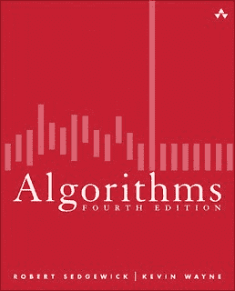
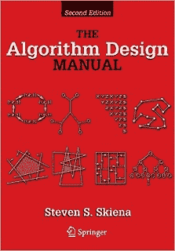
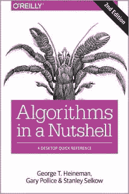
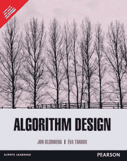
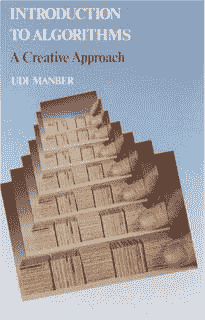
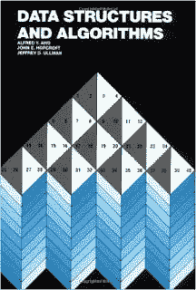
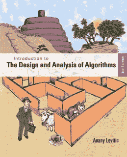
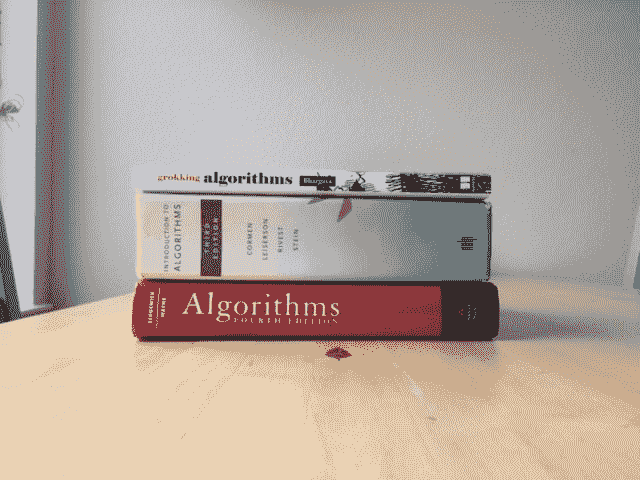

# 学习 Java、Python、C 和 C++数据结构和算法的 10 本最佳书籍

> 原文：<https://dev.to/javinpaul/10-best-books-to-learn-data-structure-and-algorithms-in-java-python-c-and-c-5743>

*披露:这篇文章包括附属链接；如果您从本文提供的不同链接购买产品或服务，我可能会收到报酬。*

算法是语言不可知的，任何称职的程序员都应该能够将它们转换成自己选择的编程语言的代码，但同时，如果示例以自己选择的编程语言呈现，学习起来会更容易。

不幸的是，我遇到过几个真正擅长编程语言的程序员，比如 T2 Java T3 或 T4 Python T5，他们知道 API 的细节和语言的复杂性，但是对算法和数据结构的基础知识却知之甚少。

只要让他们实现任何流行的排序算法，如[快速排序](http://java67.blogspot.sg/2014/07/quicksort-algorithm-in-java-in-place-example.html)或[合并排序](http://www.java67.com/2018/03/mergesort-in-java-algorithm-example-and.html)，他们就会崩溃。如果你希望他们知道更高级和复杂的算法，如[字符串算法](https://dev.to/javinpaul/top-20-string-coding-problems-from-programming-job-interviews-493m)、[图算法](http://bit.ly/2NAbaIR)、[树遍历](https://javarevisited.blogspot.com/2016/10/post-order-binary-tree-traversal-in-java-iteration-recursion.html)或贪婪算法，准备好检查面试，否则，你可能会有一些惊喜。

有一次，我遇到了一个非常好的核心 Java 高级开发人员的候选人，他擅长 Java、[多线程](https://javarevisited.blogspot.com/2018/06/top-5-java-multithreading-and-concurrency-courses-experienced-programmers.html)，但是他的数据结构和算法技能与他的经验和能力相比实在是太差了。

我问他，为什么不来面试之前，不花时间刷一下自己的算法和解题技巧？他的借口是“那些算法只是为了面试，从来没有真正用于实际编码。在我 6 年的 Java 开发生涯中，我从未使用过它们。

他说得有些对，你不需要用 Java 实现哈希表，你总是可以用 Python 中的 [HashMap](http://www.java67.com/2017/08/top-10-java-hashmap-interview-questions.html) 类或字典来实现这个目的，但是他没有认识到在[提高编程技能](https://javarevisited.blogspot.com/2014/01/10-tips-to-improve-programming-skill-become-better-programmer.html)中更长期的改进算法和数据结构。

算法是开发编程解决技能和编码意识的工具，这是将用户需求转换成代码行(也称为计算机程序)所必需的。

他们也无处不在，如果你使用脸书，你有没有想过他们是如何如此容易地找到你的朋友？或者网飞如何推荐你想看的电影？这些只是 [**机器学习算法**](https://pluralsight.pxf.io/c/1193463/424552/7490?u=https%3A%2F%2Fwww.pluralsight.com%2Fcourses%2Fmachine-learning-algorithms) 的几个例子，它将算法带到了另一个层次。

### 面向初学者和有经验的程序员的关于 Java、Python、C 和 C++的十大数据结构和算法书籍

对于那些认为算法是数据结构的人来说，另一个黄金提示是给那些想在亚马逊、T2、谷歌、脸书、英特尔或微软工作的人的，记住这是唯一永恒的技能，当然除了 UNIX、SQL 和 C 编程语言。

> 编程语言来来去去，但编程的核心，也就是算法和数据结构是不变的。

如果你知道哈希表是如何工作的，那么你可以在任何编程语言中使用它们的实现，比如 JDK 的 [HashMap](http://www.java67.com/2013/02/10-examples-of-hashmap-in-java-programming-tutorial.html) ，T2 的【Python】Dictionary，或者 T4 的【c++】boost library 的 HashMap。

所以，如果你对编程很认真，并且现在意识到算法和数据结构不是可选的，这里有一些学习算法的好书。

> 你们中的一些人可能已经读过了，但是它们值得再读一遍。顺便说一句，如果你用这篇文章中的链接买书，我也会得到报酬。

**1。**[**Thomas h . Corman《算法导论》**](http://www.amazon.com/Introduction-Algorithms-Edition-Thomas-Cormen/dp/0262033844?tag=javamysqlanta-20)
这是最受欢迎的算法书籍之一，但要注意它包含了大量的理论。这本书的当前版本是第三版，我强烈建议每个程序员都应该在他们的书架上放上这本书，但只是为了简短阅读和参考。

一口气读完这本书是不可能的，你们中的一些人可能会觉得很难读懂，但不要担心，你可以将你的学习与在线课程结合起来，如本书中的[数据结构和算法:使用 Java 的深度探索](https://click.linksynergy.com/fs-bin/click?id=JVFxdTr9V80&subid=0&offerid=323058.1&type=10&tmpid=14538&RD_PARM1=https%3A%2F%2Fwww.udemy.com%2Fdata-structures-and-algorithms-deep-dive-using-java%2F)。

这就像两全其美，你可以在网上课程中快速学习基础算法，然后通过阅读这本书进一步巩固知识，这对于你来说更有意义，因为你已经完成了一门课程。

我推荐这本书作为第一本关于算法的书的另一个原因是因为它的语言不可知论，并附有讲座

**2。** [**罗伯特·塞奇威克的算法&凯文·韦恩**](http://www.amazon.com/Algorithms-4th-Edition-Robert-Sedgewick/dp/032157351X?tag=javamysqlanta-20)
这是我很长一段时间以来首选的算法资源，现在仍然是，但现在我看到它的次数比以前少了。你会学到很多关于算法的背景知识，现在甚至这本书的特定版本也可以用于不同的编程语言，如 [Java](https://javarevisited.blogspot.com/2018/05/top-5-java-courses-for-beginners-to-learn-online.html) 和 [C++](http://www.java67.com/2018/02/5-free-cpp-courses-to-learn-programming.html) 。

这本书还有几个免费的 Coursera 在线课程， [**算法第一部分**](https://coursera.pxf.io/c/3294490/1164545/14726?u=https%3A%2F%2Fwww.coursera.org%2Flearn%2Falgorithms-part1) 和 [**算法第二部分**](https://coursera.pxf.io/c/3294490/1164545/14726?u=https%3A%2F%2Fwww.coursera.org%2Flearn%2Falgorithms-part2) ，很好地补充了这本书。太棒了。这也是我向 Java 程序员学习算法的首要推荐。

在 Coursera 上，它也有一些最好的数据结构和算法课程，涵盖了每个重要的主题。它们被捆绑在一起成为 [**Coursera 专攻算法**](https://coursera.pxf.io/c/3294490/1164545/14726?u=https%3A%2F%2Fwww.coursera.org%2Fspecializations%2Fdata-structures-algorithms) 。如果你热衷于深入学习算法，那是我建议你去的地方。

信不信由你，但是如果你已经知道一种编程语言，那么看一个关于这种编程语言的算法的例子也可以减少学习曲线。*你也可以在网上免费阅读这本书的第四版*[*这里*](【http://algs4.cs.princeton.edu/home/】T2)

**3。** [**《算法设计手册》作者史蒂夫·s·斯基亚纳**](http://www.amazon.com/Algorithm-Design-Manual-Steven-Skiena/dp/1849967202?tag=javamysqlanta-20)
这是另一本关于计算机算法的优秀书籍，书中用大量代码讲述了大量算法。我特别喜欢这本书的地方是，他实际上给出了他在实践中使用算法(或其变体)的例子；它真的可以帮助你看到一个特定的算法(或一系列算法)可以解决的问题类别。

代码在 [C](https://www.java67.com/2020/07/5-free-courses-to-learn-c-programming.html) 中，但不是很深奥，很容易理解。我离开学校也有一段时间了，这帮助我很快掌握了一些**图形算法。这本书我已经买了将近 10 年了，我仍然会时不时地看看它**

 **

**4。** [**算法概括地说**](http://www.amazon.com/Algorithms-Nutshell-In-OReilly/dp/059651624X?tag=javamysqlanta-20)
奥赖利的算法概括地说，是一本非常好的学习编程算法的书，尤其是对于 Java 程序员来说。它描述了算法，重点是实现它们，而不是经典算法书籍中使用的复杂数学。

所有算法都以模式的形式呈现，并附有使用它们的动机、给出高级概述的图片和伪代码，以及工作代码(在 [C](https://dzone.com/articles/5-free-courses-to-learn-data-structure-and-algorit) 、 [C++](http://www.java67.com/2018/02/5-free-cpp-courses-to-learn-programming.html) 、 [Java](https://javarevisited.blogspot.com/2018/05/top-5-java-courses-for-beginners-to-learn-online.html) 和 [Ruby](http://www.java67.com/2018/02/5-free-ruby-and-rails-courses-to-learn-online.html) 中)。

他们也有基准来证明算法的理论性能。总之是程序员学习算法的最佳书籍之一。

**5。** [**面试的算法**](http://www.amazon.com/Algorithms-For-Interviews-Adnan-Aziz/dp/1453792996?tag=javamysqlanta-20) \
阿德南·阿齐兹(Adnan Aziz)的《面试的算法》是一本关于算法的必读书籍，是从牢记[编程面试](https://hackernoon.com/10-data-structure-algorithms-and-programming-courses-to-crack-any-coding-interview-e1c50b30b927)的角度来写的。

封面本身表明，如果你仔细观察封面上用名人缩略图绘制的图像，这本书会多么有趣，这本书还解释了如何开发这种算法。很有趣，不是吗？

嗯，我喜欢这本书，因为它的方法和目标，有时用不同的对象学习同样的东西有助于更好地理解它。

**6。**[**Kleinberg&Tardos**](https://www.amazon.com/Algorithm-Design-Jon-Kleinberg/dp/0321295358?tag=javamysqlanta-20)\
算法设计这其实是继 Thomas Cormon 的[算法导论](http://www.amazon.com/dp/0072970545/?tag=javamysqlanta-20)之后算法方面第二好的书。它不是真正的算法入门，更适合有经验的程序员。

对于熟悉基本算法的开发者来说，更多的是算法设计。你应该从介绍罗伯特·塞奇威克的算法书或算法开始，然后继续读这本书。

顺便说一句，如果你喜欢，你也可以将你的学习与在线课程结合起来，如 [**算法和数据结构-第一部分和第二部分**](https://pluralsight.pxf.io/c/1193463/424552/7490?u=https%3A%2F%2Fwww.pluralsight.com%2Fcourses%2Fads-part1)[plural sight](https://medium.com/u/50a6c7ef7431)。在进入算法设计主题之前，熟悉基本算法和数据结构是一门很好的课程。

7 .**。** [**《算法简介:一种创造性的方法》**](https://www.amazon.com/Introduction-Algorithms-Creative-Udi-Manber/dp/0201120372?tag=javamysqlanta-20)
《算法简介:一种创造性的方法》乌迪·曼伯写的是另一本自学的好书，因为它充满了数百个问题和例子。

它旨在增强考生解决问题的能力和对算法设计背后原理的理解，这将帮助你发展你的[问题解决](http://www.java67.com/2018/06/data-structure-and-algorithm-interview-questions-programmers.html)和[编码技能](http://www.java67.com/2016/02/5-books-to-improve-coding-skills-of.html)。

**8。** [**数据结构和算法。Aho，Ullman & Hopcroft**](https://www.amazon.com/Data-Structures-Algorithms-Alfred-Aho/dp/0201000237?tag=javamysqlanta-20)
另一本关于算法和数据结构的好入门书。一本可爱而清晰的书，任何不喜欢在算法上大量使用数学的程序员都会喜欢这本书。

顺便说一句，如果你觉得这本书很难读，这也是我的一些读者抱怨的，那么你也可以看看 Aditya Bhargava 的**算法，这是一本对初学者来说最简单有趣的算法书籍。**

 **

**9。** [**算法的设计与分析**](https://www.amazon.com/Introduction-Design-Analysis-Algorithms-3rd/dp/0132316811?tag=javamysqlanta-20)
这是计算机算法上的又一位大厨，理应在程序员的书架上占有一席之地。一旦你通过了 https://coursera.pxf.io/c/3294490/1164545/14726?的[Coursera 算法专业]u = https % 3A % 2F % 2fwww . coursera . org % 2f specializations % 2f data-structures-algorithms)和一本入门书，你可以阅读这本书来学习算法中的高级主题。

10。 [**Python 算法:掌握 Python 语言中的基本算法**](https://www.amazon.com/Python-Algorithms-Mastering-Language-Experts/dp/1430232374?tag=javamysqlanta-20) \
这本书是为 Python 程序员设计的。马格努斯·李·赫特兰德也是一本流行的 Python 入门书籍[的作者。](https://www.amazon.com/Beginning-Python-Professional-Magnus-Hetland-ebook/dp/B06XGVVVMG?tag=javamysqlanta-20)

正如我所说，算法是独立于语言的，学习 python 算法并不意味着你不能用 [Java](https://javarevisited.blogspot.com/2017/11/top-5-free-java-courses-for-beginners.html) 或 [C++](http://www.java67.com/2018/02/5-free-cpp-courses-to-learn-programming.html) 实现它们，但是如果你已经知道 [Python](https://javarevisited.blogspot.com/2018/12/10-free-python-courses-for-programmers.html) ，那么这就是学习计算机算法的好书。

这本书也给出了很多关于 [**图算法**](https://click.linksynergy.com/deeplink?id=JVFxdTr9V80&mid=39197&murl=https%3A%2F%2Fwww.udemy.com%2Falgorithms-and-data-structures-in-python%2F) 的重点，这对解决现实问题非常有用。

**11。****\
当我在博客上发表这篇文章时，这本书并不属于原来的系列，但读完这本书后，我应该把它包括在列表中，因为它很简单。这是我读过的关于算法的最好的书之一，尤其是从初学者的角度来看。**

 **它使用了现代的例子，如脸书如何存储用户名，以便登录时可以轻松搜索。这些例子能更好地引起初学者的共鸣，帮助他们理解这个概念，比如为什么对于搜索来说，[数组](http://www.java67.com/2012/12/difference-between-arraylist-vs-LinkedList-java.html)比[链表](https://hackernoon.com/top-20-linked-list-coding-problems-from-programming-job-interviews-756d4a2bf652)更好。

Aditya 的美术背景也使这本书成为一个视觉学习资源。你会发现这本书里有很多有趣的、中肯的图表，帮助你更好更快地学习这个概念。

这里有一个很好的图表，将这本书与列表中提到的其他算法书进行了比较:

简而言之，任何初学程序员的最佳算法书籍之一。它没有涵盖所有的数据结构和算法，但无论它涵盖了什么，它都很好地解释了它们。

以上就是关于**每个程序员都应该看的 10 本算法书**。我同意算法是一个复杂的话题，不容易在一次阅读中理解它们，在这种情况下，我建议读两遍同一本书。

> 仅仅阅读是不够的，试着用你喜欢的编程语言来实现它们。编写自己的数组列表、HashMap 或基于树的 Map 实现没有坏处。

学习算法的效果不是立即可见的，但是随着时间的推移，你会注意到你的思维、解决方案构建和代码质量有了微妙的改善。

顺便说一下，如果你对一门关于算法的在线课程感兴趣，我建议你在 Udemy 上查看一下 [**数据结构和算法:使用 Java**](https://click.linksynergy.com/fs-bin/click?id=JVFxdTr9V80&subid=0&offerid=323058.1&type=10&tmpid=14538&RD_PARM1=https%3A%2F%2Fwww.udemy.com%2Fdata-structures-and-algorithms-deep-dive-using-java%2F) 的深度学习。这不是一个免费的课程，但你可以花不到 10 到 15 美元购买几个 Udemy flash 销售，每隔几天就有一次

您可能喜欢的其他*数据结构和算法文章* *

*   [5 门学习算法和数据结构的免费课程](https://javarevisited.blogspot.com/2018/01/top-5-free-data-structure-and-algorithm-courses-java--c-programmers.html)
*   [50+程序员的数据结构和算法问题](https://dev.to/javinpaul/50-data-structure-and-algorithms-problems-from-coding-interviews-4lh2)
*   [10 门数据结构与算法课程破解编程面试](https://hackernoon.com/10-data-structure-algorithms-and-programming-courses-to-crack-any-coding-interview-e1c50b30b927)
*   [排名前五的数据结构和算法书籍](https://javarevisited.blogspot.com/2015/07/5-data-structure-and-algorithm-books-best-must-read.html)
*   【Java 程序员应该学习的 10 件事
*   [图像信用和理解图论&算法的良好资源](https://neo4j.com/blog/top-13-resources-graph-theory-algorithms/)
*   [来自访谈的 30 多个基于数组的编码问题](https://javarevisited.blogspot.com/2015/06/top-20-array-interview-questions-and-answers.html)
*   [来自访谈的 30 多个基于链表的编码问题](https://javarevisited.blogspot.com/2017/07/top-10-linked-list-coding-questions-and.html)
*   [75+实践面试中的编码问题](http://www.java67.com/2018/05/top-75-programming-interview-questions-answers.html)
*   [我最喜欢的深入学习算法的免费课程列表(freeCodeCamp)](https://www.freecodecamp.org/news/these-are-the-best-free-courses-to-learn-data-structures-and-algorithms-in-depth-4d52f0d6b35a)
*   [我最喜欢的初学 Python 的课程](https://medium.com/better-programming/top-5-courses-to-learn-python-in-2018-best-of-lot-26644a99e7ec)

感谢您阅读本文，如果您喜欢这份书单，那么您也会喜欢我收集的每个程序员都应该阅读的 10 本书****，**，这是一份关于编程、编码、软件开发技术、最佳实践、计算机、编程职业以及过去 50 年中一些伟大的程序员/编码员/开发人员的经验的书单。**

 **> 最后，有两种程序员，一种懂算法，一种不懂。

你不需要阅读所有的书来成为数据结构和算法冠军，根据你喜欢的编程语言和你的经验来选择书。对于绝对的初学者来说，搜索算法更好，但是对于更全面的覆盖范围来说，介绍算法更好。对于像谷歌和脸书这样的艰难面试，史蒂夫·斯基纳的《面试算法和算法设计》是更好的选择。

> **P. S. -** 如果你更喜欢在线课程而不是书本，或者你想从书本和在线课程中学习，那么你也可以查看我列出的 [**学习数据结构和算法的前 5 名在线课程**](https://javarevisited.blogspot.com/2018/11/top-5-data-structures-and-algorithm-online-courses.html#axzz5YFaOvjsh) **。它包括 Java、Python 和 JavaScript 课程，便于学习。**********