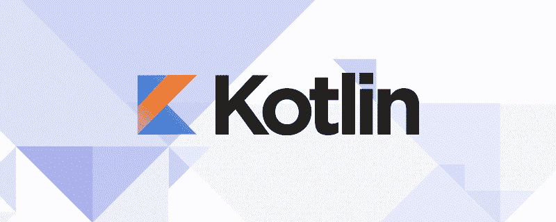
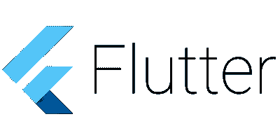
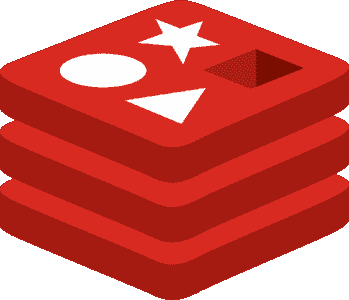

# 2020 年前，你应该看看的 10 项开源技术

> 原文：<https://dev.to/happydragos/10-open-source-tech-you-should-take-a-look-at-before-2020-5aig>

今年年初，当我开始建造 Archbee 的时候，我评估了一些很酷的技术。以下是我认为会以我们无法预测的方式改变世界的技术清单。

# 1。迅速发生的

许多人认为 Objective C 笨拙/冗长，并且很难教给年轻的开发人员。所以苹果决定酝酿他们的第二种编程语言 Swift。他们招募了克里斯·拉特纳，他因在 LLVM 上的工作而臭名昭著，并构想出了有史以来最令人印象深刻的语言之一。
许多人不知道的是，Swift 是开源的，背后有一个庞大且不断增长的社区。他们让 Swift 在 Linux 上工作，创建了 Swift Package Manager，并正在让 Swift 成为一种可行的服务器端语言，所有这些都是在很短的时间内完成的。
看看 Twilio 的 SwiftUI 简介:
[https://www.youtube.com/embed/uv5L2HQqDPU](https://www.youtube.com/embed/uv5L2HQqDPU)

### 那么，你为什么要花时间去学习一点 Swift 呢？

*   大量借鉴函数式语言的特性，如:不可空类型、不可变数据结构、一级函数、高阶函数、具有穷举开关模式的求和类型、部分和纯函数、针对递归的尾调用优化、扩展等等；Swift 不是 Haskell，但离 Java 和 C#等经典 OOP 语言还有很长的路要走；
*   Swift 被编译成 LLVM 字节码，所以不会浪费 CPU 周期；
*   具有用于内存管理的自动引用计数。虽然比不上 Rust 里编译期内存管理之类的东西，但在我看来，ARC 是退而求其次的；
*   SwiftUI 是苹果公司的一个伟大的 UI 库——深受 React 的影响，它再次证明了 React 背后的思想是伟大的:自顶向下的数据流、不变性和语言级别的声明式视图。SwiftUI 不是开源的，但它很酷，值得上榜；
*   不断增长的服务器端生态系统——Vapor 和 Kitura 都非常适合编写后端系统；有点不成熟，但是很好用；
*   XCode 是一个非常成熟、快速的编辑器，和它一起工作很愉快。
*   Swift playground 使学习和实验变得容易，因为它的即时反馈，不需要编译。
*   因为社区的活跃和兴奋，Swift 的未来是光明的；报酬最高的工作之一；

# 2。我的锅

与 Swift 的故事有些相似，Kotlin 作为 JVM 上一个现代的、不太冗长的 Java 替代物出现了。令人惊讶的是，这种伟大的语言是由开发代码编辑器的 JetBrains 公司创造和开发的。当谷歌将 Kotlin 作为其操作系统的官方语言时，kot Lin 通过 Android 变得流行起来，但在服务器端世界，kot Lin 也正在成为 Java 的一个巨大替代品，主要是因为 Spring Framework 将它作为一等公民的优先事项。
科特林项目负责人简介:
[https://www.youtube.com/embed/6P20npkvcb8](https://www.youtube.com/embed/6P20npkvcb8)

### 那么，你为什么要花时间去学习一点科特林语呢？

*   Kotlin 是多平台的，意味着你可以把它编译成 JVM、LLVM(和 WASM 通过关联)和 JavaScript，覆盖了大部分用例；
*   现代类型系统，具有不可空的类型、泛型、理解，受函数式编程语言的影响很大。Arrow 是其标准库的优秀补充，看这里:[https://arrow-kt.io/](https://arrow-kt.io/)；
*   服务器端 Kotlin 可以受益于自 Java/JVM 引入以来二十多年来构建的最成熟的服务器端生态系统之一；协程使其成为构建可伸缩的异步 web APIs 的优秀编程语言，但不幸的是，大多数库会阻塞，因为它们是为旧的每请求线程范式设计的。
*   最好的 IDEA 之一——IntelliJ IDEA；
*   React 绑定，用于编译为 JavaScript 以构建 web 应用程序。编译成 Rust 或 Go 之类的可执行文件。

# 3。库伯内特斯

当 Docker 出现时，许多开发人员没有看到它的价值。对于大多数人来说，依赖隔离似乎不足以从运行在云中的裸虚拟机进行切换。在 Google 开源他们的内部项目 Borg 之后，每个人都开始明白为什么容器和容器编排是未来在云和内部运行系统的方式。
Kubernetes 快速视频讲解:
[https://www.youtube.com/embed/PH-2FfFD2PU](https://www.youtube.com/embed/PH-2FfFD2PU)

### 所以为什么要把时间投入到学习一点 k8s 上呢？

*   声明式基础设施意味着您将不再需要对系统进行容易出错的手动配置。是的，YAML 不是最好的，但是像 Pulumi 这样的解决方案使它更加合理；
*   分布式系统更有弹性，Kubernetes 使构建分布式系统变得容易得多；
*   几乎无需手动扩展，只需运行配置更改即可添加节点或扩展容器；
*   自动恢复报废/损坏的集装箱，零停机部署；
*   容器的就绪性和活性探测器；
*   如果您在专用网络中创建集群，则很少甚至没有攻击面，只通过入口暴露；
*   比自我管理的服务器更安全:大多数托管的 k8s 集群都有很好的安全默认设置；
*   大部分云提供商都会给你提供一个免费的 k8s 主，所以不会给你增加实际的资源成本；
*   只要你能把你的服务打包成 Docker 容器，那么在开发和生产中一切都将 100%相同，使得开发过程更快；

# 4。长生不老药

多么美妙的动态函数式语言啊！Elixir 构建在坚如磐石的 Erlang VM 之上，受益于生态系统和稳定性，标志着 spot 成为 2010 年代开发的关键技术之一。
他们在主页上说得最好，所以我要引用一下:
“软件在生产中运行的不可避免的事实是，事情会出错。如果我们将网络、文件系统和其他第三方资源考虑在内，这个数字就更大了。为了应对故障，Elixir 提供了管理程序，描述当出现问题时如何重新启动系统的各个部分，返回到一个已知的初始状态，保证正常工作:可伸缩性、容错和通过消息传递的事件驱动编程的结合使 Elixir 成为反应式编程和架构的绝佳选择。”

[https://www.youtube.com/embed/cWAHpvkh8Vs](https://www.youtube.com/embed/cWAHpvkh8Vs)

### 那么，你为什么要花时间去学习一点仙丹呢？

*   默认情况下具有不变性的函数式语言、一级和更高级的函数、模式匹配、结构、符号；Phoenix Framework 真的很棒，在生产力方面从 Ruby On Rails 获得了一些启示，但在计算资源方面扩展得更好、更容易；
*   确实如此，但是在 21 世纪 20 年代，对于用户体验来说，非实时应用将不再被接受。这意味着任何专注于实时数据同步和 WebSockets 的语言/平台都有优势，在我看来 Erlang VM + Elixir 做得最好；在这里阅读 WhatsApp 团队如何在计算资源非常少的情况下生产力飙升的故事:[https://www . wired . com/2015/09/WhatsApp-serves-9 亿-users-50-engineers/](https://www.wired.com/2015/09/whatsapp-serves-900-million-users-50-engineers/)；

# 5。榆树

榆树是一种享受。一种非常简单的编程语言，具有其他语言无法比拟的保证。你听说过“零运行时异常”这个说法吗？。那来自榆树。
它的 Haskell 启发型系统允许它这样做，这意味着你晚上会睡得更好。
Elm 对于它解决的问题——前端开发——也非常明确。在我看来，这是 Evan Czaplicki 的一个很好的选择，他承认“无所不包的用例”语言不再适用。

[https://www.youtube.com/embed/o_4EX4dPppA](https://www.youtube.com/embed/o_4EX4dPppA)

### 那么，你为什么要花时间去学一点榆树呢？

*   坚如磐石的类型系统意味着你很容易重构，因为编译器会指导你；
*   实践中零运行时异常；
*   用于构建用户界面的内置工具包，称为 Elm 架构(TEA)。茶是如此伟大，它激发了许多其他语言的克隆体；
*   编译器是一流的:树立了业界错误消息的新标准，非常快，类型推断工作很棒；
*   具有“强制语义版本控制”的伟大生态系统意味着您的依赖项将总是知道某些东西是否被破坏——在构建时；
*   业界最佳的资产规模—小于 React 甚至 Preact。
*   正如您所看到的，Elm 不断地在我们的行业中设立一系列新标准。def 2010 年代的顶级创新之一。

# 6。摆动

构建原生 ui 是一项非常艰巨的任务。再加上你需要为 4-5 个操作系统做这件事，你就麻烦大了。这就是为什么谷歌开始构建 Flutter，最初专注于 Android 和 iOS，最终很快加入了 Web 平台，甚至 macOS 和 Windows 应用。
看看这个视频:
[https://www.youtube.com/embed/80pRyn7fZRk](https://www.youtube.com/embed/80pRyn7fZRk)

### 那么，你为什么要花时间去学习一点颤振呢？

*   帮助您构建高性能的移动应用程序；
*   来自谷歌的大力支持，谷歌显然正试图基于 Flutter UIs 构建另一个名为 Fuchsia 的操作系统；
*   Dart 1 有点无聊和老派，但是 Dart 2 更面向函数式编程，并且非常具体地解决 UI 问题；Flutter 的热重新加载功能可以帮助您快速轻松地进行实验，构建 ui，添加功能，并更快地修复 bug。在 iOS 和 Android 的仿真器、模拟器和硬件上体验亚秒级的重新加载时间，而不会丢失状态。
*   使用 Flutter 内置的漂亮材料设计和 Cupertino (iOS 风格)小部件、丰富的 motion APIs、流畅的自然滚动和平台感知来取悦您的用户。
*   Dart + Flutter 在 Intellij IDEA 和 Visual Studio 代码上有很大的 IDE 支持；

# 7。再说一遍

从他们的主页:
“Redis 是一个开源的(BSD 许可的)，内存中的数据结构存储，用作数据库，缓存和消息代理。它支持数据结构，如字符串、哈希、列表、集合、带有范围查询的排序集合、位图、超级日志、带有 radius 查询的地理空间索引和流。Redis 具有内置的复制、Lua 脚本、LRU 驱逐、事务和不同级别的磁盘持久性，并通过 Redis Sentinel 和 Redis Cluster 的自动分区提供高可用性。”

### 那么，你为什么要花时间去学习一点 Redis 呢？

*   理斯是疯狂的快马；理斯是疯狂的快马加鞭；理斯是疯狂的快马加鞭；理斯是疯狂的快马加鞭；理斯是疯狂的快马加鞭；理斯是疯狂的快马加鞭。
*   Redis 是一个非常通用的工具包；
*   您可以将它用作缓存存储、数据库和消息代理；
*   你可以把它作为内存中的数据结构存储，这在我看来是 Redis 最重要的方面。在微服务时代，如果你需要一些需要并发修改的共享状态，基本上别无选择，只能用 Redis
*   大多数云提供商将为您提供托管 Redis 服务；
*   对大多数编程语言的绑定；
*   非常小的 API 面，而且非常直观；
*   通过高可用性和自动分区实现高度可伸缩性。

# 8\. TensorFlow

TensorFlow 是谷歌的机器学习工具包。来自他们的主页:
“tensor flow 是一个机器学习的端到端开源平台。它拥有一个由工具、库和社区资源组成的全面、灵活的生态系统，使研究人员能够推动 ML 的发展，开发人员能够轻松构建和部署 ML 驱动的应用。”
TensorFlow 的核心优势是性能。它是为了大规模地将模型从研究阶段转化为生产阶段而构建的，并且能够交付。坚持不懈，你就能加入用它做不可思议的事情的 ML 从业者的行列，比如发现新的行星和开拓医学。
tensor flow 社区投入了大量精力来实现最初的奇迹，然后再次付出更多努力来打磨最好的宝石，同时淘汰不太幸运的设计。这个计划从来没有强迫你永远使用草稿，但是也许你习惯了这种不适，以至于你没有意识到这是暂时的。

### 那么，你为什么要花时间去学习一点张量流呢？

*   高性能机器学习库
*   与 Python、JavaScript 和 Swift 等高级语言的绑定；
*   既可以在 CPU 上运行，也可以在 GPU 上运行；
*   水平可伸缩；
*   许多可用的训练模型；
*   巨大的社区，由谷歌和许多大公司支持；
*   keras——更高层次的抽象现已内置到 Tensorflow 中；
*   Tensorflow 2.0 即将推出—“tensor flow 2.0 专注于简单易用，具有急切执行、直观的高级 API 和在任何平台上灵活构建模型等更新”。

# 9\. Istio

许多组织将其现有的整体工作负载/系统迁移到 Kubernetes。
但这并不是 Kubernetes 提供最大价值的地方，而是微服务架构。但是这种新的编写系统的方式带来了一系列新的问题，比如:微服务的可观察性、连接、控制和保护。这就是谷歌看到了建立 Istio 服务网的机会。
如果你更倾向于 DevOps 一方，你需要看看 Kubernetes 和 Istio。

[https://www.youtube.com/embed/1iyFq2VaL5Y](https://www.youtube.com/embed/1iyFq2VaL5Y)

### 那么，你为什么要花时间去学习一点 Istio 呢？

*   Istio 性能很高，写在 Envoy (C++)上面；
*   帮助您解决基于微服务的架构带来的大部分问题；
*   Side-car 设计模式:每个微服务需要执行的大部分事情(日志、安全、计算 DNS、速率限制)将从微服务转移到一个“side-car”中。这意味着每个微服务中的代码更少(也更容易出错);
*   如果你在 Google Cloud 上运行，你将会从它们的集成和部署的便利性中受益匪浅。

# 10。麋鹿

“那么，麋鹿栈是什么？”ELK”是三个开源项目的缩写:Elasticsearch、Logstash 和 Kibana。Elasticsearch 是一个搜索和分析引擎。Logstash 是一个服务器端数据处理管道，它同时从多个来源获取数据，对其进行转换，然后将其发送到像 Elasticsearch 这样的“stash”。Kibana 让用户可以在 Elasticsearch 中用图表和图形可视化数据。

[https://www.youtube.com/embed/6P20npkvcb8](https://www.youtube.com/embed/6P20npkvcb8)

### 那么，你为什么要花时间去学习麋鹿呢？

*   用于数据分析的最佳用户界面；
*   数据可视化的惊人价格…免费；
*   可扩展的来源和聚集；
*   由许多云提供商托管；
*   非常通用—从摄取日志到文本搜索，再到过滤庞大的数据集。

# 文章原载于[https://arch bee . io/blog/10-open-source-tech-you-should-a-look-at-before-2020](https://archbee.io/blog/10-open-source-tech-you-should-take-a-look-at-before-2020)