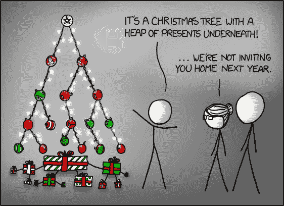
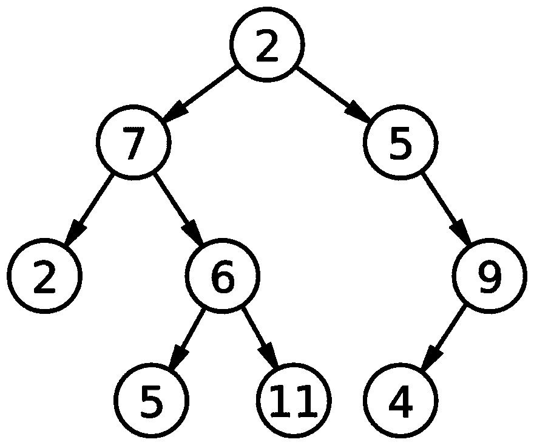
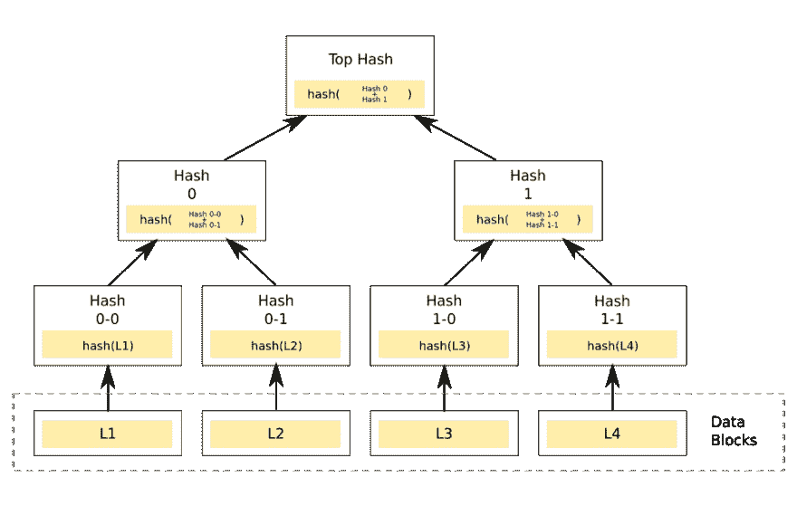

# 区块链:什么是 Merkle 树？

> 原文：<https://dev.to/tugkankibar/blockchain-what-the-hell-is-a-merkle-tree-3hi0>

<figure> 

<figcaption>*没有你在森林里找不到这种树。(来源:*[*xkcd*](https://xkcd.com/835/)*)*</figcaption>

</figure>

虽然它可能不会邀请你参加聚会，但知道什么是跳进 Merkle 树是很重要的。在计算机科学中，树是一种数据结构。它的意思是:

1.  它由**个节点**组成:这是一种表达包含数据并可以链接到其他伙伴节点的事物的奇特方式。
2.  它也是由**条边**组成的:这就是我们在上一点中谈到的链接。咄。
3.  它是**图**的一种类型:如果你只有前面两点，没有其他限制强加于它；你会有一个图表。然而，由于树是特殊类型的图；
4.  它从一个根节点开始:你必须有一个节点是你的树的开始，这是一切开始的地方。你自己的零号病人。(有人提醒我在这里开个僵尸玩笑。)
5.  节点仅通过从父节点的分支的**链接。因此，您不能随心所欲地链接节点。**
6.  没有孩子的节点被称为**叶**或**终端**。

当你遵循这六条规则时；您最终会得到如下结果:

<figure> 

<figcaption>野外的一棵树。我们不要打草惊蛇。(来源:[维基百科](https://en.wikipedia.org/wiki/Tree_(data_structure)) )</figcaption>

</figure>

我几乎可以听到每个人对着屏幕尖叫，并高喊“那又怎样？”。在我看来，最好给出一个相关的例子，比如一个组织的层级。你看，尽管我们用节点、树叶等定义了一个计算机科学术语，但它实际上并不是我们从未见过的东西。每当我们想到层级，严格来说是层级，我们就会想到树。

<figure> 

<figcaption>一个组织层级的例子。看到它们怎么一样了吗？(来源:我)</figcaption>

</figure>

事实证明，这种我们在计算机科学之前就知道的数据结构有许多不同的用例。具体来说，它通常用于表示分层数据，因为它有特定的结构来存储数据，以便进行有效的搜索等。

merkle 树是一种特殊的树。这也是这种数据结构的另一个用例，具有额外的限制。你看，在一棵 **merkle 树**，也被称为 **hash 树**，每一片**叶子**都包含…

等等，我们走得太快了，什么是散列值？

*当一个男人和一个女人非常相爱的时候……*

抱歉，这不是我们正在讨论的话题。一个**散列**基本上是任何种类的任意数据的签名。更正式的说法是，它是一个接受任意大小数据并返回固定大小数据的函数。然而，因为它是数据的“签名”,所以它必须是；

1.  **确定性**:这基本上意味着我们想要为相同的数据获得相同的散列。永远。因此，这里不能有任何随意的东西。
2.  如果我们有一个函数，对任何输入都喊“A ”,那么到目前为止它还能正常工作，对吗？然而，为了让这成为一个好的、唯一的签名，我们希望得到任何输出(固定大小)的机会大致相同。如果这没有发生，我们就会有更多的所谓的**冲突**:这意味着我们有越来越多的数据具有相同的签名。有了足够大的“固定大小”输出(签名的大小)和一致性，这不再是一个问题，特别是对于有任何意义的数据。
3.  **定义范围**:这就是我们说的“固定大小”的部分。因为我们的目标是获取任何数据并生成一个公共签名，所以它必须有一个确定的范围。这通常被称为位数，所以一个非常流行的哈希函数 SHA-512 以 512 位为其定义的范围。
4.  **不可逆**:我们希望这些签名是单行道，这意味着你不应该能够使用哈希得到原始内容。虽然这并不总是一个要求，特别是对于加密散列，但它肯定是非常重要的。(也就是说，facebook 可以存储密码的“签名”,而不是存储你的密码，这样就不会有麻烦了)

因为现在我们对散列有了一个概念；回到梅克尔树。正如我们所说，这棵树中的每片叶子都有一些数据块。任何其他**节点**包含其子节点的**加密散列(单向签名)**。这是一种非常有趣的存储数据的方式；尤其是因为它允许您验证任何类型的数据。它还非常有助于确保这是一个快速的过程，因为我们只检查数据的签名，其他什么都不检查。

<figure> 

<figcaption>一棵可爱的小树苗。打个招呼。(来源:[维基百科](https://en.wikipedia.org/wiki/Merkle_tree) )</figcaption>

</figure>

但是为什么呢？我们能不能只检查数据的普通散列，而不是把它分成几部分并创建一个完整的树？

我们可以。然而，如果你正在开发一个分布式/点对点(机器之间相互交流，你不知道谁可以信任)系统，这种类型的验证变得非常重要。即使相同的数据在多个地方，也没有办法知道是否；

1.  你从中获取数据的节点是诚实的。
2.  你得到的数据是正确的(还有你之前的节点没被忽悠)。
3.  数据在路上没有被破坏。

确保这些问题得到可靠的回答，同时使验证快速，这就是我们使用 Merkle 树的原因。这种例子在自然界有很多，特别是源代码控制系统 Git 和伪匿名加密货币比特币是最著名的。因此，这也是理解什么是区块链的先决条件。

感谢您的宝贵时间🎉由于这是我的第一篇原创内容，我很乐意听到您的任何评论、改进或想法。

请确保**通过以下渠道联系**给我；

1.  [推特](https://twitter.com/tugkankibar)
2.  [老式的电子邮件](//mailto:htkibar@gmail.com)
3.  只需在下面留下评论

希望这将是一个更大的系列的一部分，这个系列是关于什么是区块链以及如何用你想要的任何编程语言从头开发一个。敬请期待！