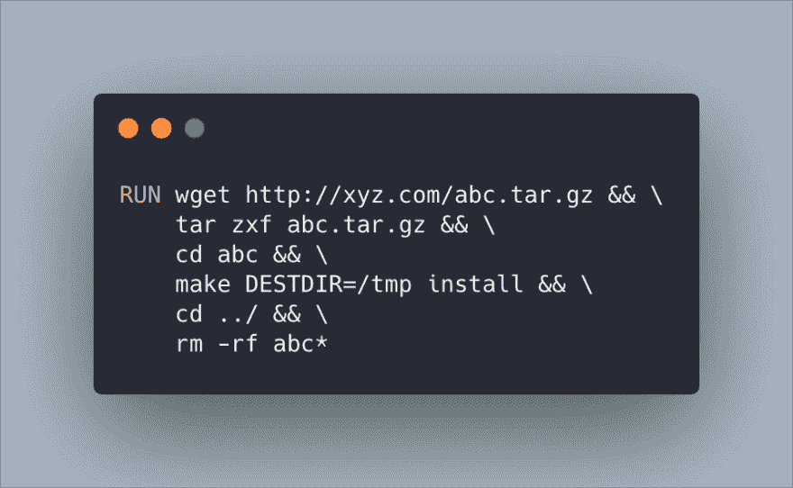
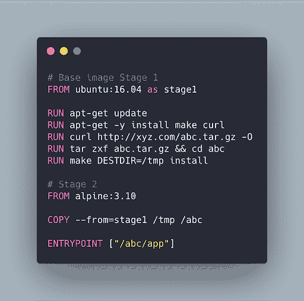

# 如何使用多阶段构件减小 Docker 图像的大小

> 原文：<https://dev.to/bnevilleoneill/how-to-reduce-docker-image-sizes-using-multi-stage-builds-51nl>

## 简介

Docker 是当今企业最重要的技术之一。大多数科技公司都在使用 Docker 来改善其产品和服务的部署策略，使其变得强大和可扩展。在本文中，我们将探讨高效编写 Dockerfiles 以减小最终图像大小的最有前途的特性之一。但是首先，让我们了解一下 Docker。

## Docker 是什么？

Docker 是应用程序的容器化，类似于虚拟机，但非常轻量级(阅读关于 [Docker 与虚拟机](https://nickjanetakis.com/blog/comparing-virtual-machines-vs-docker-containers)的完整文章)。Docker 是一个通过使用独立于操作系统的容器来轻松创建、部署和运行应用程序的工具。

一个**容器**将应用服务或功能与所有的库、配置文件、依赖项和其他必要的操作部分打包在一起。每个容器共享一个底层操作系统的服务。

## 这些 Docker 图像是什么？

Docker 映像是一组写在名为`Dockerfile`的文件中的指令。这些指令充当 Docker 中的多层文件系统。当 Docker 用户运行图像时，它会生成一个或多个容器。

我们也可以说 Docker 映像是不可变的文件，基本上是容器的快照。我们可以从单个 Docker 映像中创建 *n* 个容器，类似于从单个类中创建 *n* 个对象实例(共享共同的特征和行为)的概念。

就像我前面说过的，Dockerfile 包含一组指令，充当多层文件系统。docker 文件中的指令越多(例如`RUN`、`COPY`、`ADD`)，图像的最终大小就越大。还有许多其他因素会增加映像的大小，如上下文、基本映像、不必要的依赖项、包和一些指令。

## 为什么要缩小 Docker 图片的尺寸？

在这个内存和存储相对便宜的现代技术时代，我们为什么需要减小 Docker 图像的大小呢？

通过减小 Docker 图像的大小，我们只保留最终图像中所需的伪影，并删除所有不必要的数据。这也是必要的，因为:

*   首先也是最重要的是[最佳实践](https://docs.docker.com/develop/develop-images/dockerfile_best-practices/)
*   在映像中安装和保留不必要的依赖项会增加应用程序的复杂性和易受攻击性
*   下载和生成容器将花费大量时间
*   创建映像并将其推送到注册表也将花费大量时间，最终会阻塞我们的 CI/CD 管道
*   有时，由于构建上下文，我们最终会将密钥和秘密留在 docker 文件中
*   为了使容器不可变(是的，你没看错)，我们甚至不能在最终容器中编辑文件。这就是我们使用 CoreOS 实例的原因

## 如何缩小 Docker 图片的尺寸

减少 Docker 图像是我们应该知道如何做的事情，以保持我们的应用程序安全，并坚持正确的行业标准和准则。

有很多方法可以做到这一点，包括:

*   使用. dockerignore 文件从生成上下文中移除不必要的内容
*   尽量避免安装不必要的包和依赖项
*   保持图像中的图层最少
*   尽可能使用阿尔卑斯山的图片
*   使用多阶段构建，这是我将在本文中讨论的。

让我们转到**多阶段构建。** 

## Docker 中的多阶段构建

Docker 中的多阶段构建是在 [Docker 17.05](https://docs.docker.com/develop/develop-images/multistage-build/) 中引入的新功能。这是一种减小图像大小、更好地组织 Docker 命令、提高性能同时保持 Docker 文件易于阅读和理解的方法。

多阶段构建是将 Dockerfile 划分为多个阶段，以将所需的工件从一个阶段传递到另一个阶段，并最终在最后一个阶段交付最终的工件。这样，我们的最终图像将不会有任何不必要的内容，除了我们需要的工件。

以前，当我们没有多阶段构建功能时，很难最小化图像大小。我们过去常常在进入下一个指令之前清理每个工件(这不是必需的),因为 Dockerfile 中的每个指令都会将层添加到图像中。我们还曾经编写 bash/shell 脚本并应用 hacks 来删除不必要的工件。

让我们看一个例子:

[](https://carbon.now.sh/?bg=rgba%28171%2C%20184%2C%20195%2C%201%29&t=dracula&wt=none&l=dockerfile&ds=true&dsyoff=20px&dsblur=68px&wc=true&wa=true&pv=56px&ph=56px&ln=false&fm=Hack&fs=14px&lh=133%25&si=false&es=2x&wm=false&code=RUN%2520wget%2520http%253A%252F%252Fxyz.com%252Fabc.tar.gz%2520%2526%2526%2520%255C%250A%2520%2520%2520%2520tar%2520zxf%2520abc.tar.gz%2520%2526%2526%2520%255C%250A%2520%2520%2520%2520cd%2520abc%2520%2526%2526%2520%255C%250A%2520%2520%2520%2520make%2520DESTDIR%253D%252Ftmp%2520install%2520%2526%2526%2520%255C%250A%2520%2520%2520%2520cd%2520..%252F%2520%2526%2526%2520%255C%250A%2520%2520%2520%2520rm%2520-rf%2520abc*)

这只是 Dockerfile 中的一条指令，我们需要从某个 [`http://xyz.com`](https://gen.xyz/) 网站下载`abc.tar.gz`文件，提取内容并运行`make install`。

在同一条指令中，我们将`make install`命令的内容存储到`/tmp`目录中，并删除剩余的数据，如下载的`tar`文件和提取的`tar`内容，这样我们就可以只拥有`make install`命令的内容，这是我们进一步处理所需要的。

这就是我们在一条指令中要做的所有事情，以减小最终图像的尺寸。现在我们可以想象一下 Dockerfile 对于 *n* 条指令的复杂性。

哦，等等..等待..等待..！！！现在我们有了多阶段构建的能力，可以在不影响 power 文件可读性的情况下减小图像的大小。

让我们看看使用多阶段构建的同一个示例:

[](https://carbon.now.sh/?bg=rgba%28171%2C%20184%2C%20195%2C%201%29&t=dracula&wt=none&l=dockerfile&ds=true&dsyoff=20px&dsblur=68px&wc=true&wa=true&pv=56px&ph=56px&ln=false&fm=Hack&fs=14px&lh=133%25&si=false&es=2x&wm=false&code=%2523%2520Base%2520image%2520Stage%25201%250AFROM%2520ubuntu%253A16.04%2520as%2520stage1%250A%250ARUN%2520apt-get%2520update%250ARUN%2520apt-get%2520-y%2520install%2520make%2520curl%250ARUN%2520curl%2520http%253A%252F%252Fxyz.com%252Fabc.tar.gz%2520-O%250ARUN%2520tar%2520zxf%2520abc.tar.gz%2520%2526%2526%2520cd%2520abc%250ARUN%2520make%2520DESTDIR%253D%252Ftmp%2520install%250A%250A%2523%2520Stage%25202%250AFROM%2520alpine%253A3.10%250A%250ACOPY%2520--from%253Dstage1%2520%252Ftmp%2520%252Fabc%250A%250AENTRYPOINT%2520%255B%2522%252Fabc%252Fapp%2522%255D)

在这个 docker 文件中，我们使用`ubuntu:16.04`作为基础映像，将这个阶段称为`stage1`，并执行如下指令:

1.  运行`apt-get update`来更新包
2.  运行`apt-get -y install make curl`安装 make 和 curl 包
3.  我们使用 curl 从`http://xyz.com`下载了`abc.tar.gz`文件
4.  解压缩`abc.tar.gz`文件，并将目录更改为`abc`
5.  运行`make DESTDIR=/tmp install`命令，将输出保存到`tmp`目录
6.  我们没有移除不必要的人工物品，而是创建了另一个阶段，即阶段 2，用`alpine:3.10`作为基础图像，因为它更亮
7.  我们通过简单地运行`COPY --from=stage1 /tmp /abc`命令，将`/tmp`目录中的内容从`stage1`复制到`stage2`中的`/abc`目录
8.  最后，我们在`Entrypoint`中添加了二进制文件的路径来运行它

通过这种方式，我们将所需的工件从阶段 1 复制到阶段 2，而没有损害 docker 文件，并成功地创建了最优化和简化的映像。类似地，我们可以使用多阶段构建来为前端文件创建静态构建，并将静态文件传递到阶段 2，在那里我们可以使用 nginx 基本映像来托管它们，而无需在我们的应用程序中保留大而笨重的`node_modules`,静态构建后这些文件就没有用了。

## 结论

我们还可以使用外部 Docker 映像作为一个阶段，也可以在特定的构建阶段停止。它并不总是有用的，因为我们失去了前一阶段的中间容器，所以我们将无法利用 Docker 中的构建缓存。从 [Docker 官方文档](https://docs.docker.com/develop/develop-images/multistage-build/)中阅读更多关于多阶段构建的信息。

在本文中，我们研究了 Docker 是什么，为什么我们需要减少图像的大小，以及我们如何有效地使用多阶段构建来做到这一点。我希望这篇文章能帮助你理解 Docker 和它的多阶段构建特性。

随便评论，问我什么都行。你可以在[推特](https://twitter.com/ankitjain28may)和[媒体](https://medium.com/@ankitjain28may)上关注我。感谢阅读！ 

* * *

## Plug: [LogRocket](https://logrocket.com/signup/) ，一款适用于网络应用的 DVR

[log rocket](https://logrocket.com/signup/)是一个前端日志工具，让你重放问题，就像它们发生在你自己的浏览器中一样。LogRocket 不需要猜测错误发生的原因，也不需要向用户询问截图和日志转储，而是让您重放会话以快速了解哪里出错了。它可以与任何应用程序完美配合，不管是什么框架，并且有插件可以记录来自 Redux、Vuex 和@ngrx/store 的额外上下文。

除了记录 Redux 动作和状态，LogRocket 还记录控制台日志、JavaScript 错误、stacktraces、带有头+体的网络请求/响应、浏览器元数据、自定义日志。它还使用 DOM 来记录页面上的 HTML 和 CSS，甚至为最复杂的单页面应用程序重新创建像素级完美视频。

[免费试用](https://logrocket.com/signup/)。

* * *

帖子[如何使用多阶段构建缩小 Docker 图像尺寸](https://blog.logrocket.com/reduce-docker-image-sizes-using-multi-stage-builds/)最先出现在[博客](https://blog.logrocket.com)上。