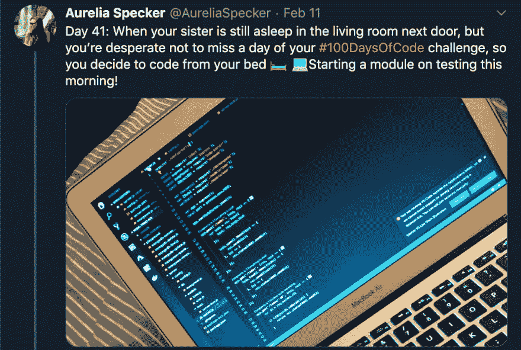
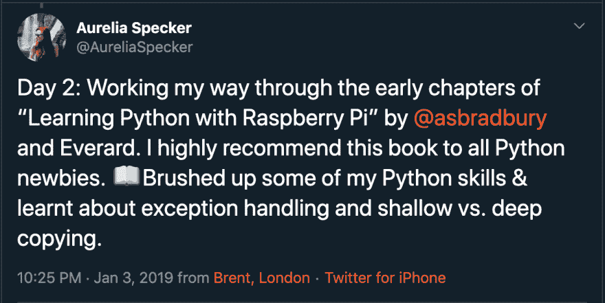
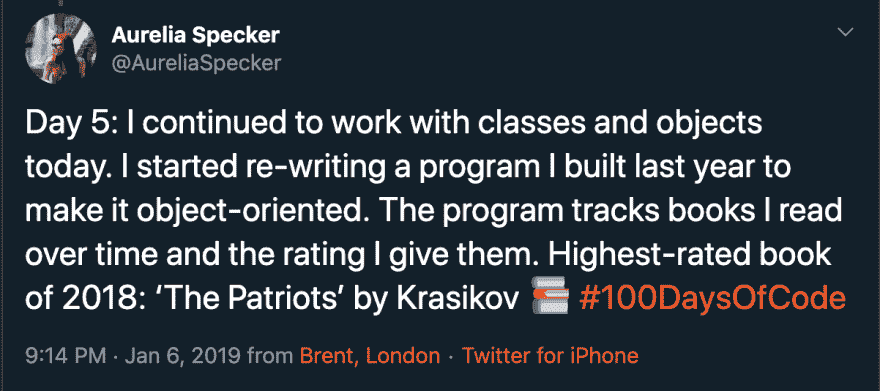
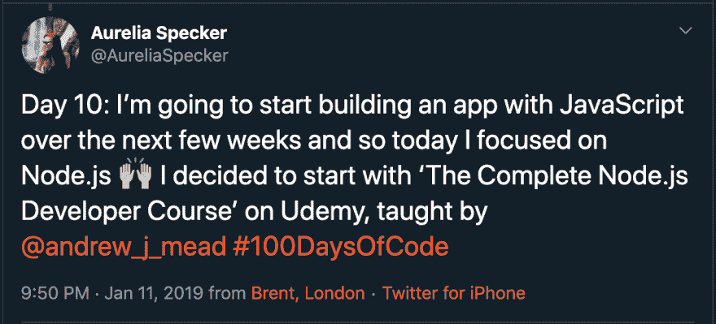
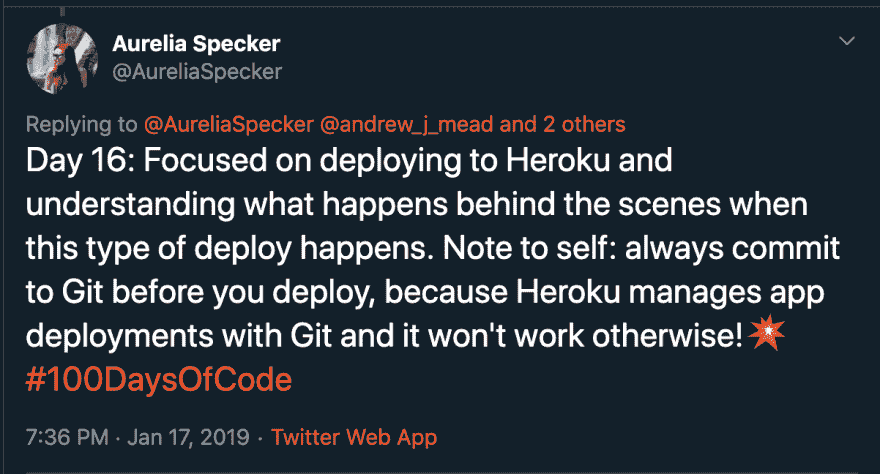
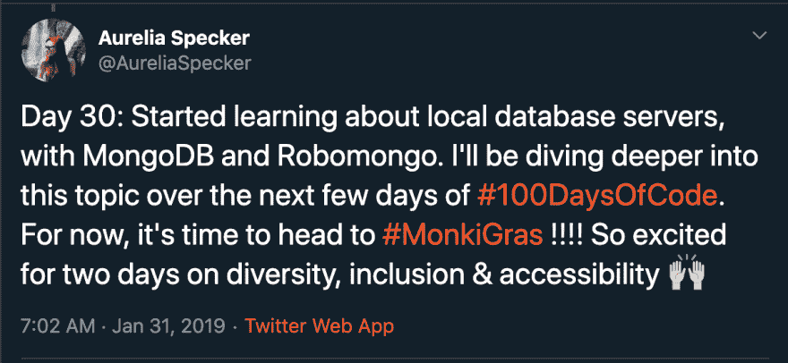
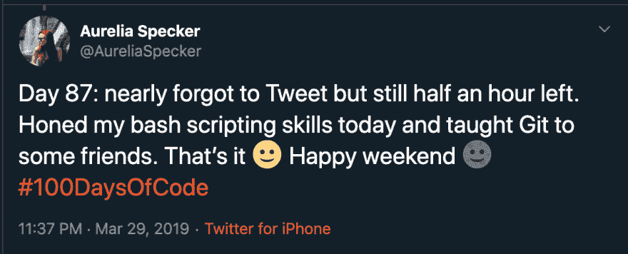

# #100DaysOfCode

> 原文：<https://dev.to/aureliaspecker/100daysofcode-36hj>

我没有技术背景。

我过去从事市场研究工作，在此之前，我在攻读现代语言学位。2017 年，我上了一个[码第一的编码课程:女生](https://www.codefirstgirls.org.uk/)。这就是我进入科技行业的方式，也是我开始在 Twitter 担任合伙人工程师的原因。

新工作几个月后，我觉得自己的编码技能提高得不够快。我需要找到在工作之外编码的动力，迫使自己走出舒适区去学习新的东西。这是我接受这个挑战的原因。

这篇文章是基于我最近关于我的#100DaysOfCode 挑战经历的一次演讲。

# 什么

#100DaysOfCode 挑战是由 [Alexander Kallaway](https://twitter.com/ka11away) 创立的，当时他对“学习编码的进展缓慢”感到沮丧([你可以在这里阅读更多内容](https://medium.com/free-code-camp/start-2017-with-the-100daysofcode-improved-and-updated-18ce604b237b))。亚历山大就此写了一篇文章，当其他人读到这个挑战时，许多人决定加入进来。自 2017 年以来，成千上万的人接受了挑战。

有两条规则:

1.  在接下来的 100 天里，每天至少花 1 个小时编码。

2.  公开承诺挑战，每天用 [#100DaysOfCode](https://twitter.com/100xcode) 标签发布你的进展。

你可以添加任何其他的规则来帮助你达到目标并适应你的时间表。例如，我添加了下面的规则:“为了让时间有价值，我必须做一些新的事情。”这意味着我作为工作的一部分所做的日常编码不算数。

# 为什么

##### 加入一个由支持、友好、积极和志趣相投的人组成的团体

例如，Twitter 和 Slack 上的社区非常活跃，我在挑战期间从其他人那里获得的支持非常有动力。

##### 结交新朋友

我很惊讶有这么多在 Twitter 上关注我的人(工作中和工作外)来问我挑战进行得如何。如果没有这个挑战，我可能永远也不会有这样的对话。

##### 做项目，不做教程

每一个初学者总有一天会从抄袭别人的代码和跟随教程转向开始写自己的代码。这是一个艰难的转变。#100DaysOfCode 挑战的性质，以及它跨越很长一段时间的事实，将有助于你实现这一转变。

##### 真正致力于学习编码的机会

我一直想写更多的代码。这个挑战迫使我不仅要思考，还要实际去做。

##### 一个活动的 GitHub 配置文件

你可以清楚地看到，当我一月份开始接受挑战时，我的 GitHub 档案变得多么活跃。同样明显的是，在四月份的挑战结束时，我需要休息一下。但之后我继续写代码。#100DaysOfCode 挑战是培养新习惯和一致性的好方法。

##### 记录你的进步

很容易意识不到你已经走了多远。能够回顾记录我在这 100 天里每天都做了什么的 [Tweet 线程](https://twitter.com/AureliaSpecker/status/1077196955514818560)有助于我看到在那段时间里我学到了多少，取得了多少成就。

##### 真是每天发微博的好借口！

# 挑战

##### 寻找时间

这对我来说是最困难的方面之一。工作占用了我很多时间，不上班的时候总是很忙。我不得不减少锻炼和社交，每天抽出一个小时来编码。

##### 不知道到底该学什么技术

存在的技术和编程语言的多样性是技术最令人兴奋的方面之一。然而，作为一个初学者，这也可能令人望而生畏，很难知道应该专注于哪些技术。

##### 不知道用什么资源

互联网上充斥着可用的资源(免费或收费)。虽然这很神奇，但也可能让人不知所措。我如何知道哪些资源是好的和值得信赖的？我如何知道什么格式最适合我？等等。

##### 进展缓慢时感到无望

100 天是一段很长的时间，自然会有一些感觉更困难的日子。有时感到气馁是正常的。在这样的日子里，重要的是后退一步，欣赏你迄今为止所做的一切。

##### 冒名顶替综合症真实存在！

每天在推特上发布你的进展会让你感到脆弱。“如果人们认为我太慢或者我学的东西太简单怎么办？”“我不够好怎么办？”这有时会很难，但学会屏蔽这些想法并忽略它们是很重要的。

# 如何成功

##### 想办法让自己承担责任

这对我真的很重要。知道我的同事，我的经理，我的朋友都在关注我的进步，这确保了我在最艰难的时刻不会放弃。

##### 有远大的计划

你不需要一个具体的计划，但是我会建议你列一个你想做或想了解的事情的清单。我的清单包括使用我的 Raspberry Pi 或者将 Python 项目重构为面向对象。当我在挑战中前进时，我发现了新的技术和概念，并将它们添加到我的列表中。这意味着，当我不知道下一步该做什么时，我可以简单地回到我的列表，开始下一项。

##### 过糟糕的一天没关系

你会有糟糕的日子。拥抱他们，并在推特上谈论它。你可能会得到社区的支持。经历糟糕的一天是旅程的一部分。谈论它也会帮助其他人在他们过糟糕的一天时不那么孤独。

##### 休息几天也没事

同样，如果需要的话，休息几天也很重要。在比赛中途，我请了 3 天假，和家人一起享受了一段时间。那时我感觉特别累，因为这段时间工作和个人生活都很忙。短暂的休息让我感到精力充沛，有足够的动力去迎接挑战的后半部分。

##### 一致性真的很重要

坚持不懈会帮助你养成一种习惯。

##### 持之以恒

我花了~70 天才开始感受到挑战的好处，才开始建立联系，才开始觉得这个挑战是值得的！学习需要时间。如果我早点放弃，我永远不会意识到在这段时间里我能学到多少东西。

##### 不要害怕寻求帮助

我很幸运在这个挑战中做了一些代码配对。有时候，你只是需要有人和你坐下来解释一个概念或者帮你调试。不要害怕寻求帮助:总会有人愿意帮助你。

# 资源

这个社区非常活跃，有许多资源可以帮助你起步，并一路支持你。例如:

*   [# 100 daysofcode 官网](https://www.100daysofcode.com/)
*   [Twitter 上的社区](https://twitter.com/search?q=%23100DaysOfCode&src=hashtag_click)
*   [# 100 daysofcode 松弛工作区](https://join.slack.com/t/100xcode/shared_invite/enQtNzQwMzIwMzQxODc5LWQwMjU5Mjg0N2ZiMzIzYzJiZmE0YjNiYTBiZDBjNjlkNjBmMTYxNDBmNmE2YmE2YzY4NTgzY2Y5NDQxNWY5ZDM)
*   播客片段: [CodeNewbie](https://www.codenewbie.org/podcast/100-days-of-code) 和[跟我学编码](https://learntocodewith.me/podcast/100-days-of-code-with-alexander-kallaway/)

# 我的学习心得

我选择广泛接触不同的技术、概念和语言，而不是在 100 天内专注于一个大项目。以下是一些例子:

##### 我第一次用的是树莓派

##### 我学习了面向对象编程

##### 我对 JavaScript 越来越熟悉，用 Node.js 写代码

##### 我研究了在 Heroku 部署项目时会发生什么

##### 我探索了异步编程并承诺

##### 我一头扎进数据库，同时使用了 MySQL 和 MongoDB

##### 我磨练了我的猛击技巧

##### 我使用 Flask 和 Jinja 为一个 Python 项目构建前端

##### 还有很多很多...