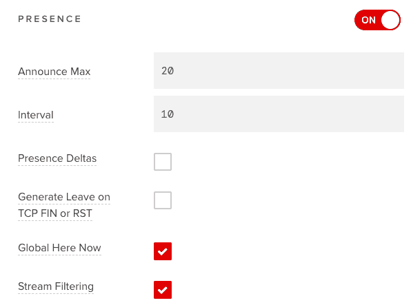
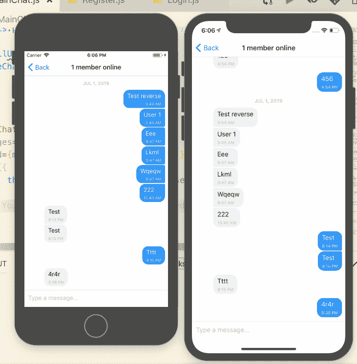

# 构建 React 原生聊天应用——第三部分:在线用户计数

> 原文：<https://dev.to/kris/building-a-react-native-chat-app-part-three-online-user-count-pubnub-2k37>

### 获得全反应原生信使克隆体

想为 Android 和 iOS 开发一款有趣的消息应用吗？使用我们外观精美、功能齐全的[社交聊天应用模板](https://www.instamobile.io/app-templates/react-native-chat-app-template/?ref=4094&campaign=dev.to)启动 react 原生聊天应用。它用 React Native 编写，具有强大的现成功能，如群聊、一对一聊天、照片消息和友谊管理。
[查看这里](https://www.instamobile.io/app-templates/react-native-chat-app-template/)

欢迎来到关于构建全功能 React 原生聊天应用的教程系列的第三部分。在前两部分中，我们介绍了[基本消息传递、UI 和原始认证](https://dev.to/kris/building-a-react-native-chat-app-part-one-basic-messaging-39dl)，并添加了[消息历史](https://dev.to/kris/building-a-react-native-chat-app-part-two-message-history-1d8k)。如果您还没有，请完成第一和第二部分，因为它们为我们接下来将要讲述的内容奠定了基础。

在这一部分中，我们将学习如何显示在线用户数，以识别聊天室中实时有多少用户。为了在我们的应用中实现这个特性，我们将使用 [PubNub Presence](https://www.pubnub.com/features/presence/) 。

### 激活 PubNub 存在

要激活在线状态，请导航至[发布管理仪表板](https://dashboard.pubnub.com/)。该仪表板将有多种配置，您可以在下面的屏幕截图中看到。为间隔设置的最小值是 10 秒。这将有助于当你在开发模式。为了降低生产成本，请将这个数字提高到一个更大的间隔长度，例如 1 分钟。

[](https://res.cloudinary.com/practicaldev/image/fetch/s--ulXQFaYx--/c_limit%2Cf_auto%2Cfl_progressive%2Cq_auto%2Cw_880/https://cdn-images-1.medium.com/max/596/0%2Av28ygrj41OE_uuXP.png)

用户将在其订阅的频道中触发以下在线状态事件:

*   **加入** —用户订阅一个频道。
*   **离开** —用户退订频道。
*   **超时** —当与信道的连接被切断，并且在 320 秒(刚刚超过 5 分钟)内没有看到订户时，触发超时事件。可以使用心跳和心跳间隔设置(SDK v3.6 或更高版本)自定义此超时间隔。
*   **状态改变** —使用状态 API(函数签名因 SDK 而异)改变状态时，将触发状态改变事件。
*   **interval** —每 10 秒发送一次占用计数(Presence Interval 属性的默认设置，也可以在您的管理仪表板中的 Presence 附加设置中进行配置)。

### 在 React 本地应用中激活状态

在这一步中，我们将在 React 本地聊天应用程序中激活状态，该应用程序是我们在前面的部分中构建的。

首先，您需要将硬编码的“MainChat1”房间名更改为一个变量，如下面的代码片段所示(MainChat.js 文件):

```
const RoomName = "MainChat1"; 
```

然后，您需要添加 UUID 来标识设备，并为 dev 模式添加一个超时，您可以在下面的代码片段(MainChat.js 文件)中看到:

```
this.pubnub = new PubNubReact({
   publishKey: "yourapikeyhere", 
   subscribeKey: "yourapikeyhere", 
   uuid: this.props.navigation.getParam("username"), presenceTimeout: 10
 }); 
```

然后，您需要在订阅频道时激活用户状态，方法是将 withPresence 状态设置为 true，如下面的代码片段所示:

```
this.pubnub.subscribe({ channels: [RoomName], withPresence: true }); 
```

这就完成了应用程序中存在的设置。

### 处理在场状态

在这一步中，我们将处理存在状态。首先创建一个新的状态对象。这将处理消息、在线用户和在线用户计数等数据，如下面的代码片段所示。把这个放到 **MainChat** :
的构造函数里

```
this.state = { 
    isTyping: false, 
    messages: [], 
    onlineUsers: [], 
   onlineUsersCount: 0 
}; 
```

### 处理在场事件

这里我们将处理 Presence 事件。首先，您需要创建一个名为 *PresenceStatus* 的新函数，并使用 get presence 函数获取呈现状态，并传递两个参数。它们是房间名和回调函数，如下面的代码片段所示。把这些放到主聊天类:

```
PresenceStatus = () => { 
    this.pubnub.getPresence(RoomName, presence => {})
 } 
```

_Note:我们需要处理两种类型的事件，分别是用户生成的和 PubNub generate_d。

### PubNub 用户在场事件

这些是用户生成的事件，如登录、注销等。当用户点击 login 时，它会生成一个 **join** 事件。当用户点击注销关闭应用程序时，它会生成一个**离开**事件，当用户在一段时间内没有做任何事情时，它会生成一个超时事件。

### 加入事件

加入事件非常简单。每当用户成功登录应用程序时，他们就会加入聊天室并收到一个加入事件。这可以通过使用以下代码片段中的代码来完成:

```
PresenceStatus = () => { 
    this.pubnub.getPresence(RoomName, presence => { 
       if (presence.action === "join") { 
          let users = this.state.onlineUsers;
          users.push({ 
              state: presence.state, 
              uuid: presence.uuid 
          }); 
          this.setState({
            onlineUsers: users, 
             onlineUsersCount: this.state.onlineUsersCount + 1 }); 
         }
 }) 
} 
```

首先，我们需要检查存在事件是否是一个“加入”然后我们将新用户添加到状态集合中。最后，我们更新 React 状态实例。

### 请假或超时事件

接下来，每当用户退出聊天室或超时时，我们都会生成一个 leave 事件和 timeout 事件。当用户点击“返回”或任何启动 componentDidMount 事件的按钮时，应用程序会生成一个 leave 事件。

当用户空闲时间太长时，他们会被挤出聊天室。下面的代码片段提供了实现这一点的代码。将此添加到您的 **PresenceStatus** 功能:

```
if (presence.action === "leave" || presence.action === "timeout") { let leftUsers = this.state.onlineUsers.filter( 
      users => users.uuid !== presence.uuid );      
          this.setState({ onlineUsers: leftUsers });
          const length = this.state.onlineUsers.length;        
          this.setState({ onlineUsersCount: length }); 
   this.props.navigation.setParams({
      onlineUsersCount: this.state.onlineUsersCount 
    }); 
} 
```

首先，我们获取其他用户，将他们从状态中过滤出来，然后将数据放回到状态中。然后我们需要对在线用户进行计数，并将计数放回 **onlineUsersCount** 状态，如代码片段所示。

### PubNub 网络存在事件

教程的这一部分讲述 PubNub 生成的事件。**间隔**事件是一个公共网络生成的事件。当用户在频道上在线时，我们可以使用它。他们将能够看到实时更新，如在线用户加入/离开。此外，用户可以识别哪些其他用户在线。

我们将执行与用户生成事件相同的逻辑，但是通过检查间隔事件数据中的条件。

### 加入事件

将此添加到您的 PresenceStatus 函数:

```
if (presence.action === "interval") { 
    if (presence.join || presence.leave || presence.timeout) {
    let onlineUsers = this.state.onlineUsers; 
     let onlineUsersCount = this.state.onlineUsersCount; 
     if (presence.join) {
       presence.join.map( user => user !== this.uuid && onlineUsers.push({ state: presence.state, uuid: user }) ); onlineUsersCount += presence.join.length; 
  }
 } 
} 
```

首先，我们检查间隔事件。如果新成员符合标准，那么我们获得当前状态数据并创建一个新的**状态**实例。如上面的代码片段所示，这被推送到在线用户的数组中。

接下来，我们将检查加入事件后的状态。如果新的 UUID 与集合中的 UUID 不匹配，那么我们假设需要将新用户添加到 **onlineUsers** 集合中。然后我们增加 **onlineUsersCount** 的数量。

### 离开事件

```
if (presence.leave) { 
   presence.leave.map(leftUser => onlineUsers.splice(onlineUsers.indexOf(leftUser), 1) 
);
 onlineUsersCount -= presence.leave.length; 
} 
```

对于离开事件，我们将跟踪离开的用户，并将他们从 **onlineUsers** 数组中拼接出来。然后我们需要减少 **onlineUsersCount** 实例来减少在线用户的数量。

### 超时事件

这里，我们需要做与 leave 事件相同的过程。

```
if (presence.timeout) {   
    presence.timeout.map(timeoutUser => onlineUsers.splice(onlineUsers.indexOf(timeoutUser), 1) ); onlineUsersCount -= presence.timeout.length; 
} 
```

我们添加更新状态逻辑，如下面的代码片段所示:

```
this.setState({ onlineUsers, onlineUsersCount }); 
```

接下来，用下面的代码更新**组件的**函数:

```
componentWillMount() { 
     this.props.navigation.setParams({ onlineUsersCount: this.state.onlineUsersCount,
   leaveChat: this.leaveChat.bind(this) 
}); 
this.pubnub.subscribe({
    channels: [RoomName], withPresence: true 
}); 
this.pubnub.getMessage(RoomName, m => { 
    this.setState(previousState => ({ messages: GiftedChat.append(previousState.messages, m["message"])
 }));
 }); 
// this.hereNow(); this.PresenceStatus(); 

} 
```

现在我们已经完成了 **PresenceStatus** 的实现代码。

### 显示在场数据

在本节中，我们将显示我们在上一节中操作的状态数据。首先，我们将在导航栏上显示数据。然后我们将在导航条下面显示用户的头像。

### 显示用户数

Navbar 是一个由 React 导航包生成的组件。我们需要将 **onlineUserCount** 状态传递给 navbar。然后，我们需要在 navbar 范围之外设置参数，以从 navbar 获取参数。

### 更新时设置状态数据

我们有多行需要更新**online usercount**。因此，我们将把它作为参数传递，如下面的代码片段所示(MainChat.js):

```
componentWillMount() { t
his.props.navigation.setParams({ 
   onlineUsersCount: this.state.onlineUsersCount });
 } 
```

### 导航栏中的在线用户计数数据

为了用状态数据更新导航栏，我们可以从参数中获取数据，如下面的代码片段所示:

```
static navigationOptions = ({ navigation }) => {
     return { 
        headerTitle: navigation.getParam("onlineUsersCount") + " member online" 
   }; 

}; 
```

我们需要添加用于配置导航栏的变量 **navigationOptions** 。然后，使用 **getParam** 和 **onlineUsersCount** ，我们可以在 UI 中设置文本。

[](https://res.cloudinary.com/practicaldev/image/fetch/s--nt3dTOkl--/c_limit%2Cf_auto%2Cfl_progressive%2Cq_66%2Cw_880/https://cdn-images-1.medium.com/max/731/0%2AEJPx-ZUF9q28b8sA.gif)

### 显示在线用户在与一个头像聊天

下一步，我们将在导航栏下实现用户存在的头像。为此，您需要复制下面代码片段中提供的代码，并将其替换到 MainChat.js 文件中。

```
render() {    
let username = this.props.navigation.getParam("username"); 
   return ( 
     <View style={{ flex: 1 }}> 
     <View style={styles.online\_user\_wrapper}> {
this.state.onlineUsers.map((item, index) => {
 return ( 
<View key={item.uuid}>
 <Image key={item.uuid} style={styles.online\_user\_avatar} source={{ uri: "https://robohash.org/" + item.uuid }} /> </View> );
      })
   } 
    </View>
    <GiftedChat messages={this.state.messages} 
        onSend={messages => this.onSend(messages)}
        user={{ \_id: username, name: username, avatar: "https://robohash.org/" + username }} />
   </View> ); 
   } 
} 
```

接下来，我们将创建一个主包装器来包装新的部分和聊天视图。然后我们需要添加一个包装器来包含头像，并遍历 **onlineUsers** 状态集合。我们将使用 [robohash](https://robohash.org) 为每个用户创建一个独特的图像。

然后，通过添加一些 CSS 来完成它，如下面的代码片段(MainChat.js):

```
const styles = StyleSheet.create({   
online\_user\_avatar: { 
      width: 50, 
      height: 50, 
      borderRadius: 20,
      margin: 10 
}, 
container: { 
      flex: 1,
      justifyContent: "center", 
      alignItems: "center",
      backgroundColor: "#F5FCFF" 
 },
 welcome: { 
      fontSize: 20,
      textAlign: "center",
       margin: 10 
 }, 
  online\_user\_wrapper: {
      height: "8%", 
      justifyContent: "flex-end", 
      alignItems: "center", 
      flexDirection: "row", 
      backgroundColor: "grey", 
     flexWrap: "wrap"
 } 
}); 
```

[](https://res.cloudinary.com/practicaldev/image/fetch/s--6oNXSHDJ--/c_limit%2Cf_auto%2Cfl_progressive%2Cq_66%2Cw_880/https://cdn-images-1.medium.com/max/731/0%2AIxtnz9SjNsaGWvPk.gif)

### 聊天注销功能

在我们认为本教程部分已经完成之前，让我们为我们的聊天应用程序实现一个注销功能。当用户点击**注销**时，需要调整用户状态数据。此外，用户必须取消订阅该频道。

### 创建 leaveChat 功能

这里，我们将创建一个 **leaveChat** 函数，如下面的代码片段所示(MainChat.js):

```
leaveChat = () => { 
  this.pubnub.unsubscribe({ 
    channels: [RoomName] });  
    return this.props.navigation.navigate("Login");
 }; 
```

当执行该函数时，用户将取消订阅 PubNub 频道，并被重定向到登录屏幕。

我们需要在下面提到的两个地方调用这个函数。在我们实现一个 **componentWillUnmount** 函数之前，我们需要实现 **leaveChat** 函数，如下面的代码片段所示:

```
componentWillUnmount() { this.leaveChat(); } 
```

### 添加注销到导航栏

我们在导航栏中添加了注销按钮点击的功能。这包括用户手动注销。我们将通过将它传递给 header 来节省一些屏幕空间，如下面的代码片段所示。修改你的**组件将挂载**函数:

```
componentWillMount() { 
  this.props.navigation.setParams({ 
   onlineUsersCount: this.state.onlineUsersCount,
   leaveChat: this.leaveChat.bind(this)
 }); ... 
```

最后，我们将删除 back 按钮，代之以标题中的 logout 按钮。将这段代码添加到 MainChat.js 中的构造函数下面:

```
static navigationOptions = ({ navigation }) => { 
    return { headerTitle: navigation.getParam("onlineUsersCount", "No") + " member online", headerLeft: null, headerRight: (
   <Button onPress={() => { 
     navigation.state.params.leaveChat(); 
    }} 
     title="Logout" color="red"
 /> )
 }; 
```

这就完成了我们使用 PubNub Presence 显示在线用户的教程！

使用命令行，运行 React 本地移动应用模拟器。

```
react-native run-ios 
react-native run-android 
```

### 包装完毕

在本教程中，我们学习了如何使用 PubNub Presence 来记录当前聊天室中有多少用户。

你的聊天应用功能越来越多，但我们还可以做更多。留意后续关于打字指标、未读消息计数等的帖子。

*原载于 2019 年 8 月 2 日*[*【https://www.pubnub.com】*](https://www.pubnub.com/blog/building-a-react-native-chat-app-part-three-display-online-user/)*。*

* * *