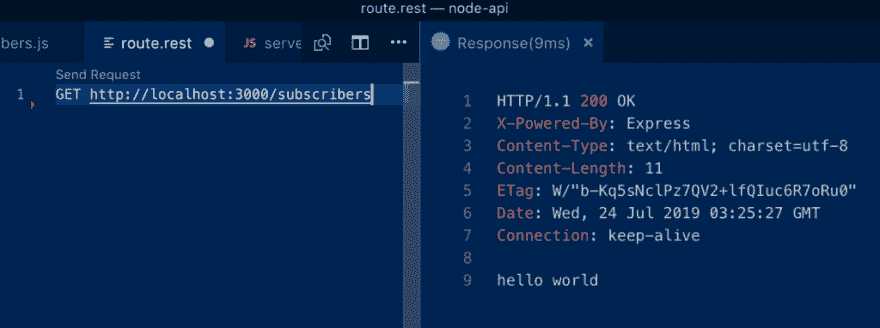
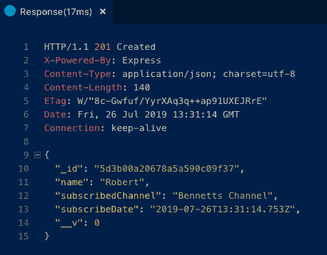
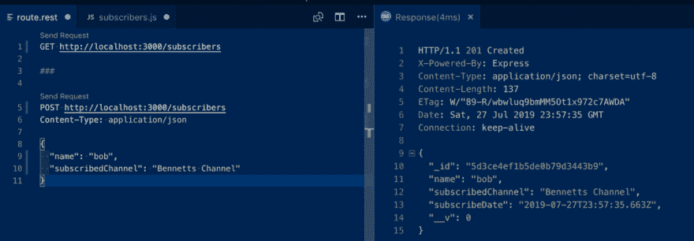
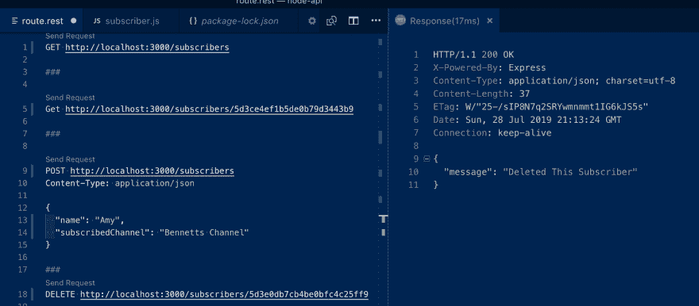
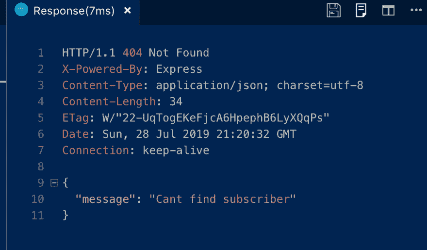

# 用 Node，Express & MongoDB 构建一个 REST API！

> 原文：<https://dev.to/beznet/build-a-rest-api-with-node-express-mongodb-4ho4>

在这个项目中，我们将为人们创建一种方式来订阅，更新，检索和删除 Youtube 帐户上的数据。我们将通过编写一个 REST API 来实现这一点，该 API 允许用户通过定义我们的数据库将接受什么信息以及它如何根据用户想要做的事情来操作这些数据来与我们的 Youtube 数据库进行交互。

一个对 [Web Dev Simplified](https://www.youtube.com/channel/UCFbNIlppjAuEX4znoulh0Cw) 的大喊，因为他能够在帮助我创建这个教程时传递知识。如果你更喜欢看这个的视频演示，那么我强烈推荐你看看网站开发简化版的教程[这里](https://youtu.be/fgTGADljAeg)

### 我的 GITHUB 回购

如果你卡住了，或者认为你做错了，不能完全弄清楚，请参考我的 Github Repo 的完整应用程序:[https://github.com/Beznet/node-api](https://github.com/Beznet/node-api)

## 项目和依赖关系设置

**重要先决条件:**在开始本教程之前，请确保您的计算机上已经安装并设置了 MongoDB。下面是 MongoDB 在其网站上提供的一个指南的链接: [MongoDB 安装](https://docs.mongodb.com/manual/administration/install-community/)

首先，让我们打开终端，为这个项目创建一个新目录。现在，在我们的终端中键入`npm init`开始，在每个问题中按 ENTER 键，暂时将所有字段留空。接下来我们要安装[快递](https://expressjs.com/)和[猫鼬](https://mongoosejs.com/):

`npm i express mongoose`

一旦这两个安装完成，我们还需要安装 [`dotenv`](https://www.npmjs.com/package/dotenv) 和 [`nodemon`](https://nodemon.io/) ，输入:

`npm i --save-dev dotenv nodemon`

*注意:-上面的 save-dev 将保存仅用于开发的依赖项，而不会将其保存到生产中*

`dotenv`将允许我们从`.env`文件中获取环境变量，nodemon 将在每次保存时更新我们的本地服务器

当我们之前运行`npm init`时，它创建了一个`package.json`文件。在脚本下的这个文件中，我们想用我们自己的脚本替换“测试”脚本，用`nodemon` :
启动我们的服务器

```
"scripts": {
  "devStart": "nodemon server.js"
} 
```

Enter fullscreen mode Exit fullscreen mode

## 设置我们的服务器

好了，现在我们开始创建第一个名为`server.js`的文件。一旦创建，在文件的顶部，我们希望包含我们的项目需要的所有依赖项:

```
const express = require('express')
const app = express()
const mongoose = require('mongoose') 
```

Enter fullscreen mode Exit fullscreen mode

当我们想要测试并确保我们的服务器正在工作时，我们将运行这个函数来监听端口 3000，如果成功，就记录一个字符串:

```
app.listen(3000, () => console.log('server started')) 
```

Enter fullscreen mode Exit fullscreen mode

此时，我们的 server.js 文件应该是这样的:

```
const express = require('express')
const app = express()
const mongoose = require('mongoose')

app.listen(3000, () => console.log('server started')) 
```

Enter fullscreen mode Exit fullscreen mode

## 连接到我们的数据库

从`mongoose.connect`开始的`server.js`文件中的下一段代码是我们连接数据库的方式。我逐行解释:

```
const express = require('express')
const app = express()
const mongoose = require('mongoose')

mongoose.connect(process.env.DATABASE_URL, { useNewUrlParser: true })
const db = mongoose.connection
db.on('error', (error) => console.error(error))
db.once('open', () => console.log('connected to database'))

app.listen(3000, () => console.log('server started')) 
```

Enter fullscreen mode Exit fullscreen mode

第一行允许我们使用 Mongoose 连接到数据库。你可能想知道`DATABASE_URL`是什么，这就是我们在`.env`文件中定义的数据库的位置。如果你还没有创建一个`.env`文件，现在是个好时机，然后你可以在那里设置`DATABASE_URL`:

```
// .env file

DATABASE_URL=mongodb://localhost/subscribers 
```

Enter fullscreen mode Exit fullscreen mode

在我们的`.env`中定义了`DATABASE_URL`之后，让我们跳回我们的`server.js`文件。现在，为了引用我们的`.env`文件中的变量，我们需要在我们的 server.js 文件的顶部添加`dotenv`包:

```
require('dotenv').config() 
```

Enter fullscreen mode Exit fullscreen mode

我们得到那个包裹后，需要那一行…

```
mongoose.connect(process.env.DATABASE_URL, { useNewUrlParser: true }) 
```

Enter fullscreen mode Exit fullscreen mode

…现在将正常工作。

接下来，我们将`db`设置为`mongoose.connection`,从语法上更容易引用我们的数据库。接下来，我们定义了当数据库遇到错误时会发生什么，也就是记录`error`本身。如果没有错误，我们希望将字符串`connected to database`记录到我们的终端。

好吧！那是一大堆东西。因此，为了将所有内容放在一起，我们的`server.js`文件现在应该看起来像这样:

```
require('dotenv').config()

const express = require('express')
const app = express()
const mongoose = require('mongoose')

mongoose.connect(process.env.DATABASE_URL, { useNewUrlParser: true })
const db = mongoose.connection
db.on('error', (error) => console.error(error))
db.once('open', () => console.log('connected to database'))

app.listen(3000, () => console.log('server started')) 
```

Enter fullscreen mode Exit fullscreen mode

## 让我们测试一下我们的数据库连接！

现在，我们可以测试我们与数据库的连接，以确保一切顺利。在我们的终端中，让我们通过键入`mongod`来启动我们的数据库，然后在另一个终端选项卡中，让我们用`npm run devStart`来启动我们的服务器。如果一切顺利，我们应该会在启动服务器后收到这些消息:

[](https://res.cloudinary.com/practicaldev/image/fetch/s--AeWL38G2--/c_limit%2Cf_auto%2Cfl_progressive%2Cq_auto%2Cw_880/https://thepracticaldev.s3.amazonaws.com/i/1eg6v5zu79s73pu5i3sl.png)

酷！我们已经成功地启动了我们的服务器，我们的数据库似乎正在运行。

## 设置我们的服务器接受 JSON

在同一个`server.js`文件中，我们想要告诉 Express 它应该接受 JSON。让我们将这一行代码放在“数据库打开”代码行和“监听端口 3000”代码行之间:

```
...
db.once('open', () => console.log('connected to database'))

app.use(express.json())

app.listen(3005, () => console.log('server started'))
... 
```

Enter fullscreen mode Exit fullscreen mode

`.use`是一个中间件，它允许您在服务器收到请求时，但在请求被传递到您的路由之前运行代码。所以在这个例子中，我们告诉 Express 接受 JSON 作为数据格式。

## 创建我们的航线文件夹&文件

让我们为我们的路由创建一个名为`routes`的新目录，然后在这个目录中创建一个名为`subscribers.js`的文件。在这个文件的内部，我们将定义服务器在接收到 GET、POST 或 PATCH 请求时应该如何处理数据。

但是在我们开始创建这些之前，让我们切换回我们的`server.js`文件，告诉服务器我们现在有了它需要处理和使用的路由。接下来的两行代码实际上是我们的`server.js`文件需要的最后两行。

```
const subscribersRouter = require('./routes/subscribers')
app.use('/subscribers', subscribersRouter) 
```

Enter fullscreen mode Exit fullscreen mode

下面是添加了新代码行的完整的`server.js`文件:

```
require('dotenv').config()

const express = require('express')
const app = express()
const mongoose = require('mongoose')

mongoose.connect(process.env.DATABASE_URL, { useNewUrlParser: true })
const db = mongoose.connection
db.on('error', (error) => console.error(error))
db.once('open', () => console.log('connected to database'))

app.use(express.json())

const subscribersRouter = require('./routes/subscribers')
app.use('/subscribers', subscribersRouter)

app.listen(3005, () => console.log('server started')) 
```

Enter fullscreen mode Exit fullscreen mode

如果有什么东西丢失或不正确，现在是一个很好的检查点，可以确保你已经更新了上面的所有内容。走了这么远，给自己一点鼓励吧！我们接下来将进入有趣的内容…

## 设置我们的路线

既然我们的服务器文件已经设置好了，现在让我们切换到新的`subscribers.js` routes 文件。首先，让我们要求 Express 并在一个名为`router`的变量上定义`express.router()`函数。当我们在这里的时候，让我们添加我们的[模块导出函数](https://www.sitepoint.com/understanding-module-exports-exports-node-js/)，也在最底部:

```
const express = require('express')
const router = express.Router()

module.exports = router 
```

Enter fullscreen mode Exit fullscreen mode

在我们进入代码之前，让我们了解一下我们到底想对我们的路线做什么。因为我们试图在 Youtube 上看到并人为地创造新订户，所以我们需要这套标准:

*   获取所有订户的路线
*   获取一个订户的途径
*   创建一个订户的路线
*   更新一个订户的路线
*   删除一个订户的路线

现在，让我们根据是 GET、POST 还是 PATCH 请求，从基本框架开始上面的每个要点:

```
const express = require('express')
const router = express.Router()

// Get all subscribers
router.get('/', (req, res) => {
})

// Get one subscriber
router.get('/:id', (req, res) => {
})

// Create one subscriber
router.post('/', (req, res) => {
})

// Update one subscriber
router.patch('/:id', (req, res) => {
})

// Delete one subscriber
router.delete('/:id', (req, res) => {
})

module.exports = router 
```

Enter fullscreen mode Exit fullscreen mode

GET、POST 和 DELETE 方法应该看起来很熟悉，但是如果不熟悉的话，这里有一点关于它们的复习。可能看起来奇怪的一件事是补丁方法。这里使用的是 PATCH 方法，而不是更传统的 PUT 方法，因为我们只想用它来更新订户的部分信息，而不是订户的所有信息。

你可能也注意到了，我们在大多数参数中都包含了`/:id`。这用于请求对单个订户采取行动的路由，因此我们需要该订户的唯一 ID。

## 测试我们的 API

让我们稍微休息一下，用我们目前所拥有的来测试我们的 API。在我们的“获取所有订户”路线中，让我们向我们的服务器发送文本:

```
// Get all subscribers

router.get('/', (req, res) => {
   res.send('Hello World')
}) 
```

Enter fullscreen mode Exit fullscreen mode

现在为了测试我们的 API，我将使用一个名为 [REST Client](https://marketplace.visualstudio.com/items?itemName=humao.rest-client) 的 Visual Studio 代码扩展。如果你没有 VS 代码，那么你可以使用另一个名为[邮差](https://www.getpostman.com/)的程序，它也有助于测试 API。对于本教程，我将在 VS 代码中只使用 REST 客户端。

一旦安装了 REST 客户端扩展，让我们在`routes`文件夹中创建一个新文件来运行我们的测试，并将其命名为`route.rest`。它需要在`.rest`结束，否则它将无法与 REST 客户端正常工作。

很好，现在让我们在`route.rest`文件:
中编写一个对服务器的测试 GET 调用

```
GET http://localhost:3000/subscribers 
```

Enter fullscreen mode Exit fullscreen mode

确保 3000 后有`/subscribers`。现在，如果你将鼠标悬停在刚刚写下那一行的上方，你应该会看到“发送请求”出现在它的上方。点击这个按钮，在屏幕的右边观察结果。如果一切顺利，应该是这样的:

[](https://res.cloudinary.com/practicaldev/image/fetch/s--Ypp4w6Yv--/c_limit%2Cf_auto%2Cfl_progressive%2Cq_auto%2Cw_880/https://thepracticaldev.s3.amazonaws.com/i/kr3wenx3n5o8qjy05t5f.png)

在第 9 行，我们可以看到服务器发回了“hello world”。这意味着我们的 API 工作正常！好了，到目前为止我们已经做了很多，让我们休息一下，然后我们将开始制作模型。

## 制作模型

让我们继续设置我们的模型和模型中的模式。模式是我们的应用程序定义数据外观的方式，也是在 MongoDB 中设置文档的方式。如果这听起来令人困惑，一旦我们看到发生了什么，它就会变得更有意义。

让我们首先创建一个名为`models`的新文件夹。在这个文件夹中，让我们创建一个名为`subscriber.js`的新文件。请注意，我们将这个文件命名为“订户”单数，而不是 routes 文件的复数形式。这个想法是，该模型将处理每个用户在个人层面上如何看待我们的数据库内部。“订户”路由有时处理多个订户请求，例如获取所有订户路由。这是一件值得一提的事情，因为在项目中命名文件时，冗长是很重要的。

在这个新文件中，我们首先需要 Mongoose，因为我们将使用它们的模式模型:

```
const mongoose = require('mongoose') 
```

Enter fullscreen mode Exit fullscreen mode

在我们需要 mongoose 之后，我们将开始定义我们的模式

```
const mongoose = require('mongoose')

const subscriberSchema = new mongoose.Schema({}) 
```

Enter fullscreen mode Exit fullscreen mode

这个 javascript 对象内部将是我们的订户的不同属性的所有键。这些键将包括`name`、`subscribedChannel`和`subscribeDate`。我们本质上是想告诉我们的数据库从这些键中的每一个期待什么，比如它们的类型，它们是否是必需的，以及是否应该应用默认值。

```
const mongoose = require('mongoose')

const subscriberSchema = new mongoose.Schema({
  name: {
    type: String,
    required: true
  },
  subscribedChannel: {
    type: String,
    required: true
  },
  subscribeDate: {
    type: Date,
    required: true,
    default: Date.now
  }
}) 
```

Enter fullscreen mode Exit fullscreen mode

`type`和`required`属性应该是不言自明的。它们定义了预期的模式类型(在本例中是字符串和日期),以及在输入新订户的信息时是否需要该键。

关于`subscribeDate`需要注意的一点是，我们将类型设置为 Date 而不是 String，因为我们将从用户那里期待一个日期。如果没有提供日期，那么我们使用`Date.now`将其默认为当前日期。

继续，我们想在模式中写的最后一行代码是`module.exports`。这将允许我们使用我们的模式来使用数据库并与之交互。Mongoose 有一种特殊的导出模型的方式，它使用了两个属性:

```
// exporting our subscriber schema

module.exports = mongoose.model('Subscriber', subscriberSchema) 
```

Enter fullscreen mode Exit fullscreen mode

“Subscriber”是我们希望给数据库中的模型起的名字，下一个是对应于这个模型的模式，也就是我们的`subscriberSchema`。

我们的模型到此为止！让我们看一下完成的模式，以确保我们得到了所有的内容:

```
const mongoose = require('mongoose')

const subscriberSchema = new mongoose.Schema({
  name: {
    type: String,
    required: true
  },
  subscribedChannel: {
    type: String,
    required: true
  },
  subscribeDate: {
    type: Date,
    required: true,
    default: Date.now
  }
})

module.exports = mongoose.model('Subscriber', subscriberSchema) 
```

Enter fullscreen mode Exit fullscreen mode

## 路线–创建并获得用户

现在我们已经用数据库的模式设置了模型，让我们在下面需要`router`
的`subscribers.js` route 文件中需要它

```
const express = require('express')
const router = express.Router()
const Subscriber = require('../models/subscriber') 
```

Enter fullscreen mode Exit fullscreen mode

现在我们可以从我们停下来的地方开始，在这里我们为每条路线编写了一个 shell:

```
// Getting all subscribers
router.get('/', (req, res) => {
   res.send('Hello World')
})

// Getting one subscriber
router.get('/:id', (req, res) => {
})

// Creating one subscriber
router.post('/', (req, res) => {
})

// Updating one subscriber
router.patch('/:id', (req, res) => {
})

// Deleting one subscriber
router.delete('/:id', (req, res) => {
}) 
```

Enter fullscreen mode Exit fullscreen mode

当我们发送“Hello World”到服务器时，我们有我们的测试响应，但是我们可以继续删除它，因为我们想实际告诉该路由以获得所有订户。

在去掉旧的`res.send('Hello World')`行之后，我们需要做的第一件事是用一个 try/catch 语句将函数包装在一个承诺中:

```
// Get all subscribers

router.get('/', async (req, res) => {
  try {

  } catch () {

  }
}) 
```

Enter fullscreen mode Exit fullscreen mode

在我们的`try`语句中，我们希望从我们的模型中获得所有的订阅者。因此，我们希望为该模型设置一个名为 subscribers 的新变量，并将一个`.find()`方法应用于我们的订户模型。

```
// Get all subscribers

router.get('/', async (req, res) => {
  try {
    const subscribers = await Subscriber.find()
  } catch () {

  }
}) 
```

Enter fullscreen mode Exit fullscreen mode

顾名思义，`find()`mongose 方法通过返回所有符合其标准的相关订户对象来工作。因为我们要返回所有的订户，所以我们只保留括号空白，因为我们需要所有的订户:

在这一行之后，我们想发送一个响应，其中包含我们刚刚以 JSON:
的形式创建的`subscribers`变量的数据

```
// Get all subscribers

router.get('/', async (req, res) => {
  try {
    const subscribers = await Subscriber.find()
    res.json(subscribers)
  } catch () {

  }
}) 
```

Enter fullscreen mode Exit fullscreen mode

最后，在我们的`catch`语句中，我们希望捕获任何可能发生的错误，并以 JSON 格式将它作为 500 错误发送给用户:

```
// Get all subscribers

router.get('/', async (req, res) => {
  try {
    const subscribers = await Subscriber.find()
    res.json(subscribers)
  } catch (err) {
    res.status(500).json({ message: err.message })
  }
}) 
```

Enter fullscreen mode Exit fullscreen mode

既然我们已经有了将数据库中的所有订户发送给我们的路由，我们需要编写一个方法来将订户实际添加到我们的数据库中。因此，让我们继续创建一个订户路线，这样我们就可以输入关于订户的数据:

```
// Create one subscriber

router.post('/', async (req, res) => {
  const subscriber = new Subscriber({
    name: req.body.name,
    subscribedChannel: req.body.subscribedChannel
  })

  try {
    const newSubscriber = await subscriber.save()
    res.status(201).json(newSubscriber)
  } catch (err) {
    res.status(400).json({ message: err.message })
  }
}) 
```

Enter fullscreen mode Exit fullscreen mode

您可以看到它与我们的“获取所有订户”路线有些相似，除了一些重要的区别。首先，我们不再对数据库进行 GET 调用，而是通过 POST 将数据推送到数据库。

在这一行:

`const subscriber = new Subscriber({...`

我们正在创建一个变量，该变量将被分配给我们之前创建的模型中的一个新的`Subscriber`。如果您还记得，我们需要一个新订户的`name`、`subscribedChannel`和`subscribeDate`属性。

下面两行代码:

`name: req.body.name,
subscribedChannel: req.body.subscribedChannel`

我们告诉我们的路由保存来自用户输入的新订户属性`name`和属性`subscribedChannel`的请求。我们的`subscribeDate`不需要定义，因为它将自动默认为这个数据库条目的日期/时间。

`try`和`catch`语句应该看起来很熟悉。我们使用的是`.save()`mongose 方法，而不是`find()`，因为这是我们告诉数据库我们希望它保存用户通过这个路由器功能传递给我们的信息的方式。

最后:

`...
res.status(201).json(newSubscriber)
} catch (err) {
res.status(400).json({ message: err.message })
}` 

我们将向用户发送一个带有 201 的[成功状态的响应，并将我们的新订户作为 JSON 返回给我们。除了我们传递一个](https://httpstatuses.com/201) [400 错误](https://httpstatuses.com/400)之外，这个问题就像我们的获取所有订户路径一样，因为这将是一个用户错误，因为它传递给了我们错误的数据。

## 让我们创建并获得我们的第一个订户吧！

至此，我们已经创建了我们的模型和两条路由，这将允许我们创建一个订户，然后从我们的数据库中调用该订户的信息。让我们切换回我们的`route.rest`文件，创建我们的第一个用户:

```
GET http://localhost:3000/subscribers

###

POST http://localhost:3000/subscribers
Content-Type: application/json

{
  "name": "Robert",
  "subscribedChannel": "Bennetts Channel"
} 
```

Enter fullscreen mode Exit fullscreen mode

使用 REST Client，我们需要用您在第 3 行的两个语句之间看到的三个 hashtags 来分隔不同的测试请求。

我们的第一个请求应该与之前完全相同，所以这里唯一不同的是我们的新 POST 请求，它允许我们用他们的名字(在我的例子中是 Robert)和他们订阅的频道([我的)创建一个新订户！](https://www.youtube.com/channel/UCDP-Mkz_lRoFSiP9_p1L3xQ))。因此，让我们运行我们的 POST 请求，看看我们得到了什么:

[](https://res.cloudinary.com/practicaldev/image/fetch/s--_jbayxgl--/c_limit%2Cf_auto%2Cfl_progressive%2Cq_auto%2Cw_880/https://thepracticaldev.s3.amazonaws.com/i/n2095ojafy3fksfc78ex.png)

如果一切顺利，当我们点击“发送请求”时，我们的响应应该像上面这样。我们可以看到，我们在顶部收到了 201 成功状态，在底部收到了订阅者对象以及我们刚刚插入的所有信息。

同样，`subscribeDate`被自动设置为创建日期，因此我们不需要手动设置它。现在让我们使用 Get All Subscribers 请求，并确保它返回 Robert 的信息:

[](https://res.cloudinary.com/practicaldev/image/fetch/s--qLOVL3Zf--/c_limit%2Cf_auto%2Cfl_progressive%2Cq_auto%2Cw_880/https://thepracticaldev.s3.amazonaws.com/i/51zg5x6qaawdvzh5ea1z.png)

我们的响应将类似于我们的创建订户响应，因为我们的数据库中只有一个用户，但是如果您创建了多个订户，这将为您填充所有的订户。

## 中间——什么？中间件！

我们在最后冲刺阶段！我们需要做的最后几件事是完成我们的删除、更新和获取一个订户路由，我们的 REST API 就完成了！

最后三条路由的一个共同点是获得特定用户的 ID。我们可以将这段代码放入它自己的函数中，并在 mongose GET/PATCH/POST 语句中将其称为[中间件](https://mongoosejs.com/docs/middleware.html)，而不是将那部分代码重复写 3 次。让我们将这个名为`getSubscriber`的中间件函数放在我们的`module.exports = router`行之前:

```
async function getSubscriber(req, res, next) {
  try {
    subscriber = await Subscriber.findById(req.params.id)
    if (subscriber == null) {
      return res.status(404).json({ message: 'Cant find subscriber'})
    }
  } catch(err){
    return res.status(500).json({ message: err.message })
  }

  res.subscriber = subscriber
  next()
} 
```

Enter fullscreen mode Exit fullscreen mode

这里发生了很多事情，让我们来分析一下。第一行应该看起来很熟悉，除了那个名为`next`的新属性。基本上，当调用`next`时，它告诉函数执行移动到我们代码的下一部分，这是这个`getSubscriber`函数将被添加到的路由函数。

我们的`try`和`catch`语句与我们的其他路线一样开放。然后，我们将第 3 行中的订户定义为我们的订户模型对象，我们将使用`findById`方法来查找与用户从父路由传入的 ID 相关的订户。这将把`subscriber`设置为一个等于该 id 的对象。

*旁注:*这部分可能有点混乱，但请耐心等待，直到我们看到下面的更新/删除/获取路线。当我们看到它在行动时，我会更有意义。

一旦我们将`subscriber`设置为模型的对象，我们就用一个`if`语句来检查该订户是否存在，并使用`null`检查。如果订户不存在，那么我们要抛出一个 404 错误。然后，我们的`catch`正在进行常见的错误检查，如果出现这种情况，将向用户返回一个 500 状态代码

最后，我们只剩下中间件函数的最后两行代码:

`res.subscriber = subscriber
next()`

`res.subscriber`在响应对象上设置一个变量，该变量等于我们的订户对象。这很有用，所以我们不必写同样的代码行，我们可以从这个函数中引用`res.subscriber`。最后，在其他所有事情都执行完之后，我们使用`next()`函数告诉`getSubscriber`函数继续执行实际的请求。

现在我们已经完成了中间件功能，让我们将它添加到我们的删除、更新和获取路径:

```
// Get one subscriber
router.get('/:id', getSubscriber, (req, res) => {
})

// Update one subscriber
router.patch('/:id', getSubscriber, async (req, res) => {
})

// Delete one subscriber
router.delete('/:id', getSubscriber, async (req, res) => {
}) 
```

Enter fullscreen mode Exit fullscreen mode

## 路线–获得一个订户

我们用我们的中间件完成了最后 3 条路线的大部分繁重工作。让我们从 Get One 路线开始:

```
// Get One Subscriber

router.get('/:id', getSubscriber, (req, res) => {
  res.json(res.subscriber)
}) 
```

Enter fullscreen mode Exit fullscreen mode

看看这看起来有多简单。我们所要做的就是用 JSON 向用户发送一个带有我们在中间件函数中定义的`res.subscriber`的响应，它返回特定订户的信息。我们可以很快地测试这条新路由，以确保我们的中间件功能和我们创建的这条新路由能够正常工作。

让我们跳回到我们的`route.rest`文件，用我们的创建订户请求创建一个新订户，这样我们就可以获得该订户的 ID:

[](https://res.cloudinary.com/practicaldev/image/fetch/s--qFCVnSaF--/c_limit%2Cf_auto%2Cfl_progressive%2Cq_auto%2Cw_880/https://thepracticaldev.s3.amazonaws.com/i/8cew3a9fonj1pzyyor2o.png)

好了，我们创建了一个新订户，并将其命名为 Bob，我们可以看到，他的名字上方有一个与其对象相关联的长 ID。我想保留这个 ID，这样当我们编写新的 GET route 时，我就可以通过 Bob 的 ID 来专门调用他。我们可以把这个放在我们的 Get All Subscribers 请求下面:

```
GET http://localhost:3000/subscribers

###

GET http://localhost:3000/subscribers/5d3ce4ef1b5de0b79d3443b9

###

POST http://localhost:3000/subscribers
Content-Type: application/json

{
  "name": "bob",
  "subscribedChannel": "Bennetts Channel"
} 
```

Enter fullscreen mode Exit fullscreen mode

在第 5 行，我们将创建新的测试请求，因此输入您新创建的用户 ID(您的 ID 将与上面的不同)并单击“发送请求”:

[](https://res.cloudinary.com/practicaldev/image/fetch/s--XQEqWvNh--/c_limit%2Cf_auto%2Cfl_progressive%2Cq_auto%2Cw_880/https://thepracticaldev.s3.amazonaws.com/i/yuk16o3zjex5n6xuh322.png)

如果一切顺利，我们应该不会看到右边的响应发生变化，因为我们只是调用刚刚创建的同一个用户。给自己拍一下背，你的中间件功能，并获得一条路线的作品！

## 路由–删除订户

现在我们知道我们的中间件正在完成它的工作，让我们切换回我们的`subscribers.js` routes 文件，并从 Delete:
开始完成我们的最后两条路由

```
// Delete one subscriber

router.delete('/:id', getSubscriber, async (req, res) => {
  try {
    await res.subscriber.remove()
    res.json({ message: 'Deleted This Subscriber' })
  } catch(err) {
    res.status(500).json({ message: err.message })
  }
}) 
```

Enter fullscreen mode Exit fullscreen mode

我们打开我们的`try`语句，然后在设置我们的`res.subscriber`之前插入我们的`await`操作符，然后使用`remove()`方法删除设置了`res.subscriber`对象的订户。然后，我们想告诉用户，我们通过传递 JSON 中的响应消息成功删除了订阅者:

`res.json({ message: 'Deleted This Subscriber' })`

和往常一样，如果确实发生了错误，我们希望我们的`catch`向用户发送适当的错误。删除到此为止！

## 路线–更新订户

我们的更新订阅者路由是我们需要为这个应用程序编写的最后一件事，这样它才能完全发挥作用！好了，在我们开始写代码之前，让我们对这种情况下的更新有个大概的了解:

*   用户只更新名称
*   用户只更新频道
*   用户更新名称和频道
*   或者他们搞砸了，它抛出一个错误

我们的需求需要我们从本质上检查和查看是否有任何更改，如果有，适当地更新它们。现在进入代码:

```
// Update Subscriber

router.patch('/:id', getSubscriber, async (req, res) => {
  if (req.body.name != null) {
    res.subscriber.name = req.body.name
  }

  if (req.body.subscribedChannel != null) {
    res.subscriber.subscribedChannel = req.body.subscribedChannel
  }
  try {
    const updatedSubscriber = await res.subscriber.save()
    res.json(updatedSubscriber)
  } catch {
    res.status(400).json({ message: err.message })
  }

}) 
```

Enter fullscreen mode Exit fullscreen mode

我们从一个补丁方法开始我们的功能，我们在最初定义我们的路由外壳时讨论过这个方法。现在你可以看到我们在函数中添加了两个`if`语句。第一个 if 语句检查来自用户请求的`body`的名字是否不等于`null`。这是一个重要的检查，因为如果它等于`null`，那么这意味着用户没有通过我们的 route 函数传递任何关于姓名的数据。如果是的话，我们就转到这条线上:

`res.subscriber.name = req.body.name`

在这里，我们从`res.subscriber`开始设置我们的订户的名称，并且现在将该名称设置为用户从他们的请求中传递的新名称。

这里遵循相同的逻辑:

`res.subscriber.subscribedChannel = req.body.subscribedChannel`

在这里，我们检查用户是否更新了`subscribedChannel`，如果是，那么我们执行相同的序列，根据用户的请求将当前的`subscribedChannel`更改为新的。

在我们完成这些`if`语句检查之后，我们想要告诉函数将这些新的更改保存到我们的数据库中。这在我们的`try`语句中很容易做到，我们用新的名称和/或通道获取`res.subscriber`对象，然后在一个名为`updatedSubscriber`的新变量中添加`save()`方法。然后，我们希望将这个新的`updatedSubscriber`对象以 JSON 的形式传递给我们的用户:

`try {
const updatedSubscriber = await res.subscriber.save()
res.json(updatedSubscriber)
}` 

这就是我们在`subscribers.js` route 文件中需要的所有东西，所以让我们在这里暂停一下，确保到目前为止我们已经得到了所有东西。去我的 [github repo](https://github.com/Beznet/node-api) 为这个项目，并确保你的代码准确反映了我在下面的最后测试之前。

## 最后的考验

我们已经完成了最后两条路线，让我们进入我们的`route.rest`文件，测试这些坏孩子，确保他们工作正常。

我们的删除请求就像我们的 Get One Subscriber 路由一样简单，只是我们没有使用 Get 请求，而是自然地使用了 Delete 请求。因此，在您的数据库中获取一个订户的 ID，让我们创建这个测试路由:

```
###

DELETE http://localhost:3000/subscribers/5d3e0db7cb4be0bfc4c25ff9 
```

Enter fullscreen mode Exit fullscreen mode

现在，让我们单击“发送请求”,看看我们的用户是否被成功删除:

[](https://res.cloudinary.com/practicaldev/image/fetch/s--I6LKwY8h--/c_limit%2Cf_auto%2Cfl_progressive%2Cq_auto%2Cw_880/https://thepracticaldev.s3.amazonaws.com/i/l2do2uh9ivqlren4gp95.png)

不错！因此，我们可以看到，我们在右侧收到了一条“已删除该订户”的消息，这意味着我们成功了。现在，如果您使用刚刚删除的那个 ID，并尝试使用我们的 Get One Subscriber 请求来请求它，它应该会告诉我们找不到该订户，因为它们不再存在于我们的数据库中:

[](https://res.cloudinary.com/practicaldev/image/fetch/s--9hYEnU1_--/c_limit%2Cf_auto%2Cfl_progressive%2Cq_auto%2Cw_880/https://thepracticaldev.s3.amazonaws.com/i/duat7pwxz9cmd6yvdjsv.png)

我们的最后一个请求是用我们的更新路由更新数据库中现有的订户信息。因为我们刚刚删除了最后一个订阅者，所以继续创建一个新的订阅者，让我们使用 PATCH:
编写更新请求

```
###

PATCH http://localhost:3000/subscribers/5d3e144ecb4be0bfc4c25ffa
Content-Type: application/json 

{
  "name": "Tommy"
} 
```

Enter fullscreen mode Exit fullscreen mode

在运行上述补丁请求之前，我刚刚创建了一个新订户，并将其命名为 Lizzy:

[](https://res.cloudinary.com/practicaldev/image/fetch/s--etL8EbN2--/c_limit%2Cf_auto%2Cfl_progressive%2Cq_auto%2Cw_880/https://thepracticaldev.s3.amazonaws.com/i/f86mz37ip99ylei0nauz.png)

好了，如果我们运行上面的补丁请求，我们应该看到 Lizzy 的名字改为 Tommy:

[](https://res.cloudinary.com/practicaldev/image/fetch/s--CXgpwfRa--/c_limit%2Cf_auto%2Cfl_progressive%2Cq_auto%2Cw_880/https://thepracticaldev.s3.amazonaws.com/i/nj7cl7qtkto45nyikidq.png)

如果一切顺利，我们就可以成功地将 Lizzy 的名字更新为 Tommy。

# 结论

伙计们，我们成功了。我真的希望这篇教程对你们有些人有帮助。我们讨论了很多事情，所以如果你感到不知所措，那完全可以理解。但是要意识到我们刚刚做了一段非常棒的后端代码，它可以转化成许多不同的现实世界的应用程序。感谢你熬过了这一切！

如果你遇到了困难或者发现了值得一提的东西，请在下面给我留言。你也可以在 Twitter 和 Youtube 上自由关注我，因为我会定期在这两个网站上发布帖子。大家编码快乐！

*原文发表[此处](https://www.bennettdungan.com/2019/07/29/build-a-rest-api-with-node-express-mongodb/)T3】*