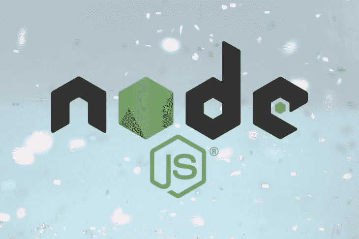

# 用 Node.js 处理和调度事件

> 原文：<https://dev.to/bnevilleoneill/handling-and-dispatching-events-with-node-js-4e5m>

[](https://res.cloudinary.com/practicaldev/image/fetch/s--ucdZJgFU--/c_limit%2Cf_auto%2Cfl_progressive%2Cq_auto%2Cw_880/https://thepracticaldev.s3.amazonaws.com/i/bp451f56ys110hu5my9c.jpeg)

## node . js 是什么？

在其核心，Node.js 是一个开源的运行时环境，为在服务器端运行 JavaScript 应用程序而构建。它提供了一个事件驱动、非阻塞(异步)I/O 和跨平台运行时环境，用于使用 JavaScript 构建高度可伸缩的服务器端应用程序。

这不会是 Node.js 的入门指南；要了解更多，你可以查看 YouTube 上的[官方文档](https://nodejs.org/en/docs/)或视频教程。

## Node.js 中的  模块

Node.js 附带了几个模块——或者你也可以称之为库——它们可以包含在你的应用程序中，并被重用来帮助执行特定的任务，比如`event`、`os`和`path`模块等等。

Node.js 中的一些核心模块包括:

| **模块** | **描述** |
| --- | --- |
| 超文本传送协议（Hyper Text Transport Protocol 的缩写） | 使 Node.js 像 HTTP 服务器一样工作 |
| 全球资源定位器(Uniform Resource Locator) | 解析和解析 URL 字符串 |
| 查询字符串 | 处理 URL 查询字符串 |
| 小路 | 处理文件路径 |
| 满量程 | 处理文件系统 |
| 操作系统（Operating System） | 提供有关操作系统的信息 |

## 基本服务器设置

### 要求:

*   节点(最新稳定版本)
*   npm(安装时附带节点)

让我们用最少的配置设置我们的节点服务器，如下所示，并将文件保存为`index.js`。

```
// index.js
const http = require('http');

// declare server variables
const hostname = '127.0.0.1';
const port = 8080;

const server = http.createServer((req, res) => {
  res.statusCode = 200;
  res.setHeader('Content-Type', 'text/plain');
  res.end('Hello World\n');
});

server.listen(port, hostname, () => {
  console.log(`Server is running at http://${hostname}:${port}/`);
}); 
```

<svg width="20px" height="20px" viewBox="0 0 24 24" class="highlight-action crayons-icon highlight-action--fullscreen-on"><title>Enter fullscreen mode</title></svg> <svg width="20px" height="20px" viewBox="0 0 24 24" class="highlight-action crayons-icon highlight-action--fullscreen-off"><title>Exit fullscreen mode</title></svg>

确保保存文件并运行`node index.js`。输出应该是:

```
Server is running at http://127.0.0.1:8080 
```

<svg width="20px" height="20px" viewBox="0 0 24 24" class="highlight-action crayons-icon highlight-action--fullscreen-on"><title>Enter fullscreen mode</title></svg> <svg width="20px" height="20px" viewBox="0 0 24 24" class="highlight-action crayons-icon highlight-action--fullscreen-off"><title>Exit fullscreen mode</title></svg>

对我们服务器的每个请求都应该给出`Hello World`作为响应。

[](https://logrocket.com/signup/)

## `events`模块

`events`模块允许我们在 Node.js 中轻松地创建和处理自定义事件。该模块包括用于引发和处理事件的`EventEmitter`类。

几乎整个 Node.js 核心 API 都是围绕这个模块构建的，它发出命名事件，这些事件导致函数对象(也称为侦听器)被调用。在文章的最后，我们应该已经构建了一个非常简单的模块，它实现了事件模块。

### `events`模块的一些常见属性和方法

| **事件发射器方法** | **描述** |
| --- | --- |
| addListener(事件，侦听器) | 将侦听器添加到指定事件的侦听器数组的末尾。不检查是否已经添加了侦听器。 |
| on(事件，侦听器) | 它也可以作为 emitter.addListener()的别名来调用 |
| 一次(事件，侦听器) | 为事件添加一次性侦听器。该侦听器仅在下一次触发事件时被调用，之后将被移除。 |
| 发出(事件，[arg1]，[arg2]，[…]) | 用提供的参数引发指定的事件。 |
| removeListener(事件，侦听器) | 从指定事件的侦听器数组中移除一个侦听器。注意:更改侦听器后面的侦听器数组中的数组索引。 |
| remove all listeners([事件]) | 移除所有侦听器或指定事件的侦听器。 |

像任何其他使用`require`语句的模块一样，需要`events`对象和一个动态创建的实例。

```
// index.js

const http = require('http');
const events = require('events');

// declare server variables
const hostname = '127.0.0.1';
const port = 8080;

//create an object of EventEmitter class from events module
const myEmitter = new events.EventEmitter();

const server = http.createServer((req, res) => {
  res.statusCode = 200;
  res.setHeader('Content-Type', 'text/plain');
  res.end('Hello World\n');
});

server.listen(port, hostname, () => {
  console.log(`Server running at http://${hostname}:${port}/`);
}); 
```

<svg width="20px" height="20px" viewBox="0 0 24 24" class="highlight-action crayons-icon highlight-action--fullscreen-on"><title>Enter fullscreen mode</title></svg> <svg width="20px" height="20px" viewBox="0 0 24 24" class="highlight-action crayons-icon highlight-action--fullscreen-off"><title>Exit fullscreen mode</title></svg>

让我们通过监听一个自定义事件并同时调度该事件来玩一玩:

```
//index.js

const http = require('http');
const events = require('events');

// declare server variables
const hostname = '127.0.0.1';
const port = 8080;

//create an object of EventEmitter class from events module
const myEmitter = new events.EventEmitter();

 //Subscribe for ping event
 myEmitter.on('ping', function (data) {
    console.log('First event: ' + data);
 });

 // Raising ping event
 myEmitter.emit('ping', 'My first Node.js event has been triggered.');

const server = http.createServer((req, res) => {
  res.statusCode = 200;
  res.setHeader('Content-Type', 'text/plain');
  res.end('Hello World\n');
});

server.listen(port, hostname, () => {
  console.log(`Server running at http://${hostname}:${port}/`);
}); 
```

<svg width="20px" height="20px" viewBox="0 0 24 24" class="highlight-action crayons-icon highlight-action--fullscreen-on"><title>Enter fullscreen mode</title></svg> <svg width="20px" height="20px" viewBox="0 0 24 24" class="highlight-action crayons-icon highlight-action--fullscreen-off"><title>Exit fullscreen mode</title></svg>

要使更改生效，必须重新启动服务器。完成后，在浏览器中刷新页面，您应该会看到控制台中记录了一条消息:

```
First event: My first Node.js event has been triggered. 
```

<svg width="20px" height="20px" viewBox="0 0 24 24" class="highlight-action crayons-icon highlight-action--fullscreen-on"><title>Enter fullscreen mode</title></svg> <svg width="20px" height="20px" viewBox="0 0 24 24" class="highlight-action crayons-icon highlight-action--fullscreen-off"><title>Exit fullscreen mode</title></svg>

如上面的例子所示，除了触发事件，我们还可以将信息作为第二个参数传递给侦听器。

## 只处理一次事件

正如我们上面所做的，当使用`emitter.on()`方法注册一个侦听器时，每次发出指定的事件时，都会调用该侦听器。但是出于某种原因，有些事件在整个应用程序生命周期中只需要处理一次，并且可以用`once()`方法来实现。

让我们将它添加到我们的代码中:

```
//index.js

const http = require('http');
const events = require('events');

// declare server variables
const hostname = '127.0.0.1';
const port = 8080;

//create an object of EventEmitter class from events module
const myEmitter = new events.EventEmitter();

//Subscribe for ping event
 myEmitter.on('ping', function (data) {
    console.log('First event: ' + data);
 });

 // Raising ping event
 myEmitter.emit('ping', 'My first Node.js event has been triggered.');

let triggered = 0;
myEmitter.once('event', () => {
  console.log(++triggered);
});
myEmitter.emit('event');
// Prints: 1
myEmitter.emit('event');
// Ignored

const server = http.createServer((req, res) => {
  res.statusCode = 200;
  res.setHeader('Content-Type', 'text/plain');
  res.end('Hello World\n');
});

server.listen(port, hostname, () => {
  console.log(`Server running at http://${hostname}:${port}/`);
}); 
```

<svg width="20px" height="20px" viewBox="0 0 24 24" class="highlight-action crayons-icon highlight-action--fullscreen-on"><title>Enter fullscreen mode</title></svg> <svg width="20px" height="20px" viewBox="0 0 24 24" class="highlight-action crayons-icon highlight-action--fullscreen-off"><title>Exit fullscreen mode</title></svg>

通过使用`once()`方法而不是`on()`，事件不会发生多次，只会在第一次发生时触发。如果它在程序中被第二次触发，它将被忽略。

## 错误事件

开发过程中的错误是不可避免的，但可以在 Node.js 中正确处理。除了 try-catch 块，Node 还可以侦听错误事件，并在错误发生时执行若干操作。如果一个`EventEmitter`没有至少一个为`error`事件注册的侦听器，并且发出了一个`error`事件，那么就会抛出错误，打印一个堆栈跟踪，并且 Node.js 进程退出。

```
//index.js

const http = require('http');
const events = require('events');

// declare server variables
const hostname = '127.0.0.1';
const port = 8080;

//create an object of EventEmitter class from events module
const myEmitter = new events.EventEmitter();

//Subscribe for ping event
 myEmitter.on('ping', function (data) {   
 console.log('First subscriber: ' + data);
 });

 // Raising ping event
myEmitter.emit('ping', 'This is my first Node.js event emitter example.');

let triggered = 0;
myEmitter.once('event', () => {
  console.log(++triggered);
});
myEmitter.emit('event');
// Prints: 1
myEmitter.emit('event');
// Ignored

myEmitter.on('error', (err) => {
  console.error('whoops! there was an error bro!' + err);
 });
myEmitter.emit('error', new Error('whoops!'));
 // Prints: whoops! there was an error to the console

const server = http.createServer((req, res) => {
  res.statusCode = 200;
  res.setHeader('Content-Type', 'text/plain');
  res.end('Hello World\n');
});

server.listen(port, hostname, () => {
  console.log(`Server running at http://${hostname}:${port}/`);
}); 
```

<svg width="20px" height="20px" viewBox="0 0 24 24" class="highlight-action crayons-icon highlight-action--fullscreen-on"><title>Enter fullscreen mode</title></svg> <svg width="20px" height="20px" viewBox="0 0 24 24" class="highlight-action crayons-icon highlight-action--fullscreen-off"><title>Exit fullscreen mode</title></svg>

为了防止 Node.js 进程崩溃，建议总是为`'error'`事件添加侦听器。

## 结论

我们已经了解了很多关于事件的知识，以及它如何在 Node.js 应用程序的开发中发挥重要作用。我们还学习了如何创建、调度和管理事件。使用事件驱动编程，编写代码是为了做出反应，而不是等待被调用。

* * *

## Plug: [LogRocket](https://logrocket.com/signup/) ，一款适用于网络应用的 DVR

[](https://res.cloudinary.com/practicaldev/image/fetch/s--6FG5kvEL--/c_limit%2Cf_auto%2Cfl_progressive%2Cq_auto%2Cw_880/https://i2.wp.com/blog.logrocket.com/wp-content/uploads/2017/03/1d0cd-1s_rmyo6nbrasp-xtvbaxfg.png%3Fresize%3D1200%252C677%26ssl%3D1)

[log rocket](https://logrocket.com/signup/)是一个前端日志工具，让你重放问题，就像它们发生在你自己的浏览器中一样。LogRocket 不需要猜测错误发生的原因，也不需要向用户询问截图和日志转储，而是让您重放会话以快速了解哪里出错了。它可以与任何应用程序完美配合，不管是什么框架，并且有插件可以记录来自 Redux、Vuex 和@ngrx/store 的额外上下文。

除了记录 Redux 动作和状态，LogRocket 还记录控制台日志、JavaScript 错误、stacktraces、带有头+体的网络请求/响应、浏览器元数据、自定义日志。它还使用 DOM 来记录页面上的 HTML 和 CSS，甚至为最复杂的单页面应用程序重新创建像素级完美视频。

[免费试用](https://logrocket.com/signup/)。

* * *

用 Node.js 处理和调度事件的帖子[最早出现在](https://blog.logrocket.com/handling-and-dispatching-events-with-node-js/)[日志博客](https://blog.logrocket.com)上。