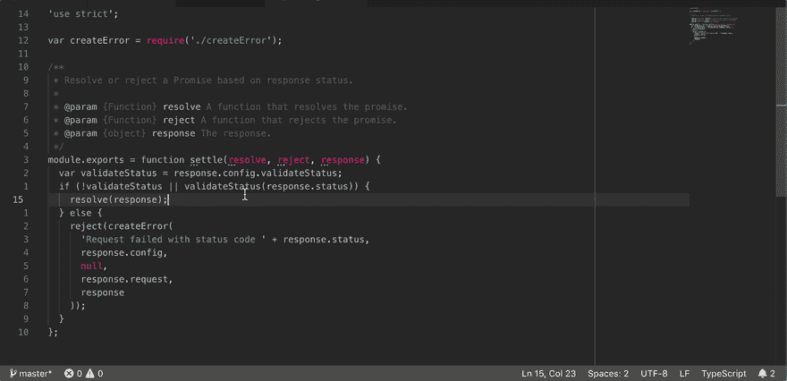

# Vs 代码一周一个技巧:拆分窗格

> 原文：<https://dev.to/aurelio/vs-code-one-tip-a-week-splitting-panes-4k9m>

编码时需要在屏幕上一次查看多个文件是很常见的。有时，我们甚至想查看同一个长文件的两个不同部分。其他时候，我们只是想充分利用宽屏显示器。

对于所有这些情况，拆分我们的编辑器是解决方案，今天我们将看看如何在没有鼠标的帮助下做到这一点。

向右拆分编辑器(垂直):

MAC-`⌘ + \`

Win-`Ctrl + \`

Linux-`Ctrl + \`

我试图通过将(反)斜线与将某物切成两半的想法联系起来，来记住这条捷径。不确定它是否有意义，但它确实对我有用！

编辑器也可以水平分割(或者，如在 VsCode 行话中，垂直分割)。我不使用这个快捷方式，但如果你有不同的习惯，这里是:

MAC-`⌘ + K + \`

Win-`Ctrl + K + \`

Linux-`Ctrl + K + \`

## 更多方式分割屏幕

如果你打开命令面板(Mac 上的`⌘ + SHIFT + P`，其他地方的`Ctrl + SHIFT + P`，你会看到一些其他的选项来分割屏幕，比如向下分割编辑器，向左分割编辑器等等。

这些没有关联的默认键绑定，可以通过面板访问。如果你想让它们作为快捷方式，你可以使用 [VsCode 快捷键编辑器](https://code.visualstudio.com/docs/getstarted/keybindings)来添加你的自定义组合键。

## 学分

*   封面图片来自德鲁·比默。点击查看他的作品[。](https://unsplash.com/photos/5DD7-L4A4Uw)

* * *

这是一个学习如何充分利用 Vs Code 键盘快捷键而不感到不知所措的努力。

学习如何在没有鼠标的情况下使用我们最喜欢的 IDE 会有很大的不同。
由于像 Jetbrains 的惊人的[键推广器这样的扩展似乎](https://plugins.jetbrains.com/plugin/4455-key-promoter)[远不是现在的现实，至少](https://github.com/Microsoft/vscode/issues/26729)是这样，我开始一口一口地收集我最喜欢的键盘技巧。

这个想法很简单:找到一个你喜欢的技巧，练习一整周，直到你真正掌握了它，并使它成为你工作流程的一部分，然后进入下一个。跟着我一起提高！

* * *

*原载于[我的博客](https://nobitagit.github.io/blog/vscode-tip-split-panes/)T3。*