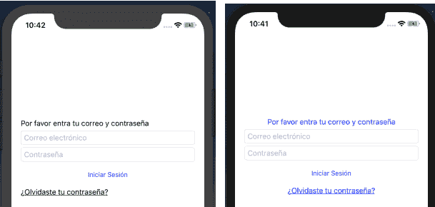

# 为我们的应用程序定义样式

> [https://dev . to/eatskolnikov/为我们的应用设定-样式-57jk](https://dev.to/eatskolnikov/definiendo-estilos-para-nuestras-aplicaciones-57jk)

使用“样式”(Styles)有助于为应用程序定义一致的用户界面，并且是使 XAML 文件更易于读取和长期维护的极好方法。

样式的一些特性:

*   它们很容易定义。
*   可以继承它以最大限度地减少代码重用。
*   可以设定为 XAML 或 C #。
*   您可以在同一控件中实现多个样式类，而无需继承。

要定义样式，必须将其添加为资源。您可以在特定页面或应用程式类别中定义它。下面是一个例子:

<figure> 

<figcaption>左边是外观前的申请，右边是外观后的结果</figcaption>

</figure>

让我们集中讨论这一部分:

参见我们如何在 **ContentPage** 的资源字典中添加 sstilos 的定义，我们也可以在应用层面上这样做。样式定义再明确不过了，这些部分是:

*   属性 **TargetType** :此属性是必需的，它定义了我们要应用的样式和我们有权设置的属性的控制类型。
*   **Setter 的标签**:您必须为要设置的每个属性添加 Setter 标签。具有**属性**和**属性值**属性。Visual Studio 中的 IntelliSense 会根据“**target type**”自动填充可用的特性和值。
*   属性 **x:Key** :此属性是可选的。设定此性质时，您会立即将型式设定为明确类型。

款式有六种口味:

*   **整体风格:**当您在应用程序中定义自己的风格时，可以在整个项目中使用它们
*   **隐式样式:**这是默认行为，只要不为样式指定键(x:Key 属性)，就会隐式应用于指定 **TargetType** 的所有控件
*   **显式样式:T1】定义样式并为其设置键时，如果这样做，需要明确设置要应用该样式的控件的 Style 属性。**
*   **动态型式:**虽然型式在执行阶段无法修改，但您可以使用动态资源做为实现此效果的替代方案。
*   **设备样式:**这些目前只能应用于标签实例，共有 6 个，位于 Devices 类中。样式:[【body style】](https://docs.microsoft.com/en-us/dotnet/api/xamarin.forms.device.styles.bodystyle?view=xamarin-forms)、[【caption style】](https://docs.microsoft.com/en-us/dotnet/api/xamarin.forms.device.styles.captionstyle?view=xamarin-forms)、[【listdetailextstyle】](https://docs.microsoft.com/en-us/dotnet/api/xamarin.forms.device.styles.listitemdetailtextstyle?view=xamarin-forms)，，

您可以使用属性 **BasedOn** 使一个样式继承另一个样式。样式可以应用于 forms xamprin 中的每个可视元素。如果您计划从视觉元素继承并为该新元素添加样式，请确保在 TargetType 中指定类名，或将 Style 标签中的“**applytoderivedtypes**”设置为 True

一如既往谢谢你的时间，我希望你对这些内容有所帮助。下一批货见。

post [为我们的应用设定风格](https://blog.torib.io/2019/07/31/agregando-estilo-a-nuestras-aplicaciones/)首先出现在[钍框架](https://blog.torib.io)上。