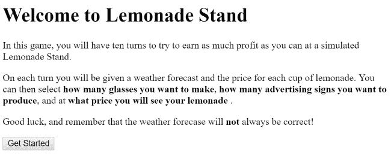
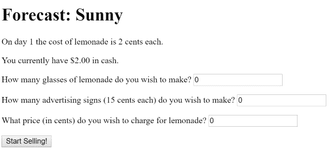

# 玩 Vue 和 Vuex -柠檬水摊

> 原文：<https://dev.to/raymondcamden/playing-with-vue-and-vuex-lemonade-stand-2d5o>

我今年的目标之一是更多地使用 Vue“应用”(即，不是简单的页面增强演示)，并更多地挖掘 Vuex。我真的很喜欢 Vuex，但我一直在纠结使用它的“最佳”方式，什么对它有意义，什么没有意义，以及一般如何接近它。我认为让自己变得更舒服的最好方法之一就是建造一些东西，看看什么感觉是对的。考虑到这一点，今天我要分享一个我做的游戏，叫做柠檬水摊。

[](https://res.cloudinary.com/practicaldev/image/fetch/s---bdAZ3t9--/c_limit%2Cf_auto%2Cfl_progressive%2Cq_auto%2Cw_880/https://static.raymondcamden.cimg/2019/08/ls.png)

柠檬水摊是一款经典的电脑游戏，在过去的日子里。我记得在家和在学校都在我的 Apple II 上玩它。我还记得编辑代码，这样我就有很多钱，这并不像你想象的那么有趣。(虽然问我关于编辑巴德的故事保存，这很酷。)

这个游戏是一个非常简单的经济模拟器。你经营一个柠檬水摊，每天都会给你一份天气预报和材料成本，你必须决定你想做多少杯柠檬水以及成本。你也可以购买广告标志来帮助提高你的销售。

整个项目托管在[代码沙箱](https://codesandbox.io)-【https://codesandbox.io/s/lemonade-stand-oxbfq?fontsize=14】T2&视图=预览上。你既可以玩游戏，也可以编辑代码(如果你这样做了，请在下面的评论中告诉我)。让我来分解一下我是如何建造它的。

首先，应用程序利用 [Vue 路由器](https://router.vuejs.org/)来处理游戏的不同状态。有一个提供基本介绍的初始页面。

[](https://res.cloudinary.com/practicaldev/image/fetch/s--orpqOJcR--/c_limit%2Cf_auto%2Cfl_progressive%2Cq_auto%2Cw_880/https://static.raymondcamden.cimg/2019/08/ls2.png)

下一个视图是“计划器”，在那里你决定你要做多少个玻璃杯，你要买多少个标志，你要以什么价格出售你的商品。

[](https://res.cloudinary.com/practicaldev/image/fetch/s--txwg58VQ--/c_limit%2Cf_auto%2Cfl_progressive%2Cq_auto%2Cw_880/https://static.raymondcamden.cimg/2019/08/ls3.png)

当你想出你的选择后，你就可以进入下一个屏幕并看到结果。

[](https://res.cloudinary.com/practicaldev/image/fetch/s--opp_xvV0--/c_limit%2Cf_auto%2Cfl_progressive%2Cq_auto%2Cw_880/https://static.raymondcamden.cimg/2019/08/ls4.png)

现在让我们看看代码。我不会展示每一行，而是将重点放在我认为重要的地方。不要忘了你可以使用上面的链接来查看代码并进行分叉。

首先，让我们看看 main.js，我的游戏的顶级设置。

```
import Vue from "vue";
import App from "./App.vue";

import router from "./routes";
import store from "./store";

Vue.config.productionTip = false;

Vue.filter("money", value => {
  if (!window.Intl) return value;
  return new Intl.NumberFormat("en-US", {
    style: "currency",
    currency: "USD"
  }).format(value);
});

new Vue({
  render: h => h(App),
  router,
  store
}).$mount("#app"); 
```

<svg width="20px" height="20px" viewBox="0 0 24 24" class="highlight-action crayons-icon highlight-action--fullscreen-on"><title>Enter fullscreen mode</title></svg> <svg width="20px" height="20px" viewBox="0 0 24 24" class="highlight-action crayons-icon highlight-action--fullscreen-off"><title>Exit fullscreen mode</title></svg>

这里的独特部分是加载一个路由器、加载一个 Vuex 商店和设置一个显示货币值的全局过滤器。

路由器是微不足道的，因为我只有三个视图:

```
import Vue from "vue";
import VueRouter from "vue-router";

import Home from "./views/Home";
import Game from "./views/Game";
import Report from "./views/Report";

Vue.use(VueRouter);

const routes = [
  {
    path: "/",
    component: Home
  },
  {
    path: "/game",
    component: Game
  },
  {
    path: "/report",
    component: Report
  }
];

export default new VueRouter({
  routes
}); 
```

<svg width="20px" height="20px" viewBox="0 0 24 24" class="highlight-action crayons-icon highlight-action--fullscreen-on"><title>Enter fullscreen mode</title></svg> <svg width="20px" height="20px" viewBox="0 0 24 24" class="highlight-action crayons-icon highlight-action--fullscreen-off"><title>Exit fullscreen mode</title></svg>

第一个视图叫做`Home.vue`，主要是文本，但是要注意用`<router-view>`来处理导航。

```
<template>
  <div>
    <h1>Welcome to Lemonade Stand</h1>

    <p>
      In this game, you will have ten turns to try to earn as
      much profit as you can at a simulated Lemonade Stand.
    </p>

    <p>
      On each turn you will be given a weather forecast and the price
      for each cup of lemonade. You can then select
      <strong>how many glasses you want to make</strong>,
      <strong>how many advertising signs you want to produce</strong>, and at
      <strong>what price you will see your lemonade</strong>.
    </p>

    <p>
      Good luck, and remember that the weather forecase will
      <strong>not</strong> always be correct!
    </p>

    <router-link to="/game" tag="button">Get Started</router-link>
  </div>
</template>

<script>
export default {};
</script> 
```

<svg width="20px" height="20px" viewBox="0 0 24 24" class="highlight-action crayons-icon highlight-action--fullscreen-on"><title>Enter fullscreen mode</title></svg> <svg width="20px" height="20px" viewBox="0 0 24 24" class="highlight-action crayons-icon highlight-action--fullscreen-off"><title>Exit fullscreen mode</title></svg>

到目前为止一切顺利。现在让我们看下一个视图，`Game.vue`。

```
<template>
  <div>
    <h1>Forecast: {{ forecast }}</h1>
    <p>On day {{ day }} the cost of lemonade is {{ costOfLemonade }} cents each.</p>
    <p>You currently have {{ assets | money }} in cash.</p>
    <p>
      How many glasses of lemonade do you wish to make?
      <input
        type="number"
        v-model.number="numGlasses"
        min="0"
      >
    </p>
    <p>
      How many advertising signs ({{costOfSigns}} cents each) do you wish to make?
      <input
        type="number"
        v-model.number="numSigns"
        min="0"
      >
    </p>
    <p>
      What price (in cents) do you wish to charge for lemonade?
      <input
        type="number"
        v-model.number="pricePerGlass"
        min="0"
      >
    </p>

    <div v-if="hasErrors">
      <strong>Oh oh! Please fix these errors!</strong>
      <ul>
        <li v-for="e in errors">{{e}}</li>
      </ul>
    </div>

    <button @click="initiateSales">Start Selling!</button>
  </div>
</template>

<script>
export default {
  data() {
    return {
      numGlasses: 0,
      numSigns: 0,
      pricePerGlass: 0
    };
  },
  created() {
    console.log('created');
    this.$store.commit("generateForecast");
  },
  computed: {
    assets() {
      return this.$store.state.assets / 100;
    },
    day() {
      return this.$store.state.day;
    },
    costOfLemonade() {
      return this.$store.getters.costOfLemonade;
    },
    costOfSigns() {
      return this.$store.state.signCost;
    },
    errors() {
      return this.$store.state.errors;
    },
    forecast() {
      return this.$store.getters.forecast;
    },
    hasErrors() {
      return this.$store.getters.hasErrors;
    }
  },
  methods: {
    initiateSales() {
      // try to sell - note we pass the getter value cuz Mutations can't use Getters (weird!)
      this.$store.commit("doSales", {
        glasses: this.numGlasses,
        signs: this.numSigns,
        cost: this.pricePerGlass,
        costOfLemonade: this.costOfLemonade
      });
      if(!this.hasErrors) this.$router.replace("/report");
    }
  }
};
</script> 
```

<svg width="20px" height="20px" viewBox="0 0 24 24" class="highlight-action crayons-icon highlight-action--fullscreen-on"><title>Enter fullscreen mode</title></svg> <svg width="20px" height="20px" viewBox="0 0 24 24" class="highlight-action crayons-icon highlight-action--fullscreen-off"><title>Exit fullscreen mode</title></svg>

这里发生了很多事。该组件从布局开始，它实际上是一个顶层报告和三个表单字段。

代码在`created`处理程序中做的第一件事是要求商店生成一个预测:`this.$store.commit("generateForecast");`。我很快会分享商店代码，但基本上游戏中与数字和逻辑相关的每个方面都放在商店中。你可以在很多地方看到这一点，比如我们询问标牌价格的地方。虽然这个值不会改变，但是我在我的存储中将它设置为一个常量，这样我就可以在一个地方改变它。

这就是为什么你会看到一堆的`computed`值，这些值会被存储起来。有*是*做这件事的更好的方法(见 [mapGetters](https://vuex.vuejs.org/guide/getters.html) ),但是我就是不想用它。

请注意最后一段代码`initiateSales`，它只是获取值并请求商店开始销售柠檬水。如果没有任何错误，我们将进入报告页面。接下来让我们来看看。

```
<template>
  <div>
    <h1>Daily Financial Report</h1>

    <p v-if="message">
      <strong>{{message}}</strong>
    </p>

    <p>For day {{day}}, you sold {{glassesSold}} glasses of lemonade.</p>

    <p>
      You earned {{income | money}} and had expenses of {{expenses | money}}
      for a net profit of {{ profit | money }}.
    </p>

    <p>You currently have {{ assets | money }}.</p>

    <router-link to="/game" tag="button">Next Day</router-link>
  </div>
</template>

<script>
export default {
  data() {
    return {};
  },
  created() {
    // we update our assets now, nto before, so i don't have to worry about the
    // display changing for a spli second. could be better?
    this.$store.commit("updateAssets");
  },
  computed: {
    assets() {
      return this.$store.state.assets / 100;
    },
    day() {
      return this.$store.state.day;
    },
    glassesSold() {
      return this.$store.state.glassesSold;
    },
    income() {
      return this.$store.state.income / 100;
    },
    expenses() {
      return this.$store.state.expenses / 100;
    },
    profit() {
      return this.income - this.expenses;
    },
    message() {
      return this.$store.state.message;
    }
  },
  methods: {}
};
</script> 
```

<svg width="20px" height="20px" viewBox="0 0 24 24" class="highlight-action crayons-icon highlight-action--fullscreen-on"><title>Enter fullscreen mode</title></svg> <svg width="20px" height="20px" viewBox="0 0 24 24" class="highlight-action crayons-icon highlight-action--fullscreen-off"><title>Exit fullscreen mode</title></svg>

一般来说，这个视图所做的就是向用户报告发生了什么。我的商店将知道卖出了多少件商品、利润等等(接下来您将看到商店)，所以我的视图只需要请求值。唯一*稍微*诡异的部分大概就是这个了，`this.$store.commit("updateAssets");`。这个 store 变化更新了您的资产，我在这里也是这样做的，这样您就不会在销售额制成表格后看到之前视图中的瞬间变化。直觉告诉我可以做得更好。

好了，现在让我们来看看商店吧！

```
import Vue from "vue";
import Vuex from "vuex";

Vue.use(Vuex);

/*
forecast posibilities and their impacts on sales
*/
const FORECASTS = [
  {
    label: "Sunny",
    salesRange: [60, 90],
    chanceOfRain: 10
  },
  {
    label: "Cloudy",
    salesRange: [40, 60],
    chanceOfRain: 40
  },
  {
    label: "Storms",
    salesRange: [20, 40],
    chanceOfRain: 70
  },
  {
    label: "Heat Wave",
    salesRange: [70, 100],
    chanceOfRain: 5
  },
  {
    label: "Partly Cloudy",
    salesRange: [50, 70],
    chanceOfRain: 20
  }
];

const SIGN_COST = 15;
const RAIN_PENALTY = 33;

// Credit: https://developer.mozilla.org/en-US/docs/Web/JavaScript/Reference/Global_Objects/Math/random#Getting_a_random_integer_between_two_values
function getRandomInt(min, max) {
  min = Math.ceil(min);
  max = Math.floor(max);
  return Math.floor(Math.random() * (max - min)) + min; //The maximum is exclusive and the minimum is inclusive
}

export default new Vuex.Store({
  state: {
    day: 0,
    assets: 200,
    forecast: null,
    signCost: SIGN_COST,
    errors: [],
    message: "",
    glassesSold: null,
    expenses: null,
    income: null
  },
  mutations: {
    doSales(state, salesData) {
      console.log("Attempting to do sales with " + JSON.stringify(salesData));
      // reset errors
      state.errors = [];
      if (salesData.glasses <= 0)
        state.errors.push(
          "You must enter a positive number of glasses to sell."
        );

      if (salesData.signs < 0)
        state.errors.push("You can only buy a positive number of signs.");
      if (salesData.cost < salesData.costOfLemonade)
        state.errors.push(
          "You can't sell glasses for less than they are worth."
        );

      let totalCost =
        salesData.glasses * salesData.costOfLemonade +
        salesData.signs * state.signCost;
      console.log("totalCost", totalCost);

      if (totalCost > state.assets)
        state.errors.push(
          `Your cost (${totalCost / 100}) is more than you have.`
        );

      if (state.errors.length > 0) return;

      /*
        Ok, so a few things here. We have a forecast, and that gives us a range of sales, 
        ie on sunny days you can expect to sell 60-100% of your inventory. 

        The # of signs though has an impact, 1 to 0 signs will reduce your chance. Many signs
        will help, but to a max (the user doesnt know)

        Finally, we have a random chance of rain that is higher with cloudy and partly cloudy, 
        rain reduces your sales range too. We could add more things like construction on the street, etc

        Nope, not finally, cost of lemonade impacts sales too
      */

      //Ok, first get the range
      let range = state.forecast.salesRange;
      console.log("current range is " + range);

      //now determine signs bonus
      let signsBonus = 0;
      if (salesData.signs === 0) signsBonus = -20;
      else if (salesData.signs === 1) signsBonus = -10;
      else if (salesData.signs <= 4) signsBonus = 10;
      else if (salesData.signs <= 6) signsBonus = 15;
      else if (salesData.signs > 6) signsBonus = 20;

      console.log("bonus from signs is " + signsBonus);

      //now determine cost bonus
      let costBonus = 0;
      if (salesData.cost < 10) costBonus = 25;
      else if (salesData.cost < 30) costBonus = 15;
      else if (salesData.cost < 50) costBonus = 10;
      else if (salesData.cost < 75) costBonus = 10;
      else if (salesData.cost < 100) costBonus = 0;
      else costBonus = -10;

      console.log("bonus from col is " + costBonus);

      //now do we have rain?
      let didItRain = getRandomInt(0, 100) < state.forecast.chanceOfRain;
      console.log("did it rain?", didItRain);

      //ok, get our percent sold
      let [bottom, top] = state.forecast.salesRange;
      let percentSold = getRandomInt(bottom, top);

      console.log("initial percent sold", percentSold);

      //modify range based on signsBonus and didItRain
      percentSold += signsBonus;
      percentSold += costBonus;
      if (didItRain) percentSold -= RAIN_PENALTY;

      console.log("now percent sold is ", percentSold);
      //figure our glasses sold
      let glassesSold = Math.floor((percentSold / 100) * salesData.glasses);
      let moneyEarned = glassesSold * salesData.cost;
      console.log("you sold " + glassesSold + " and earned " + moneyEarned);

      //save the data
      state.glassesSold = glassesSold;
      state.income = moneyEarned;
      state.expenses = totalCost;
      if (didItRain) state.message = "It rained!";
    },
    generateForecast(state) {
      let prediction = FORECASTS[getRandomInt(0, FORECASTS.length - 1)];
      state.forecast = prediction;
      //also clear previous message
      state.message = "";
      state.day++;
    },
    updateAssets(state) {
      state.assets += state.income - state.expenses;
    }
  },
  getters: {
    costOfLemonade(state) {
      if (state.day > 2) return 4;
      return 2;
    },
    forecast(state) {
      return state.forecast.label;
    },
    hasErrors(state) {
      return state.errors.length > 0;
    }
  }
}); 
```

<svg width="20px" height="20px" viewBox="0 0 24 24" class="highlight-action crayons-icon highlight-action--fullscreen-on"><title>Enter fullscreen mode</title></svg> <svg width="20px" height="20px" viewBox="0 0 24 24" class="highlight-action crayons-icon highlight-action--fullscreen-off"><title>Exit fullscreen mode</title></svg>

我的存储包含表示游戏当前值的状态，但它也有不会改变的“配置”信息。比如一个标志的价格。当人们玩游戏并提供反馈时，我可以调高或调低这个值。

常量代表游戏中可能发生的天气类型。每种天气类型都对销售(`salesRange`)有影响，也有下雨的可能。你可以在《T2》中看到这种逻辑。在我计算出你的销售值是否合适(即你没有超支)后，我会确定你卖出了多少眼镜。这是基于天气，你做了多少个标志，你的柠檬水的价格，以及是否下雨。这将增加(或减少)售出眼镜的百分比。

一旦知道了这一点，所有的值都存储在状态中，这样就可以在报告视图中使用它们。

差不多就是这些了，但是我想把我在做这个的时候想到的一些具体的事情说出来。

*   我最喜欢 Vuex 的一点是它给了我一个很好的逻辑抽象。我的商店变得复杂，我的 Vue 应用和组件变得简单而笨拙。
*   我对使用 Vuex 作为“配置”数据以及实际变化的状态有点不确定。不过我在 Twitter 上问过了，看起来人们都这么做，所以至少我不是一个人。；)
*   我遇到了一个有趣的问题。不允许突变访问 Getters。动作可以，但是我的商店里没有任何异步调用。你可以在`doSales`中看到我的解决方法，我不得不传递柠檬水的成本，尽管它是一个吸气剂。这让我回到了整个突变/动作的事情，这仍然让我感到尴尬。是的，一个是同步的，一个是异步的，但我只是有点希望 Vuex 有一种方法来改变数据，异步与否。

像往常一样，我喜欢关于这方面的反馈(批评与否！)，请在下面给我留言评论。

*头部照片由[杆长](https://unsplash.com/@rodlong?utm_source=unsplash&utm_medium=referral&utm_content=creditCopyText)在 Unsplash 上*